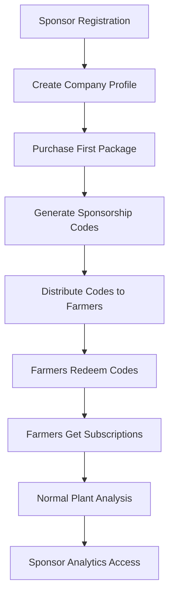
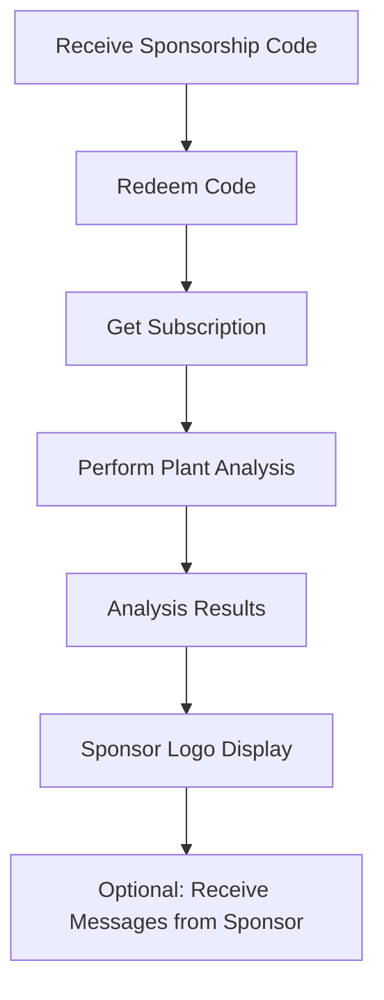

# Sponsorship System Integration Guide

## Overview
ZiraAI Sponsorship System provides a comprehensive tier-based platform that enables agricultural companies to sponsor plant analysis services while accessing farmer data and analytics based on their subscription tier.

**Implementation Date**: August 2025  
**Version**: 2.0 (Complete Architecture Redesign)

## Business Model

### Tier-Based Feature Access
The sponsorship system operates on a four-tier model with increasing benefits:

| Feature | S Tier | M Tier | L Tier | XL Tier |
|---------|--------|--------|--------|---------|
| **Data Access** | 30% | 30% | 60% | 100% |
| **Logo Visibility** | Results Screen | Results Screen | Results Screen | Results Screen |
| **Farmer Messaging** | ❌ | ❌ | ✅ | ✅ |
| **Farmer Profile Access** | None | Anonymous | Full | Full |
| **Smart Linking** | ✅ | ✅ | ✅ | ✅ |
| **Analytics Dashboard** | Basic | Basic | Advanced | Premium |

### Key Business Logic
1. **Messaging ↔ Profile Correlation**: Only messaging-enabled tiers (L/XL) can access full farmer profiles
2. **Purchase-Based Access**: Features determined by package purchases, not profile settings
3. **One Company Profile**: Sponsors create a single company profile, then purchase multiple tier packages
4. **Code Distribution Model**: Bulk code generation for farmer distribution

## Architecture Components

### 1. Core Entities

#### SponsorProfile
Company-focused profile supporting multiple purchases:
```csharp
public class SponsorProfile
{
    public int Id { get; set; }
    public int UserId { get; set; }
    public string CompanyName { get; set; }
    public string ContactEmail { get; set; }
    public string ContactPhone { get; set; }
    public string CompanyType { get; set; } // "Cooperative", "Private", "NGO"
    public string BusinessModel { get; set; } // "B2B", "B2C", "Hybrid"
    public bool IsActive { get; set; }
    public int TotalPurchases { get; set; }
    public int TotalCodesGenerated { get; set; }
    public int TotalCodesRedeemed { get; set; }
}
```

#### SponsorshipPurchase
Purchase-based tier access:
```csharp
public class SponsorshipPurchase
{
    public int Id { get; set; }
    public int SponsorId { get; set; }
    public int SubscriptionTierId { get; set; } // 1=S, 2=M, 3=L, 4=XL
    public int Quantity { get; set; }
    public decimal Amount { get; set; }
    public string PaymentReference { get; set; }
    public string CodePrefix { get; set; }
    public int ValidityDays { get; set; }
    public DateTime PurchaseDate { get; set; }
    public bool IsActive { get; set; }
}
```

#### SponsorshipCode
Individual redemption codes:
```csharp
public class SponsorshipCode
{
    public int Id { get; set; }
    public int PurchaseId { get; set; }
    public string Code { get; set; } // e.g., "SPT001-ABC123"
    public bool IsRedeemed { get; set; }
    public int? RedeemedByUserId { get; set; }
    public DateTime? RedeemedDate { get; set; }
    public DateTime ExpiryDate { get; set; }
    public bool IsActive { get; set; }
}
```

### 2. Service Layer

#### Tier-Based Access Services
```csharp
// Messaging capability (L/XL only)
public interface IAnalysisMessagingService
{
    Task<IResult> SendMessageAsync(SendMessageCommand command);
    Task<IDataResult<List<AnalysisMessage>>> GetConversationAsync(int sponsorUserId, int farmerId);
}

// Farmer profile visibility (tier-dependent)
public interface IFarmerProfileVisibilityService
{
    Task<bool> CanViewFarmerProfileAsync(int sponsorUserId, int farmerId);
    Task<string> GetFarmerVisibilityLevelAsync(int sponsorUserId);
    Task<bool> ShouldAnonymizeFarmerDataAsync(int sponsorUserId);
}

// Data access filtering (percentage-based)
public interface ISponsorDataAccessService
{
    Task<List<PlantAnalysis>> GetFilteredAnalysisDataAsync(int sponsorUserId, int limit = 100);
    Task<bool> HasAccessToAnalysisAsync(int sponsorUserId, int analysisId);
}
```

### 3. API Endpoints

#### Authentication & Registration
```bash
# Sponsor registration
POST /api/auth/register
{
  "email": "sponsor@company.com",
  "password": "SecurePass123!",
  "firstName": "John",
  "lastName": "Doe",
  "role": "Sponsor"
}
```

#### Company Profile Management
```bash
# Create company profile (required first step)
POST /api/sponsorships/create-profile
Authorization: Bearer {token}
{
  "companyName": "AgriTech Solutions Ltd",
  "contactEmail": "contact@agritech.com",
  "contactPhone": "+90555123456",
  "website": "https://agritech.com",
  "companyType": "Private",
  "businessModel": "B2B",
  "description": "Leading agricultural technology provider"
}

# Update company profile
PUT /api/sponsorships/update-profile/{id}
Authorization: Bearer {token}
{
  "companyName": "Updated Company Name",
  "contactEmail": "newemail@company.com"
}

# Get current company profile
GET /api/sponsorships/my-profile
Authorization: Bearer {token}
```

#### Package Purchasing & Code Generation
```bash
# Purchase sponsorship package (generates bulk codes)
POST /api/sponsorships/purchase-package
Authorization: Bearer {token}
{
  "subscriptionTierId": 3, // L tier
  "quantity": 50, // 50 codes
  "amount": 2999.50,
  "paymentMethod": "CreditCard",
  "paymentReference": "txn_abc123",
  "validityDays": 365
}

# Response includes generated codes
{
  "success": true,
  "data": {
    "purchaseId": 123,
    "codePrefix": "SPT001",
    "generatedCodes": [
      {
        "code": "SPT001-ABC123",
        "tierName": "L",
        "expiryDate": "2026-08-16T00:00:00Z"
      }
      // ... 49 more codes
    ]
  }
}

# View purchase history
GET /api/sponsorships/my-purchases
Authorization: Bearer {token}

# Get generated codes
GET /api/sponsorships/my-codes
Authorization: Bearer {token}
```

#### Tier-Based Features

##### Messaging (L/XL Tiers Only)
```bash
# Send message to farmer
POST /api/sponsorship/messages
Authorization: Bearer {token}
{
  "farmerId": 123,
  "subject": "Plant Analysis Follow-up",
  "message": "Your tomato plants show excellent growth patterns. We recommend organic fertilizers for optimal yield."
}

# Get conversation history
GET /api/sponsorship/messages/conversation/{farmerId}
Authorization: Bearer {token}

# List all conversations
GET /api/sponsorship/messages
Authorization: Bearer {token}
```

##### Farmer Profile Access (Tier-Dependent)
```bash
# Get farmer profile (visibility varies by tier)
GET /api/sponsorship/farmer-profile/{farmerId}
Authorization: Bearer {token}

# S tier: 403 Forbidden
# M tier: Anonymous profile data (no contact info)
# L/XL tier: Full profile with contact details
```

##### Analytics & Data Access
```bash
# Get sponsored analyses
GET /api/sponsorships/sponsored-analyses
Authorization: Bearer {token}

# Usage analytics (detailed data percentage based on tier)
GET /api/sponsorships/usage-analytics
Authorization: Bearer {token}

# Smart link creation
POST /api/sponsorship/smart-links
Authorization: Bearer {token}
{
  "title": "AgriTech Plant Analysis",
  "description": "Professional plant health assessment",
  "targetUrl": "https://company.com/analysis",
  "isActive": true
}
```

## Integration Workflows

### 1. Complete Sponsor Onboarding Flow



#### Step-by-Step Implementation

1. **Sponsor Registration**
```bash
POST /api/auth/register
{
  "email": "sponsor@company.com",
  "password": "SecurePass123!",
  "role": "Sponsor"
}
```

2. **Create Company Profile**
```bash
POST /api/sponsorships/create-profile
{
  "companyName": "AgriTech Solutions",
  "companyType": "Private",
  "businessModel": "B2B"
}
```

3. **Purchase Package & Generate Codes**
```bash
POST /api/sponsorships/purchase-package
{
  "subscriptionTierId": 3, // L tier for messaging
  "quantity": 100,
  "amount": 5999.00
}
```

4. **Farmer Code Redemption**
```bash
POST /api/subscriptions/redeem-code
{
  "sponsorshipCode": "SPT001-ABC123"
}
```

5. **Access Tier-Based Features**
```bash
# L/XL tier: Send messages
POST /api/sponsorship/messages
{
  "farmerId": 123,
  "subject": "Welcome to our program",
  "message": "Thank you for using our sponsored analysis service"
}
```

### 2. Farmer Integration Workflow



#### Farmer Integration Steps

1. **Code Redemption**
```bash
POST /api/subscriptions/redeem-code
Authorization: Bearer {farmer_token}
{
  "sponsorshipCode": "SPT001-ABC123"
}
```

2. **Normal Plant Analysis**
```bash
POST /api/plantanalyses/analyze
Authorization: Bearer {farmer_token}
{
  "image": "data:image/jpeg;base64,...",
  "farmerId": "F001",
  "cropType": "tomato"
}
```

3. **Results Include Sponsor Information**
```json
{
  "success": true,
  "data": {
    "analysisResults": { "..." },
    "sponsorInfo": {
      "companyName": "AgriTech Solutions",
      "logoUrl": "https://api.example.com/sponsor-logos/agritech.png",
      "website": "https://agritech.com"
    }
  }
}
```

## Error Handling & Business Rules

### Tier Restriction Responses

#### S/M Tier Messaging Attempt
```json
{
  "success": false,
  "message": "Messaging is not allowed for your subscription tier. Upgrade to Large or Extra Large package to access farmer messaging.",
  "tierInfo": {
    "currentTier": "S",
    "messagingTiers": ["L", "XL"],
    "upgradeRequired": true
  }
}
```

#### Profile Access Limitation
```json
{
  "success": false,
  "message": "Farmer profile access is limited for your tier. Upgrade for full profile visibility.",
  "visibilityLevel": "Anonymous",
  "upgradeOptions": {
    "currentTier": "M",
    "fullAccessTiers": ["L", "XL"]
  }
}
```

### Data Access Filtering

#### Percentage-Based Data Access
```csharp
// Automatic filtering based on tier
var dataPercentage = tier switch
{
    "S" => 0.30m,  // 30% of data
    "M" => 0.30m,  // 30% of data
    "L" => 0.60m,  // 60% of data
    "XL" => 1.00m  // 100% of data
};

var adjustedLimit = (int)(requestedLimit * dataPercentage);
```

## Security & Validation

### Authentication Requirements
- All sponsor endpoints require JWT Bearer authentication
- Role-based access control: `Sponsor` or `Admin` roles
- Tier-based feature validation on each request

### Input Validation
```csharp
// Null-safe FluentValidation patterns
RuleFor(x => x.FarmerId)
    .Must((command, farmerId) => farmerId > 0)
    .WithMessage("Valid farmer ID is required");

RuleFor(x => x.Message)
    .Must((command, message) => !string.IsNullOrWhiteSpace(message))
    .WithMessage("Message content is required")
    .Must((command, message) => message?.Length <= 1000)
    .WithMessage("Message cannot exceed 1000 characters");
```

### Data Protection
- Farmer profile anonymization for M tier sponsors
- Message content validation and sanitization
- Automatic data access percentage enforcement

## Testing & Quality Assurance

### Postman Collection Integration
The complete Postman collection includes:
- **Authentication Flows**: Registration, login, token refresh
- **Profile Management**: Create, update, retrieve company profiles
- **Package Purchasing**: Buy packages, generate codes, view history
- **Tier Testing**: Validate tier-based access restrictions
- **Error Scenarios**: Test all tier restriction responses

### Tier Testing Scenarios

#### S Tier Testing
```javascript
// Verify S tier restrictions
pm.test("S tier cannot send messages", function () {
    pm.expect(response.status).to.eql(403);
    pm.expect(response.json().message).to.include("Messaging is not allowed");
});

pm.test("S tier gets 30% data access", function () {
    pm.expect(response.json().data.length).to.be.at.most(30);
});
```

#### L/XL Tier Testing
```javascript
// Verify L/XL tier capabilities
pm.test("L tier can send messages", function () {
    pm.expect(response.status).to.eql(200);
    pm.expect(response.json().success).to.be.true;
});

pm.test("L tier can access full farmer profiles", function () {
    pm.expect(response.json().data).to.have.property('contactEmail');
});
```

## Production Deployment

### Environment Configuration
```json
{
  "Sponsorship": {
    "CodePrefix": "SPT",
    "DefaultValidityDays": 365,
    "MaxCodesPerPurchase": 1000,
    "TierFeatures": {
      "S": { "DataAccess": 0.30, "Messaging": false, "ProfileAccess": "None" },
      "M": { "DataAccess": 0.30, "Messaging": false, "ProfileAccess": "Anonymous" },
      "L": { "DataAccess": 0.60, "Messaging": true, "ProfileAccess": "Full" },
      "XL": { "DataAccess": 1.00, "Messaging": true, "ProfileAccess": "Full" }
    }
  }
}
```

### Database Deployment
- Ensure all sponsorship tables are created with proper constraints
- Set up foreign key relationships between entities
- Configure indexes for performance optimization

### Monitoring & Analytics
Monitor these key metrics:
- **Code Redemption Rate**: Percentage of generated codes actually redeemed
- **Tier Distribution**: Distribution of sponsors across tiers
- **Messaging Activity**: Volume of messages sent by L/XL tier sponsors
- **Upgrade Conversion**: Rate of tier upgrades for messaging access

## Business Benefits

### Revenue Model
1. **Tiered Pricing**: Clear value proposition for tier upgrades
2. **Feature Correlation**: Messaging capability drives L/XL tier purchases
3. **Bulk Sales**: Package-based purchasing model
4. **Recurring Revenue**: Subscription-based farmer access

### Value Proposition
- **For Sponsors**: Targeted farmer outreach and comprehensive analytics
- **For Farmers**: Free/subsidized plant analysis services
- **For Platform**: Diversified revenue streams and enhanced user engagement

This integration guide provides a complete framework for implementing the ZiraAI Sponsorship System with proper tier-based access control, comprehensive error handling, and scalable architecture design.