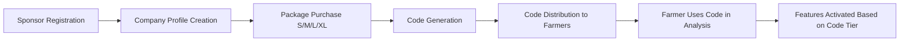

# 🏢 ZiraAI Sponsorluk Sistemi - Kapsamlı Dokümantasyon
## ✅ **CORRECTED ARCHITECTURE - VERSION 2.0**

> **⚠️ CRITICAL ARCHITECTURAL UPDATE - AUGUST 2025:**
> 
> This documentation reflects the **CORRECTED** sponsorship system architecture. 
> 
> **OLD (INCORRECT)**: Each sponsor creates multiple profiles for different tiers
> **NEW (CORRECT)**: One company profile + Multiple package purchases
> 
> The system now properly implements: **Profile → Purchase → Code → Redemption → Feature Access**

---

## 📋 İçindekiler
1. [Sistem Genel Bakış](#sistem-genel-bakış)
2. [Doğru İş Akışı](#doğru-iş-akışı)
3. [Sponsorluk Paketleri](#sponsorluk-paketleri)
4. [Database Yapısı](#database-yapısı)
5. [API Endpoints](#api-endpoints)
6. [Frontend Entegrasyonu](#frontend-entegrasyonu)
7. [Migration Guide](#migration-guide)

---

## 🎯 Sistem Genel Bakış

ZiraAI Sponsorluk Sistemi, sponsor firmalar için tier-based (S/M/L/XL) paket satın alma ve kod dağıtımı sağlayan enterprise sistemdir.

### ✨ Core Architecture Principles

1. **One Company, One Profile**: Her sponsor firma tek profil oluşturur
2. **Multiple Package Purchases**: Aynı firma farklı paketlerden satın alabilir
3. **Code-Based Feature Access**: Özellikler kullanılan kodun tier'ına göre belirlenir
4. **Analysis-Driven Permissions**: Logo ve veri erişimi analiz ID üzerinden kontrol edilir

### 🔄 Doğru İş Akışı



---

## 📦 Sponsorluk Paketleri

### Paket Özellikleri Karşılaştırması

| Özellik | S Paketi | M Paketi | L Paketi | XL Paketi |
|---------|----------|----------|----------|-----------|
| **Fiyat** | ₺29.99/kod | ₺59.99/kod | ₺99.99/kod | ₺149.99/kod |
| **Logo - Başlangıç** | ❌ | ✅ | ✅ | ✅ |
| **Logo - Sonuç** | ✅ | ✅ | ✅ | ✅ |
| **Logo - Analiz** | ❌ | ❌ | ✅ | ✅ |
| **Logo - Profil** | ❌ | ❌ | ✅ | ✅ |
| **Veri Erişimi** | %30 | %30 | %60 | %100 |
| **Mesajlaşma** | ❌ | ✅ | ✅ | ✅ |
| **Smart Links** | ❌ | ❌ | ❌ | ✅ |
| **Öncelikli Destek** | ❌ | ❌ | ✅ | ✅ |

### S Paketi (Small) - Başlangıç Seviye
- **Hedef Kitle**: Küçük ölçekli tarım firmaları
- **Logo Görünürlük**: Sadece sonuç ekranı
- **Veri Erişimi**: Temel bilgiler (%30)
- **Özellikler**: Temel sponsorluk ve marka görünürlüğü

### M Paketi (Medium) - Orta Seviye
- **Hedef Kitle**: Orta ölçekli tarım işletmeleri
- **Logo Görünürlük**: Başlangıç + Sonuç ekranları
- **Veri Erişimi**: Temel bilgiler (%30)
- **Özellikler**: Logo görünürlüğü + Mesajlaşma sistemi

### L Paketi (Large) - İleri Seviye
- **Hedef Kitle**: Büyük tarım şirketleri
- **Logo Görünürlük**: Tüm ekranlar
- **Veri Erişimi**: Genişletilmiş bilgiler (%60)
- **Özellikler**: Tam görünürlük + Gelişmiş mesajlaşma + Detaylı analitik

### XL Paketi (Extra Large) - Premium
- **Hedef Kitle**: Enterprise müşteriler
- **Logo Görünürlük**: Tüm ekranlar
- **Veri Erişimi**: Tam erişim (%100)
- **Özellikler**: Tüm özellikler + AI Smart Links + Premium analytics

---

## 🗄️ Database Yapısı

### Core Tables

#### 1. SponsorProfiles (Company Information)
```sql
CREATE TABLE SponsorProfiles (
    Id INT PRIMARY KEY,
    SponsorId INT UNIQUE NOT NULL, -- User ID of sponsor
    CompanyName VARCHAR(200) NOT NULL,
    CompanyDescription TEXT,
    SponsorLogoUrl VARCHAR(500),
    WebsiteUrl VARCHAR(500),
    ContactEmail VARCHAR(100),
    ContactPhone VARCHAR(20),
    ContactPerson VARCHAR(100),
    CompanyType VARCHAR(100), -- Agriculture, Technology, etc.
    BusinessModel VARCHAR(50), -- B2B, B2C, B2B2C
    IsVerifiedCompany BOOLEAN DEFAULT FALSE,
    IsActive BOOLEAN DEFAULT TRUE,
    TotalPurchases INT DEFAULT 0,
    TotalCodesGenerated INT DEFAULT 0,
    TotalCodesRedeemed INT DEFAULT 0,
    TotalInvestment DECIMAL(18,2) DEFAULT 0,
    CreatedDate TIMESTAMP NOT NULL,
    UpdatedDate TIMESTAMP
);
```

#### 2. SponsorshipPurchases (Package Purchases)
```sql
CREATE TABLE SponsorshipPurchases (
    Id INT PRIMARY KEY,
    SponsorId INT NOT NULL,
    SubscriptionTierId INT NOT NULL, -- S=1, M=2, L=3, XL=4
    Quantity INT NOT NULL,
    UnitPrice DECIMAL(10,2) NOT NULL,
    TotalAmount DECIMAL(18,2) NOT NULL,
    Currency VARCHAR(3) DEFAULT 'TRY',
    PaymentMethod VARCHAR(50),
    PaymentReference VARCHAR(100),
    PaymentStatus VARCHAR(50),
    CodesGenerated INT DEFAULT 0,
    CodesUsed INT DEFAULT 0,
    ValidityDays INT DEFAULT 365,
    PurchaseDate TIMESTAMP NOT NULL,
    FOREIGN KEY (SponsorId) REFERENCES Users(Id),
    FOREIGN KEY (SubscriptionTierId) REFERENCES SubscriptionTiers(Id)
);
```

#### 3. SponsorshipCodes (Generated Codes)
```sql
CREATE TABLE SponsorshipCodes (
    Id INT PRIMARY KEY,
    SponsorshipPurchaseId INT NOT NULL,
    Code VARCHAR(50) UNIQUE NOT NULL,
    IsUsed BOOLEAN DEFAULT FALSE,
    UsedByUserId INT,
    UsedDate TIMESTAMP,
    ExpiryDate TIMESTAMP NOT NULL,
    CreatedDate TIMESTAMP NOT NULL,
    FOREIGN KEY (SponsorshipPurchaseId) REFERENCES SponsorshipPurchases(Id),
    FOREIGN KEY (UsedByUserId) REFERENCES Users(Id)
);
```

#### 4. PlantAnalyses (Analysis with Sponsorship)
```sql
CREATE TABLE PlantAnalyses (
    Id INT PRIMARY KEY,
    UserId INT,
    SponsorshipCodeId INT, -- Which code was used
    SponsorUserId INT, -- Sponsor who provided the code
    ImagePath VARCHAR(500),
    AnalysisDate TIMESTAMP,
    -- Other analysis fields...
    FOREIGN KEY (SponsorshipCodeId) REFERENCES SponsorshipCodes(Id),
    FOREIGN KEY (SponsorUserId) REFERENCES Users(Id)
);
```

### Database Relationships
```
SponsorProfile (1) ←→ (N) SponsorshipPurchase
SponsorshipPurchase (1) ←→ (N) SponsorshipCode
SponsorshipCode (1) ←→ (1) PlantAnalysis
```

---

## 🔌 API Endpoints

### 1. Sponsor Profile Management

#### Create Company Profile (One-Time)
```http
POST /api/v1/sponsorship/create-profile
Authorization: Bearer {sponsor_token}
Roles: Sponsor, Admin

{
  "companyName": "Tarım Teknoloji A.Ş.",
  "companyDescription": "Modern tarım çözümleri",
  "sponsorLogoUrl": "https://example.com/logo.png",
  "websiteUrl": "https://tarimtech.com.tr",
  "contactEmail": "info@tarimtech.com.tr",
  "contactPhone": "+90 212 555 0000",
  "contactPerson": "Ahmet Yılmaz",
  "companyType": "Agriculture",
  "businessModel": "B2B"
}

**🔒 Security Features:**
- **Role Authorization**: Only users with "Sponsor" or "Admin" roles can create profiles
- **Automatic SponsorId**: SponsorId is automatically extracted from JWT token (not sent in payload)
- **User Context**: Profile is tied to the authenticated user making the request

Response:
{
  "success": true,
  "data": {
    "id": 1,
    "sponsorId": 123,
    "companyName": "Tarım Teknoloji A.Ş.",
    "isActive": true
  }
}
```

#### Get Sponsor Profile
```http
GET /api/sponsorships/profile
Authorization: Bearer {sponsor_token}

Response:
{
  "success": true,
  "data": {
    "id": 1,
    "companyName": "Tarım Teknoloji A.Ş.",
    "totalPurchases": 4,
    "totalCodesGenerated": 180,
    "totalCodesRedeemed": 142,
    "totalInvestment": 15995.50
  }
}
```

### 2. Package Purchase

#### Purchase Package (Multiple Allowed)
```http
POST /api/sponsorships/purchase-package
Authorization: Bearer {sponsor_token}

{
  "subscriptionTierId": 2, // M paketi
  "quantity": 50,
  "unitPrice": 59.99,
  "totalAmount": 2999.50,
  "currency": "TRY",
  "paymentMethod": "CreditCard",
  "paymentReference": "TXN_20250815_001"
}

Response:
{
  "success": true,
  "data": {
    "purchaseId": 1,
    "codesGenerated": 50,
    "tierName": "M",
    "tierFeatures": {
      "logoVisibility": ["start", "result"],
      "dataAccessPercentage": 30,
      "messagingEnabled": true,
      "smartLinksEnabled": false
    },
    "codes": [
      "AGRI-M-001",
      "AGRI-M-002",
      // ... 50 codes
    ]
  }
}
```

#### Get Purchase History
```http
GET /api/sponsorships/purchases
Authorization: Bearer {sponsor_token}

Response:
{
  "success": true,
  "data": [
    {
      "purchaseId": 1,
      "tierName": "S",
      "quantity": 100,
      "codesUsed": 87,
      "purchaseDate": "2025-08-01T10:00:00Z"
    },
    {
      "purchaseId": 2,
      "tierName": "M",
      "quantity": 50,
      "codesUsed": 35,
      "purchaseDate": "2025-08-10T14:30:00Z"
    }
  ]
}
```

### 3. Code Management

#### Get Available Codes
```http
GET /api/sponsorships/codes?onlyUnused=true
Authorization: Bearer {sponsor_token}

Response:
{
  "success": true,
  "data": {
    "totalCodes": 150,
    "unusedCodes": 28,
    "codes": [
      {
        "code": "AGRI-S-014",
        "tierName": "S",
        "expiryDate": "2026-08-01T00:00:00Z"
      },
      {
        "code": "AGRI-M-023",
        "tierName": "M",
        "expiryDate": "2026-08-10T00:00:00Z"
      }
    ]
  }
}
```

#### Send Codes to Farmers
```http
POST /api/sponsorships/send-codes
Authorization: Bearer {sponsor_token}

{
  "recipients": [
    {
      "phoneNumber": "+90 555 123 4567",
      "farmerName": "Mehmet Çiftçi",
      "code": "AGRI-M-023"
    }
  ],
  "channel": "SMS" // or "WhatsApp"
}

Response:
{
  "success": true,
  "data": {
    "sentCount": 1,
    "failedCount": 0
  }
}
```

### 4. Analysis-Based Features (NEW)

#### Get Logo Permissions for Analysis
```http
GET /api/sponsorships/logo-permissions/analysis/{plantAnalysisId}
Authorization: Bearer {token}

Response:
{
  "success": true,
  "data": {
    "plantAnalysisId": 456,
    "tierName": "M",
    "sponsorId": 123,
    "permissions": {
      "canShowOnStart": true,
      "canShowOnResult": true,
      "canShowOnAnalysis": false,
      "canShowOnProfile": false
    }
  }
}
```

#### Get Sponsor Display Info for Analysis
```http
GET /api/sponsorships/display-info/analysis/{plantAnalysisId}?screen=result
Authorization: Bearer {token}

Response:
{
  "success": true,
  "data": {
    "canDisplay": true,
    "tierName": "M",
    "sponsorInfo": {
      "companyName": "Tarım Teknoloji A.Ş.",
      "sponsorLogoUrl": "https://example.com/logo.png",
      "websiteUrl": "https://tarimtech.com.tr"
    }
  }
}
```

#### Get Filtered Analysis Data
```http
GET /api/sponsorships/analysis/{plantAnalysisId}/filtered
Authorization: Bearer {sponsor_token}

Response (M Tier - 30% Data):
{
  "success": true,
  "data": {
    "plantAnalysisId": 456,
    "accessLevel": "30%",
    "visibleData": {
      "plantType": "tomato",
      "overallHealthScore": 8,
      "analysisDate": "2025-08-15T10:30:00Z",
      "cropType": "tomato"
    },
    "hiddenFields": [
      "gpsCoordinates",
      "farmerContact",
      "detailedRecommendations",
      "environmentalData"
    ]
  }
}
```

### 5. Tier-Specific Features

#### Messaging (M/L/XL Tiers Only)
```http
POST /api/sponsorships/messages
Authorization: Bearer {sponsor_token}

{
  "toUserId": 789, // Farmer ID
  "plantAnalysisId": 456,
  "message": "Analizinize göre önerilerimiz var.",
  "messageType": "Recommendation"
}

Response:
{
  "success": true,
  "data": {
    "messageId": 1,
    "sentDate": "2025-08-15T14:30:00Z"
  }
}
```

#### Smart Links (XL Tier Only)
```http
POST /api/sponsorships/smart-links
Authorization: Bearer {sponsor_token}

{
  "linkUrl": "https://tarimtech.com.tr/azot-gubresi",
  "linkText": "Azot Gübresi - %30 İndirim",
  "keywords": ["azot", "gübre", "domates"],
  "targetCropTypes": ["tomato"],
  "productName": "TarımTech Azot Plus",
  "productPrice": 299.99,
  "discountPercentage": 30
}

Response:
{
  "success": true,
  "data": {
    "smartLinkId": 1,
    "trackingUrl": "https://api.ziraai.com/sl/1"
  }
}
```

---

## 🎨 Frontend Entegrasyonu

### 1. Sponsor Profile Component
```jsx
import React, { useState, useEffect } from 'react';
import { SponsorshipAPI } from '../api/sponsorship';

const SponsorProfile = () => {
  const [profile, setProfile] = useState(null);
  const [purchases, setPurchases] = useState([]);

  useEffect(() => {
    loadSponsorData();
  }, []);

  const loadSponsorData = async () => {
    const profileData = await SponsorshipAPI.getProfile();
    const purchaseData = await SponsorshipAPI.getPurchases();
    setProfile(profileData.data);
    setPurchases(purchaseData.data);
  };

  const handlePurchasePackage = async (tierId, quantity) => {
    const result = await SponsorshipAPI.purchasePackage({
      subscriptionTierId: tierId,
      quantity: quantity,
      // ... payment details
    });
    
    if (result.success) {
      alert(`${quantity} adet kod başarıyla oluşturuldu!`);
      loadSponsorData();
    }
  };

  return (
    <div className="sponsor-profile">
      <div className="company-info">
        <h2>{profile?.companyName}</h2>
        <div className="stats">
          <div>Toplam Satın Alma: {profile?.totalPurchases}</div>
          <div>Üretilen Kod: {profile?.totalCodesGenerated}</div>
          <div>Kullanılan Kod: {profile?.totalCodesRedeemed}</div>
          <div>Toplam Yatırım: ₺{profile?.totalInvestment}</div>
        </div>
      </div>

      <div className="purchase-section">
        <h3>Paket Satın Al</h3>
        <div className="package-cards">
          <PackageCard 
            tier="S" 
            price={29.99} 
            onPurchase={(qty) => handlePurchasePackage(1, qty)}
          />
          <PackageCard 
            tier="M" 
            price={59.99}
            onPurchase={(qty) => handlePurchasePackage(2, qty)}
          />
          <PackageCard 
            tier="L" 
            price={99.99}
            onPurchase={(qty) => handlePurchasePackage(3, qty)}
          />
          <PackageCard 
            tier="XL" 
            price={149.99}
            onPurchase={(qty) => handlePurchasePackage(4, qty)}
          />
        </div>
      </div>

      <div className="purchase-history">
        <h3>Satın Alma Geçmişi</h3>
        <table>
          <thead>
            <tr>
              <th>Paket</th>
              <th>Adet</th>
              <th>Kullanılan</th>
              <th>Tarih</th>
            </tr>
          </thead>
          <tbody>
            {purchases.map(p => (
              <tr key={p.purchaseId}>
                <td>{p.tierName}</td>
                <td>{p.quantity}</td>
                <td>{p.codesUsed}/{p.quantity}</td>
                <td>{new Date(p.purchaseDate).toLocaleDateString()}</td>
              </tr>
            ))}
          </tbody>
        </table>
      </div>
    </div>
  );
};
```

### 2. Analysis Logo Display Component
```jsx
const AnalysisLogoDisplay = ({ plantAnalysisId, screenType }) => {
  const [sponsorInfo, setSponsorInfo] = useState(null);

  useEffect(() => {
    checkLogoPermissions();
  }, [plantAnalysisId, screenType]);

  const checkLogoPermissions = async () => {
    const response = await fetch(
      `/api/sponsorships/display-info/analysis/${plantAnalysisId}?screen=${screenType}`
    );
    const data = await response.json();
    
    if (data.success && data.data.canDisplay) {
      setSponsorInfo(data.data.sponsorInfo);
    }
  };

  if (!sponsorInfo) return null;

  return (
    <div className="sponsor-logo-container">
       window.open(sponsorInfo.websiteUrl)}
      />
      <span className="sponsor-text">
        {sponsorInfo.companyName} sponsorluğunda
      </span>
    </div>
  );
};
```

### 3. Code Redemption Component (Farmer Side)
```jsx
const CodeRedemption = ({ onAnalysisStart }) => {
  const [code, setCode] = useState('');
  const [codeInfo, setCodeInfo] = useState(null);

  const validateCode = async () => {
    const response = await fetch(`/api/sponsorships/validate/${code}`);
    const data = await response.json();
    
    if (data.success) {
      setCodeInfo(data.data);
    } else {
      alert('Geçersiz kod!');
    }
  };

  const startAnalysis = () => {
    onAnalysisStart({
      sponsorshipCode: code,
      tierName: codeInfo.subscriptionTier
    });
  };

  return (
    <div className="code-redemption">
      <h3>Sponsorluk Kodu</h3>
      <input
        type="text"
        value={code}
        onChange={(e) => setCode(e.target.value)}
        placeholder="AGRI-XXX-000"
      />
      <button onClick={validateCode}>Kodu Doğrula</button>
      
      {codeInfo && (
        <div className="code-info">
          <p>✅ Kod geçerli!</p>
          <p>Paket: {codeInfo.subscriptionTier}</p>
          <p>Geçerlilik: {new Date(codeInfo.expiryDate).toLocaleDateString()}</p>
          <button onClick={startAnalysis}>Analizi Başlat</button>
        </div>
      )}
    </div>
  );
};
```

---

## 🔄 Migration Guide (For Existing Implementations)

### Breaking Changes

#### 1. SponsorProfile Entity
```diff
- public int CurrentSubscriptionTierId { get; set; }
- public string VisibilityLevel { get; set; }
- public string DataAccessLevel { get; set; }
- public bool HasMessaging { get; set; }
- public bool HasSmartLinking { get; set; }

+ public string CompanyType { get; set; }
+ public string BusinessModel { get; set; }
+ public int TotalPurchases { get; set; }
+ public int TotalCodesGenerated { get; set; }
+ public int TotalCodesRedeemed { get; set; }
```

#### 2. API Endpoints
```diff
- POST /api/sponsorships/create-profile { currentSubscriptionTierId: 1 }
+ POST /api/sponsorships/create-profile { companyType: "Agriculture" }

+ POST /api/sponsorships/purchase-package { subscriptionTierId: 1, quantity: 100 }

- GET /api/sponsorships/logo-permissions/{sponsorId}
+ GET /api/sponsorships/logo-permissions/analysis/{plantAnalysisId}
```

#### 3. Service Layer
```diff
// OLD: Profile-based feature access
- var profile = await _sponsorProfileRepository.GetBySponsorIdAsync(sponsorId);
- return profile.VisibilityLevel == "AllScreens";

// NEW: Code-based feature access
+ var tierName = await GetTierNameFromAnalysisAsync(plantAnalysisId);
+ return tierName == "L" || tierName == "XL";
```

### Migration Steps

1. **Database Migration**
```sql
-- Step 1: Add new columns to SponsorProfiles
ALTER TABLE SponsorProfiles ADD COLUMN CompanyType VARCHAR(100);
ALTER TABLE SponsorProfiles ADD COLUMN BusinessModel VARCHAR(50);
ALTER TABLE SponsorProfiles ADD COLUMN TotalPurchases INT DEFAULT 0;
ALTER TABLE SponsorProfiles ADD COLUMN TotalCodesGenerated INT DEFAULT 0;
ALTER TABLE SponsorProfiles ADD COLUMN TotalCodesRedeemed INT DEFAULT 0;

-- Step 2: Migrate existing tier data to purchases
INSERT INTO SponsorshipPurchases (SponsorId, SubscriptionTierId, Quantity, PurchaseDate)
SELECT SponsorId, CurrentSubscriptionTierId, 1, CreatedDate
FROM SponsorProfiles
WHERE CurrentSubscriptionTierId IS NOT NULL;

-- Step 3: Drop old columns (after verification)
ALTER TABLE SponsorProfiles DROP COLUMN CurrentSubscriptionTierId;
ALTER TABLE SponsorProfiles DROP COLUMN VisibilityLevel;
ALTER TABLE SponsorProfiles DROP COLUMN DataAccessLevel;
ALTER TABLE SponsorProfiles DROP COLUMN HasMessaging;
ALTER TABLE SponsorProfiles DROP COLUMN HasSmartLinking;
```

2. **Code Updates**
- Update service layer to use new methods
- Update API controllers with new endpoints
- Update frontend to use analysis-based endpoints

3. **Testing**
- Test profile creation without tier
- Test package purchase flow
- Test code redemption
- Verify feature access based on redeemed codes

---

## 📊 Analytics & Reporting

### Sponsor Dashboard Metrics
```sql
-- Total investment by sponsor
SELECT 
  sp.CompanyName,
  COUNT(DISTINCT spu.Id) as TotalPurchases,
  SUM(spu.Quantity) as TotalCodesGenerated,
  SUM(spu.CodesUsed) as TotalCodesRedeemed,
  SUM(spu.TotalAmount) as TotalInvestment
FROM SponsorProfiles sp
JOIN SponsorshipPurchases spu ON sp.SponsorId = spu.SponsorId
GROUP BY sp.CompanyName;

-- Tier distribution
SELECT 
  st.TierName,
  COUNT(spu.Id) as PurchaseCount,
  SUM(spu.Quantity) as TotalCodes,
  SUM(spu.CodesUsed) as UsedCodes,
  ROUND(AVG(spu.CodesUsed * 100.0 / spu.Quantity), 2) as UsageRate
FROM SponsorshipPurchases spu
JOIN SubscriptionTiers st ON spu.SubscriptionTierId = st.Id
GROUP BY st.TierName;
```

---

## 🔒 Security Considerations

1. **Authentication**: All sponsor endpoints require JWT authentication
2. **Authorization**: Role-based access (Sponsor, Farmer, Admin)
3. **Data Access**: Tier-based data filtering enforced at service layer
4. **Code Validation**: One-time use codes with expiry dates
5. **Rate Limiting**: API throttling to prevent abuse

---

## 🚀 Deployment Guide

### Environment Variables
```env
# Database
DATABASE_CONNECTION=Host=localhost;Database=ziraai;Username=user;Password=pass

# JWT
JWT_SECRET=your-secret-key
JWT_EXPIRY=3600

# Payment Gateway
PAYMENT_GATEWAY_API_KEY=your-payment-key
PAYMENT_WEBHOOK_SECRET=your-webhook-secret

# SMS/WhatsApp
SMS_API_KEY=your-sms-key
WHATSAPP_API_KEY=your-whatsapp-key
```

### Docker Deployment
```dockerfile
FROM mcr.microsoft.com/dotnet/aspnet:9.0
WORKDIR /app
COPY . .
EXPOSE 80
ENTRYPOINT ["dotnet", "WebAPI.dll"]
```

### Health Checks
```http
GET /api/health/sponsorship

Response:
{
  "status": "Healthy",
  "checks": {
    "database": "Connected",
    "services": "Running",
    "cache": "Active"
  }
}
```

---

## 📝 Conclusion

The corrected sponsorship system architecture provides:
- ✅ **Proper Business Logic**: One profile, multiple purchases
- ✅ **Scalability**: Supports complex sponsor scenarios
- ✅ **Clear Data Flow**: Code-based feature activation
- ✅ **Enterprise Ready**: Production-grade implementation

For support and questions, contact the development team.

---

**Version**: 2.0 (Corrected Architecture)
**Last Updated**: August 2025
**Status**: Production Ready