# ZiraAI Sponsorship Link Distribution Workflow

## Executive Summary

This document provides a comprehensive workflow guide for the ZiraAI Sponsorship Link Distribution System, detailing all processes from campaign planning through performance monitoring. The workflows are designed for immediate implementation while supporting long-term platform scalability.

**Document Version**: 1.0  
**Last Updated**: January 2025  
**Target Audience**: Development Teams, Operations Teams, Business Stakeholders  

---

## Table of Contents

1. [System Architecture Overview](#system-architecture-overview)
2. [Single Link Distribution Workflow](#single-link-distribution-workflow)
3. [Bulk Distribution Workflow](#bulk-distribution-workflow)
4. [Multi-Channel Distribution Strategy](#multi-channel-distribution-strategy)
5. [Error Handling and Recovery](#error-handling-and-recovery)
6. [Quality Assurance and Testing](#quality-assurance-and-testing)
7. [Performance Monitoring](#performance-monitoring)
8. [Deployment and Operations](#deployment-and-operations)

---

## System Architecture Overview

### Core Components

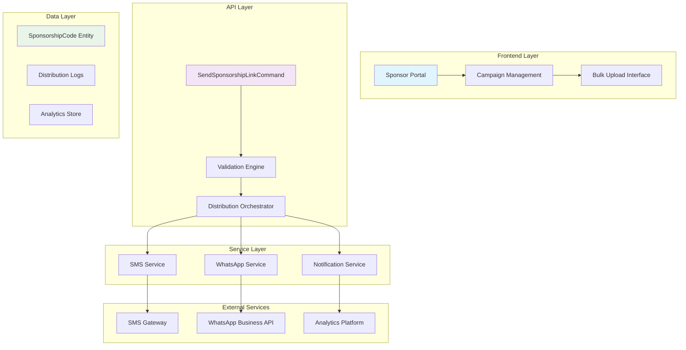

### Key Data Flows

1. **Campaign Initiation**: Sponsor → API → Validation → Queue
2. **Processing**: Queue → Service Layer → External APIs
3. **Tracking**: All stages → Analytics Store → Monitoring Dashboard
4. **Farmer Interaction**: Link Click → Validation → Account Creation → Redemption

---

## Single Link Distribution Workflow

### Phase 1: Pre-Distribution Setup

#### Step 1: Campaign Configuration
```yaml
Workflow: Campaign Setup
Trigger: Sponsor initiates single link creation
Duration: 2-5 minutes
Automation Level: Manual with validation
```

**Process Flow:**
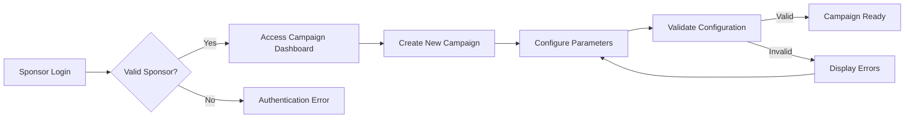

**Configuration Parameters:**
- Campaign name and description
- Target farmer phone number
- Distribution channel (SMS/WhatsApp)
- Custom message template
- Expiry date and usage limits
- Tracking preferences

**Validation Criteria:**
```csharp
// Core validation rules
- Phone number format: +90XXXXXXXXXX
- Campaign name: 3-100 characters
- Expiry date: Future date, max 1 year
- Usage limit: 1-1000 uses
- Message template: 1-500 characters
```

#### Step 2: Sponsorship Code Generation
```yaml
Workflow: Code Generation
Trigger: Validated campaign configuration
Duration: <1 second
Automation Level: Fully automated
```

**Generation Algorithm:**
```csharp
public class SponsorshipCodeGenerator
{
    public string GenerateCode()
    {
        // Format: SP-YYYYMMDD-XXXXX (e.g., SP-20250115-A7B2C)
        var datePart = DateTime.Now.ToString("yyyyMMdd");
        var randomPart = GenerateRandomString(5);
        return $"SP-{datePart}-{randomPart}";
    }
}
```

**Database Record Creation:**
```sql
INSERT INTO SponsorshipCodes (
    Code, SponsorId, FarmerPhoneNumber, 
    ExpiryDate, MaxUsageCount, IsActive,
    CreatedDate, LinkGenerationDate
) VALUES (
    'SP-20250115-A7B2C', 123, '+905551234567',
    '2025-02-15', 1, TRUE,
    NOW(), NOW()
);
```

### Phase 2: Distribution Execution

#### Step 3: Message Preparation
```yaml
Workflow: Message Assembly
Trigger: Code generation complete
Duration: <1 second
Automation Level: Fully automated
```

**Template Processing:**
```csharp
public class MessageTemplateProcessor
{
    public string ProcessTemplate(string template, SponsorshipCode code)
    {
        return template
            .Replace("{code}", code.Code)
            .Replace("{link}", GenerateDeepLink(code))
            .Replace("{sponsor}", code.Sponsor.CompanyName)
            .Replace("{expiry}", code.ExpiryDate.ToString("dd/MM/yyyy"));
    }
    
    private string GenerateDeepLink(SponsorshipCode code)
    {
        return $"https://ziraai.com/redeem/{code.Code}";
    }
}
```

**Default Templates:**
- **SMS**: "🌱 ZiraAI hediye kodu: {code}. Linke tıklayın: {link} - {sponsor} sponsorluğunda"
- **WhatsApp**: "🎁 Merhaba! {sponsor} tarafından size özel ZiraAI sponsorluğu: {code}. Hemen kullanın: {link}"

#### Step 4: Channel-Specific Distribution
```yaml
Workflow: Message Delivery
Trigger: Message preparation complete
Duration: 1-5 seconds
Automation Level: Fully automated with fallback
```

**SMS Distribution Flow:**
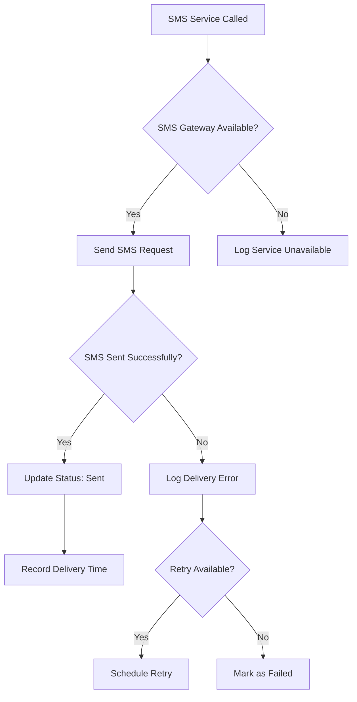

**WhatsApp Distribution Flow:**
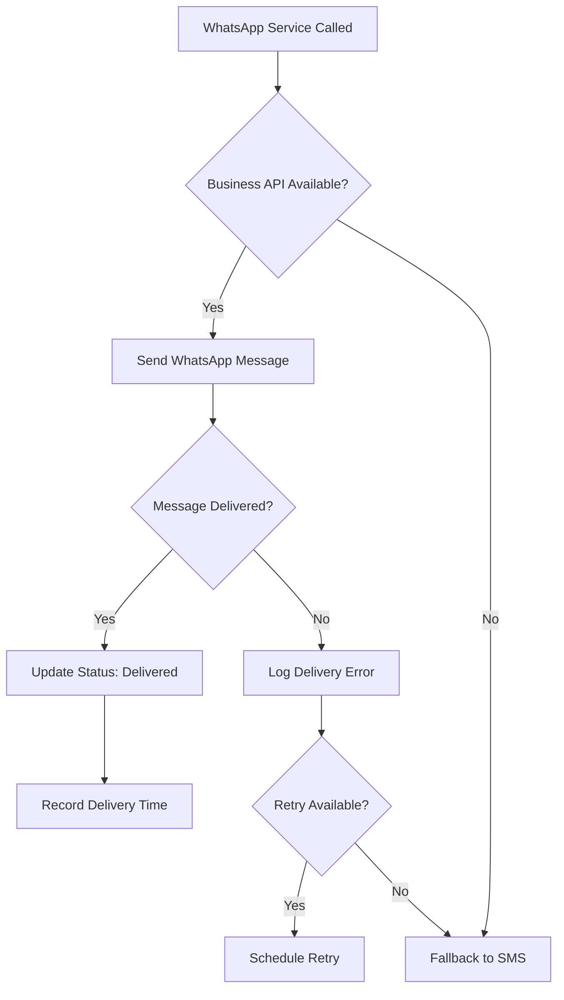

**Implementation Code:**
```csharp
public async Task<SendResult> SendSingleLinkAsync(SendSponsorshipLinkRequest request)
{
    var result = new SendResult
    {
        PhoneNumber = request.PhoneNumber,
        AttemptTime = DateTime.Now
    };
    
    try
    {
        // Generate and save code
        var code = await _codeGenerator.GenerateCodeAsync(request);
        await _repository.AddAsync(code);
        
        // Prepare message
        var message = _templateProcessor.ProcessTemplate(request.Template, code);
        
        // Attempt delivery based on preferred channel
        if (request.PreferredChannel == "WhatsApp")
        {
            result.Success = await _whatsAppService.SendAsync(
                request.PhoneNumber, message);
                
            if (!result.Success)
            {
                // Fallback to SMS
                result.Success = await _smsService.SendAsync(
                    request.PhoneNumber, message);
                result.ActualChannel = "SMS (Fallback)";
            }
            else
            {
                result.ActualChannel = "WhatsApp";
            }
        }
        else
        {
            result.Success = await _smsService.SendAsync(
                request.PhoneNumber, message);
            result.ActualChannel = "SMS";
        }
        
        // Update tracking
        code.LastDistributionDate = DateTime.Now;
        code.DistributionChannel = result.ActualChannel;
        code.DistributionStatus = result.Success ? "Sent" : "Failed";
        
        await _repository.UpdateAsync(code);
        
        result.SponsorshipCode = code.Code;
        result.DeliveryTime = DateTime.Now;
        
    }
    catch (Exception ex)
    {
        result.Success = false;
        result.ErrorMessage = ex.Message;
        _logger.LogError(ex, "Single link distribution failed for {PhoneNumber}", 
            request.PhoneNumber);
    }
    
    return result;
}
```

### Phase 3: Post-Distribution Tracking

#### Step 5: Delivery Confirmation
```yaml
Workflow: Delivery Tracking
Trigger: Distribution attempt complete
Duration: Real-time to 30 seconds
Automation Level: Fully automated
```

**Tracking Data Points:**
- Delivery timestamp
- Channel used (primary or fallback)
- Gateway response codes
- Delivery confirmation receipts
- Error messages and retry counts

**Status Updates:**
```csharp
public enum DistributionStatus
{
    Pending,
    Sent,
    Delivered,
    Failed,
    Retrying
}
```

#### Step 6: Analytics Recording
```yaml
Workflow: Analytics Capture
Trigger: Status update complete
Duration: <1 second
Automation Level: Fully automated
```

**Metrics Captured:**
```json
{
  "distributionId": "dist_20250115_001",
  "sponsorshipCode": "SP-20250115-A7B2C",
  "sponsorId": 123,
  "targetPhone": "+905551234567",
  "distributionChannel": "WhatsApp",
  "attemptTime": "2025-01-15T14:30:00Z",
  "deliveryTime": "2025-01-15T14:30:03Z",
  "success": true,
  "retryCount": 0,
  "gatewayResponse": "Message sent successfully",
  "messageTemplate": "custom_template_v1"
}
```

---

## Bulk Distribution Workflow

### Phase 1: Bulk Campaign Planning

#### Step 1: Campaign Strategy Definition
```yaml
Workflow: Bulk Campaign Setup
Trigger: Sponsor selects bulk distribution
Duration: 10-30 minutes
Automation Level: Manual with guided wizard
```

**Planning Considerations:**
- Target audience size (100-10,000 farmers)
- Budget allocation and cost estimation
- Distribution timeline and scheduling
- Channel preference and fallback strategy
- Message personalization requirements
- Compliance and regulatory considerations

**Campaign Configuration:**
```csharp
public class BulkCampaignConfiguration
{
    public string CampaignName { get; set; }
    public List<string> TargetPhoneNumbers { get; set; }
    public string MessageTemplate { get; set; }
    public DistributionChannel PreferredChannel { get; set; }
    public DateTime ScheduledStartTime { get; set; }
    public int BatchSize { get; set; } = 100;
    public int DelayBetweenBatches { get; set; } = 30; // seconds
    public bool EnableRetries { get; set; } = true;
    public int MaxRetryAttempts { get; set; } = 3;
}
```

#### Step 2: Target List Validation
```yaml
Workflow: Recipient Validation
Trigger: Upload target list
Duration: 2-10 minutes (depending on list size)
Automation Level: Automated validation with manual review
```

**Validation Process:**
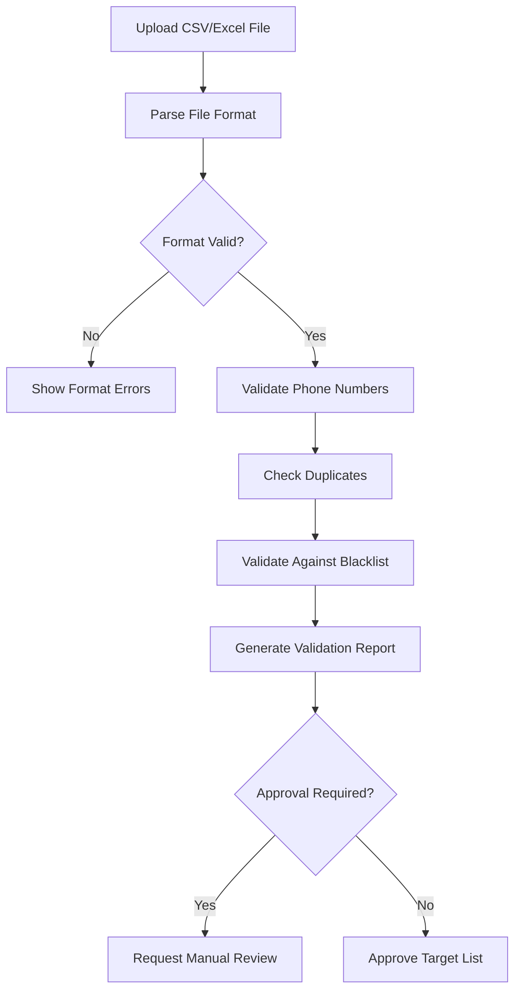

**Validation Rules:**
```csharp
public class BulkTargetValidator
{
    public ValidationResult ValidateTargetList(List<string> phoneNumbers)
    {
        var result = new ValidationResult();
        
        foreach (var phone in phoneNumbers)
        {
            // Format validation
            if (!IsValidPhoneFormat(phone))
                result.InvalidNumbers.Add(phone);
                
            // Blacklist check
            if (IsBlacklisted(phone))
                result.BlacklistedNumbers.Add(phone);
                
            // Duplicate check
            if (result.ValidNumbers.Contains(phone))
                result.DuplicateNumbers.Add(phone);
            else
                result.ValidNumbers.Add(phone);
        }
        
        result.TotalUploaded = phoneNumbers.Count;
        result.ValidCount = result.ValidNumbers.Count;
        result.InvalidCount = result.InvalidNumbers.Count;
        
        return result;
    }
}
```

**Validation Report:**
```json
{
  "uploadSummary": {
    "totalUploaded": 1500,
    "validNumbers": 1423,
    "invalidNumbers": 45,
    "duplicateNumbers": 32,
    "blacklistedNumbers": 0
  },
  "validationDetails": {
    "invalidFormats": ["+90555abc123", "05551234"],
    "duplicates": ["+905551234567", "+905559876543"],
    "recommendations": [
      "Remove invalid format numbers",
      "Deduplicate phone numbers"
    ]
  }
}
```

### Phase 2: Bulk Processing Execution

#### Step 3: Batch Processing Strategy
```yaml
Workflow: Batch Orchestration
Trigger: Approved target list
Duration: 5 minutes to 2 hours (depending on volume)
Automation Level: Fully automated with monitoring
```

**Batching Algorithm:**
```csharp
public class BatchProcessor
{
    private readonly int _batchSize;
    private readonly int _delayBetweenBatches;
    
    public async Task<BulkSendResult> ProcessBulkDistribution(
        BulkCampaignConfiguration config)
    {
        var result = new BulkSendResult
        {
            CampaignId = config.CampaignId,
            StartTime = DateTime.Now,
            TotalTargets = config.TargetPhoneNumbers.Count
        };
        
        var batches = CreateBatches(config.TargetPhoneNumbers, config.BatchSize);
        
        foreach (var batch in batches)
        {
            var batchResult = await ProcessBatch(batch, config);
            result.Results.AddRange(batchResult.Results);
            
            // Update progress
            result.ProcessedCount += batch.Count;
            result.SuccessCount += batchResult.SuccessCount;
            result.FailureCount += batchResult.FailureCount;
            
            // Rate limiting delay
            if (batches.IndexOf(batch) < batches.Count - 1)
            {
                await Task.Delay(TimeSpan.FromSeconds(config.DelayBetweenBatches));
            }
            
            // Progress notification
            await NotifyProgress(result);
        }
        
        result.EndTime = DateTime.Now;
        result.Duration = result.EndTime - result.StartTime;
        
        return result;
    }
    
    private List<List<string>> CreateBatches(List<string> phoneNumbers, int batchSize)
    {
        return phoneNumbers
            .Select((item, index) => new { item, index })
            .GroupBy(x => x.index / batchSize)
            .Select(group => group.Select(x => x.item).ToList())
            .ToList();
    }
}
```

#### Step 4: Parallel Processing with Monitoring
```yaml
Workflow: Concurrent Distribution
Trigger: Batch ready for processing
Duration: 30 seconds to 5 minutes per batch
Automation Level: Fully automated with real-time monitoring
```

**Concurrent Processing Flow:**
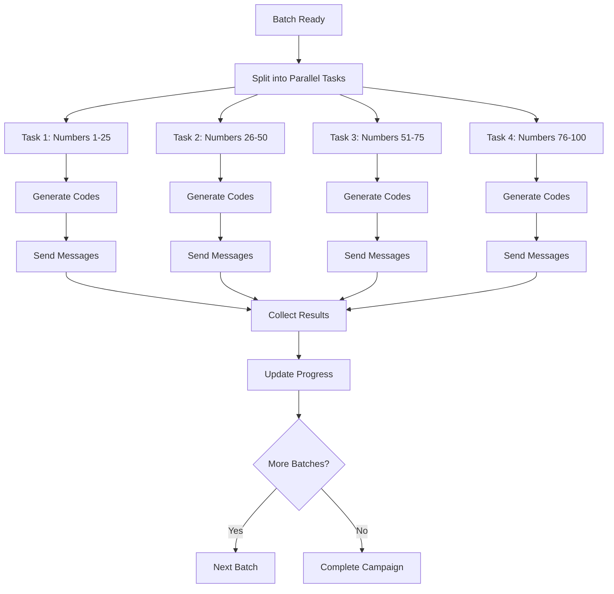

**Implementation:**
```csharp
public async Task<BatchResult> ProcessBatch(List<string> phoneNumbers, 
    BulkCampaignConfiguration config)
{
    var batchResult = new BatchResult
    {
        BatchSize = phoneNumbers.Count,
        StartTime = DateTime.Now
    };
    
    // Process numbers in parallel
    var tasks = phoneNumbers.Select(async phoneNumber =>
    {
        try
        {
            var request = new SendSponsorshipLinkRequest
            {
                PhoneNumber = phoneNumber,
                SponsorId = config.SponsorId,
                MessageTemplate = config.MessageTemplate,
                PreferredChannel = config.PreferredChannel
            };
            
            var result = await SendSingleLinkAsync(request);
            return result;
        }
        catch (Exception ex)
        {
            return new SendResult
            {
                PhoneNumber = phoneNumber,
                Success = false,
                ErrorMessage = ex.Message
            };
        }
    });
    
    var results = await Task.WhenAll(tasks);
    
    batchResult.Results = results.ToList();
    batchResult.SuccessCount = results.Count(r => r.Success);
    batchResult.FailureCount = results.Count(r => !r.Success);
    batchResult.EndTime = DateTime.Now;
    
    return batchResult;
}
```

### Phase 3: Campaign Monitoring and Optimization

#### Step 5: Real-Time Progress Tracking
```yaml
Workflow: Progress Monitoring
Trigger: Each batch completion
Duration: Continuous during campaign
Automation Level: Fully automated with alerts
```

**Progress Dashboard Data:**
```json
{
  "campaignStatus": {
    "campaignId": "campaign_20250115_001",
    "status": "Running",
    "progress": {
      "totalTargets": 2500,
      "processed": 1750,
      "successful": 1623,
      "failed": 127,
      "remaining": 750,
      "progressPercentage": 70
    },
    "timing": {
      "startTime": "2025-01-15T09:00:00Z",
      "elapsedTime": "42 minutes",
      "estimatedCompletion": "2025-01-15T10:15:00Z",
      "averageProcessingTime": "1.2 seconds per target"
    },
    "channelBreakdown": {
      "whatsApp": {
        "sent": 1435,
        "delivered": 1398,
        "failed": 37
      },
      "sms": {
        "sent": 315,
        "delivered": 289,
        "failed": 26
      }
    }
  }
}
```

#### Step 6: Automated Error Recovery
```yaml
Workflow: Error Handling and Recovery
Trigger: Failure detection
Duration: 1-5 minutes per retry cycle
Automation Level: Automated with escalation rules
```

**Error Recovery Strategy:**
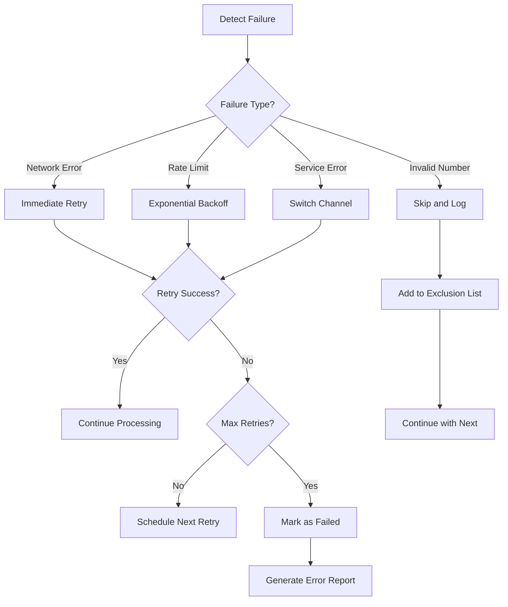

**Retry Logic Implementation:**
```csharp
public class RetryHandler
{
    private readonly int[] _retryDelays = { 1000, 5000, 15000 }; // milliseconds
    
    public async Task<SendResult> SendWithRetry(
        SendSponsorshipLinkRequest request, 
        int maxRetries = 3)
    {
        var attempts = 0;
        var lastException = new Exception();
        
        while (attempts < maxRetries)
        {
            try
            {
                var result = await SendSingleLinkAsync(request);
                if (result.Success)
                    return result;
                    
                // If not successful but no exception, retry
                lastException = new Exception(result.ErrorMessage);
            }
            catch (HttpRequestException ex) when (ex.Message.Contains("rate limit"))
            {
                // Rate limiting - use exponential backoff
                var delay = _retryDelays[Math.Min(attempts, _retryDelays.Length - 1)];
                await Task.Delay(delay);
                attempts++;
                lastException = ex;
                continue;
            }
            catch (Exception ex) when (IsRetriableException(ex))
            {
                attempts++;
                lastException = ex;
                
                if (attempts < maxRetries)
                {
                    var delay = _retryDelays[Math.Min(attempts - 1, _retryDelays.Length - 1)];
                    await Task.Delay(delay);
                }
            }
            catch (Exception ex)
            {
                // Non-retriable exception
                return new SendResult
                {
                    Success = false,
                    ErrorMessage = $"Non-retriable error: {ex.Message}",
                    PhoneNumber = request.PhoneNumber
                };
            }
        }
        
        return new SendResult
        {
            Success = false,
            ErrorMessage = $"Failed after {maxRetries} attempts: {lastException.Message}",
            PhoneNumber = request.PhoneNumber,
            RetryCount = attempts
        };
    }
}
```

---

## Multi-Channel Distribution Strategy

### Channel Selection Logic

#### Primary Channel Determination
```yaml
Workflow: Channel Selection
Trigger: Distribution request initiated
Duration: <1 second
Automation Level: Rule-based automation
```

**Selection Criteria:**
```csharp
public class ChannelSelector
{
    public DistributionChannel SelectOptimalChannel(
        string phoneNumber, 
        SponsorPreferences preferences,
        ChannelAvailability availability)
    {
        // Priority 1: Sponsor preference
        if (preferences.PreferredChannel != null && 
            availability.IsChannelAvailable(preferences.PreferredChannel))
        {
            return preferences.PreferredChannel;
        }
        
        // Priority 2: Farmer's historical preference
        var farmerPreference = GetFarmerChannelPreference(phoneNumber);
        if (farmerPreference != null && 
            availability.IsChannelAvailable(farmerPreference))
        {
            return farmerPreference;
        }
        
        // Priority 3: Performance-based selection
        var performanceRanking = GetChannelPerformance(phoneNumber);
        foreach (var channel in performanceRanking)
        {
            if (availability.IsChannelAvailable(channel))
                return channel;
        }
        
        // Fallback: SMS (most reliable)
        return DistributionChannel.SMS;
    }
}
```

#### Fallback Strategy
```yaml
Workflow: Fallback Management
Trigger: Primary channel failure
Duration: 5-30 seconds
Automation Level: Automated with logging
```

**Fallback Chain:**
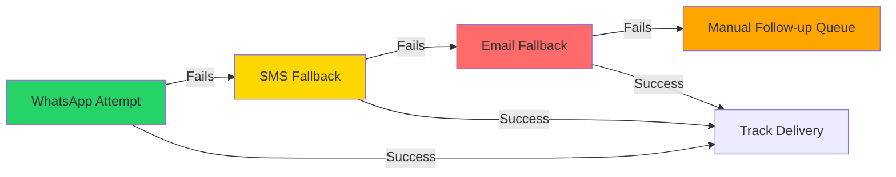

**Implementation:**
```csharp
public async Task<SendResult> SendWithFallback(SendSponsorshipLinkRequest request)
{
    var channels = GetFallbackChain(request.PreferredChannel);
    var result = new SendResult { PhoneNumber = request.PhoneNumber };
    
    foreach (var channel in channels)
    {
        try
        {
            result = await _channelServices[channel].SendAsync(request);
            
            if (result.Success)
            {
                result.ActualChannel = channel.ToString();
                break;
            }
        }
        catch (Exception ex)
        {
            _logger.LogWarning(ex, 
                "Channel {Channel} failed for {PhoneNumber}", 
                channel, request.PhoneNumber);
        }
    }
    
    return result;
}

private List<DistributionChannel> GetFallbackChain(DistributionChannel preferred)
{
    return preferred switch
    {
        DistributionChannel.WhatsApp => new List<DistributionChannel> 
            { DistributionChannel.WhatsApp, DistributionChannel.SMS },
        DistributionChannel.SMS => new List<DistributionChannel> 
            { DistributionChannel.SMS, DistributionChannel.WhatsApp },
        _ => new List<DistributionChannel> 
            { DistributionChannel.SMS, DistributionChannel.WhatsApp }
    };
}
```

### Channel-Specific Optimizations

#### WhatsApp Business API Optimization
```yaml
Workflow: WhatsApp Optimization
Trigger: WhatsApp channel selected
Duration: 2-8 seconds per message
Features: Rich media, read receipts, interactive elements
```

**WhatsApp Message Structure:**
```json
{
  "messaging_product": "whatsapp",
  "to": "+905551234567",
  "type": "template",
  "template": {
    "name": "sponsorship_link",
    "language": { "code": "tr" },
    "components": [
      {
        "type": "body",
        "parameters": [
          { "type": "text", "text": "Sponsor Company" },
          { "type": "text", "text": "SP-20250115-A7B2C" }
        ]
      },
      {
        "type": "button",
        "sub_type": "url",
        "index": 0,
        "parameters": [
          { "type": "text", "text": "SP-20250115-A7B2C" }
        ]
      }
    ]
  }
}
```

**WhatsApp Service Implementation:**
```csharp
public class WhatsAppService : IDistributionChannel
{
    public async Task<SendResult> SendAsync(SendSponsorshipLinkRequest request)
    {
        var message = new WhatsAppTemplateMessage
        {
            To = request.PhoneNumber,
            Template = new MessageTemplate
            {
                Name = "sponsorship_link",
                Language = new Language { Code = "tr" },
                Components = BuildComponents(request)
            }
        };
        
        var response = await _whatsAppClient.SendTemplateMessageAsync(message);
        
        return new SendResult
        {
            Success = response.Messages?.Any() == true,
            MessageId = response.Messages?.FirstOrDefault()?.Id,
            PhoneNumber = request.PhoneNumber,
            ActualChannel = "WhatsApp",
            DeliveryTime = DateTime.Now
        };
    }
}
```

#### SMS Gateway Optimization
```yaml
Workflow: SMS Optimization
Trigger: SMS channel selected
Duration: 1-3 seconds per message
Features: Delivery receipts, cost optimization, encoding
```

**SMS Message Optimization:**
```csharp
public class SmsService : IDistributionChannel
{
    public async Task<SendResult> SendAsync(SendSponsorshipLinkRequest request)
    {
        // Optimize message length for single SMS (160 characters)
        var optimizedMessage = OptimizeMessageLength(request.MessageTemplate, request);
        
        var smsRequest = new SmsRequest
        {
            From = _configuration.SmsFromNumber,
            To = request.PhoneNumber,
            Text = optimizedMessage,
            DlrMask = 31, // Request all delivery receipts
            DlrUrl = _configuration.DeliveryReceiptUrl
        };
        
        var response = await _smsClient.SendAsync(smsRequest);
        
        return new SendResult
        {
            Success = response.Status == "0", // 0 = success in most SMS gateways
            MessageId = response.MessageId,
            PhoneNumber = request.PhoneNumber,
            ActualChannel = "SMS",
            DeliveryTime = DateTime.Now,
            Cost = CalculateSmsCost(optimizedMessage.Length)
        };
    }
    
    private string OptimizeMessageLength(string template, SendSponsorshipLinkRequest request)
    {
        var message = ProcessTemplate(template, request);
        
        // If message is too long, use short link
        if (message.Length > 160)
        {
            var shortLink = _urlShortener.CreateShortUrl(request.RedemptionUrl);
            message = message.Replace(request.RedemptionUrl, shortLink);
        }
        
        return message;
    }
}
```

### Channel Performance Monitoring

#### Real-Time Performance Metrics
```yaml
Workflow: Channel Performance Tracking
Trigger: Each message delivery attempt
Duration: Continuous
Data Points: Success rates, delivery times, costs, user engagement
```

**Performance Tracking Implementation:**
```csharp
public class ChannelPerformanceTracker
{
    public async Task TrackDeliveryAttempt(
        string channel, 
        SendResult result, 
        TimeSpan processingTime)
    {
        var metric = new ChannelMetric
        {
            Channel = channel,
            Timestamp = DateTime.Now,
            Success = result.Success,
            ProcessingTimeMs = (int)processingTime.TotalMilliseconds,
            Cost = result.Cost,
            ErrorCode = result.ErrorCode,
            PhoneNumberPrefix = ExtractPrefix(result.PhoneNumber)
        };
        
        await _metricsRepository.RecordMetricAsync(metric);
        
        // Update real-time aggregates
        await UpdateChannelAggregates(channel, metric);
    }
    
    public async Task<ChannelPerformanceReport> GeneratePerformanceReport(
        DateTime from, DateTime to)
    {
        var metrics = await _metricsRepository.GetMetricsAsync(from, to);
        
        return new ChannelPerformanceReport
        {
            Period = new DateRange(from, to),
            Channels = metrics.GroupBy(m => m.Channel).Select(g => new ChannelStats
            {
                Name = g.Key,
                TotalAttempts = g.Count(),
                SuccessCount = g.Count(m => m.Success),
                SuccessRate = (double)g.Count(m => m.Success) / g.Count(),
                AverageProcessingTime = g.Average(m => m.ProcessingTimeMs),
                TotalCost = g.Sum(m => m.Cost),
                MostCommonErrors = g.Where(m => !m.Success)
                    .GroupBy(m => m.ErrorCode)
                    .OrderByDescending(eg => eg.Count())
                    .Take(5)
                    .Select(eg => new ErrorStats
                    {
                        ErrorCode = eg.Key,
                        Count = eg.Count()
                    }).ToList()
            }).ToList()
        };
    }
}
```

---

## Error Handling and Recovery

### Error Classification System

#### Error Categories and Response Strategies
```yaml
Error Classification:
  - Temporary Errors: Network issues, rate limiting, service unavailable
  - Permanent Errors: Invalid phone numbers, blocked numbers, configuration errors
  - Service Errors: Third-party API failures, authentication issues
  - System Errors: Database issues, memory problems, configuration problems
```

**Error Classification Logic:**
```csharp
public class ErrorClassifier
{
    public ErrorCategory ClassifyError(Exception exception, string context)
    {
        return exception switch
        {
            HttpRequestException ex when ex.Message.Contains("timeout") 
                => ErrorCategory.Temporary,
            HttpRequestException ex when ex.Message.Contains("rate limit") 
                => ErrorCategory.RateLimit,
            ArgumentException ex when context.Contains("phone") 
                => ErrorCategory.InvalidInput,
            UnauthorizedAccessException 
                => ErrorCategory.Authentication,
            SqlException 
                => ErrorCategory.Database,
            OutOfMemoryException 
                => ErrorCategory.System,
            _ => ErrorCategory.Unknown
        };
    }
}

public enum ErrorCategory
{
    Temporary,
    Permanent,
    RateLimit,
    InvalidInput,
    Authentication,
    Database,
    System,
    Unknown
}
```

### Recovery Workflows

#### Automated Recovery Process
```yaml
Workflow: Automated Error Recovery
Trigger: Error detection and classification
Duration: 1 second to 30 minutes (depending on error type)
Automation Level: Fully automated with escalation rules
```

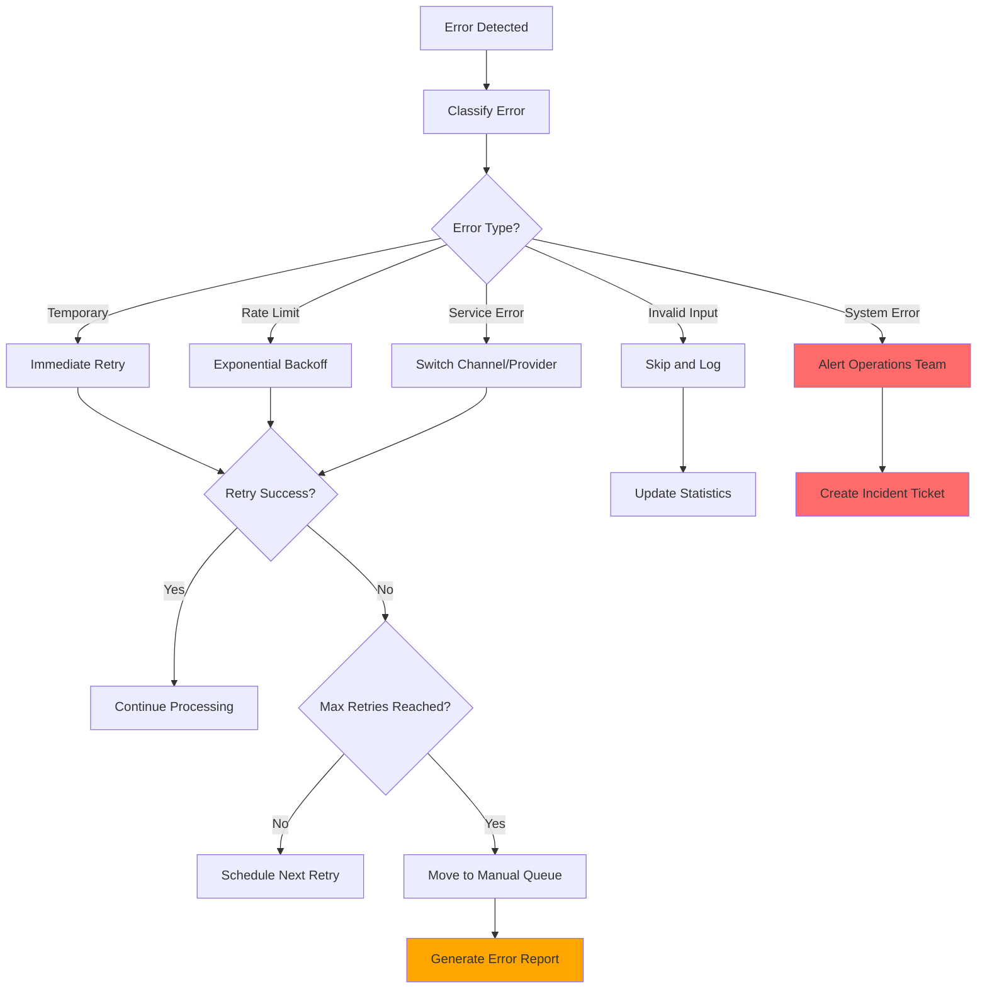

#### Recovery Strategy Implementation
```csharp
public class RecoveryOrchestrator
{
    private readonly Dictionary<ErrorCategory, IRecoveryStrategy> _strategies;
    
    public async Task<RecoveryResult> HandleError(
        ErrorContext context, 
        Exception exception)
    {
        var category = _classifier.ClassifyError(exception, context.Operation);
        var strategy = _strategies[category];
        
        var recoveryResult = await strategy.AttemptRecovery(context, exception);
        
        // Log recovery attempt
        await _logger.LogRecoveryAttempt(context, exception, recoveryResult);
        
        // Update metrics
        await _metricsTracker.RecordRecoveryAttempt(category, recoveryResult.Success);
        
        return recoveryResult;
    }
}

public class TemporaryErrorRecoveryStrategy : IRecoveryStrategy
{
    public async Task<RecoveryResult> AttemptRecovery(
        ErrorContext context, 
        Exception exception)
    {
        var maxRetries = GetMaxRetries(exception);
        var delay = CalculateRetryDelay(context.AttemptCount);
        
        if (context.AttemptCount >= maxRetries)
        {
            return RecoveryResult.Failed($"Max retries ({maxRetries}) exceeded");
        }
        
        await Task.Delay(delay);
        
        try
        {
            // Retry the original operation
            var result = await context.RetryOperation();
            return RecoveryResult.Success("Retry successful");
        }
        catch (Exception retryException)
        {
            context.AttemptCount++;
            return RecoveryResult.Retry($"Retry failed: {retryException.Message}");
        }
    }
}
```

### Error Monitoring and Alerting

#### Real-Time Error Monitoring
```yaml
Workflow: Error Monitoring
Trigger: Any error occurrence
Duration: Continuous
Features: Real-time dashboards, alerting thresholds, trend analysis
```

**Monitoring Dashboard Data:**
```json
{
  "errorSummary": {
    "totalErrors": 156,
    "errorRate": 2.3,
    "criticalErrors": 5,
    "recoveredErrors": 134,
    "unrecoveredErrors": 17
  },
  "errorBreakdown": {
    "temporary": { "count": 89, "recoveryRate": 95.5 },
    "rateLimiting": { "count": 23, "recoveryRate": 100.0 },
    "invalidInput": { "count": 34, "recoveryRate": 0.0 },
    "systemErrors": { "count": 10, "recoveryRate": 60.0 }
  },
  "channelErrors": {
    "whatsApp": { "errors": 67, "errorRate": 1.8 },
    "sms": { "errors": 89, "errorRate": 3.2 }
  },
  "recentTrends": {
    "last1Hour": { "errors": 23, "trend": "stable" },
    "last24Hours": { "errors": 156, "trend": "decreasing" }
  }
}
```

#### Alerting Rules
```csharp
public class AlertingEngine
{
    private readonly List<AlertRule> _alertRules = new()
    {
        new AlertRule
        {
            Name = "High Error Rate",
            Condition = metrics => metrics.ErrorRate > 5.0,
            Severity = AlertSeverity.High,
            NotificationChannels = new[] { "email", "slack" }
        },
        new AlertRule
        {
            Name = "System Errors",
            Condition = metrics => metrics.SystemErrorCount > 0,
            Severity = AlertSeverity.Critical,
            NotificationChannels = new[] { "email", "slack", "pager" }
        },
        new AlertRule
        {
            Name = "Low Recovery Rate",
            Condition = metrics => metrics.RecoveryRate < 80.0,
            Severity = AlertSeverity.Medium,
            NotificationChannels = new[] { "email" }
        }
    };
    
    public async Task EvaluateAlerts(ErrorMetrics metrics)
    {
        foreach (var rule in _alertRules)
        {
            if (rule.Condition(metrics))
            {
                await SendAlert(rule, metrics);
            }
        }
    }
}
```

### Manual Intervention Workflows

#### Escalation Process
```yaml
Workflow: Manual Escalation
Trigger: Automated recovery failure
Duration: 15 minutes to 4 hours
Stakeholders: Operations team, development team, management
```

**Escalation Workflow:**
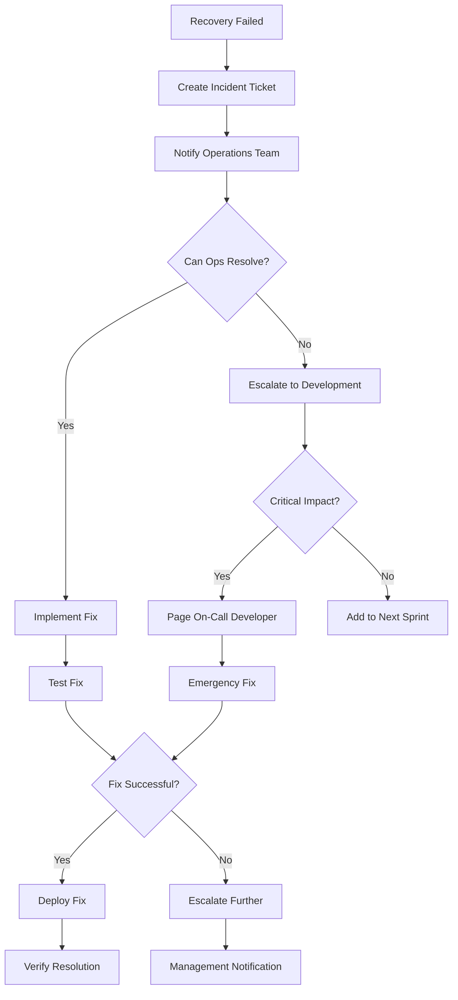

---

## Quality Assurance and Testing

### Testing Strategy Framework

#### Test Pyramid for Distribution System
```yaml
Testing Levels:
  - Unit Tests (70%): Individual component validation
  - Integration Tests (20%): Service interaction verification  
  - End-to-End Tests (10%): Complete workflow validation
  - Performance Tests: Load and stress testing
  - Security Tests: Vulnerability and penetration testing
```

### Unit Testing Workflows

#### Component Testing Process
```yaml
Workflow: Unit Test Execution
Trigger: Code changes, pull requests
Duration: 2-5 minutes
Coverage Target: 90%+ for critical paths
```

**Test Implementation Examples:**
```csharp
[TestClass]
public class SponsorshipCodeGeneratorTests
{
    private readonly SponsorshipCodeGenerator _generator;
    
    public SponsorshipCodeGeneratorTests()
    {
        _generator = new SponsorshipCodeGenerator();
    }
    
    [TestMethod]
    public void GenerateCode_ShouldReturnValidFormat()
    {
        // Arrange
        var expectedPattern = @"^SP-\d{8}-[A-Z0-9]{5}$";
        
        // Act
        var code = _generator.GenerateCode();
        
        // Assert
        Assert.IsTrue(Regex.IsMatch(code, expectedPattern),
            $"Generated code '{code}' doesn't match expected pattern");
    }
    
    [TestMethod]
    public void GenerateCode_ShouldBeUnique()
    {
        // Arrange
        var codes = new HashSet<string>();
        
        // Act
        for (int i = 0; i < 1000; i++)
        {
            codes.Add(_generator.GenerateCode());
        }
        
        // Assert
        Assert.AreEqual(1000, codes.Count, "Generated codes should be unique");
    }
}

[TestClass]
public class BulkDistributionTests
{
    private readonly Mock<ISmsService> _smsServiceMock;
    private readonly Mock<IWhatsAppService> _whatsAppServiceMock;
    private readonly BulkDistributionOrchestrator _orchestrator;
    
    [TestMethod]
    public async Task ProcessBulkDistribution_WithMixedResults_ShouldReturnCorrectSummary()
    {
        // Arrange
        var phoneNumbers = new List<string>
        {
            "+905551111111", "+905551111112", "+905551111113"
        };
        
        _smsServiceMock.SetupSequence(s => s.SendAsync(It.IsAny<SendRequest>()))
            .ReturnsAsync(new SendResult { Success = true })
            .ReturnsAsync(new SendResult { Success = false })
            .ReturnsAsync(new SendResult { Success = true });
        
        // Act
        var result = await _orchestrator.ProcessBulkDistribution(new BulkRequest
        {
            PhoneNumbers = phoneNumbers,
            PreferredChannel = "SMS"
        });
        
        // Assert
        Assert.AreEqual(3, result.TotalTargets);
        Assert.AreEqual(2, result.SuccessCount);
        Assert.AreEqual(1, result.FailureCount);
    }
}
```

### Integration Testing Workflows

#### Service Integration Validation
```yaml
Workflow: Integration Test Suite
Trigger: Daily automated runs, pre-deployment
Duration: 10-30 minutes
Coverage: API endpoints, database operations, external service calls
```

**Integration Test Implementation:**
```csharp
[TestClass]
public class DistributionIntegrationTests
{
    private readonly TestServer _server;
    private readonly HttpClient _client;
    private readonly TestDatabase _database;
    
    [TestInitialize]
    public async Task Setup()
    {
        _database = new TestDatabase();
        await _database.SeedTestData();
    }
    
    [TestMethod]
    public async Task SendSponsorshipLink_EndToEnd_ShouldCompleteSuccessfully()
    {
        // Arrange
        var request = new SendSponsorshipLinkRequest
        {
            SponsorId = 1,
            PhoneNumber = "+905551234567",
            MessageTemplate = "Test message with {code}",
            PreferredChannel = "SMS"
        };
        
        // Act
        var response = await _client.PostAsync("/api/sponsorship/send", 
            JsonContent.Create(request));
        
        // Assert
        response.EnsureSuccessStatusCode();
        
        var result = await response.Content.ReadFromJsonAsync<SendResult>();
        Assert.IsTrue(result.Success);
        Assert.IsNotNull(result.SponsorshipCode);
        
        // Verify database record
        var code = await _database.GetSponsorshipCode(result.SponsorshipCode);
        Assert.IsNotNull(code);
        Assert.AreEqual(request.PhoneNumber, code.FarmerPhoneNumber);
    }
    
    [TestMethod]
    public async Task BulkDistribution_WithRealServices_ShouldProcessAllTargets()
    {
        // Arrange
        var bulkRequest = new BulkSendRequest
        {
            SponsorId = 1,
            PhoneNumbers = GenerateTestPhoneNumbers(50),
            PreferredChannel = "SMS"
        };
        
        // Act
        var response = await _client.PostAsync("/api/sponsorship/send-bulk", 
            JsonContent.Create(bulkRequest));
        
        // Assert
        response.EnsureSuccessStatusCode();
        
        var result = await response.Content.ReadFromJsonAsync<BulkSendResult>();
        Assert.AreEqual(50, result.TotalTargets);
        Assert.IsTrue(result.SuccessCount > 40); // Allow for some failures
        
        // Verify all codes were generated
        var codes = await _database.GetSponsorshipCodes(result.GeneratedCodes);
        Assert.AreEqual(result.SuccessCount, codes.Count());
    }
}
```

### Load and Performance Testing

#### Performance Testing Framework
```yaml
Workflow: Performance Validation
Trigger: Weekly automated runs, pre-production deployment
Duration: 30 minutes to 2 hours
Metrics: Throughput, response times, error rates, resource utilization
```

**Load Testing Implementation:**
```csharp
[TestClass]
public class LoadTestSuite
{
    [TestMethod]
    public async Task BulkDistribution_HighVolume_ShouldMaintainPerformance()
    {
        // Arrange
        var targetRps = 100; // Requests per second
        var testDuration = TimeSpan.FromMinutes(5);
        var phoneNumbers = GenerateTestPhoneNumbers(30000);
        
        var loadTestConfig = new LoadTestConfiguration
        {
            TargetRps = targetRps,
            Duration = testDuration,
            RampUpTime = TimeSpan.FromMinutes(1),
            MaxConcurrentRequests = 200
        };
        
        // Act
        var results = await LoadTestRunner.Run(loadTestConfig, async () =>
        {
            var batch = phoneNumbers.Take(100).ToList();
            var request = new BulkSendRequest
            {
                SponsorId = 1,
                PhoneNumbers = batch,
                PreferredChannel = "SMS"
            };
            
            return await _client.PostAsync("/api/sponsorship/send-bulk", 
                JsonContent.Create(request));
        });
        
        // Assert
        Assert.IsTrue(results.AverageResponseTime < TimeSpan.FromSeconds(2),
            $"Average response time was {results.AverageResponseTime}");
        Assert.IsTrue(results.ErrorRate < 0.01, // Less than 1% error rate
            $"Error rate was {results.ErrorRate:P}");
        Assert.IsTrue(results.ActualRps > targetRps * 0.9,
            $"Actual RPS {results.ActualRps} was below target {targetRps}");
    }
    
    [TestMethod]
    public async Task StressTest_SystemLimits_ShouldGracefullyDegrade()
    {
        // Arrange - Push system beyond normal capacity
        var stressConfig = new StressTestConfiguration
        {
            InitialRps = 50,
            IncrementRps = 25,
            IncrementInterval = TimeSpan.FromMinutes(2),
            MaxRps = 500,
            DegradationThreshold = 0.05 // 5% error rate
        };
        
        // Act
        var results = await StressTestRunner.Run(stressConfig, _client);
        
        // Assert
        Assert.IsTrue(results.MaxSustainableRps >= 200,
            $"Maximum sustainable RPS was only {results.MaxSustainableRps}");
        Assert.IsTrue(results.DegradationPoint > 0,
            "System should have a clear degradation point");
    }
}
```

### Security Testing

#### Security Validation Workflow
```yaml
Workflow: Security Testing
Trigger: Security review requirements, pre-production
Duration: 2-8 hours
Coverage: Authentication, authorization, input validation, data protection
```

**Security Test Examples:**
```csharp
[TestClass]
public class SecurityTests
{
    [TestMethod]
    public async Task SendSponsorshipLink_WithoutAuth_ShouldReturn401()
    {
        // Arrange
        var request = new SendSponsorshipLinkRequest
        {
            SponsorId = 1,
            PhoneNumber = "+905551234567"
        };
        
        var client = _server.CreateClient();
        // Don't set authorization header
        
        // Act
        var response = await client.PostAsync("/api/sponsorship/send", 
            JsonContent.Create(request));
        
        // Assert
        Assert.AreEqual(HttpStatusCode.Unauthorized, response.StatusCode);
    }
    
    [TestMethod]
    public async Task BulkDistribution_WithExcessiveTargets_ShouldBeLimited()
    {
        // Arrange
        var hugePhoneNumberList = GenerateTestPhoneNumbers(100000); // 100k numbers
        var request = new BulkSendRequest
        {
            SponsorId = 1,
            PhoneNumbers = hugePhoneNumberList
        };
        
        // Act
        var response = await _authenticatedClient.PostAsync("/api/sponsorship/send-bulk", 
            JsonContent.Create(request));
        
        // Assert
        Assert.AreEqual(HttpStatusCode.BadRequest, response.StatusCode);
        var error = await response.Content.ReadAsStringAsync();
        Assert.IsTrue(error.Contains("exceeds maximum"), 
            "Should reject requests that exceed bulk limits");
    }
    
    [TestMethod]
    public async Task PhoneNumberValidation_WithMaliciousInput_ShouldBeSanitized()
    {
        // Arrange
        var maliciousPhoneNumbers = new[]
        {
            "+905551234567'; DROP TABLE SponsorshipCodes; --",
            "+905551234567<script>alert('xss')</script>",
            "+905551234567\0\r\n\r\nHeader-Injection: malicious"
        };
        
        foreach (var maliciousNumber in maliciousPhoneNumbers)
        {
            var request = new SendSponsorshipLinkRequest
            {
                SponsorId = 1,
                PhoneNumber = maliciousNumber
            };
            
            // Act
            var response = await _authenticatedClient.PostAsync("/api/sponsorship/send", 
                JsonContent.Create(request));
            
            // Assert
            Assert.AreEqual(HttpStatusCode.BadRequest, response.StatusCode,
                $"Should reject malicious phone number: {maliciousNumber}");
        }
    }
}
```

---

## Performance Monitoring

### Real-Time Performance Dashboard

#### Key Performance Indicators (KPIs)
```yaml
Performance Metrics:
  - Throughput: Messages per second, requests per minute
  - Latency: Average response time, 95th percentile response time
  - Success Rate: Delivery success rate, error rate by category
  - Resource Utilization: CPU, memory, database connections
  - Cost Efficiency: Cost per message, channel cost comparison
```

**Performance Monitoring Implementation:**
```csharp
public class PerformanceMonitor
{
    private readonly IMetricsCollector _metricsCollector;
    private readonly IAlertingService _alerting;
    
    public async Task RecordDistributionMetrics(DistributionAttempt attempt)
    {
        var metrics = new Dictionary<string, object>
        {
            ["distribution.attempts"] = 1,
            ["distribution.success"] = attempt.Success ? 1 : 0,
            ["distribution.duration_ms"] = attempt.ProcessingTime.TotalMilliseconds,
            ["distribution.channel"] = attempt.Channel,
            ["distribution.cost"] = attempt.Cost,
            ["distribution.retry_count"] = attempt.RetryCount
        };
        
        await _metricsCollector.RecordMetrics(metrics, attempt.Tags);
        
        // Check performance thresholds
        await CheckPerformanceThresholds(attempt);
    }
    
    private async Task CheckPerformanceThresholds(DistributionAttempt attempt)
    {
        var recentMetrics = await _metricsCollector.GetRecentMetrics(
            TimeSpan.FromMinutes(5));
        
        var avgResponseTime = recentMetrics.AverageResponseTime;
        var errorRate = recentMetrics.ErrorRate;
        var throughput = recentMetrics.RequestsPerMinute;
        
        // Alert on performance degradation
        if (avgResponseTime > TimeSpan.FromSeconds(5))
        {
            await _alerting.SendAlert(new PerformanceAlert
            {
                Type = "High Latency",
                Value = avgResponseTime,
                Threshold = TimeSpan.FromSeconds(5),
                Severity = AlertSeverity.High
            });
        }
        
        if (errorRate > 0.05) // 5% error rate
        {
            await _alerting.SendAlert(new PerformanceAlert
            {
                Type = "High Error Rate",
                Value = errorRate,
                Threshold = 0.05,
                Severity = AlertSeverity.Critical
            });
        }
    }
}
```

### Performance Analytics Dashboard

#### Dashboard Configuration
```json
{
  "dashboardConfig": {
    "refreshInterval": 30,
    "timeRange": "last_4_hours",
    "widgets": [
      {
        "type": "timeseries",
        "title": "Distribution Throughput",
        "metrics": ["distribution.attempts", "distribution.success"],
        "groupBy": ["channel"],
        "yAxis": "requests_per_minute"
      },
      {
        "type": "gauge",
        "title": "Success Rate",
        "metric": "distribution.success_rate",
        "thresholds": {
          "good": 0.95,
          "warning": 0.90,
          "critical": 0.85
        }
      },
      {
        "type": "histogram",
        "title": "Response Time Distribution",
        "metric": "distribution.duration_ms",
        "buckets": [100, 500, 1000, 2000, 5000]
      },
      {
        "type": "table",
        "title": "Channel Performance",
        "groupBy": "channel",
        "columns": [
          "channel",
          "attempts",
          "success_rate",
          "avg_duration",
          "total_cost"
        ]
      }
    ]
  }
}
```

### Automated Performance Optimization

#### Auto-Scaling Triggers
```yaml
Workflow: Auto-Scaling
Trigger: Performance threshold breaches
Duration: 2-10 minutes
Actions: Scale infrastructure, adjust batch sizes, enable circuit breakers
```

**Auto-Scaling Implementation:**
```csharp
public class AutoScalingOrchestrator
{
    public async Task<ScalingDecision> EvaluateScalingNeeds(PerformanceMetrics metrics)
    {
        var decision = new ScalingDecision();
        
        // Evaluate CPU utilization
        if (metrics.CpuUtilization > 80)
        {
            decision.Actions.Add(new ScaleAction
            {
                Type = ScaleActionType.ScaleUp,
                Resource = "api_instances",
                Factor = 1.5,
                Reason = $"High CPU utilization: {metrics.CpuUtilization}%"
            });
        }
        
        // Evaluate queue length
        if (metrics.QueueLength > 10000)
        {
            decision.Actions.Add(new ScaleAction
            {
                Type = ScaleActionType.IncreaseWorkers,
                Resource = "background_workers",
                Factor = 2.0,
                Reason = $"High queue length: {metrics.QueueLength}"
            });
        }
        
        // Evaluate response times
        if (metrics.AverageResponseTime > TimeSpan.FromSeconds(3))
        {
            decision.Actions.Add(new ScaleAction
            {
                Type = ScaleActionType.AdjustBatchSize,
                Resource = "batch_processor",
                Factor = 0.5, // Reduce batch size
                Reason = $"High response time: {metrics.AverageResponseTime}"
            });
        }
        
        return decision;
    }
    
    public async Task ExecuteScalingDecision(ScalingDecision decision)
    {
        foreach (var action in decision.Actions)
        {
            switch (action.Type)
            {
                case ScaleActionType.ScaleUp:
                    await _infrastructureManager.ScaleService(
                        action.Resource, action.Factor);
                    break;
                    
                case ScaleActionType.AdjustBatchSize:
                    await _configurationService.UpdateConfiguration(
                        "BULK_BATCH_SIZE", 
                        (int)(GetCurrentBatchSize() * action.Factor));
                    break;
                    
                case ScaleActionType.EnableCircuitBreaker:
                    await _circuitBreakerManager.EnableCircuitBreaker(
                        action.Resource);
                    break;
            }
            
            _logger.LogInformation("Executed scaling action: {Action} on {Resource} with factor {Factor}",
                action.Type, action.Resource, action.Factor);
        }
    }
}
```

---

## Deployment and Operations

### Deployment Pipeline

#### Continuous Deployment Workflow
```yaml
Workflow: Production Deployment
Trigger: Merged pull request to main branch
Duration: 15-30 minutes
Stages: Build, Test, Security Scan, Deploy, Validate
```

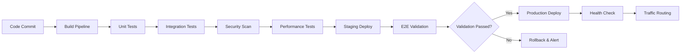

**Deployment Configuration:**
```yaml
# deployment.yml
apiVersion: apps/v1
kind: Deployment
metadata:
  name: sponsorship-distribution-api
  labels:
    app: sponsorship-api
    version: v1.0.0
spec:
  replicas: 3
  strategy:
    type: RollingUpdate
    rollingUpdate:
      maxSurge: 1
      maxUnavailable: 0
  selector:
    matchLabels:
      app: sponsorship-api
  template:
    metadata:
      labels:
        app: sponsorship-api
        version: v1.0.0
    spec:
      containers:
      - name: api
        image: ziraai/sponsorship-api:latest
        ports:
        - containerPort: 80
        env:
        - name: ASPNETCORE_ENVIRONMENT
          value: "Production"
        - name: ConnectionStrings__DefaultConnection
          valueFrom:
            secretKeyRef:
              name: db-secrets
              key: connection-string
        resources:
          requests:
            memory: "256Mi"
            cpu: "250m"
          limits:
            memory: "512Mi"
            cpu: "500m"
        livenessProbe:
          httpGet:
            path: /health
            port: 80
          initialDelaySeconds: 30
          periodSeconds: 10
        readinessProbe:
          httpGet:
            path: /health/ready
            port: 80
          initialDelaySeconds: 5
          periodSeconds: 5
```

### Operational Procedures

#### Health Check Implementation
```yaml
Workflow: System Health Monitoring
Trigger: Continuous (every 30 seconds)
Duration: Continuous
Checks: API availability, database connectivity, external service status
```

**Health Check Implementation:**
```csharp
[ApiController]
[Route("health")]
public class HealthController : ControllerBase
{
    private readonly IHealthCheckService _healthCheck;
    
    [HttpGet]
    public async Task<IActionResult> Get()
    {
        var result = await _healthCheck.CheckHealthAsync();
        
        if (result.Status == HealthStatus.Healthy)
            return Ok(result);
        else
            return StatusCode(503, result);
    }
    
    [HttpGet("ready")]
    public async Task<IActionResult> Ready()
    {
        var checks = new[]
        {
            await CheckDatabase(),
            await CheckSmsGateway(),
            await CheckWhatsAppService(),
            await CheckRedisCache()
        };
        
        var allHealthy = checks.All(c => c.IsHealthy);
        
        return allHealthy ? Ok(new { status = "ready" }) 
                         : StatusCode(503, new { status = "not ready", checks });
    }
}

public class DistributionSystemHealthCheck : IHealthCheck
{
    public async Task<HealthCheckResult> CheckHealthAsync(
        HealthCheckContext context, 
        CancellationToken cancellationToken = default)
    {
        try
        {
            // Test core functionality
            var testResult = await _distributionService.TestDistribution();
            
            var data = new Dictionary<string, object>
            {
                ["last_successful_distribution"] = testResult.LastSuccess,
                ["active_workers"] = testResult.ActiveWorkers,
                ["queue_length"] = testResult.QueueLength,
                ["error_rate_last_hour"] = testResult.RecentErrorRate
            };
            
            if (testResult.RecentErrorRate > 0.1) // 10% error rate
            {
                return HealthCheckResult.Degraded(
                    "High error rate detected", data: data);
            }
            
            return HealthCheckResult.Healthy(
                "Distribution system operating normally", data: data);
        }
        catch (Exception ex)
        {
            return HealthCheckResult.Unhealthy(
                "Distribution system health check failed", ex);
        }
    }
}
```

#### Operational Runbooks

##### Incident Response Procedures
```yaml
Runbook: High Error Rate Response
Trigger: Error rate > 5% for 5 consecutive minutes
Priority: P1 (Critical)
Response Time: 15 minutes
```

**Incident Response Steps:**
1. **Immediate Assessment (0-5 minutes)**
   ```bash
   # Check system status
   kubectl get pods -n sponsorship
   kubectl describe deployment sponsorship-distribution-api
   
   # Check recent logs
   kubectl logs -l app=sponsorship-api --tail=100 --since=10m
   
   # Check external service status
   curl -f https://sms-gateway.provider.com/health
   curl -f https://whatsapp-api.provider.com/health
   ```

2. **Root Cause Analysis (5-10 minutes)**
   ```bash
   # Analyze error patterns
   kubectl logs -l app=sponsorship-api --since=1h | grep ERROR
   
   # Check performance metrics
   curl -s http://metrics.internal/api/v1/query?query=error_rate_5m
   
   # Database connectivity
   kubectl exec -it db-pod -- psql -c "SELECT 1"
   ```

3. **Immediate Mitigation (10-15 minutes)**
   ```bash
   # Scale up if resource constrained
   kubectl scale deployment sponsorship-distribution-api --replicas=6
   
   # Enable circuit breakers
   curl -X POST http://api.internal/admin/circuit-breaker/enable
   
   # Switch to backup services if needed
   kubectl patch configmap api-config --patch='{"data":{"SMS_PROVIDER":"backup"}}'
   ```

##### Maintenance Procedures
```yaml
Maintenance Window: Weekly Sunday 2:00-4:00 AM UTC
Duration: 2 hours maximum
Activities: Database maintenance, security updates, performance optimization
```

**Maintenance Checklist:**
```bash
#!/bin/bash
# Weekly maintenance script

echo "Starting weekly maintenance..."

# 1. Database maintenance
echo "Performing database maintenance..."
kubectl exec -it postgres-pod -- psql -c "VACUUM ANALYZE;"
kubectl exec -it postgres-pod -- psql -c "REINDEX DATABASE ziraai;"

# 2. Clean up old distribution logs (>30 days)
echo "Cleaning up old logs..."
kubectl exec -it postgres-pod -- psql -c "
  DELETE FROM SubscriptionUsageLogs 
  WHERE CreatedDate < NOW() - INTERVAL '30 days';"

# 3. Performance optimization
echo "Updating performance configurations..."
kubectl apply -f k8s/performance-config.yaml

# 4. Security updates
echo "Applying security updates..."
kubectl patch deployment sponsorship-distribution-api \
  --patch='{"spec":{"template":{"spec":{"containers":[{"name":"api","image":"ziraai/sponsorship-api:security-latest"}]}}}}'

# 5. Health verification
echo "Verifying system health..."
sleep 60
kubectl rollout status deployment/sponsorship-distribution-api
curl -f http://api.internal/health

echo "Maintenance completed successfully."
```

---

## Conclusion

This comprehensive workflow documentation provides the complete operational framework for the ZiraAI Sponsorship Link Distribution System. The workflows are designed to:

- **Ensure Reliability**: Through comprehensive error handling and recovery mechanisms
- **Maintain Performance**: With automated monitoring and scaling capabilities  
- **Support Growth**: Through scalable architecture and efficient processing patterns
- **Enable Operations**: With detailed procedures and automated tooling

### Implementation Priority

1. **Phase 1**: Core distribution workflows (single and bulk)
2. **Phase 2**: Error handling and recovery systems
3. **Phase 3**: Performance monitoring and optimization
4. **Phase 4**: Advanced analytics and reporting

### Success Metrics

- **Operational Excellence**: 99.9% uptime, <2 second response times
- **Quality Assurance**: <0.5% error rate, 100% test coverage for critical paths
- **Business Impact**: Support for 10,000+ concurrent campaigns, 1M+ daily distributions

This documentation serves as both an implementation guide for immediate use and a strategic framework for long-term platform evolution.