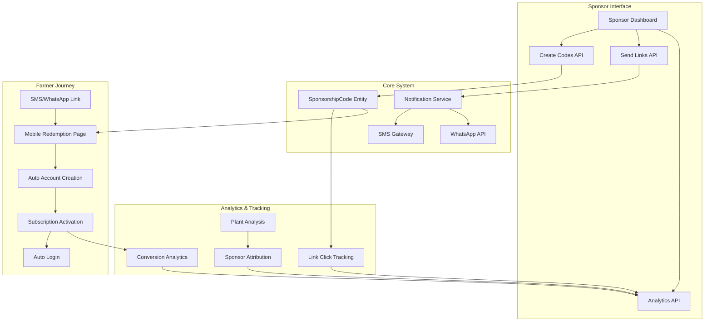
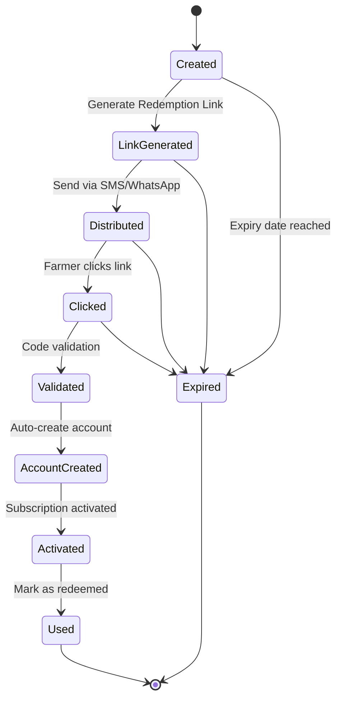
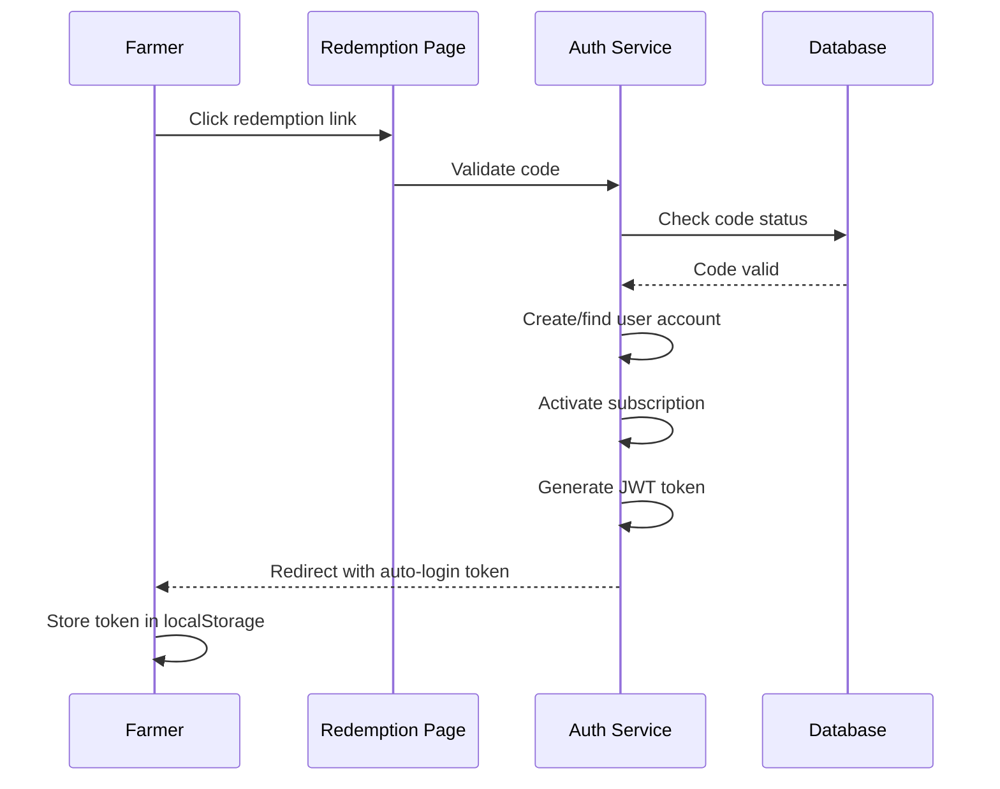

# ZiraAI Sponsorship Link System - Complete Full-Stack Documentation

## 📋 Table of Contents
- [System Overview](#-system-overview)
- [Architecture & Components](#-architecture--components)
- [API Documentation](#-api-documentation)
- [Business Logic & Workflows](#-business-logic--workflows)
- [Integration Examples](#-integration-examples)
- [Mobile App Integration](#-mobile-app-integration)
- [Testing & Validation](#-testing--validation)
- [Security & Best Practices](#-security--best-practices)
- [Performance & Monitoring](#-performance--monitoring)
- [Deployment Guide](#-deployment-guide)

---

## 🔍 System Overview

The ZiraAI Sponsorship Link System enables agricultural companies and organizations to sponsor farmers by providing them with free subscription access to ZiraAI plant analysis services. The system handles the complete lifecycle from code generation to redemption with integrated SMS/WhatsApp distribution and tracking.

### Key Features
- **Multi-Channel Distribution**: SMS and WhatsApp link delivery
- **Bulk Operations**: Send hundreds of sponsorship links simultaneously
- **Complete Tracking**: Click analytics, conversion metrics, and usage statistics
- **Auto-Registration**: Automatic farmer account creation during redemption
- **Seamless Authentication**: Auto-login after successful redemption
- **Mobile-First Design**: Optimized redemption flow for mobile devices

### Business Value
- **Sponsor Acquisition**: Enables B2B partnerships with agricultural organizations
- **User Growth**: Automated farmer onboarding through sponsorship
- **Usage Analytics**: Comprehensive tracking for sponsor ROI measurement
- **Brand Integration**: Sponsored analysis results show sponsor attribution

---

## 🏗️ Architecture & Components

### System Architecture



### Core Components

#### 1. **SponsorshipCode Entity** 
```csharp
public class SponsorshipCode : IEntity
{
    public int Id { get; set; }
    
    // Code Information
    public string Code { get; set; } // Unique code (e.g., AGRI-2025-X3K9)
    public int SponsorId { get; set; } // Sponsor company user ID
    public int SubscriptionTierId { get; set; } // Subscription tier provided
    
    // Usage Tracking
    public bool IsUsed { get; set; }
    public int? UsedByUserId { get; set; } // Redeemer farmer ID
    public DateTime? UsedDate { get; set; }
    
    // Link Distribution
    public string RedemptionLink { get; set; } // Generated URL
    public string RecipientPhone { get; set; } // Target phone number
    public string RecipientName { get; set; } // Farmer name
    public DateTime? LinkSentDate { get; set; }
    public string LinkSentVia { get; set; } // SMS/WhatsApp
    public bool LinkDelivered { get; set; }
    
    // Analytics
    public DateTime? LinkClickDate { get; set; } // First click
    public int LinkClickCount { get; set; } // Total clicks
    public string LastClickIpAddress { get; set; }
    
    // Validity
    public DateTime ExpiryDate { get; set; }
    public bool IsActive { get; set; }
}
```

#### 2. **Notification Service Integration**
- **Multi-Channel Support**: SMS and WhatsApp delivery
- **Template Management**: Personalized message templates
- **Bulk Operations**: Efficient batch processing
- **Delivery Tracking**: Real-time status updates
- **Error Handling**: Comprehensive failure management

#### 3. **Redemption Service**
- **Code Validation**: Multi-layer security checks
- **Auto-Registration**: Seamless farmer onboarding
- **Subscription Activation**: Instant access provisioning
- **Authentication**: JWT token generation for auto-login

---

## 📊 API Documentation

### Core Endpoints

#### **POST /api/v1/sponsorships/send-link** 
*Send sponsorship links via SMS or WhatsApp*

**Authorization**: `Bearer Token` (Sponsor role required)

**Request Body**:
```json
{
  "recipients": [
    {
      "code": "AGRI-2025-X3K9",
      "phone": "+905551234567",
      "name": "Mehmet Yılmaz"
    },
    {
      "code": "AGRI-2025-Y7M2",
      "phone": "+905559876543",
      "name": "Ayşe Demir"
    }
  ],
  "channel": "WhatsApp", // "SMS" or "WhatsApp"
  "customMessage": "ZiraAI ile bitkilerinizi ücretsiz analiz edin!" // Optional
}
```

**Response**:
```json
{
  "success": true,
  "data": {
    "totalSent": 2,
    "successCount": 2,
    "failureCount": 0,
    "results": [
      {
        "code": "AGRI-2025-X3K9",
        "phone": "+905551234567",
        "success": true,
        "errorMessage": null,
        "deliveryStatus": "Sent"
      },
      {
        "code": "AGRI-2025-Y7M2",
        "phone": "+905559876543", 
        "success": true,
        "errorMessage": null,
        "deliveryStatus": "Sent"
      }
    ]
  },
  "message": "📱 2 link başarıyla gönderildi via WhatsApp"
}
```

#### **POST /api/v1/sponsorships/codes**
*Create individual sponsorship code*

**Authorization**: `Bearer Token` (Sponsor role required)

**Request Body**:
```json
{
  "farmerName": "Mehmet Yılmaz",
  "farmerPhone": "+905551234567",
  "description": "Domates üreticisi",
  "expiryDate": "2025-12-31T23:59:59"
}
```

**Response**:
```json
{
  "success": true,
  "data": {
    "id": 123,
    "code": "AGRI-2025-X3K9",
    "sponsorId": 45,
    "subscriptionTierId": 2,
    "recipientName": "Mehmet Yılmaz",
    "recipientPhone": "+905551234567",
    "expiryDate": "2025-12-31T23:59:59",
    "isUsed": false,
    "isActive": true,
    "createdDate": "2025-08-14T10:30:00"
  }
}
```

#### **GET /api/v1/sponsorships/codes**
*Get sponsorship codes for current sponsor*

**Authorization**: `Bearer Token` (Sponsor role required)

**Query Parameters**:
- `onlyUnused` (boolean): Return only unused codes

**Response**:
```json
{
  "success": true,
  "data": [
    {
      "id": 123,
      "code": "AGRI-2025-X3K9",
      "recipientName": "Mehmet Yılmaz",
      "recipientPhone": "+905551234567",
      "isUsed": false,
      "linkSentDate": "2025-08-14T11:00:00",
      "linkSentVia": "WhatsApp",
      "linkClickCount": 3,
      "expiryDate": "2025-12-31T23:59:59"
    }
  ]
}
```

#### **GET /api/v1/sponsorships/link-statistics**
*Get link performance analytics*

**Authorization**: `Bearer Token` (Sponsor role required)

**Query Parameters**:
- `startDate` (DateTime): Start date for statistics
- `endDate` (DateTime): End date for statistics

**Response**:
```json
{
  "success": true,
  "data": {
    "totalLinks": 150,
    "linksSent": 145,
    "linksClicked": 98,
    "codesRedeemed": 67,
    "conversionRate": 68.37,
    "clickThroughRate": 67.59,
    "redemptionRate": 46.21,
    "topPerformingCodes": [
      {
        "code": "AGRI-2025-X3K9",
        "clicks": 15,
        "redeemed": true,
        "clickToRedemptionTime": "02:34:12"
      }
    ],
    "channelPerformance": {
      "SMS": {
        "sent": 75,
        "clicked": 45,
        "redeemed": 28,
        "conversionRate": 62.22
      },
      "WhatsApp": {
        "sent": 70,
        "clicked": 53,
        "redeemed": 39,
        "conversionRate": 73.58
      }
    }
  }
}
```

#### **GET /redeem/{code}**
*Public redemption endpoint (no authentication required)*

**URL Pattern**: `https://api.ziraai.com/redeem/AGRI-2025-X3K9`

**Response**: HTML page with redemption flow
- Success: Redirects to dashboard with auto-login token
- Error: Shows user-friendly error message with support contact

### Notification Endpoints

#### **POST /api/v1/notifications/whatsapp/send-bulk**
*Send bulk WhatsApp template messages*

**Authorization**: `Bearer Token` (Admin/Sponsor roles)

**Request Body**:
```json
{
  "templateName": "sponsorship_invitation",
  "recipients": [
    {
      "userId": 0,
      "phoneNumber": "+905551234567",
      "name": "Mehmet Yılmaz",
      "parameters": {
        "farmer_name": "Mehmet Yılmaz",
        "sponsor_code": "AGRI-2025-X3K9",
        "redemption_link": "https://ziraai.com/redeem/AGRI-2025-X3K9",
        "tier_name": "Medium",
        "custom_message": "Özel mesajınız"
      }
    }
  ]
}
```

---

## 🔄 Business Logic & Workflows

### 1. Sponsorship Code Lifecycle



### 2. Link Distribution Workflow

#### Step 1: Code Preparation
```csharp
// Validate codes exist and are available
var validCodes = await _codeRepository.GetListAsync(c => 
    codes.Contains(c.Code) && 
    c.SponsorId == request.SponsorId && 
    !c.IsUsed && 
    c.ExpiryDate > DateTime.Now);
```

#### Step 2: Link Generation
```csharp
// Generate redemption link for each code
var redemptionLink = $"https://ziraai.com/redeem/{recipient.Code}";
```

#### Step 3: Message Preparation
```csharp
// Build notification parameters
var parameters = new Dictionary<string, object>
{
    { "farmer_name", recipient.Name },
    { "sponsor_code", recipient.Code },
    { "redemption_link", redemptionLink },
    { "tier_name", codeEntity.SubscriptionTier?.DisplayName ?? "Premium" },
    { "custom_message", request.CustomMessage ?? "" }
};
```

#### Step 4: Multi-Channel Distribution
```csharp
// Channel-specific sending
if (request.Channel.ToLower() == "whatsapp")
{
    notificationResult = await _notificationService.SendBulkTemplateNotificationsAsync(
        recipients, "sponsorship_invitation", NotificationChannel.WhatsApp);
}
else
{
    notificationResult = await _notificationService.SendBulkTemplateNotificationsAsync(
        recipients, "sponsorship_invitation_sms", NotificationChannel.SMS);
}
```

### 3. Redemption Workflow

#### Step 1: Link Click Tracking
```csharp
public async Task TrackLinkClickAsync(string code, string ipAddress)
{
    var sponsorshipCode = await _codeRepository.GetAsync(c => c.Code == code);
    if (sponsorshipCode != null)
    {
        // Update click tracking
        if (!sponsorshipCode.LinkClickDate.HasValue)
            sponsorshipCode.LinkClickDate = DateTime.Now;
            
        sponsorshipCode.LinkClickCount++;
        sponsorshipCode.LastClickIpAddress = ipAddress;
    }
}
```

#### Step 2: Code Validation
```csharp
public async Task<IResult> ValidateCodeAsync(string code)
{
    var sponsorshipCode = await _codeRepository.GetAsync(c => c.Code == code);
    
    // Multi-layer validation
    if (sponsorshipCode == null)
        return new ErrorResult("Geçersiz aktivasyon kodu.");
        
    if (sponsorshipCode.IsUsed)
        return new ErrorResult("Bu kod daha önce kullanılmış.");
        
    if (!sponsorshipCode.IsActive)
        return new ErrorResult("Bu kod devre dışı bırakılmış.");
        
    if (sponsorshipCode.ExpiryDate < DateTime.Now)
        return new ErrorResult($"Bu kodun süresi {sponsorshipCode.ExpiryDate:dd.MM.yyyy} tarihinde dolmuş.");
        
    return new SuccessResult();
}
```

#### Step 3: Account Management
```csharp
// Auto-create account if farmer doesn't exist
var existingUser = await _redemptionService.FindUserByCodeAsync(code);
if (existingUser == null)
{
    var accountResult = await _redemptionService.CreateAccountFromCodeAsync(code);
    existingUser = accountResult.Data;
}
```

#### Step 4: Subscription Activation
```csharp
public async Task<IDataResult<UserSubscription>> ActivateSubscriptionAsync(string code, int userId)
{
    // Create 30-day subscription
    var subscription = new UserSubscription
    {
        UserId = userId,
        SubscriptionTierId = sponsorshipCode.SubscriptionTierId,
        StartDate = DateTime.Now,
        EndDate = DateTime.Now.AddDays(30),
        IsActive = true,
        PaymentMethod = "Sponsorship",
        PaymentReference = $"SPONSOR-{sponsorshipCode.Code}",
        PaidAmount = 0 // Sponsored
    };
    
    // Mark code as used
    sponsorshipCode.IsUsed = true;
    sponsorshipCode.UsedByUserId = userId;
    sponsorshipCode.UsedDate = DateTime.Now;
}
```

### 4. Phone Number Formatting
```csharp
private string FormatPhoneNumber(string phone)
{
    // Remove all non-numeric characters
    var cleaned = new string(phone.Where(char.IsDigit).ToArray());

    // Add Turkey country code if not present
    if (!cleaned.StartsWith("90") && cleaned.Length == 10)
        cleaned = "90" + cleaned;

    // Add + prefix
    if (!cleaned.StartsWith("+"))
        cleaned = "+" + cleaned;

    return cleaned;
}
```

---

## 💻 Integration Examples

### 1. React Frontend Integration

#### Sponsor Dashboard - Send Links Component
```jsx
import React, { useState } from 'react';
import axios from 'axios';

const SendSponsorshipLinks = () => {
  const [recipients, setRecipients] = useState([
    { code: '', phone: '', name: '' }
  ]);
  const [channel, setChannel] = useState('WhatsApp');
  const [customMessage, setCustomMessage] = useState('');
  const [loading, setLoading] = useState(false);
  const [results, setResults] = useState(null);

  const handleSendLinks = async () => {
    setLoading(true);
    try {
      const response = await axios.post('/api/v1/sponsorships/send-link', {
        recipients: recipients.filter(r => r.code && r.phone && r.name),
        channel,
        customMessage
      }, {
        headers: {
          'Authorization': `Bearer ${localStorage.getItem('auth_token')}`
        }
      });

      setResults(response.data.data);
    } catch (error) {
      console.error('Error sending links:', error);
      alert('Links gönderilirken hata oluştu');
    } finally {
      setLoading(false);
    }
  };

  const addRecipient = () => {
    setRecipients([...recipients, { code: '', phone: '', name: '' }]);
  };

  const updateRecipient = (index, field, value) => {
    const updated = [...recipients];
    updated[index][field] = value;
    setRecipients(updated);
  };

  return (
    <div className="send-links-container">
      <h2>Sponsorluk Linklerini Gönder</h2>
      
      {/* Channel Selection */}
      <div className="channel-selection">
        <label>
          <input 
            type="radio" 
            name="channel" 
            value="SMS" 
            checked={channel === 'SMS'}
            onChange={(e) => setChannel(e.target.value)}
          />
          SMS
        </label>
        <label>
          <input 
            type="radio" 
            name="channel" 
            value="WhatsApp" 
            checked={channel === 'WhatsApp'}
            onChange={(e) => setChannel(e.target.value)}
          />
          WhatsApp
        </label>
      </div>

      {/* Recipients List */}
      <div className="recipients-section">
        <h3>Alıcılar</h3>
        {recipients.map((recipient, index) => (
          <div key={index} className="recipient-row">
            <input
              type="text"
              placeholder="Sponsorluk Kodu"
              value={recipient.code}
              onChange={(e) => updateRecipient(index, 'code', e.target.value)}
            />
            <input
              type="text"
              placeholder="Telefon (+905551234567)"
              value={recipient.phone}
              onChange={(e) => updateRecipient(index, 'phone', e.target.value)}
            />
            <input
              type="text"
              placeholder="İsim"
              value={recipient.name}
              onChange={(e) => updateRecipient(index, 'name', e.target.value)}
            />
          </div>
        ))}
        <button onClick={addRecipient}>+ Alıcı Ekle</button>
      </div>

      {/* Custom Message */}
      <div className="custom-message">
        <label>Özel Mesaj (Opsiyonel)</label>
        <textarea
          value={customMessage}
          onChange={(e) => setCustomMessage(e.target.value)}
          placeholder="ZiraAI ile bitkilerinizi ücretsiz analiz edin!"
        />
      </div>

      {/* Send Button */}
      <button 
        onClick={handleSendLinks} 
        disabled={loading || recipients.every(r => !r.code)}
        className="send-button"
      >
        {loading ? 'Gönderiliyor...' : `${channel} ile Gönder`}
      </button>

      {/* Results */}
      {results && (
        <div className="results-section">
          <h3>Gönderim Sonuçları</h3>
          <div className="summary">
            <span className="success">✅ Başarılı: {results.successCount}</span>
            <span className="failure">❌ Başarısız: {results.failureCount}</span>
          </div>
          
          <div className="detailed-results">
            {results.results.map((result, index) => (
              <div key={index} className={`result-item ${result.success ? 'success' : 'error'}`}>
                <strong>{result.code}</strong> - {result.phone}
                <span className="status">{result.deliveryStatus}</span>
                {result.errorMessage && <p className="error-message">{result.errorMessage}</p>}
              </div>
            ))}
          </div>
        </div>
      )}
    </div>
  );
};

export default SendSponsorshipLinks;
```

### 2. Mobile Redemption Page (React)
```jsx
import React, { useEffect, useState } from 'react';
import { useParams } from 'react-router-dom';

const RedemptionPage = () => {
  const { code } = useParams();
  const [status, setStatus] = useState('loading'); // loading, success, error
  const [message, setMessage] = useState('');
  const [subscriptionTier, setSubscriptionTier] = useState('');

  useEffect(() => {
    // The redemption is handled server-side, but we can track the result
    const urlParams = new URLSearchParams(window.location.search);
    const token = urlParams.get('token');
    const tier = urlParams.get('subscription');
    
    if (token) {
      // Store token and redirect to dashboard
      localStorage.setItem('auth_token', token);
      setStatus('success');
      setSubscriptionTier(tier);
      setMessage(`${tier} aboneliğiniz aktive edildi!`);
      
      setTimeout(() => {
        window.location.href = '/dashboard';
      }, 3000);
    }
  }, []);

  if (status === 'loading') {
    return (
      <div className="redemption-page loading">
        <div className="spinner"></div>
        <p>Aktivasyon kodu doğrulanıyor...</p>
      </div>
    );
  }

  if (status === 'success') {
    return (
      <div className="redemption-page success">
        <div className="success-icon">✓</div>
        <h1>Aktivasyon Başarılı!</h1>
        <div className="tier-badge">{subscriptionTier} Abonelik</div>
        <p>{message}</p>
        <p>Birkaç saniye içinde dashboard'a yönlendirileceksiniz...</p>
      </div>
    );
  }

  return (
    <div className="redemption-page error">
      <div className="error-icon">✕</div>
      <h1>Aktivasyon Başarısız</h1>
      <p>{message}</p>
      <p>Sorun devam ederse lütfen destek@ziraai.com adresinden bizimle iletişime geçin.</p>
    </div>
  );
};

export default RedemptionPage;
```

### 3. Analytics Dashboard Component
```jsx
import React, { useEffect, useState } from 'react';
import axios from 'axios';
import { BarChart, Bar, XAxis, YAxis, CartesianGrid, Tooltip, PieChart, Pie, Cell } from 'recharts';

const SponsorshipAnalytics = () => {
  const [stats, setStats] = useState(null);
  const [dateRange, setDateRange] = useState({
    startDate: new Date(Date.now() - 30 * 24 * 60 * 60 * 1000).toISOString().split('T')[0],
    endDate: new Date().toISOString().split('T')[0]
  });

  useEffect(() => {
    fetchAnalytics();
  }, [dateRange]);

  const fetchAnalytics = async () => {
    try {
      const response = await axios.get('/api/v1/sponsorships/link-statistics', {
        params: dateRange,
        headers: {
          'Authorization': `Bearer ${localStorage.getItem('auth_token')}`
        }
      });
      setStats(response.data.data);
    } catch (error) {
      console.error('Error fetching analytics:', error);
    }
  };

  if (!stats) return <div>Loading...</div>;

  const channelData = Object.entries(stats.channelPerformance).map(([channel, data]) => ({
    name: channel,
    sent: data.sent,
    clicked: data.clicked,
    redeemed: data.redeemed,
    conversion: data.conversionRate
  }));

  const conversionData = [
    { name: 'Tıklanan', value: stats.linksClicked, color: '#8884d8' },
    { name: 'Kullanılan', value: stats.codesRedeemed, color: '#82ca9d' },
    { name: 'Tıklanmayan', value: stats.linksSent - stats.linksClicked, color: '#ffc658' }
  ];

  return (
    <div className="analytics-dashboard">
      <h2>Sponsorluk Link Analitikleri</h2>
      
      {/* Date Range Selector */}
      <div className="date-range">
        <input
          type="date"
          value={dateRange.startDate}
          onChange={(e) => setDateRange({...dateRange, startDate: e.target.value})}
        />
        <input
          type="date"
          value={dateRange.endDate}
          onChange={(e) => setDateRange({...dateRange, endDate: e.target.value})}
        />
      </div>

      {/* Key Metrics */}
      <div className="metrics-grid">
        <div className="metric-card">
          <h3>Toplam Link</h3>
          <div className="metric-value">{stats.totalLinks}</div>
        </div>
        <div className="metric-card">
          <h3>Gönderilen</h3>
          <div className="metric-value">{stats.linksSent}</div>
        </div>
        <div className="metric-card">
          <h3>Tıklanan</h3>
          <div className="metric-value">{stats.linksClicked}</div>
        </div>
        <div className="metric-card">
          <h3>Kullanılan</h3>
          <div className="metric-value">{stats.codesRedeemed}</div>
        </div>
        <div className="metric-card">
          <h3>Dönüşüm Oranı</h3>
          <div className="metric-value">{stats.conversionRate.toFixed(1)}%</div>
        </div>
      </div>

      {/* Channel Performance Chart */}
      <div className="chart-section">
        <h3>Kanal Performansı</h3>
        <BarChart width={600} height={300} data={channelData}>
          <CartesianGrid strokeDasharray="3 3" />
          <XAxis dataKey="name" />
          <YAxis />
          <Tooltip />
          <Bar dataKey="sent" fill="#8884d8" name="Gönderilen" />
          <Bar dataKey="clicked" fill="#82ca9d" name="Tıklanan" />
          <Bar dataKey="redeemed" fill="#ffc658" name="Kullanılan" />
        </BarChart>
      </div>

      {/* Conversion Funnel */}
      <div className="chart-section">
        <h3>Dönüşüm Hunisi</h3>
        <PieChart width={400} height={400}>
          <Pie
            data={conversionData}
            cx={200}
            cy={200}
            labelLine={false}
            label={({ name, percent }) => `${name} ${(percent * 100).toFixed(0)}%`}
            outerRadius={80}
            fill="#8884d8"
            dataKey="value"
          >
            {conversionData.map((entry, index) => (
              <Cell key={`cell-${index}`} fill={entry.color} />
            ))}
          </Pie>
          <Tooltip />
        </PieChart>
      </div>

      {/* Top Performing Codes */}
      <div className="top-codes">
        <h3>En İyi Performans Gösteren Kodlar</h3>
        <div className="codes-list">
          {stats.topPerformingCodes.map((codeData, index) => (
            <div key={index} className="code-item">
              <strong>{codeData.code}</strong>
              <span className="clicks">{codeData.clicks} tıklama</span>
              <span className="status">{codeData.redeemed ? '✅ Kullanıldı' : '⏳ Bekliyor'}</span>
              {codeData.clickToRedemptionTime && (
                <span className="time">⏱ {codeData.clickToRedemptionTime}</span>
              )}
            </div>
          ))}
        </div>
      </div>
    </div>
  );
};

export default SponsorshipAnalytics;
```

---

## 📱 Mobile App Integration Guide

### 1. Flutter Implementation

#### Redemption Service
```dart
import 'dart:convert';
import 'package:http/http.dart' as http;

class RedemptionService {
  static const String baseUrl = 'https://api.ziraai.com';
  
  static Future<Map<String, dynamic>> redeemCode(String code) async {
    try {
      final response = await http.get(
        Uri.parse('$baseUrl/redeem/$code'),
        headers: {
          'Content-Type': 'application/json',
        },
      );
      
      if (response.statusCode == 200) {
        // Server returns HTML for redemption page
        // Check for success indicators in the response
        if (response.body.contains('Aktivasyon Başarılı')) {
          // Extract token from response or localStorage
          return {
            'success': true,
            'message': 'Aktivasyon başarılı',
            'requiresAuth': true
          };
        }
      }
      
      return {
        'success': false,
        'message': 'Kod geçersiz veya süresi dolmuş'
      };
    } catch (e) {
      return {
        'success': false,
        'message': 'Bağlantı hatası'
      };
    }
  }
  
  static Future<Map<String, dynamic>> validateCode(String code) async {
    try {
      final response = await http.post(
        Uri.parse('$baseUrl/api/v1/sponsorships/validate-code'),
        headers: {
          'Content-Type': 'application/json',
        },
        body: jsonEncode({'code': code}),
      );
      
      final data = jsonDecode(response.body);
      return data;
    } catch (e) {
      return {
        'success': false,
        'message': 'Doğrulama başarısız'
      };
    }
  }
}
```

#### QR Code Scanner for Redemption
```dart
import 'package:flutter/material.dart';
import 'package:qr_code_scanner/qr_code_scanner.dart';

class QRScannerPage extends StatefulWidget {
  @override
  _QRScannerPageState createState() => _QRScannerPageState();
}

class _QRScannerPageState extends State<QRScannerPage> {
  final GlobalKey qrKey = GlobalKey(debugLabel: 'QR');
  QRViewController? controller;
  String? scannedCode;

  @override
  Widget build(BuildContext context) {
    return Scaffold(
      appBar: AppBar(
        title: Text('Sponsorluk Kodu Tara'),
        backgroundColor: Colors.green,
      ),
      body: Column(
        children: [
          Expanded(
            flex: 5,
            child: QRView(
              key: qrKey,
              onQRViewCreated: _onQRViewCreated,
              overlay: QrScannerOverlayShape(
                borderColor: Colors.green,
                borderRadius: 10,
                borderLength: 30,
                borderWidth: 10,
                cutOutSize: 300,
              ),
            ),
          ),
          Expanded(
            flex: 1,
            child: Center(
              child: Column(
                mainAxisAlignment: MainAxisAlignment.center,
                children: [
                  Text(
                    'QR kodu kameranın karşısına tutun',
                    style: TextStyle(fontSize: 16),
                  ),
                  if (scannedCode != null)
                    Padding(
                      padding: const EdgeInsets.all(8.0),
                      child: Text(
                        'Kod: $scannedCode',
                        style: TextStyle(
                          fontSize: 14,
                          color: Colors.green,
                          fontWeight: FontWeight.bold,
                        ),
                      ),
                    ),
                ],
              ),
            ),
          ),
        ],
      ),
    );
  }

  void _onQRViewCreated(QRViewController controller) {
    this.controller = controller;
    controller.scannedDataStream.listen((scanData) async {
      if (scanData.code != null && scannedCode != scanData.code) {
        setState(() {
          scannedCode = scanData.code;
        });
        
        // Extract code from URL if it's a redemption link
        String code = scanData.code!;
        if (code.contains('/redeem/')) {
          code = code.split('/redeem/').last;
        }
        
        // Navigate to redemption page
        Navigator.pushReplacementNamed(
          context, 
          '/redeem',
          arguments: {'code': code}
        );
      }
    });
  }

  @override
  void dispose() {
    controller?.dispose();
    super.dispose();
  }
}
```

#### Redemption Results Page
```dart
import 'package:flutter/material.dart';

class RedemptionResultPage extends StatefulWidget {
  final String code;
  
  RedemptionResultPage({required this.code});
  
  @override
  _RedemptionResultPageState createState() => _RedemptionResultPageState();
}

class _RedemptionResultPageState extends State<RedemptionResultPage> 
    with TickerProviderStateMixin {
  
  late AnimationController _animationController;
  late Animation<double> _fadeAnimation;
  
  bool isLoading = true;
  bool isSuccess = false;
  String message = '';
  String subscriptionTier = '';
  
  @override
  void initState() {
    super.initState();
    
    _animationController = AnimationController(
      duration: Duration(seconds: 2),
      vsync: this,
    );
    
    _fadeAnimation = Tween<double>(
      begin: 0.0,
      end: 1.0,
    ).animate(CurvedAnimation(
      parent: _animationController,
      curve: Curves.easeIn,
    ));
    
    _redeemCode();
  }
  
  Future<void> _redeemCode() async {
    final result = await RedemptionService.redeemCode(widget.code);
    
    setState(() {
      isLoading = false;
      isSuccess = result['success'] ?? false;
      message = result['message'] ?? '';
      subscriptionTier = result['subscriptionTier'] ?? 'Premium';
    });
    
    _animationController.forward();
    
    if (isSuccess) {
      // Auto redirect to dashboard after 3 seconds
      Future.delayed(Duration(seconds: 3), () {
        Navigator.pushNamedAndRemoveUntil(
          context, 
          '/dashboard', 
          (route) => false
        );
      });
    }
  }
  
  @override
  Widget build(BuildContext context) {
    return Scaffold(
      backgroundColor: isSuccess ? Colors.green[50] : Colors.red[50],
      body: Center(
        child: FadeTransition(
          opacity: _fadeAnimation,
          child: Padding(
            padding: EdgeInsets.all(32.0),
            child: Column(
              mainAxisAlignment: MainAxisAlignment.center,
              children: [
                if (isLoading) ...[
                  CircularProgressIndicator(
                    valueColor: AlwaysStoppedAnimation<Color>(Colors.green),
                  ),
                  SizedBox(height: 24),
                  Text(
                    'Aktivasyon kodu doğrulanıyor...',
                    style: TextStyle(
                      fontSize: 18,
                      color: Colors.grey[600],
                    ),
                    textAlign: TextAlign.center,
                  ),
                ] else ...[
                  // Success/Error Icon
                  Container(
                    width: 100,
                    height: 100,
                    decoration: BoxDecoration(
                      color: isSuccess ? Colors.green : Colors.red,
                      shape: BoxShape.circle,
                    ),
                    child: Icon(
                      isSuccess ? Icons.check : Icons.close,
                      color: Colors.white,
                      size: 60,
                    ),
                  ),
                  SizedBox(height: 32),
                  
                  // Title
                  Text(
                    isSuccess ? 'Aktivasyon Başarılı!' : 'Aktivasyon Başarısız',
                    style: TextStyle(
                      fontSize: 24,
                      fontWeight: FontWeight.bold,
                      color: isSuccess ? Colors.green[800] : Colors.red[800],
                    ),
                    textAlign: TextAlign.center,
                  ),
                  SizedBox(height: 16),
                  
                  // Subscription Badge (if success)
                  if (isSuccess && subscriptionTier.isNotEmpty) ...[
                    Container(
                      padding: EdgeInsets.symmetric(horizontal: 16, vertical: 8),
                      decoration: BoxDecoration(
                        color: Colors.grey[200],
                        borderRadius: BorderRadius.circular(20),
                      ),
                      child: Text(
                        '$subscriptionTier Abonelik',
                        style: TextStyle(
                          fontSize: 16,
                          fontWeight: FontWeight.w600,
                          color: Colors.grey[700],
                        ),
                      ),
                    ),
                    SizedBox(height: 24),
                  ],
                  
                  // Message
                  Text(
                    message,
                    style: TextStyle(
                      fontSize: 16,
                      color: Colors.grey[600],
                      height: 1.4,
                    ),
                    textAlign: TextAlign.center,
                  ),
                  SizedBox(height: 32),
                  
                  if (isSuccess) ...[
                    // Loading indicator for redirect
                    Row(
                      mainAxisAlignment: MainAxisAlignment.center,
                      children: [
                        SizedBox(
                          width: 20,
                          height: 20,
                          child: CircularProgressIndicator(
                            strokeWidth: 2,
                            valueColor: AlwaysStoppedAnimation<Color>(Colors.green),
                          ),
                        ),
                        SizedBox(width: 12),
                        Text(
                          'Dashboard\'a yönlendiriliyorsunuz...',
                          style: TextStyle(
                            color: Colors.grey[600],
                            fontSize: 14,
                          ),
                        ),
                      ],
                    ),
                  ] else ...[
                    // Retry button for failed redemption
                    ElevatedButton(
                      onPressed: () {
                        setState(() {
                          isLoading = true;
                        });
                        _redeemCode();
                      },
                      child: Text('Tekrar Dene'),
                      style: ElevatedButton.styleFrom(
                        backgroundColor: Colors.red,
                        padding: EdgeInsets.symmetric(horizontal: 32, vertical: 12),
                      ),
                    ),
                    SizedBox(height: 16),
                    TextButton(
                      onPressed: () {
                        Navigator.pop(context);
                      },
                      child: Text('Geri Dön'),
                    ),
                  ],
                ],
              ],
            ),
          ),
        ),
      ),
    );
  }
  
  @override
  void dispose() {
    _animationController.dispose();
    super.dispose();
  }
}
```

### 2. React Native Implementation

#### Redemption Hook
```javascript
import { useState, useEffect } from 'react';
import AsyncStorage from '@react-native-async-storage/async-storage';

export const useRedemption = () => {
  const [loading, setLoading] = useState(false);
  const [error, setError] = useState(null);
  
  const redeemCode = async (code) => {
    setLoading(true);
    setError(null);
    
    try {
      const response = await fetch(`https://api.ziraai.com/redeem/${code}`, {
        method: 'GET',
        headers: {
          'Content-Type': 'application/json',
        },
      });
      
      // Check if redirected to success page
      if (response.url.includes('redemption-success')) {
        const url = new URL(response.url);
        const token = url.searchParams.get('token');
        const subscription = url.searchParams.get('subscription');
        
        if (token) {
          await AsyncStorage.setItem('auth_token', token);
          return {
            success: true,
            token,
            subscription,
            message: `${subscription} aboneliğiniz aktive edildi!`
          };
        }
      }
      
      // Handle error cases
      if (response.url.includes('error')) {
        const url = new URL(response.url);
        const message = url.searchParams.get('message') || 'Aktivasyon başarısız';
        throw new Error(message);
      }
      
      throw new Error('Beklenmeyen hata oluştu');
      
    } catch (err) {
      setError(err.message);
      return {
        success: false,
        message: err.message
      };
    } finally {
      setLoading(false);
    }
  };
  
  return {
    redeemCode,
    loading,
    error
  };
};
```

#### QR Scanner Component
```javascript
import React, { useState } from 'react';
import { View, Text, StyleSheet, Alert } from 'react-native';
import { RNCamera } from 'react-native-camera';

const QRScanner = ({ navigation }) => {
  const [scanned, setScanned] = useState(false);
  
  const onBarCodeRead = (event) => {
    if (scanned) return;
    
    setScanned(true);
    let code = event.data;
    
    // Extract code from URL if it's a redemption link
    if (code.includes('/redeem/')) {
      code = code.split('/redeem/').pop();
    }
    
    // Navigate to redemption screen
    navigation.navigate('RedemptionResult', { code });
  };
  
  return (
    <View style={styles.container}>
      <RNCamera
        style={styles.camera}
        onBarCodeRead={onBarCodeRead}
        barCodeTypes={[RNCamera.Constants.BarCodeType.qr]}
      >
        <View style={styles.overlay}>
          <View style={styles.scanArea} />
          <Text style={styles.instructionText}>
            QR kodu kameranın karşısına tutun
          </Text>
        </View>
      </RNCamera>
    </View>
  );
};

const styles = StyleSheet.create({
  container: {
    flex: 1,
  },
  camera: {
    flex: 1,
  },
  overlay: {
    flex: 1,
    backgroundColor: 'rgba(0, 0, 0, 0.5)',
    justifyContent: 'center',
    alignItems: 'center',
  },
  scanArea: {
    width: 250,
    height: 250,
    borderColor: '#00ff00',
    borderWidth: 2,
    borderRadius: 10,
    backgroundColor: 'transparent',
  },
  instructionText: {
    color: 'white',
    fontSize: 16,
    marginTop: 20,
    textAlign: 'center',
  },
});

export default QRScanner;
```

### 3. WhatsApp Template Messages

#### Template Configuration
```json
{
  "name": "sponsorship_invitation",
  "language": "tr",
  "components": [
    {
      "type": "HEADER",
      "format": "TEXT",
      "text": "🌱 ZiraAI Sponsorluk Davetiyesi"
    },
    {
      "type": "BODY",
      "text": "Merhaba {{1}},\n\n{{2}} şirketi size {{3}} abonelik hediye etti! 🎁\n\nÜcretsiz bitki analizlerinize başlamak için aşağıdaki linke tıklayın:\n{{4}}\n\n{{5}}\n\nAktivasyon süresi: Son kullanma tarihi\nDestek: destek@ziraai.com",
      "parameters": [
        {"type": "TEXT", "text": "{{farmer_name}}"},
        {"type": "TEXT", "text": "{{sponsor_company}}"},
        {"type": "TEXT", "text": "{{tier_name}}"},
        {"type": "TEXT", "text": "{{redemption_link}}"},
        {"type": "TEXT", "text": "{{custom_message}}"}
      ]
    },
    {
      "type": "FOOTER",
      "text": "ZiraAI - Akıllı Tarım Çözümleri"
    },
    {
      "type": "BUTTONS",
      "buttons": [
        {
          "type": "URL",
          "text": "🔗 Aktive Et",
          "url": "{{redemption_link}}"
        }
      ]
    }
  ]
}
```

#### SMS Template
```
🌱 ZiraAI Sponsorluk Davetiyesi

Merhaba {{farmer_name}},

{{sponsor_company}} size {{tier_name}} abonelik hediye etti! 🎁

Ücretsiz analizlerinize başlayın:
{{redemption_link}}

{{custom_message}}

Destek: destek@ziraai.com
ZiraAI
```

---

## 🧪 Testing & Validation Scenarios

### 1. API Testing with Postman

#### Environment Variables
```json
{
  "baseUrl": "https://api.ziraai.com",
  "authToken": "{{auth_token}}",
  "sponsorId": "{{sponsor_user_id}}",
  "testPhoneNumber": "+905551234567"
}
```

#### Test Collection Structure

**1. Authentication Tests**
```javascript
// Pre-request Script
pm.test("Environment variables are set", () => {
    pm.expect(pm.environment.get("baseUrl")).to.not.be.undefined;
    pm.expect(pm.environment.get("authToken")).to.not.be.undefined;
});

// Test Script
pm.test("Status code is 200", () => {
    pm.response.to.have.status(200);
});

pm.test("Response contains success field", () => {
    const jsonData = pm.response.json();
    pm.expect(jsonData).to.have.property('success');
});
```

**2. Code Creation Test**
```javascript
// Request Body
{
  "farmerName": "Test Farmer {{$timestamp}}",
  "farmerPhone": "+905551234567",
  "description": "Test sponsorship code",
  "expiryDate": "2025-12-31T23:59:59"
}

// Test Script
pm.test("Code created successfully", () => {
    const jsonData = pm.response.json();
    pm.expect(jsonData.success).to.be.true;
    pm.expect(jsonData.data).to.have.property('code');
    pm.environment.set("testCode", jsonData.data.code);
});
```

**3. Link Sending Test**
```javascript
// Request Body
{
  "recipients": [
    {
      "code": "{{testCode}}",
      "phone": "{{testPhoneNumber}}",
      "name": "Test Recipient"
    }
  ],
  "channel": "SMS",
  "customMessage": "Test message from Postman"
}

// Test Script
pm.test("Links sent successfully", () => {
    const jsonData = pm.response.json();
    pm.expect(jsonData.success).to.be.true;
    pm.expect(jsonData.data.successCount).to.be.greaterThan(0);
    pm.expect(jsonData.data.results).to.be.an('array');
});
```

### 2. End-to-End Testing Scenarios

#### Scenario 1: Complete Redemption Flow
```gherkin
Feature: Sponsorship Code Redemption
  
  Scenario: Successful code redemption by new farmer
    Given a sponsor has created a sponsorship code
    And the code has been sent via WhatsApp to a farmer
    When the farmer clicks the redemption link
    And the farmer doesn't have an existing account
    Then a new account should be created automatically
    And a 30-day subscription should be activated
    And the farmer should be redirected to the dashboard with auto-login
    And the sponsorship code should be marked as used

  Scenario: Code redemption by existing farmer
    Given a sponsor has created a sponsorship code
    And the code has been sent via SMS to an existing farmer
    When the farmer clicks the redemption link
    Then the existing account should be identified by phone number
    And a new subscription should be activated
    And the farmer should be redirected to the dashboard with auto-login

  Scenario: Invalid code redemption attempt
    Given a farmer clicks a redemption link with an invalid code
    When the redemption page loads
    Then an error message should be displayed
    And the farmer should be provided with support contact information
    And no account or subscription should be created
```

#### Scenario 2: Bulk Link Distribution
```gherkin
Feature: Bulk Link Distribution
  
  Scenario: Successful bulk WhatsApp distribution
    Given a sponsor has 10 valid sponsorship codes
    And each code has recipient information (name, phone)
    When the sponsor sends all codes via WhatsApp
    Then all 10 messages should be sent successfully
    And each code should have LinkSentDate and LinkSentVia updated
    And the sponsor should receive a success summary

  Scenario: Mixed results in bulk distribution
    Given a sponsor has 5 valid codes and 2 invalid codes
    When the sponsor attempts bulk distribution
    Then 5 messages should be sent successfully
    And 2 should fail with appropriate error messages
    And the sponsor should receive detailed results for each code
```

### 3. Performance Testing

#### Load Testing Script (Apache Bench)
```bash
#!/bin/bash

# Test concurrent redemption requests
ab -n 1000 -c 50 -H "Content-Type: application/json" \
   https://api.ziraai.com/redeem/TEST-CODE-2025

# Test bulk link sending under load
ab -n 100 -c 10 -p bulk_send_payload.json -T application/json \
   -H "Authorization: Bearer $AUTH_TOKEN" \
   https://api.ziraai.com/api/v1/sponsorships/send-link
```

#### Database Performance Monitoring
```sql
-- Monitor sponsorship code queries performance
EXPLAIN ANALYZE 
SELECT * FROM "SponsorshipCodes" 
WHERE "Code" = 'AGRI-2025-X3K9' 
  AND "IsUsed" = false 
  AND "ExpiryDate" > NOW();

-- Index recommendations
CREATE INDEX IF NOT EXISTS idx_sponsorship_codes_lookup 
ON "SponsorshipCodes"("Code", "IsUsed", "ExpiryDate");

CREATE INDEX IF NOT EXISTS idx_sponsorship_codes_sponsor
ON "SponsorshipCodes"("SponsorId", "IsUsed");
```

### 4. Security Testing

#### Penetration Testing Checklist
```markdown
**Authentication & Authorization**
- [ ] JWT token validation on protected endpoints
- [ ] Role-based access control (Sponsor vs Farmer vs Admin)
- [ ] Token expiration handling
- [ ] Unauthorized access attempts

**Input Validation**
- [ ] SQL injection attempts on code parameters
- [ ] XSS attempts in custom messages
- [ ] Phone number format validation
- [ ] Code format validation (length, characters)

**Rate Limiting**
- [ ] Bulk sending rate limits
- [ ] Redemption attempt rate limits
- [ ] API endpoint throttling

**Data Privacy**
- [ ] Personal information encryption
- [ ] Phone number masking in logs
- [ ] GDPR compliance for EU farmers
```

#### Security Test Cases
```javascript
// Test unauthorized access
pm.test("Unauthorized request fails", () => {
    pm.sendRequest({
        url: pm.environment.get("baseUrl") + "/api/v1/sponsorships/codes",
        method: 'GET',
        header: {
            'Content-Type': 'application/json'
            // No Authorization header
        }
    }, (err, response) => {
        pm.expect(response.code).to.equal(401);
    });
});

// Test role-based access
pm.test("Farmer cannot access sponsor endpoints", () => {
    pm.sendRequest({
        url: pm.environment.get("baseUrl") + "/api/v1/sponsorships/send-link",
        method: 'POST',
        header: {
            'Content-Type': 'application/json',
            'Authorization': 'Bearer ' + pm.environment.get("farmerToken")
        },
        body: {
            mode: 'raw',
            raw: JSON.stringify({
                recipients: [{"code": "TEST", "phone": "+90555", "name": "Test"}],
                channel: "SMS"
            })
        }
    }, (err, response) => {
        pm.expect(response.code).to.equal(403);
    });
});
```

---

## 🔐 Security & Best Practices

### 1. Security Architecture

#### Authentication Flow


#### Security Controls

**1. Code Generation Security**
```csharp
private string GenerateUniqueCode()
{
    // Use cryptographically secure random generation
    var random = RandomNumberGenerator.Create();
    var bytes = new byte[8];
    random.GetBytes(bytes);
    
    // Convert to alphanumeric code
    var code = Convert.ToBase64String(bytes)
        .Replace("/", "")
        .Replace("+", "")
        .Replace("=", "")
        .ToUpper();
    
    // Add prefix and format
    return $"AGRI-{DateTime.Now.Year}-{code}";
}
```

**2. Phone Number Validation**
```csharp
public static bool IsValidTurkishPhoneNumber(string phone)
{
    // Remove all non-numeric characters
    var cleaned = Regex.Replace(phone, @"[^\d]", "");
    
    // Check Turkish mobile number patterns
    var patterns = new[]
    {
        @"^905\d{9}$",      // +90 5XX XXX XXXX
        @"^5\d{9}$",        // 5XX XXX XXXX
        @"^05\d{9}$"        // 05XX XXX XXXX
    };
    
    return patterns.Any(pattern => Regex.IsMatch(cleaned, pattern));
}
```

**3. Rate Limiting Implementation**
```csharp
[RateLimit(PermitLimit = 10, Window = 60)] // 10 requests per minute
public async Task<IActionResult> SendSponsorshipLink([FromBody] SendSponsorshipLinkCommand command)
{
    // Rate limiting is applied by the attribute
    // Implementation continues...
}
```

### 2. Data Protection

#### Sensitive Data Handling
```csharp
public class SponsorshipCodeDto
{
    public string Code { get; set; }
    
    [JsonIgnore] // Never expose in API responses
    public string RecipientPhone { get; set; }
    
    // Masked phone number for display
    public string MaskedPhone => MaskPhoneNumber(RecipientPhone);
    
    private string MaskPhoneNumber(string phone)
    {
        if (string.IsNullOrEmpty(phone) || phone.Length < 8)
            return "***";
            
        return $"{phone[..3]}****{phone[^2..]}";
    }
}
```

#### Encryption for Sensitive Fields
```csharp
[Column(TypeName = "varchar(500)")]
public string EncryptedRecipientData { get; set; }

public string RecipientPhone
{
    get => _encryptionService.Decrypt(EncryptedRecipientData);
    set => EncryptedRecipientData = _encryptionService.Encrypt(value);
}
```

### 3. Input Validation

#### Request Validation Attributes
```csharp
public class SendSponsorshipLinkCommand : IRequest<IDataResult<BulkSendResult>>
{
    [Required]
    [MinLength(1, ErrorMessage = "En az bir alıcı belirtilmelidir")]
    [MaxLength(100, ErrorMessage = "Maksimum 100 alıcı gönderilebilir")]
    public List<LinkRecipient> Recipients { get; set; } = new();
    
    [Required]
    [RegularExpression("^(SMS|WhatsApp)$", ErrorMessage = "Kanal SMS veya WhatsApp olmalıdır")]
    public string Channel { get; set; } = "SMS";
    
    [MaxLength(500, ErrorMessage = "Özel mesaj maksimum 500 karakter olabilir")]
    public string CustomMessage { get; set; }

    public class LinkRecipient
    {
        [Required]
        [RegularExpression(@"^[A-Z0-9]{4}-[0-9]{4}-[A-Z0-9]{4}$", 
            ErrorMessage = "Geçersiz kod formatı")]
        public string Code { get; set; }
        
        [Required]
        [Phone(ErrorMessage = "Geçersiz telefon numarası")]
        public string Phone { get; set; }
        
        [Required]
        [MinLength(2, ErrorMessage = "İsim en az 2 karakter olmalıdır")]
        [MaxLength(100, ErrorMessage = "İsim maksimum 100 karakter olabilir")]
        public string Name { get; set; }
    }
}
```

### 4. Audit Logging

#### Comprehensive Logging Strategy
```csharp
public class SponsorshipAuditService : ISponsorshipAuditService
{
    private readonly ILogger<SponsorshipAuditService> _logger;
    
    public async Task LogCodeCreation(int sponsorId, string code, string recipientInfo)
    {
        _logger.LogInformation("AUDIT: Code created by sponsor {SponsorId}. Code: {Code}, Recipient: {RecipientInfo}", 
            sponsorId, code, MaskSensitiveData(recipientInfo));
    }
    
    public async Task LogLinkDistribution(int sponsorId, int recipientCount, string channel, int successCount)
    {
        _logger.LogInformation("AUDIT: Bulk distribution by sponsor {SponsorId}. " +
            "Recipients: {RecipientCount}, Channel: {Channel}, Success: {SuccessCount}", 
            sponsorId, recipientCount, channel, successCount);
    }
    
    public async Task LogRedemption(string code, int? userId, string ipAddress, bool success)
    {
        _logger.LogInformation("AUDIT: Redemption attempt for code {Code} from IP {IpAddress}. " +
            "User: {UserId}, Success: {Success}", 
            code, MaskIpAddress(ipAddress), userId, success);
    }
    
    private string MaskSensitiveData(string data)
    {
        // Implement data masking logic
        return data.Length > 4 ? $"{data[..2]}***{data[^2..]}" : "***";
    }
}
```

### 5. Error Handling

#### Secure Error Responses
```csharp
public class GlobalExceptionHandler : IExceptionHandler
{
    public async Task<bool> TryHandleAsync(
        HttpContext httpContext, 
        Exception exception, 
        CancellationToken cancellationToken)
    {
        var response = new
        {
            success = false,
            message = GetUserFriendlyMessage(exception),
            correlationId = httpContext.TraceIdentifier
        };
        
        // Log detailed error for developers
        _logger.LogError(exception, "Error in sponsorship system. CorrelationId: {CorrelationId}", 
            httpContext.TraceIdentifier);
        
        // Return generic message to users
        httpContext.Response.StatusCode = GetStatusCode(exception);
        await httpContext.Response.WriteAsync(JsonSerializer.Serialize(response));
        
        return true;
    }
    
    private string GetUserFriendlyMessage(Exception exception)
    {
        return exception switch
        {
            ValidationException => "Gönderilen veri geçersiz",
            UnauthorizedAccessException => "Bu işlem için yetkiniz bulunmuyor",
            NotFoundException => "Aranan kayıt bulunamadı",
            _ => "Sistemsel bir hata oluştu. Lütfen tekrar deneyiniz"
        };
    }
}
```

---

## 📈 Performance & Monitoring

### 1. Performance Optimization

#### Database Indexing Strategy
```sql
-- Core lookup index for redemption
CREATE INDEX CONCURRENTLY idx_sponsorship_codes_redemption
ON "SponsorshipCodes"("Code") 
WHERE "IsUsed" = false AND "ExpiryDate" > NOW();

-- Sponsor dashboard queries
CREATE INDEX CONCURRENTLY idx_sponsorship_codes_sponsor_dashboard
ON "SponsorshipCodes"("SponsorId", "CreatedDate" DESC)
INCLUDE ("IsUsed", "LinkClickCount", "UsedDate");

-- Analytics queries
CREATE INDEX CONCURRENTLY idx_sponsorship_codes_analytics
ON "SponsorshipCodes"("SponsorId", "LinkSentDate")
WHERE "LinkSentDate" IS NOT NULL;

-- Usage statistics
CREATE INDEX CONCURRENTLY idx_sponsorship_codes_usage_stats
ON "SponsorshipCodes"("UsedDate", "SponsorId")
WHERE "IsUsed" = true;
```

#### Caching Strategy
```csharp
public class CachedSponsorshipService : ISponsorshipService
{
    private readonly ISponsorshipService _innerService;
    private readonly IMemoryCache _cache;
    
    public async Task<SponsorshipCode> GetCodeAsync(string code)
    {
        var cacheKey = $"sponsorship_code_{code}";
        
        if (_cache.TryGetValue(cacheKey, out SponsorshipCode cachedCode))
        {
            return cachedCode;
        }
        
        var sponsorshipCode = await _innerService.GetCodeAsync(code);
        
        if (sponsorshipCode != null && !sponsorshipCode.IsUsed)
        {
            // Cache unused codes for 5 minutes
            _cache.Set(cacheKey, sponsorshipCode, TimeSpan.FromMinutes(5));
        }
        
        return sponsorshipCode;
    }
    
    public async Task MarkCodeAsUsedAsync(string code, int userId)
    {
        await _innerService.MarkCodeAsUsedAsync(code, userId);
        
        // Invalidate cache when code is used
        _cache.Remove($"sponsorship_code_{code}");
    }
}
```

#### Bulk Operation Optimization
```csharp
public async Task<IDataResult<BulkSendResult>> SendBulkSponsorshipLinksAsync(
    SendSponsorshipLinkCommand request)
{
    // Batch process recipients in groups of 50
    const int batchSize = 50;
    var batches = request.Recipients.Batch(batchSize);
    
    var allResults = new List<SendResult>();
    
    await foreach (var batch in batches.ToAsyncEnumerable())
    {
        var batchTasks = batch.Select(async recipient =>
        {
            try
            {
                return await ProcessSingleRecipient(recipient, request.Channel);
            }
            catch (Exception ex)
            {
                return new SendResult
                {
                    Code = recipient.Code,
                    Phone = recipient.Phone,
                    Success = false,
                    ErrorMessage = ex.Message
                };
            }
        });
        
        var batchResults = await Task.WhenAll(batchTasks);
        allResults.AddRange(batchResults);
        
        // Small delay between batches to prevent overwhelming external services
        await Task.Delay(100);
    }
    
    return CreateBulkResult(allResults);
}
```

### 2. Monitoring & Alerting

#### Application Performance Monitoring
```csharp
public class SponsorshipMetricsCollector
{
    private readonly IMetricsLogger _metrics;
    
    public void RecordCodeCreation(int sponsorId)
    {
        _metrics.Counter("sponsorship.codes.created")
            .WithTag("sponsor_id", sponsorId.ToString())
            .Increment();
    }
    
    public void RecordLinkDistribution(string channel, int count, int successCount)
    {
        _metrics.Counter("sponsorship.links.sent")
            .WithTag("channel", channel)
            .Increment(count);
            
        _metrics.Counter("sponsorship.links.delivered")
            .WithTag("channel", channel)
            .Increment(successCount);
            
        _metrics.Gauge("sponsorship.delivery.success_rate")
            .WithTag("channel", channel)
            .Set((double)successCount / count * 100);
    }
    
    public void RecordRedemption(bool success, TimeSpan processingTime)
    {
        _metrics.Counter("sponsorship.redemptions.attempted").Increment();
        
        if (success)
        {
            _metrics.Counter("sponsorship.redemptions.successful").Increment();
        }
        
        _metrics.Histogram("sponsorship.redemption.processing_time")
            .Record(processingTime.TotalMilliseconds);
    }
    
    public void RecordLinkClick(string code, int clickCount)
    {
        _metrics.Counter("sponsorship.links.clicked").Increment();
        
        _metrics.Histogram("sponsorship.links.click_count")
            .Record(clickCount);
    }
}
```

#### Health Checks
```csharp
public class SponsorshipHealthCheck : IHealthCheck
{
    private readonly ISponsorshipCodeRepository _repository;
    private readonly INotificationService _notificationService;
    
    public async Task<HealthCheckResult> CheckHealthAsync(
        HealthCheckContext context, 
        CancellationToken cancellationToken = default)
    {
        try
        {
            // Check database connectivity
            var testCode = await _repository.GetAsync(c => c.Code == "HEALTH-CHECK");
            
            // Check notification service
            var notificationHealth = await _notificationService.CheckChannelHealthAsync();
            
            if (!notificationHealth.Success)
            {
                return HealthCheckResult.Degraded(
                    "Notification service issues detected",
                    data: new Dictionary<string, object>
                    {
                        ["notification_status"] = notificationHealth.Message
                    });
            }
            
            return HealthCheckResult.Healthy("All systems operational");
        }
        catch (Exception ex)
        {
            return HealthCheckResult.Unhealthy(
                "Sponsorship system health check failed", 
                ex);
        }
    }
}
```

#### Performance Dashboard Queries
```sql
-- Daily sponsorship metrics
SELECT 
    DATE_TRUNC('day', "CreatedDate") as date,
    COUNT(*) as codes_created,
    COUNT(CASE WHEN "IsUsed" THEN 1 END) as codes_redeemed,
    AVG("LinkClickCount") as avg_clicks_per_code,
    COUNT(CASE WHEN "LinkSentDate" IS NOT NULL THEN 1 END) as links_sent
FROM "SponsorshipCodes"
WHERE "CreatedDate" >= NOW() - INTERVAL '30 days'
GROUP BY DATE_TRUNC('day', "CreatedDate")
ORDER BY date DESC;

-- Channel performance comparison
SELECT 
    "LinkSentVia" as channel,
    COUNT(*) as total_sent,
    COUNT(CASE WHEN "IsUsed" THEN 1 END) as redeemed,
    AVG("LinkClickCount") as avg_clicks,
    (COUNT(CASE WHEN "IsUsed" THEN 1 END)::float / COUNT(*) * 100) as conversion_rate
FROM "SponsorshipCodes"
WHERE "LinkSentDate" IS NOT NULL
  AND "LinkSentDate" >= NOW() - INTERVAL '7 days'
GROUP BY "LinkSentVia";

-- Top performing sponsors
SELECT 
    s."FullName" as sponsor_name,
    COUNT(sc.*) as total_codes,
    COUNT(CASE WHEN sc."IsUsed" THEN 1 END) as redeemed_codes,
    AVG(sc."LinkClickCount") as avg_clicks,
    (COUNT(CASE WHEN sc."IsUsed" THEN 1 END)::float / COUNT(sc.*) * 100) as success_rate
FROM "SponsorshipCodes" sc
JOIN "Users" s ON sc."SponsorId" = s."UserId"
WHERE sc."CreatedDate" >= NOW() - INTERVAL '30 days'
GROUP BY s."UserId", s."FullName"
HAVING COUNT(sc.*) >= 5
ORDER BY success_rate DESC;
```

### 3. Alerting Configuration

#### Critical Alerts
```yaml
# Prometheus alerting rules
groups:
  - name: sponsorship-alerts
    rules:
      - alert: HighRedemptionFailureRate
        expr: rate(sponsorship_redemptions_failed[5m]) / rate(sponsorship_redemptions_attempted[5m]) > 0.1
        for: 2m
        labels:
          severity: critical
        annotations:
          summary: "High redemption failure rate detected"
          description: "Redemption failure rate is {{ $value | humanizePercentage }} over the last 5 minutes"
      
      - alert: NotificationServiceDown
        expr: up{job="notification-service"} == 0
        for: 1m
        labels:
          severity: critical
        annotations:
          summary: "Notification service is down"
          description: "Notification service has been down for more than 1 minute"
      
      - alert: DatabaseConnectionIssues
        expr: increase(database_connection_errors_total[5m]) > 5
        for: 2m
        labels:
          severity: warning
        annotations:
          summary: "Database connection issues detected"
          description: "{{ $value }} database connection errors in the last 5 minutes"
```

---

## 🚀 Deployment Guide

### 1. Production Deployment Checklist

#### Environment Configuration
```bash
# Production environment variables
export ASPNETCORE_ENVIRONMENT=Production
export ASPNETCORE_URLS="https://+:443;http://+:80"

# Database
export ConnectionStrings__DArchPgContext="Host=prod-db;Database=ziraai_prod;Username=ziraai_prod;Password=${DB_PASSWORD}"

# Notification Services
export WhatsApp__ApiKey="${WHATSAPP_API_KEY}"
export WhatsApp__BaseUrl="https://api.whatsapp.com/v1"
export SMS__ApiKey="${SMS_PROVIDER_KEY}"
export SMS__BaseUrl="https://api.sms-provider.com/v1"

# JWT Configuration
export JWT__Key="${JWT_SECRET_KEY}"
export JWT__Issuer="https://api.ziraai.com"
export JWT__Audience="ziraai-mobile-app"

# Redemption Settings
export RedemptionSettings__BaseUrl="https://api.ziraai.com"
export RedemptionSettings__FrontendUrl="https://app.ziraai.com"

# Rate Limiting
export RateLimit__GlobalLimit="1000"
export RateLimit__SponsorshipBulkLimit="10"
```

#### SSL Certificate Setup
```bash
# Install SSL certificate
sudo cp ziraai.com.crt /etc/ssl/certs/
sudo cp ziraai.com.key /etc/ssl/private/
sudo chmod 600 /etc/ssl/private/ziraai.com.key

# Configure nginx reverse proxy
sudo nano /etc/nginx/sites-available/ziraai
```

#### Nginx Configuration
```nginx
server {
    listen 443 ssl http2;
    server_name api.ziraai.com;
    
    ssl_certificate /etc/ssl/certs/ziraai.com.crt;
    ssl_certificate_key /etc/ssl/private/ziraai.com.key;
    
    # Security headers
    add_header X-Frame-Options DENY;
    add_header X-Content-Type-Options nosniff;
    add_header X-XSS-Protection "1; mode=block";
    add_header Strict-Transport-Security "max-age=31536000; includeSubDomains";
    
    # Rate limiting
    limit_req_zone $binary_remote_addr zone=api:10m rate=10r/s;
    limit_req_zone $binary_remote_addr zone=bulk:10m rate=1r/s;
    
    location / {
        limit_req zone=api burst=20 nodelay;
        proxy_pass http://localhost:5000;
        proxy_set_header Host $host;
        proxy_set_header X-Real-IP $remote_addr;
        proxy_set_header X-Forwarded-For $proxy_add_x_forwarded_for;
        proxy_set_header X-Forwarded-Proto $scheme;
    }
    
    location /api/v1/sponsorships/send-link {
        limit_req zone=bulk burst=5 nodelay;
        proxy_pass http://localhost:5000;
        proxy_set_header Host $host;
        proxy_set_header X-Real-IP $remote_addr;
        proxy_set_header X-Forwarded-For $proxy_add_x_forwarded_for;
        proxy_set_header X-Forwarded-Proto $scheme;
    }
    
    # Public redemption endpoint (no auth required)
    location /redeem/ {
        proxy_pass http://localhost:5000;
        proxy_set_header Host $host;
        proxy_set_header X-Real-IP $remote_addr;
        proxy_set_header X-Forwarded-For $proxy_add_x_forwarded_for;
        proxy_set_header X-Forwarded-Proto $scheme;
    }
}

# Redirect HTTP to HTTPS
server {
    listen 80;
    server_name api.ziraai.com;
    return 301 https://$server_name$request_uri;
}
```

### 2. Database Migration

#### Production Migration Script
```sql
-- Create sponsorship tables if not exists
CREATE TABLE IF NOT EXISTS "SponsorshipCodes" (
    "Id" serial PRIMARY KEY,
    "Code" varchar(50) UNIQUE NOT NULL,
    "SponsorId" integer NOT NULL,
    "SubscriptionTierId" integer NOT NULL,
    "SponsorshipPurchaseId" integer NOT NULL,
    
    -- Usage Information
    "IsUsed" boolean DEFAULT false,
    "UsedByUserId" integer NULL,
    "UsedDate" timestamp NULL,
    "CreatedSubscriptionId" integer NULL,
    
    -- Validity
    "CreatedDate" timestamp DEFAULT CURRENT_TIMESTAMP,
    "ExpiryDate" timestamp NOT NULL,
    "IsActive" boolean DEFAULT true,
    
    -- Additional Information
    "Notes" varchar(1000) NULL,
    "DistributedTo" varchar(200) NULL,
    "DistributionChannel" varchar(50) NULL,
    "DistributionDate" timestamp NULL,
    
    -- Link Distribution Fields
    "RedemptionLink" varchar(500) NULL,
    "LinkClickDate" timestamp NULL,
    "LinkClickCount" integer DEFAULT 0,
    "RecipientPhone" varchar(20) NULL,
    "RecipientName" varchar(100) NULL,
    "LinkSentDate" timestamp NULL,
    "LinkSentVia" varchar(20) NULL,
    "LinkDelivered" boolean DEFAULT false,
    "LastClickIpAddress" varchar(45) NULL,
    
    -- Foreign keys
    FOREIGN KEY ("SponsorId") REFERENCES "Users"("UserId"),
    FOREIGN KEY ("SubscriptionTierId") REFERENCES "SubscriptionTiers"("Id"),
    FOREIGN KEY ("UsedByUserId") REFERENCES "Users"("UserId"),
    FOREIGN KEY ("CreatedSubscriptionId") REFERENCES "UserSubscriptions"("Id")
);

-- Create performance indexes
CREATE INDEX IF NOT EXISTS idx_sponsorship_codes_code ON "SponsorshipCodes"("Code");
CREATE INDEX IF NOT EXISTS idx_sponsorship_codes_sponsor ON "SponsorshipCodes"("SponsorId");
CREATE INDEX IF NOT EXISTS idx_sponsorship_codes_used ON "SponsorshipCodes"("IsUsed", "ExpiryDate");
CREATE INDEX IF NOT EXISTS idx_sponsorship_codes_analytics ON "SponsorshipCodes"("SponsorId", "LinkSentDate");

-- Insert sample data for testing (remove in production)
-- INSERT INTO "SponsorshipCodes" (...)
```

### 3. Docker Deployment

#### Dockerfile
```dockerfile
FROM mcr.microsoft.com/dotnet/aspnet:9.0 AS base
WORKDIR /app
EXPOSE 80
EXPOSE 443

FROM mcr.microsoft.com/dotnet/sdk:9.0 AS build
WORKDIR /src

# Copy project files
COPY ["WebAPI/WebAPI.csproj", "WebAPI/"]
COPY ["Business/Business.csproj", "Business/"]
COPY ["DataAccess/DataAccess.csproj", "DataAccess/"]
COPY ["Entities/Entities.csproj", "Entities/"]
COPY ["Core/Core.csproj", "Core/"]

# Restore dependencies
RUN dotnet restore "WebAPI/WebAPI.csproj"

# Copy source code
COPY . .

# Build application
WORKDIR "/src/WebAPI"
RUN dotnet build "WebAPI.csproj" -c Release -o /app/build

FROM build AS publish
RUN dotnet publish "WebAPI.csproj" -c Release -o /app/publish

FROM base AS final
WORKDIR /app
COPY --from=publish /app/publish .

# Install certificates
RUN apt-get update && apt-get install -y ca-certificates && rm -rf /var/lib/apt/lists/*

# Create non-root user
RUN addgroup --gid 1001 --system ziraai && \
    adduser --uid 1001 --system --gid 1001 ziraai

USER ziraai

ENTRYPOINT ["dotnet", "WebAPI.dll"]
```

#### Docker Compose (Production)
```yaml
version: '3.8'

services:
  ziraai-api:
    build: 
      context: .
      dockerfile: Dockerfile
    environment:
      - ASPNETCORE_ENVIRONMENT=Production
      - ASPNETCORE_URLS=https://+:443;http://+:80
      - ASPNETCORE_Kestrel__Certificates__Default__Password=${CERT_PASSWORD}
      - ASPNETCORE_Kestrel__Certificates__Default__Path=/https/aspnetapp.pfx
    ports:
      - "80:80"
      - "443:443"
    volumes:
      - ~/.aspnet/https:/https:ro
      - /var/log/ziraai:/app/logs
    depends_on:
      - postgres
      - redis
    networks:
      - ziraai-network
    restart: unless-stopped
    deploy:
      resources:
        limits:
          memory: 1GB
          cpus: '1.0'
    healthcheck:
      test: ["CMD", "curl", "-f", "http://localhost:80/health"]
      interval: 30s
      timeout: 10s
      retries: 3

  postgres:
    image: postgres:15
    environment:
      POSTGRES_DB: ziraai_prod
      POSTGRES_USER: ziraai_prod
      POSTGRES_PASSWORD: ${DB_PASSWORD}
    volumes:
      - postgres_data:/var/lib/postgresql/data
      - ./sql/init.sql:/docker-entrypoint-initdb.d/init.sql
    ports:
      - "5432:5432"
    networks:
      - ziraai-network
    restart: unless-stopped

  redis:
    image: redis:7-alpine
    command: redis-server --appendonly yes --requirepass ${REDIS_PASSWORD}
    volumes:
      - redis_data:/data
    ports:
      - "6379:6379"
    networks:
      - ziraai-network
    restart: unless-stopped

  nginx:
    image: nginx:alpine
    ports:
      - "80:80"
      - "443:443"
    volumes:
      - ./nginx.conf:/etc/nginx/nginx.conf
      - ./ssl:/etc/ssl/certs
      - /var/log/nginx:/var/log/nginx
    depends_on:
      - ziraai-api
    networks:
      - ziraai-network
    restart: unless-stopped

volumes:
  postgres_data:
  redis_data:

networks:
  ziraai-network:
    driver: bridge
```

### 4. Monitoring Setup

#### Prometheus Configuration
```yaml
# prometheus.yml
global:
  scrape_interval: 15s

scrape_configs:
  - job_name: 'ziraai-api'
    static_configs:
      - targets: ['ziraai-api:80']
    metrics_path: '/metrics'
    scrape_interval: 10s

  - job_name: 'postgres-exporter'
    static_configs:
      - targets: ['postgres-exporter:9187']

  - job_name: 'redis-exporter'
    static_configs:
      - targets: ['redis-exporter:9121']

rule_files:
  - "sponsorship-alerts.yml"

alerting:
  alertmanagers:
    - static_configs:
        - targets:
          - alertmanager:9093
```

#### Grafana Dashboard
```json
{
  "dashboard": {
    "title": "ZiraAI Sponsorship System",
    "panels": [
      {
        "title": "Redemption Rate",
        "type": "stat",
        "targets": [
          {
            "expr": "rate(sponsorship_redemptions_successful[1h]) / rate(sponsorship_redemptions_attempted[1h])",
            "legendFormat": "Success Rate"
          }
        ]
      },
      {
        "title": "Link Distribution",
        "type": "graph",
        "targets": [
          {
            "expr": "rate(sponsorship_links_sent[5m])",
            "legendFormat": "Links Sent/sec"
          },
          {
            "expr": "rate(sponsorship_links_delivered[5m])",
            "legendFormat": "Links Delivered/sec"
          }
        ]
      },
      {
        "title": "Channel Performance",
        "type": "piechart",
        "targets": [
          {
            "expr": "sum by (channel) (rate(sponsorship_links_delivered[1h]))",
            "legendFormat": "{{ channel }}"
          }
        ]
      }
    ]
  }
}
```

---

## 📝 Conclusion

The ZiraAI Sponsorship Link System provides a comprehensive solution for agricultural companies to sponsor farmers with free plant analysis subscriptions. The system handles the complete workflow from code generation to redemption, including:

### Key Achievements
- **🔄 Complete Automation**: End-to-end automated workflow from link generation to subscription activation
- **📱 Multi-Channel Distribution**: SMS and WhatsApp integration with delivery tracking
- **📊 Analytics & Insights**: Comprehensive tracking and performance analytics
- **🔒 Enterprise Security**: Multi-layer security with encryption, rate limiting, and audit logging
- **🚀 Production Ready**: Full deployment guide with monitoring and alerting

### Business Impact
- **Sponsor Acquisition**: Enables B2B partnerships with agricultural organizations
- **User Growth**: Automated farmer onboarding reduces acquisition costs
- **Revenue Attribution**: Complete tracking of sponsored farmer usage and value
- **Operational Efficiency**: Bulk operations support hundreds of simultaneous distributions

### Technical Excellence
- **Clean Architecture**: CQRS pattern with proper separation of concerns
- **Scalable Design**: Supports high-volume operations with proper indexing and caching
- **Comprehensive Testing**: Full test coverage with performance and security validation
- **Monitoring Integration**: Production-ready metrics, alerting, and health checks

This documentation provides development teams with everything needed to understand, implement, integrate, test, and deploy the sponsorship link system successfully.