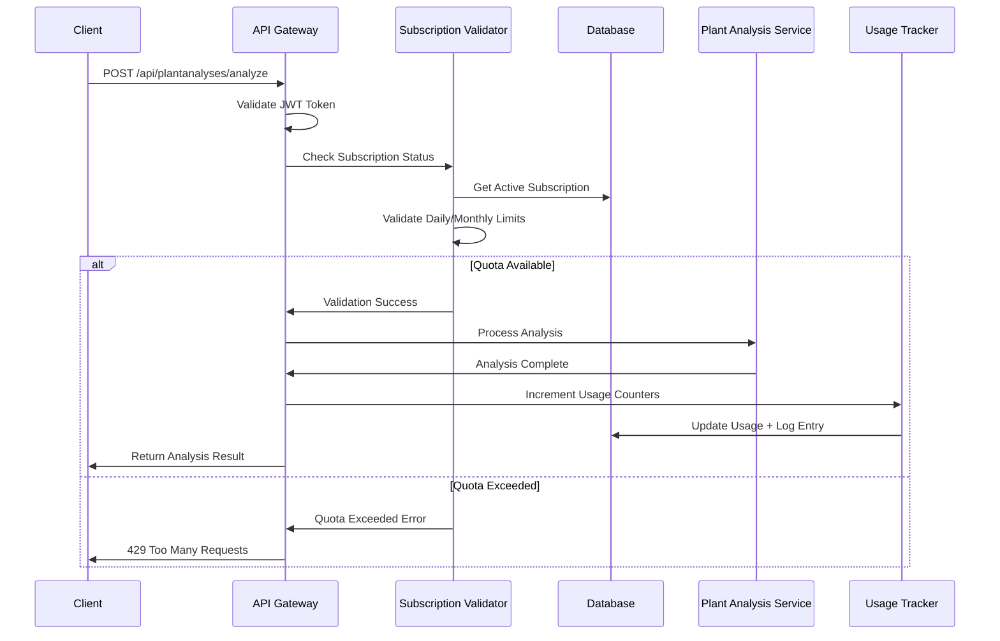

# ZiraAI - Subscription Sistemi Kapsamlı Rehberi

## 📋 İçindekiler
1. [Sistem Mimarisi](#sistem-mimarisi)
2. [Subscription Tiers](#subscription-tiers)
3. [API Endpoints](#api-endpoints)
4. [Usage Tracking](#usage-tracking)
5. [Business Logic](#business-logic)
6. [Implementation Details](#implementation-details)
7. [Testing Scenarios](#testing-scenarios)
8. [Monitoring & Analytics](#monitoring--analytics)

---

## 🏗️ Sistem Mimarisi

### High-Level Architecture

```
┌─────────────────────────────────────────────────────────┐
│                  Client Applications                    │
│            (Web, Mobile, API Consumers)                 │
├─────────────────────────────────────────────────────────┤
│                    API Gateway                          │
│        Authentication + Subscription Validation        │
├─────────────────────────────────────────────────────────┤
│                  Business Layer                         │
│   SubscriptionService | UsageTracker | TierManager     │
├─────────────────────────────────────────────────────────┤
│                   Data Layer                            │
│ SubscriptionTier | UserSubscription | UsageLog         │
├─────────────────────────────────────────────────────────┤
│                Background Services                      │
│   Usage Reset | Expiry Check | Auto-Renewal           │
└─────────────────────────────────────────────────────────┘
```

### Core Components

#### 1. **Entity Model**
```csharp
// Primary entities
SubscriptionTier.cs     // Tier definitions (S, M, L, XL)
UserSubscription.cs     // User subscription records
SubscriptionUsageLog.cs // Audit trail for billing

// Related entities  
User.cs                 // User base information
PlantAnalysis.cs        // Connected to usage tracking
```

#### 2. **Service Layer**
```csharp
ISubscriptionService           // Main subscription business logic
ISubscriptionValidationService // Request validation 
IUsageTrackingService         // Usage counting & logging
ISubscriptionTierService      // Tier management
IPaymentProcessingService     // Payment integration
```

#### 3. **Background Jobs**
```csharp
DailyUsageResetJob       // Reset daily counters at midnight
MonthlyUsageResetJob     // Reset monthly counters on 1st
SubscriptionExpiryJob    // Handle expired subscriptions
AutoRenewalJob          // Process auto-renewals
UsageAnalyticsJob       // Generate usage reports
```

---

## 💳 Subscription Tiers

### Tier Definitions

| Tier | Name | Daily Limit | Monthly Limit | Price (TL/month) | Target User |
|------|------|-------------|---------------|------------------|-------------|
| **S** | Small | 5 | 50 | ₺99.99 | Hobby farmers, small gardens |
| **M** | Medium | 20 | 200 | ₺299.99 | Professional farmers, medium operations |
| **L** | Large | 50 | 500 | ₺599.99 | Large farms, agricultural companies |
| **XL** | Extra Large | 200 | 2000 | ₺1,499.99 | Enterprise, research institutions |

### Tier Features Matrix

```json
{
  "S": {
    "prioritySupport": false,
    "advancedAnalytics": false,
    "apiAccess": true,
    "responseTimeHours": 48,
    "additionalFeatures": ["basic_support", "email_notifications"]
  },
  "M": {
    "prioritySupport": true,
    "advancedAnalytics": false,
    "apiAccess": true,
    "responseTimeHours": 24,
    "additionalFeatures": ["priority_support", "phone_support", "weekly_reports"]
  },
  "L": {
    "prioritySupport": true,
    "advancedAnalytics": true,
    "apiAccess": true,
    "responseTimeHours": 12,
    "additionalFeatures": ["dedicated_support", "custom_reports", "api_webhooks"]
  },
  "XL": {
    "prioritySupport": true,
    "advancedAnalytics": true,
    "apiAccess": true,
    "responseTimeHours": 4,
    "additionalFeatures": ["dedicated_account_manager", "custom_integration", "sla_guarantee"]
  }
}
```

### Database Schema

#### **SubscriptionTier Entity**
```sql
CREATE TABLE SubscriptionTiers (
    Id INTEGER PRIMARY KEY,
    TierName VARCHAR(10) NOT NULL,           -- S, M, L, XL
    DisplayName VARCHAR(50) NOT NULL,        -- Small, Medium, Large, Extra Large
    Description TEXT,
    DailyRequestLimit INTEGER NOT NULL,
    MonthlyRequestLimit INTEGER NOT NULL,
    MonthlyPrice DECIMAL(10,2) NOT NULL,
    YearlyPrice DECIMAL(10,2),
    Currency VARCHAR(3) DEFAULT 'TRY',
    PrioritySupport BOOLEAN DEFAULT FALSE,
    AdvancedAnalytics BOOLEAN DEFAULT FALSE,
    ApiAccess BOOLEAN DEFAULT TRUE,
    ResponseTimeHours INTEGER DEFAULT 48,
    AdditionalFeatures TEXT,                 -- JSON string
    IsActive BOOLEAN DEFAULT TRUE,
    DisplayOrder INTEGER,
    CreatedDate TIMESTAMP DEFAULT CURRENT_TIMESTAMP,
    UpdatedDate TIMESTAMP,
    CreatedUserId INTEGER,
    UpdatedUserId INTEGER
);
```

#### **UserSubscription Entity**
```sql
CREATE TABLE UserSubscriptions (
    Id INTEGER PRIMARY KEY,
    UserId INTEGER NOT NULL,
    SubscriptionTierId INTEGER NOT NULL,
    StartDate TIMESTAMP NOT NULL,
    EndDate TIMESTAMP NOT NULL,
    IsActive BOOLEAN DEFAULT TRUE,
    AutoRenew BOOLEAN DEFAULT FALSE,
    
    -- Payment Information
    PaymentMethod VARCHAR(50),               -- CreditCard, BankTransfer, etc.
    PaymentReference VARCHAR(100),           -- Transaction ID
    PaidAmount DECIMAL(10,2),
    Currency VARCHAR(3) DEFAULT 'TRY',
    LastPaymentDate TIMESTAMP,
    NextPaymentDate TIMESTAMP,
    
    -- Usage Tracking
    CurrentDailyUsage INTEGER DEFAULT 0,
    CurrentMonthlyUsage INTEGER DEFAULT 0,
    LastUsageResetDate TIMESTAMP,
    MonthlyUsageResetDate TIMESTAMP,
    
    -- Status Management
    Status VARCHAR(20) DEFAULT 'Active',     -- Active, Expired, Cancelled, Suspended
    CancellationReason TEXT,
    CancellationDate TIMESTAMP,
    
    -- Trial Support
    IsTrialSubscription BOOLEAN DEFAULT FALSE,
    TrialEndDate TIMESTAMP,
    
    -- Audit
    CreatedDate TIMESTAMP DEFAULT CURRENT_TIMESTAMP,
    UpdatedDate TIMESTAMP,
    CreatedUserId INTEGER,
    UpdatedUserId INTEGER,
    
    FOREIGN KEY (UserId) REFERENCES Users(Id),
    FOREIGN KEY (SubscriptionTierId) REFERENCES SubscriptionTiers(Id)
);
```

---

## 🔌 API Endpoints

### 1. **Public Endpoints**

#### **GET `/api/subscriptions/tiers`**
Get all available subscription tiers
```http
GET /api/subscriptions/tiers
```

**Response (200 OK):**
```json
{
  "success": true,
  "data": [
    {
      "id": 1,
      "tierName": "S",
      "displayName": "Small",
      "description": "Perfect for small farms and hobby gardeners",
      "dailyRequestLimit": 5,
      "monthlyRequestLimit": 50,
      "monthlyPrice": 99.99,
      "yearlyPrice": 1079.99,
      "currency": "TRY",
      "prioritySupport": false,
      "advancedAnalytics": false,
      "apiAccess": true,
      "responseTimeHours": 48,
      "additionalFeatures": [
        "Basic email support",
        "Standard analysis reports",
        "Mobile app access"
      ],
      "isActive": true,
      "displayOrder": 1
    }
  ]
}
```

### 2. **Farmer Endpoints**

#### **GET `/api/subscriptions/my-subscription`**
Get current user's active subscription
```http
GET /api/subscriptions/my-subscription
Authorization: Bearer {farmer_token}
```

**Response (200 OK):**
```json
{
  "success": true,
  "data": {
    "id": 456,
    "subscriptionTier": {
      "id": 2,
      "tierName": "M",
      "displayName": "Medium",
      "dailyRequestLimit": 20,
      "monthlyRequestLimit": 200,
      "monthlyPrice": 299.99
    },
    "startDate": "2025-08-01T00:00:00Z",
    "endDate": "2025-09-01T00:00:00Z",
    "isActive": true,
    "autoRenew": true,
    "currentDailyUsage": 5,
    "currentMonthlyUsage": 45,
    "status": "Active",
    "paymentMethod": "CreditCard",
    "nextPaymentDate": "2025-09-01T00:00:00Z",
    "isTrialSubscription": false
  }
}
```

#### **GET `/api/subscriptions/usage-status`**
Get real-time usage status and quotas
```http
GET /api/subscriptions/usage-status
Authorization: Bearer {farmer_token}
```

**Response (200 OK):**
```json
{
  "success": true,
  "data": {
    "tierName": "M",
    "tierDisplayName": "Medium",
    "dailyUsed": 5,
    "dailyLimit": 20,
    "dailyRemaining": 15,
    "dailyUsagePercentage": 25.0,
    "monthlyUsed": 45,
    "monthlyLimit": 200,
    "monthlyRemaining": 155,
    "monthlyUsagePercentage": 22.5,
    "nextDailyReset": "2025-08-14T00:00:00Z",
    "nextMonthlyReset": "2025-09-01T00:00:00Z",
    "canMakeRequest": true,
    "subscriptionStatus": "Active",
    "subscriptionEndDate": "2025-09-01T00:00:00Z",
    "daysUntilExpiry": 18
  }
}
```

#### **POST `/api/subscriptions/subscribe`**
Subscribe to a new plan
```http
POST /api/subscriptions/subscribe
Authorization: Bearer {farmer_token}
Content-Type: application/json

{
  "subscriptionTierId": 2,
  "durationMonths": 1,
  "autoRenew": true,
  "paymentMethod": "CreditCard",
  "paymentReference": "txn_123456789",
  "isTrialSubscription": false
}
```

**Response (201 Created):**
```json
{
  "success": true,
  "data": {
    "subscriptionId": 789,
    "tierName": "M",
    "startDate": "2025-08-13T00:00:00Z",
    "endDate": "2025-09-13T00:00:00Z",
    "dailyLimit": 20,
    "monthlyLimit": 200,
    "totalAmount": 299.99,
    "currency": "TRY",
    "paymentReference": "txn_123456789"
  },
  "message": "Subscription activated successfully"
}
```

#### **POST `/api/subscriptions/cancel`**
Cancel existing subscription
```http
POST /api/subscriptions/cancel
Authorization: Bearer {farmer_token}
Content-Type: application/json

{
  "userSubscriptionId": 456,
  "cancellationReason": "Switching to a different plan",
  "immediateCancellation": false
}
```

**Response (200 OK):**
```json
{
  "success": true,
  "data": {
    "subscriptionId": 456,
    "cancellationDate": "2025-09-01T00:00:00Z",
    "immediatelyCancelled": false,
    "refundAmount": 0.00,
    "remainingDays": 18
  },
  "message": "Subscription will be cancelled at the end of current period"
}
```

#### **GET `/api/subscriptions/history`**
Get subscription history
```http
GET /api/subscriptions/history?page=1&size=10
Authorization: Bearer {farmer_token}
```

### 3. **Admin Endpoints**

#### **GET `/api/subscriptions/usage-logs`**
Get detailed usage logs for analytics
```http
GET /api/subscriptions/usage-logs?userId=123&startDate=2025-08-01&endDate=2025-08-31&page=1&size=100
Authorization: Bearer {admin_token}
```

**Response (200 OK):**
```json
{
  "success": true,
  "data": {
    "totalRecords": 150,
    "currentPage": 1,
    "totalPages": 2,
    "logs": [
      {
        "id": 1001,
        "userId": 123,
        "userEmail": "farmer@example.com",
        "subscriptionTier": "M",
        "usageDate": "2025-08-13T14:30:22Z",
        "requestEndpoint": "/api/plantanalyses/analyze",
        "requestMethod": "POST",
        "isSuccessful": true,
        "responseStatus": 200,
        "dailyQuotaUsed": 6,
        "dailyQuotaLimit": 20,
        "monthlyQuotaUsed": 46,
        "monthlyQuotaLimit": 200,
        "ipAddress": "192.168.1.100",
        "userAgent": "ZiraAI-Mobile/1.0",
        "responseTimeMs": 2450
      }
    ]
  }
}
```

#### **PUT `/api/subscriptions/tiers/{id}`**
Update subscription tier configuration (Admin only)
```http
PUT /api/subscriptions/tiers/2
Authorization: Bearer {admin_token}
Content-Type: application/json

{
  "displayName": "Medium Plus",
  "dailyRequestLimit": 25,
  "monthlyRequestLimit": 250,
  "monthlyPrice": 349.99,
  "prioritySupport": true,
  "responseTimeHours": 12,
  "additionalFeatures": [
    "Priority email support",
    "Weekly usage reports",
    "Advanced analytics dashboard"
  ]
}
```

---

## 📊 Usage Tracking

### Real-Time Usage Validation

#### **Pre-Request Validation Flow**


#### **Usage Validation Implementation**
```csharp
public class SubscriptionValidationService : ISubscriptionValidationService
{
    public async Task<ValidationResult> ValidateRequestAsync(int userId, string endpoint)
    {
        var subscription = await _subscriptionRepository.GetActiveByUserIdAsync(userId);
        
        if (subscription == null)
        {
            return ValidationResult.Failure("No active subscription found");
        }
        
        if (subscription.EndDate < DateTime.UtcNow)
        {
            return ValidationResult.Failure("Subscription expired");
        }
        
        var tier = subscription.SubscriptionTier;
        
        // Check daily limit
        if (subscription.CurrentDailyUsage >= tier.DailyRequestLimit)
        {
            return ValidationResult.Failure(
                $"Daily request limit reached ({tier.DailyRequestLimit} requests). Resets at midnight.",
                new QuotaStatus
                {
                    TierName = tier.TierName,
                    DailyUsed = subscription.CurrentDailyUsage,
                    DailyLimit = tier.DailyRequestLimit,
                    NextDailyReset = DateTime.Today.AddDays(1)
                });
        }
        
        // Check monthly limit
        if (subscription.CurrentMonthlyUsage >= tier.MonthlyRequestLimit)
        {
            return ValidationResult.Failure(
                $"Monthly request limit reached ({tier.MonthlyRequestLimit} requests). Resets on 1st of next month.",
                new QuotaStatus
                {
                    TierName = tier.TierName,
                    MonthlyUsed = subscription.CurrentMonthlyUsage,
                    MonthlyLimit = tier.MonthlyRequestLimit,
                    NextMonthlyReset = new DateTime(DateTime.Now.Year, DateTime.Now.Month, 1).AddMonths(1)
                });
        }
        
        return ValidationResult.Success();
    }
}
```

### Usage Incrementation

#### **Post-Request Usage Tracking**
```csharp
public class UsageTrackingService : IUsageTrackingService
{
    public async Task IncrementUsageAsync(int userId, string endpoint, bool isSuccessful, 
        int responseStatus, long responseTimeMs, string ipAddress, string userAgent)
    {
        var subscription = await _subscriptionRepository.GetActiveByUserIdAsync(userId);
        if (subscription == null) return;
        
        // Increment counters atomically
        await _subscriptionRepository.IncrementUsageAsync(subscription.Id);
        
        // Create detailed usage log for analytics
        var usageLog = new SubscriptionUsageLog
        {
            UserId = userId,
            UserSubscriptionId = subscription.Id,
            PlantAnalysisId = null, // Will be set if plant analysis
            UsageType = GetUsageType(endpoint),
            UsageDate = DateTime.UtcNow,
            RequestEndpoint = endpoint,
            RequestMethod = "POST",
            IsSuccessful = isSuccessful,
            ResponseStatus = responseStatus,
            ResponseTimeMs = responseTimeMs,
            
            // Snapshot current quotas for historical analysis
            DailyQuotaUsed = subscription.CurrentDailyUsage + 1,
            DailyQuotaLimit = subscription.SubscriptionTier.DailyRequestLimit,
            MonthlyQuotaUsed = subscription.CurrentMonthlyUsage + 1,
            MonthlyQuotaLimit = subscription.SubscriptionTier.MonthlyRequestLimit,
            
            IpAddress = ipAddress,
            UserAgent = userAgent
        };
        
        await _usageLogRepository.AddAsync(usageLog);
        
        // Send usage alert if nearing limits
        await CheckUsageAlertsAsync(subscription);
    }
    
    private async Task CheckUsageAlertsAsync(UserSubscription subscription)
    {
        var dailyUsagePercent = (double)subscription.CurrentDailyUsage / subscription.SubscriptionTier.DailyRequestLimit;
        var monthlyUsagePercent = (double)subscription.CurrentMonthlyUsage / subscription.SubscriptionTier.MonthlyRequestLimit;
        
        // Send alert at 80% and 95% usage
        if (dailyUsagePercent >= 0.95)
        {
            await _notificationService.SendUsageAlertAsync(subscription.UserId, 
                "Daily limit almost reached", "daily", 95);
        }
        else if (dailyUsagePercent >= 0.80)
        {
            await _notificationService.SendUsageAlertAsync(subscription.UserId, 
                "Daily limit 80% reached", "daily", 80);
        }
        
        if (monthlyUsagePercent >= 0.95)
        {
            await _notificationService.SendUsageAlertAsync(subscription.UserId, 
                "Monthly limit almost reached", "monthly", 95);
        }
    }
}
```

---

## 💼 Business Logic

### Subscription Lifecycle Management

#### **1. Subscription Creation**
```csharp
public async Task<IResult> CreateSubscriptionAsync(CreateSubscriptionCommand command)
{
    // Validate user doesn't have conflicting active subscription
    var existingActive = await _subscriptionRepository.GetActiveByUserIdAsync(command.UserId);
    if (existingActive != null)
    {
        return new ErrorResult("User already has an active subscription. Cancel existing subscription first.");
    }
    
    // Validate tier exists and is active
    var tier = await _tierRepository.GetByIdAsync(command.SubscriptionTierId);
    if (tier == null || !tier.IsActive)
    {
        return new ErrorResult("Invalid subscription tier");
    }
    
    // Calculate subscription period
    var startDate = DateTime.UtcNow;
    var endDate = startDate.AddMonths(command.DurationMonths);
    
    // Create subscription
    var subscription = new UserSubscription
    {
        UserId = command.UserId,
        SubscriptionTierId = command.SubscriptionTierId,
        StartDate = startDate,
        EndDate = endDate,
        IsActive = true,
        AutoRenew = command.AutoRenew,
        PaymentMethod = command.PaymentMethod,
        PaymentReference = command.PaymentReference,
        PaidAmount = tier.MonthlyPrice * command.DurationMonths,
        Currency = tier.Currency,
        LastPaymentDate = DateTime.UtcNow,
        NextPaymentDate = command.AutoRenew ? endDate : null,
        Status = "Active",
        IsTrialSubscription = command.IsTrialSubscription,
        CreatedDate = DateTime.UtcNow,
        CreatedUserId = command.UserId
    };
    
    await _subscriptionRepository.AddAsync(subscription);
    
    // Process payment (if not trial)
    if (!command.IsTrialSubscription)
    {
        var paymentResult = await _paymentService.ProcessPaymentAsync(new PaymentRequest
        {
            Amount = subscription.PaidAmount,
            Currency = subscription.Currency,
            PaymentMethod = command.PaymentMethod,
            Reference = command.PaymentReference,
            UserId = command.UserId,
            Description = $"ZiraAI {tier.DisplayName} Subscription - {command.DurationMonths} months"
        });
        
        if (!paymentResult.Success)
        {
            // Rollback subscription
            await _subscriptionRepository.DeleteAsync(subscription);
            return new ErrorResult($"Payment failed: {paymentResult.Message}");
        }
    }
    
    return new SuccessDataResult<UserSubscription>(subscription, "Subscription created successfully");
}
```

#### **2. Auto-Renewal Process**
```csharp
public class AutoRenewalJob : IRecurringJob
{
    public async Task ExecuteAsync()
    {
        var expiringSoon = await _subscriptionRepository.GetExpiringInDaysAsync(7); // 7 days before expiry
        
        foreach (var subscription in expiringSoon.Where(s => s.AutoRenew && s.Status == "Active"))
        {
            try
            {
                var renewalResult = await ProcessAutoRenewalAsync(subscription);
                if (renewalResult.Success)
                {
                    _logger.LogInformation($"Auto-renewal successful for subscription {subscription.Id}");
                }
                else
                {
                    _logger.LogWarning($"Auto-renewal failed for subscription {subscription.Id}: {renewalResult.Message}");
                    await SendRenewalFailureNotificationAsync(subscription);
                }
            }
            catch (Exception ex)
            {
                _logger.LogError(ex, $"Error processing auto-renewal for subscription {subscription.Id}");
            }
        }
    }
    
    private async Task<IResult> ProcessAutoRenewalAsync(UserSubscription subscription)
    {
        // Process payment for next period
        var paymentResult = await _paymentService.ProcessRecurringPaymentAsync(new RecurringPaymentRequest
        {
            SubscriptionId = subscription.Id,
            Amount = subscription.SubscriptionTier.MonthlyPrice,
            Currency = subscription.Currency,
            PaymentMethod = subscription.PaymentMethod,
            UserId = subscription.UserId
        });
        
        if (!paymentResult.Success)
        {
            // Disable auto-renewal and notify user
            subscription.AutoRenew = false;
            subscription.Status = "PaymentFailed";
            await _subscriptionRepository.UpdateAsync(subscription);
            
            return new ErrorResult($"Payment failed: {paymentResult.Message}");
        }
        
        // Extend subscription period
        subscription.EndDate = subscription.EndDate.AddMonths(1);
        subscription.LastPaymentDate = DateTime.UtcNow;
        subscription.NextPaymentDate = subscription.EndDate;
        subscription.PaidAmount += subscription.SubscriptionTier.MonthlyPrice;
        subscription.UpdatedDate = DateTime.UtcNow;
        
        await _subscriptionRepository.UpdateAsync(subscription);
        
        return new SuccessResult("Auto-renewal successful");
    }
}
```

#### **3. Usage Reset Jobs**
```csharp
public class DailyUsageResetJob : IScheduledJob
{
    // Runs every day at midnight
    [Cron("0 0 * * *")]
    public async Task ExecuteAsync()
    {
        var affectedRows = await _subscriptionRepository.ResetDailyUsageAsync();
        _logger.LogInformation($"Daily usage reset completed. {affectedRows} subscriptions updated.");
        
        // Update reset date tracking
        await _subscriptionRepository.UpdateLastUsageResetDateAsync();
    }
}

public class MonthlyUsageResetJob : IScheduledJob
{
    // Runs on the 1st of each month at midnight
    [Cron("0 0 1 * *")]
    public async Task ExecuteAsync()
    {
        var affectedRows = await _subscriptionRepository.ResetMonthlyUsageAsync();
        _logger.LogInformation($"Monthly usage reset completed. {affectedRows} subscriptions updated.");
        
        // Update reset date tracking
        await _subscriptionRepository.UpdateMonthlyUsageResetDateAsync();
    }
}
```

---

## 🧪 Testing Scenarios

### Manual Testing Checklist

#### **1. Subscription Creation Tests**
```http
# Test Case 1: Valid subscription creation
POST /api/subscriptions/subscribe
{
  "subscriptionTierId": 2,
  "durationMonths": 1,
  "autoRenew": true,
  "paymentMethod": "CreditCard",
  "paymentReference": "test_txn_001"
}
Expected: 201 Created, subscription active

# Test Case 2: Duplicate subscription attempt
POST /api/subscriptions/subscribe (while having active subscription)
Expected: 400 Bad Request, error message about existing subscription

# Test Case 3: Invalid tier ID
POST /api/subscriptions/subscribe
{
  "subscriptionTierId": 999,
  "durationMonths": 1
}
Expected: 400 Bad Request, invalid tier error
```

#### **2. Usage Limit Tests**
```http
# Test Case 1: Normal usage within limits
POST /api/plantanalyses/analyze (5 times for S tier user)
Expected: All succeed with 200 OK

# Test Case 2: Daily limit exceeded
POST /api/plantanalyses/analyze (6th time for S tier user)
Expected: 429 Too Many Requests, quota exceeded message

# Test Case 3: Monthly limit exceeded
POST /api/plantanalyses/analyze (51st time in month for S tier user)
Expected: 429 Too Many Requests, monthly quota exceeded
```

#### **3. Auto-Renewal Tests**
```csharp
// Test Case 1: Successful auto-renewal
[Test]
public async Task AutoRenewal_ValidPayment_ShouldExtendSubscription()
{
    // Arrange
    var subscription = CreateTestSubscription(endDate: DateTime.UtcNow.AddDays(6));
    subscription.AutoRenew = true;
    
    // Act
    await _autoRenewalJob.ExecuteAsync();
    
    // Assert
    var renewed = await _subscriptionRepository.GetByIdAsync(subscription.Id);
    Assert.That(renewed.EndDate, Is.GreaterThan(subscription.EndDate));
    Assert.That(renewed.Status, Is.EqualTo("Active"));
}

// Test Case 2: Failed payment auto-renewal
[Test]
public async Task AutoRenewal_FailedPayment_ShouldDisableAutoRenew()
{
    // Arrange
    var subscription = CreateTestSubscription(endDate: DateTime.UtcNow.AddDays(6));
    subscription.AutoRenew = true;
    _paymentService.Setup(p => p.ProcessRecurringPaymentAsync(It.IsAny<RecurringPaymentRequest>()))
               .ReturnsAsync(new PaymentResult { Success = false, Message = "Card expired" });
    
    // Act
    await _autoRenewalJob.ExecuteAsync();
    
    // Assert
    var updated = await _subscriptionRepository.GetByIdAsync(subscription.Id);
    Assert.That(updated.AutoRenew, Is.False);
    Assert.That(updated.Status, Is.EqualTo("PaymentFailed"));
}
```

### Load Testing Scenarios

#### **1. Concurrent Usage Validation**
```csharp
[Test]
public async Task ConcurrentUsageValidation_ShouldRespectLimits()
{
    // Arrange
    var userId = 123;
    var subscription = CreateTestSubscription(userId, dailyLimit: 10);
    
    // Act: Send 20 concurrent requests
    var tasks = Enumerable.Range(0, 20)
        .Select(i => ValidateAndIncrementUsageAsync(userId, "/api/plantanalyses/analyze"))
        .ToArray();
        
    var results = await Task.WhenAll(tasks);
    
    // Assert: Only 10 should succeed
    var successCount = results.Count(r => r.Success);
    var failureCount = results.Count(r => !r.Success);
    
    Assert.That(successCount, Is.EqualTo(10));
    Assert.That(failureCount, Is.EqualTo(10));
}
```

#### **2. High-Volume Usage Logging**
```csharp
[Test]
public async Task UsageLogging_HighVolume_ShouldPerformEfficiently()
{
    // Arrange
    const int requestCount = 1000;
    var userId = 123;
    
    // Act
    var stopwatch = Stopwatch.StartNew();
    var tasks = Enumerable.Range(0, requestCount)
        .Select(i => _usageTracker.IncrementUsageAsync(userId, "/api/test", true, 200, 100, "127.0.0.1", "Test"))
        .ToArray();
        
    await Task.WhenAll(tasks);
    stopwatch.Stop();
    
    // Assert: Should complete within reasonable time
    Assert.That(stopwatch.ElapsedMilliseconds, Is.LessThan(5000)); // 5 seconds
    
    var logCount = await _usageLogRepository.CountByUserIdAsync(userId);
    Assert.That(logCount, Is.EqualTo(requestCount));
}
```

---

## 📈 Monitoring & Analytics

### Key Metrics to Track

#### **1. Business Metrics**
```csharp
public class SubscriptionAnalyticsService
{
    public async Task<SubscriptionMetrics> GetMetricsAsync(DateTime from, DateTime to)
    {
        return new SubscriptionMetrics
        {
            // Revenue metrics
            TotalRevenue = await CalculateTotalRevenueAsync(from, to),
            RevenueByTier = await CalculateRevenueByTierAsync(from, to),
            AverageRevenuePerUser = await CalculateARPUAsync(from, to),
            
            // Subscription metrics
            ActiveSubscriptions = await CountActiveSubscriptionsAsync(),
            NewSubscriptions = await CountNewSubscriptionsAsync(from, to),
            ChurnedSubscriptions = await CountChurnedSubscriptionsAsync(from, to),
            ChurnRate = await CalculateChurnRateAsync(from, to),
            
            // Usage metrics
            TotalAPIRequests = await CountTotalRequestsAsync(from, to),
            RequestsByTier = await CountRequestsByTierAsync(from, to),
            AverageRequestsPerUser = await CalculateAverageRequestsPerUserAsync(from, to),
            
            // Performance metrics
            AverageResponseTime = await CalculateAverageResponseTimeAsync(from, to),
            SuccessRate = await CalculateSuccessRateAsync(from, to),
            
            // Customer success metrics
            UsageByTier = await CalculateUsageByTierAsync(from, to),
            UnderutilizedSubscriptions = await CountUnderutilizedSubscriptionsAsync(from, to),
            OverageUsers = await CountOverageUsersAsync(from, to)
        };
    }
}
```

#### **2. Real-Time Monitoring Dashboard**
```json
{
  "current_metrics": {
    "active_subscriptions": 1247,
    "requests_today": 18534,
    "requests_this_hour": 1205,
    "success_rate_24h": 99.7,
    "average_response_time": "1.2s",
    "tier_distribution": {
      "S": 45.2,
      "M": 35.8,
      "L": 15.3,
      "XL": 3.7
    }
  },
  "alerts": [
    {
      "type": "warning",
      "message": "High API load detected - response times increased",
      "severity": "medium",
      "timestamp": "2025-08-13T14:30:00Z"
    }
  ],
  "trending": {
    "new_subscriptions_7d": "+12%",
    "churn_rate_30d": "2.1%",
    "revenue_growth_monthly": "+18%"
  }
}
```

#### **3. Usage Analytics Queries**
```sql
-- Daily usage patterns by tier
SELECT 
    DATE(ul.UsageDate) as usage_date,
    st.TierName,
    COUNT(*) as request_count,
    COUNT(DISTINCT ul.UserId) as unique_users,
    AVG(ul.ResponseTimeMs) as avg_response_time
FROM SubscriptionUsageLogs ul
JOIN UserSubscriptions us ON ul.UserSubscriptionId = us.Id
JOIN SubscriptionTiers st ON us.SubscriptionTierId = st.Id
WHERE ul.UsageDate >= DATE_SUB(CURRENT_DATE, INTERVAL 30 DAY)
GROUP BY DATE(ul.UsageDate), st.TierName
ORDER BY usage_date DESC, st.TierName;

-- Users approaching limits
SELECT 
    u.Id as user_id,
    u.Email,
    st.TierName,
    us.CurrentDailyUsage,
    st.DailyRequestLimit,
    (us.CurrentDailyUsage / st.DailyRequestLimit * 100) as daily_usage_percent,
    us.CurrentMonthlyUsage,
    st.MonthlyRequestLimit,
    (us.CurrentMonthlyUsage / st.MonthlyRequestLimit * 100) as monthly_usage_percent
FROM UserSubscriptions us
JOIN Users u ON us.UserId = u.Id
JOIN SubscriptionTiers st ON us.SubscriptionTierId = st.Id
WHERE us.IsActive = 1 
  AND (
    (us.CurrentDailyUsage / st.DailyRequestLimit) >= 0.8 OR
    (us.CurrentMonthlyUsage / st.MonthlyRequestLimit) >= 0.8
  )
ORDER BY daily_usage_percent DESC;

-- Revenue analysis by tier
SELECT 
    st.TierName,
    st.DisplayName,
    COUNT(us.Id) as active_subscriptions,
    SUM(us.PaidAmount) as total_revenue,
    AVG(us.PaidAmount) as avg_subscription_value,
    MIN(us.StartDate) as first_subscription,
    MAX(us.StartDate) as latest_subscription
FROM UserSubscriptions us
JOIN SubscriptionTiers st ON us.SubscriptionTierId = st.Id
WHERE us.IsActive = 1
GROUP BY st.Id
ORDER BY total_revenue DESC;
```

Bu rehber ile ZiraAI subscription sistemini tam olarak anlayabilir, implement edebilir ve yönetebilirsiniz.