# ZiraAI User Journey - Sponsorship System

## Executive Summary

This document maps the complete user journey for the ZiraAI Sponsorship System from a user-centric perspective, focusing on emotional experiences, touchpoints, and opportunities for enhancement. The journey covers all personas involved in the sponsorship ecosystem.

**Document Version**: 1.0  
**Last Updated**: January 2025  
**Focus**: User Experience & Journey Optimization  
**Primary Personas**: Sponsors, Farmers, Support Team

---

## Table of Contents

1. [User Personas & Context](#user-personas--context)
2. [Sponsor Journey Map](#sponsor-journey-map)
3. [Farmer Journey Map](#farmer-journey-map)
4. [Support Team Journey](#support-team-journey)
5. [Cross-Journey Touchpoints](#cross-journey-touchpoints)
6. [Pain Points & Opportunities](#pain-points--opportunities)
7. [Success Metrics & KPIs](#success-metrics--kpis)
8. [Improvement Recommendations](#improvement-recommendations)

---

## User Personas & Context

### Primary Personas

#### 1. The Sponsor (Agricultural Company Representative)
**Name**: Mehmet Yılmaz  
**Age**: 42  
**Role**: Regional Marketing Manager  
**Tech Comfort**: Moderate  
**Goals**: 
- Build brand loyalty among farmers
- Demonstrate social responsibility
- Track ROI on sponsorship investments
- Streamline distribution process

**Pain Points**:
- Limited technical expertise
- Time constraints
- Budget accountability pressure
- Need for measurable results

**Quote**: "I want to help farmers while building our brand, but I need it to be simple and trackable."

#### 2. The Farmer (Sponsorship Recipient)
**Name**: Ayşe Kaya  
**Age**: 35  
**Role**: Small-scale tomato farmer  
**Tech Comfort**: Basic smartphone user  
**Goals**:
- Access professional plant analysis
- Improve crop yields
- Minimize costs
- Learn modern farming techniques

**Pain Points**:
- Limited mobile data
- Complex technology intimidating
- Language/literacy concerns
- Trust in digital services

**Quote**: "I need help with my crops, but technology sometimes feels overwhelming."

#### 3. The Support Agent
**Name**: Zeynep Demir  
**Age**: 28  
**Role**: Customer Success Specialist  
**Tech Comfort**: High  
**Goals**:
- Resolve issues quickly
- Educate users effectively
- Reduce repeat contacts
- Maintain satisfaction scores

**Pain Points**:
- Incomplete user information
- Language barriers
- Technical limitations
- High volume periods

**Quote**: "I want to help users succeed, but I need better tools and information."

---

## Sponsor Journey Map

### Journey Overview: Creating and Distributing Sponsorship Campaign

```mermaid
graph LR
    A[Awareness] --> B[Consideration]
    B --> C[Decision]
    C --> D[Onboarding]
    D --> E[Campaign Setup]
    E --> F[Distribution]
    F --> G[Monitoring]
    G --> H[Analysis]
    H --> I[Renewal]
    
    style A fill:#e3f2fd
    style B fill:#e1f5fe
    style C fill:#b3e5fc
    style D fill:#81d4fa
    style E fill:#4fc3f7
    style F fill:#29b6f6
    style G fill:#03a9f4
    style H fill:#039be5
    style I fill:#0288d1
```

### Phase 1: Awareness & Discovery

#### User State
- **Emotion**: Curious but skeptical 😐
- **Confidence**: Low
- **Motivation**: High

#### Touchpoints
1. **Marketing Website**
   - First impression of sponsorship program
   - Value proposition understanding
   - Case studies and testimonials

2. **Sales Presentation**
   - Personal demonstration
   - ROI calculations
   - Competitive advantages

#### User Actions
```
🤔 Thinks: "Could this really help our brand?"
👀 Does: Browses website, watches demo video
💭 Feels: Intrigued but needs more information
🎯 Needs: Clear ROI demonstration, peer validation
```

#### System Response
- Personalized landing page based on company size
- Automated ROI calculator tool
- Success story recommendations
- Free trial offer prominent

#### Opportunities
- **Quick Win**: Interactive ROI calculator on homepage
- **Enhancement**: Video testimonials from similar companies
- **Support**: Live chat with sales specialist

### Phase 2: Consideration & Evaluation

#### User State
- **Emotion**: Analytical and comparing options 🤓
- **Confidence**: Growing
- **Motivation**: High

#### Journey Moments
```yaml
Moment 1: Comparing Options
  User Action: Reviews competitor offerings
  System Response: Comparison chart highlighting advantages
  Emotion: Confidence building
  
Moment 2: Internal Pitch
  User Action: Presents to management
  System Response: Downloadable presentation deck
  Emotion: Empowered
  
Moment 3: Budget Approval
  User Action: Requests pricing details
  System Response: Transparent pricing calculator
  Emotion: Trust building
```

#### Critical Decision Factors
1. **Price vs. Value**: Clear cost-per-farmer breakdown
2. **Ease of Use**: Demonstration of simple interface
3. **Support Quality**: Availability of Turkish-language support
4. **Track Record**: Success metrics from other sponsors

### Phase 3: Onboarding Experience

#### User State
- **Emotion**: Excited but anxious 😊😰
- **Confidence**: Medium
- **Motivation**: Very high

#### Onboarding Flow
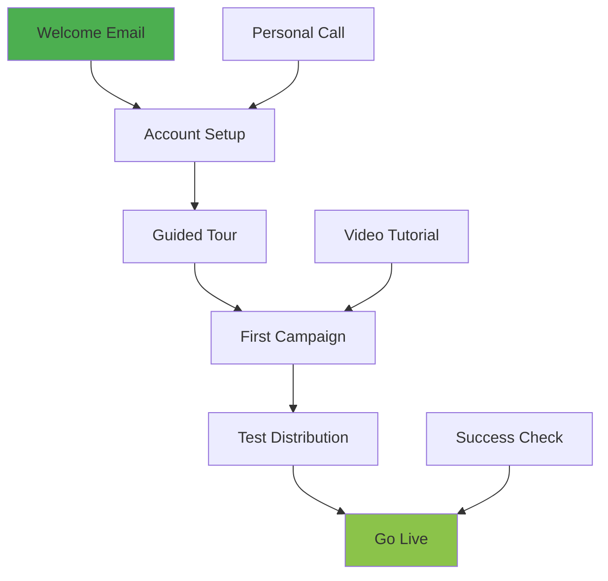

#### Step-by-Step Experience

**Step 1: Welcome & Account Setup (Day 1)**
```
📧 Receives: Personalized welcome email with clear next steps
🖥️ Sees: Simple account creation form (5 fields maximum)
✅ Completes: Basic company profile
😊 Feels: Welcomed and supported
⏱️ Time: 5 minutes
```

**Step 2: Guided Platform Tour (Day 1)**
```
🎥 Watches: 3-minute interactive tour
👆 Tries: Creating mock campaign
💡 Learns: Key features and shortcuts
😌 Feels: More confident
⏱️ Time: 15 minutes
```

**Step 3: First Campaign Creation (Day 2)**
```
📝 Creates: Real campaign with 10 test farmers
🎯 Selects: Target audience and message
🚀 Launches: Test distribution
😃 Feels: Accomplished
⏱️ Time: 20 minutes
```

#### Support Touchpoints
- Onboarding specialist assigned
- Daily check-in emails (first week)
- WhatsApp support group access
- Video library access

### Phase 4: Campaign Execution

#### User State
- **Emotion**: Focused and determined 💪
- **Confidence**: High
- **Motivation**: High

#### Campaign Creation Workflow

```yaml
Step 1: Campaign Planning
  Duration: 15 minutes
  Actions:
    - Name campaign
    - Set objectives
    - Define budget
  Interface:
    - Wizard-style form
    - Progress indicator
    - Auto-save feature
  User Feeling: Organized

Step 2: Audience Selection
  Duration: 10 minutes
  Actions:
    - Upload farmer list
    - Validate phone numbers
    - Set distribution schedule
  Interface:
    - Drag-drop upload
    - Real-time validation
    - Duplicate detection
  User Feeling: Confident

Step 3: Message Customization
  Duration: 5 minutes
  Actions:
    - Choose template
    - Personalize message
    - Preview on phone mockup
  Interface:
    - Template gallery
    - Live preview
    - Character counter
  User Feeling: Creative

Step 4: Launch & Monitor
  Duration: 2 minutes
  Actions:
    - Review summary
    - Confirm launch
    - Watch live progress
  Interface:
    - Checklist view
    - One-click launch
    - Real-time dashboard
  User Feeling: Excited
```

#### Real-Time Monitoring Experience

**Dashboard View**
```
📊 Sees: Live distribution progress bar
📈 Tracks: Success rate in real-time
🔔 Receives: Milestone notifications
📱 Accesses: Mobile app for on-the-go monitoring
💪 Feels: In control and informed
```

**Key Metrics Displayed**
- Messages sent/delivered/failed
- Real-time success percentage
- Geographic distribution map
- Cost tracking vs. budget
- Farmer engagement rate

### Phase 5: Results & Analysis

#### User State
- **Emotion**: Analytical and evaluative 📊
- **Confidence**: High
- **Motivation**: Variable (based on results)

#### Analytics Journey

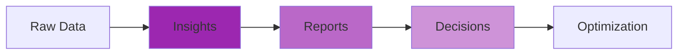

#### Reporting Experience
```yaml
Daily Summary Email:
  Timing: 9 AM each day
  Contents:
    - Yesterday's performance
    - Week-to-date progress
    - Success stories
    - Action items
  Format: Mobile-friendly HTML
  User Reaction: Informed and engaged

Weekly Deep Dive:
  Timing: Monday mornings
  Contents:
    - Detailed analytics
    - Farmer feedback
    - ROI calculations
    - Recommendations
  Format: Interactive dashboard
  User Reaction: Strategic thinking

Monthly Business Review:
  Timing: First Tuesday
  Contents:
    - Executive summary
    - Comparison to goals
    - Competitive benchmarking
    - Next month planning
  Format: Downloadable PDF + Live presentation
  User Reaction: Prepared for stakeholders
```

---

## Farmer Journey Map

### Journey Overview: Receiving and Redeeming Sponsorship

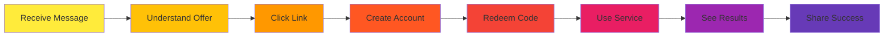

### Phase 1: Message Reception

#### User State
- **Emotion**: Surprised and curious 🤔
- **Confidence**: Low
- **Motivation**: Medium

#### The Moment of Contact

**SMS Arrival Experience**
```
📱 Notification: Message tone sounds
👀 Sees: "ZiraAI Sponsorship from [Company Name]"
🤔 Thinks: "Is this legitimate? What is this?"
📖 Reads: Full message with clear benefit
💭 Feels: Intrigued but cautious
```

**Message Content Psychology**
```yaml
Effective Elements:
  - Sponsor company name (builds trust)
  - "Free" clearly stated (removes cost concern)
  - Expiry date visible (creates urgency)
  - Simple action step (reduces friction)
  
Emotional Journey:
  1. Surprise → "Unexpected message"
  2. Suspicion → "Is this real?"
  3. Recognition → "Oh, it's from [Known Company]"
  4. Interest → "Free plant analysis could help"
  5. Decision → "Let me try this"
```

### Phase 2: Link Interaction

#### User State
- **Emotion**: Cautiously optimistic 🤞
- **Confidence**: Growing
- **Motivation**: High

#### Click-Through Experience

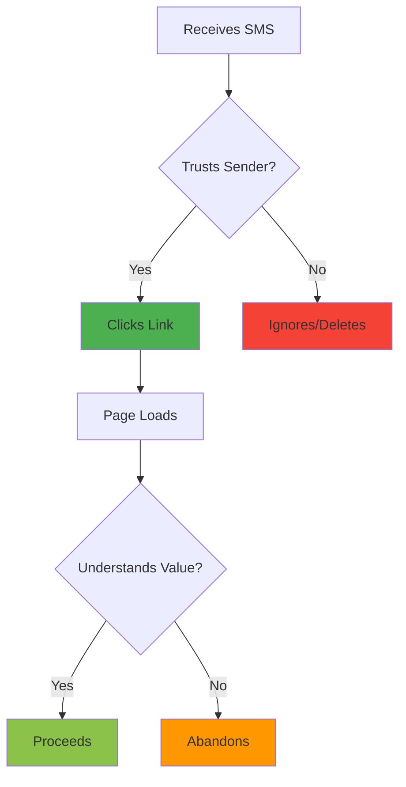

**Landing Page Experience**
```
👁️ First Impression: Clean, professional, mobile-optimized
🎨 Visual Elements: Sponsor logo, farming imagery, trust badges
📝 Content Hierarchy:
  1. "Your Sponsorship from [Company]"
  2. "Free Plant Analysis - No Payment Required"
  3. "3 Easy Steps to Get Started"
  4. Large "Activate Now" button
⏱️ Load Time: Under 2 seconds
📱 Mobile Optimization: Large buttons, readable text, no zoom needed
```

### Phase 3: Account Creation

#### User State
- **Emotion**: Committed but impatient ⏰
- **Confidence**: Medium
- **Motivation**: High

#### Registration Flow

**Simplified Onboarding**
```yaml
Step 1: Phone Verification
  User Sees: "Enter the phone number that received the message"
  User Does: Enters number (pre-filled from link)
  System Does: Sends OTP instantly
  Time: 30 seconds
  Emotion: "This is easy"

Step 2: OTP Confirmation  
  User Sees: "Enter 6-digit code sent to your phone"
  User Does: Enters code
  System Does: Auto-advances on correct entry
  Time: 20 seconds
  Emotion: "Almost there"

Step 3: Basic Information
  User Sees: "Just 3 more details"
  User Enters:
    - Name (required)
    - Farm location (optional)
    - Crop type (optional)
  System Does: Creates account instantly
  Time: 45 seconds
  Emotion: "That was quick!"
```

**Friction Reduction Tactics**
- Pre-filled phone number from SMS link
- No email required initially
- No password creation (OTP-based auth)
- Optional fields clearly marked
- Progress indicator showing "Almost done!"

### Phase 4: Service Utilization

#### User State
- **Emotion**: Excited and hopeful 🌱
- **Confidence**: Growing
- **Motivation**: Very high

#### First Analysis Experience

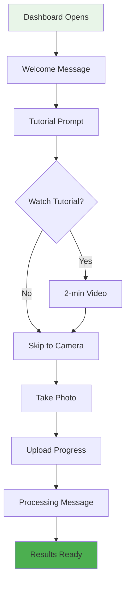

**Photo Capture Journey**
```
📸 Prompt: "Take a photo of your plant's leaves"
🎯 Guidance: Overlay showing ideal framing
💡 Tips: "Good lighting, close-up of problem area"
✅ Validation: "Great photo! Analyzing now..."
⏳ Wait: Progress animation with farming facts
🎉 Success: "Analysis complete! View results"
```

**Analysis Results Presentation**
```yaml
Results Structure:
  Visual Priority:
    1. Health Score (Big, colorful gauge)
    2. Main Issue (Clear heading)
    3. Recommended Action (Green action box)
    4. Detailed Findings (Expandable sections)
    
Language Approach:
    - Simple, non-technical terms
    - Local language (Turkish)
    - Visual icons for each finding
    - Color coding (red/yellow/green)
    
Emotional Design:
    - Positive framing ("Your plant is 70% healthy")
    - Actionable steps ("Water twice daily")
    - Encouraging tone ("You can fix this!")
    - Expert validation ("Analyzed by AI")
```

### Phase 5: Ongoing Engagement

#### User State
- **Emotion**: Grateful and empowered 💪
- **Confidence**: High
- **Motivation**: Sustained

#### Continued Usage Pattern

**Weekly Behavior**
```
Monday: Checks plant progress, takes new photo
Wednesday: Reviews recommendations, adjusts care
Friday: Shares results with neighboring farmers
Sunday: Plans next week's farming activities
```

**Success Moments**
```yaml
First Success:
  Trigger: Following recommendation improves plant
  User Reaction: "This actually works!"
  Action: Takes more photos, tells friends
  System Response: Congratulation message, encouragement

Sharing Moment:
  Trigger: Proud of improvement
  User Action: Shows results to other farmers
  System Support: Easy sharing button
  Result: Organic marketing, community building

Learning Moment:
  Trigger: Understanding a complex issue
  User Reaction: "Now I understand why this happens"
  System Support: Educational content, tips library
  Result: Increased expertise, confidence
```

---

## Support Team Journey

### Journey Overview: Helping Users Succeed

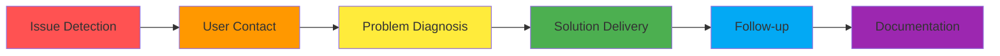

### Phase 1: Issue Identification

#### Support Agent State
- **Emotion**: Alert and prepared 🎯
- **Tools**: Monitoring dashboard, alert system
- **Goal**: Quick issue detection and prioritization

#### Issue Detection Methods

**Proactive Monitoring**
```yaml
System Alerts:
  - Failed distribution rate > 5%
  - User abandonment spike
  - Error rate increase
  - Negative feedback trend

Agent Dashboard:
  Priority Queue:
    - Critical: System failures
    - High: Sponsor issues
    - Medium: Individual farmer problems
    - Low: General inquiries
    
  Context Provided:
    - User history
    - Recent actions
    - Error details
    - Similar cases
```

### Phase 2: User Interaction

#### Communication Channels

**Multi-Channel Support Matrix**
```
Channel: WhatsApp
  Response Time: < 5 minutes
  Use Cases: Quick questions, photo sharing
  Agent Tools: Template responses, translation
  User Preference: High (familiar platform)

Channel: Phone
  Response Time: Immediate
  Use Cases: Complex issues, elderly users
  Agent Tools: Screen sharing, remote control
  User Preference: Medium (for urgent issues)

Channel: In-App Chat
  Response Time: < 2 minutes
  Use Cases: Technical issues, account problems
  Agent Tools: Cobrowsing, direct fixes
  User Preference: Low (less familiar)
```

#### Communication Flow

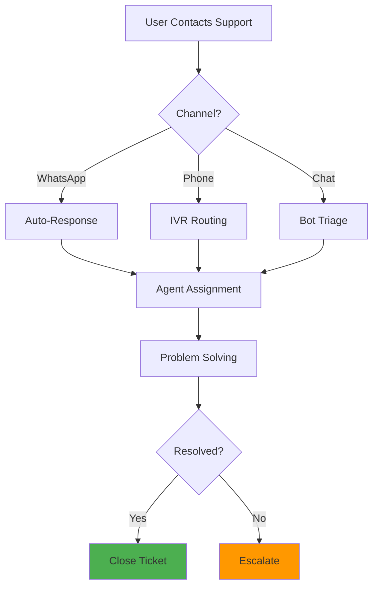

### Phase 3: Problem Resolution

#### Agent Workflow

**Diagnostic Process**
```yaml
Step 1: Understand Issue
  Time: 2 minutes
  Actions:
    - Read ticket history
    - Check user account
    - Review recent actions
  Tools:
    - Unified dashboard
    - User timeline view
    - Error log access

Step 2: Reproduce Problem
  Time: 3 minutes
  Actions:
    - Test in sandbox
    - Check similar cases
    - Verify fix approach
  Tools:
    - Test environment
    - Knowledge base
    - Team chat

Step 3: Implement Solution
  Time: 5 minutes
  Actions:
    - Apply fix
    - Test resolution
    - Document steps
  Tools:
    - Admin panel
    - Direct database access
    - Script library

Step 4: Verify with User
  Time: 3 minutes
  Actions:
    - Confirm resolution
    - Ensure satisfaction
    - Prevent recurrence
  Tools:
    - Screen sharing
    - Follow-up scheduler
    - Satisfaction survey
```

---

## Cross-Journey Touchpoints

### Critical Interaction Points

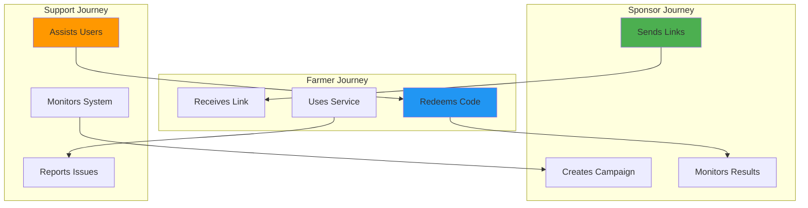

### Touchpoint Analysis

#### Touchpoint 1: Link Distribution
**Where Journeys Meet**: Sponsor sends → Farmer receives
**Critical Success Factors**:
- Message delivery rate
- Trust establishment
- Clear value communication
- Simple redemption path

**Optimization Opportunities**:
- A/B test message templates
- Optimize send timing
- Personalize sender identification
- Include sponsor logo in messages

#### Touchpoint 2: Redemption Process
**Where Journeys Meet**: Farmer redeems → Sponsor sees result
**Critical Success Factors**:
- Frictionless redemption
- Quick account creation
- Immediate value delivery
- Real-time tracking update

**Optimization Opportunities**:
- Reduce form fields
- Implement social login
- Add progress indicators
- Send instant confirmation

#### Touchpoint 3: Support Intervention
**Where Journeys Meet**: User struggles → Agent helps → Success achieved
**Critical Success Factors**:
- Quick problem identification
- Effective communication
- First-contact resolution
- Learning from issues

**Optimization Opportunities**:
- Predictive issue detection
- Proactive outreach
- Self-service resources
- Community support forums

---

## Pain Points & Opportunities

### Identified Pain Points

#### Sponsor Pain Points

```yaml
Pain Point 1: Complex Bulk Upload
  Severity: High
  Current Experience:
    - Excel format confusion
    - Validation errors unclear
    - No partial save option
  Impact:
    - 25% abandonment rate
    - Support tickets increase
    - Delayed campaigns
  
  Opportunity:
    Solution: Smart upload wizard
    Features:
      - Auto-format detection
      - Real-time validation
      - Save draft capability
    Expected Impact:
      - 50% reduction in errors
      - 80% faster uploads
      - Higher satisfaction

Pain Point 2: Limited Analytics Customization
  Severity: Medium
  Current Experience:
    - Fixed report formats
    - No custom date ranges
    - Can't export raw data
  Impact:
    - Manual report creation
    - Delayed insights
    - Stakeholder frustration
    
  Opportunity:
    Solution: Advanced analytics suite
    Features:
      - Custom dashboards
      - Flexible exports
      - API access
    Expected Impact:
      - 2x faster reporting
      - Better decision making
      - Increased retention
```

#### Farmer Pain Points

```yaml
Pain Point 1: Technology Intimidation
  Severity: High
  Current Experience:
    - Complex interface
    - Technical terminology
    - No offline mode
  Impact:
    - 40% don't complete registration
    - Low feature utilization
    - Require support help
    
  Opportunity:
    Solution: Simplified farmer mode
    Features:
      - Visual-first interface
      - Voice instructions
      - Offline capability
    Expected Impact:
      - 70% completion rate
      - 3x feature adoption
      - 50% less support needs

Pain Point 2: Limited Internet Connectivity
  Severity: High
  Current Experience:
    - Large image uploads fail
    - Timeout errors
    - Lost work
  Impact:
    - Failed analyses
    - User frustration
    - Service abandonment
    
  Opportunity:
    Solution: Progressive web app
    Features:
      - Automatic compression
      - Queue and retry
      - Offline mode
    Expected Impact:
      - 95% success rate
      - Better rural adoption
      - Increased usage
```

### Opportunity Matrix

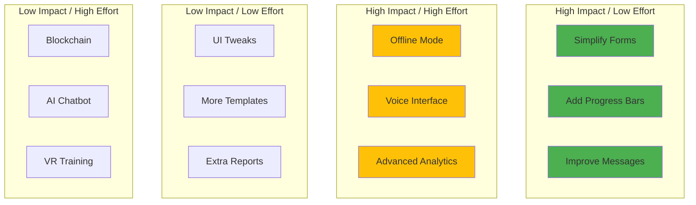

---

## Success Metrics & KPIs

### User Experience Metrics

#### Sponsor Success Metrics

```yaml
Activation Metrics:
  Time to First Campaign:
    Current: 3.5 days
    Target: 1 day
    Measurement: Account creation → First distribution
    
  Onboarding Completion:
    Current: 65%
    Target: 90%
    Measurement: Completed all tutorial steps
    
Engagement Metrics:
  Monthly Active Users:
    Current: 75%
    Target: 85%
    Measurement: Logged in + performed action
    
  Feature Adoption:
    Current: 4 of 10 features
    Target: 7 of 10 features
    Measurement: Features used in 30 days
    
Satisfaction Metrics:
  NPS Score:
    Current: 42
    Target: 60
    Measurement: Quarterly survey
    
  Support Tickets:
    Current: 0.8 per user/month
    Target: 0.3 per user/month
    Measurement: Ticket volume / active users
```

#### Farmer Success Metrics

```yaml
Activation Metrics:
  Redemption Rate:
    Current: 35%
    Target: 60%
    Measurement: Codes redeemed / codes sent
    
  Time to Redemption:
    Current: 48 hours
    Target: 6 hours
    Measurement: Message sent → Code redeemed
    
Usage Metrics:
  Analyses per User:
    Current: 2.3/month
    Target: 5/month
    Measurement: Total analyses / active users
    
  Feature Discovery:
    Current: 30%
    Target: 70%
    Measurement: Users trying 3+ features
    
Value Metrics:
  Improvement Rate:
    Current: Unknown
    Target: 70%
    Measurement: Self-reported crop improvement
    
  Referral Rate:
    Current: 15%
    Target: 40%
    Measurement: Users referring others
```

### Journey Health Indicators

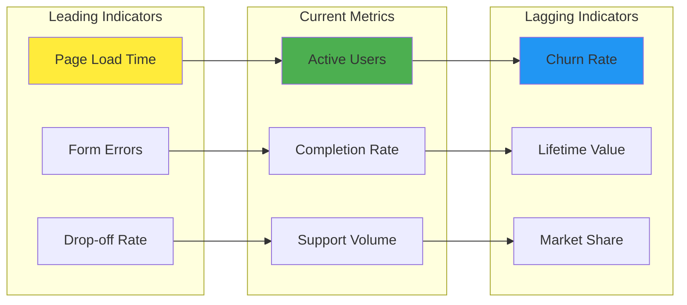

---

## Improvement Recommendations

### Immediate Quick Wins (Week 1-2)

#### 1. Message Optimization
**Change**: Personalize SMS with sponsor name prominently
**Implementation**: Update message templates
**Expected Impact**: +15% click-through rate
**Effort**: 2 hours
**Cost**: None

#### 2. Progress Indicators
**Change**: Add progress bars to all multi-step processes
**Implementation**: Frontend update
**Expected Impact**: +25% completion rate
**Effort**: 1 day
**Cost**: Minimal

#### 3. Support Access
**Change**: Add WhatsApp button on all error screens
**Implementation**: Add floating button component
**Expected Impact**: -30% unresolved issues
**Effort**: 4 hours
**Cost**: None

### Short-Term Improvements (Month 1-2)

#### 1. Simplified Farmer Interface
```yaml
Project: Farmer Mode
Timeline: 6 weeks
Team: 2 developers, 1 designer
Features:
  - Large touch targets
  - Icon-based navigation
  - Minimal text
  - Voice guidance option
Investment: $15,000
Expected ROI:
  - 40% increase in farmer adoption
  - 50% reduction in support calls
  - 25% increase in analyses performed
```

#### 2. Smart Upload System
```yaml
Project: Intelligent Bulk Upload
Timeline: 4 weeks
Team: 1 backend, 1 frontend developer
Features:
  - Auto-detect file format
  - Column mapping AI
  - Partial save capability
  - Error recovery
Investment: $10,000
Expected ROI:
  - 60% faster campaign creation
  - 70% fewer upload errors
  - 30% reduction in abandonment
```

### Long-Term Strategic Initiatives (Quarter 1-2)

#### 1. Progressive Web App
```yaml
Project: Offline-First Mobile Experience
Timeline: 3 months
Team: 3 developers, 1 QA
Features:
  - Works offline
  - Auto-sync when connected
  - Push notifications
  - App-like experience
Investment: $45,000
Expected ROI:
  - 2x rural farmer adoption
  - 90% task completion rate
  - 50% increase in daily active users
```

#### 2. AI-Powered Support
```yaml
Project: Intelligent Support System
Timeline: 4 months
Team: 2 ML engineers, 2 developers
Features:
  - Predictive issue detection
  - Auto-resolution for common issues
  - Smart routing to agents
  - Proactive user outreach
Investment: $60,000
Expected ROI:
  - 70% first-contact resolution
  - 40% reduction in support costs
  - 20-point NPS increase
```

### Implementation Roadmap

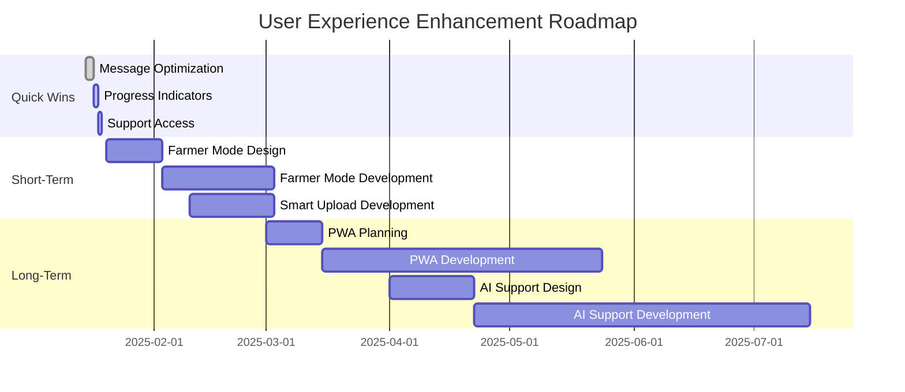

### Success Measurement Framework

#### Weekly Pulse Metrics
- New user activation rate
- Support ticket volume
- Feature usage statistics
- Error rates by journey phase

#### Monthly Health Check
- NPS and satisfaction scores
- Cohort retention analysis
- Journey completion rates
- ROI per sponsor

#### Quarterly Business Review
- Strategic KPI achievement
- Competitive positioning
- Market share growth
- User lifetime value

---

## Conclusion

The ZiraAI Sponsorship User Journey reveals a system with strong foundations but significant opportunities for user experience enhancement. By focusing on the human elements of the journey - emotions, motivations, and pain points - we can transform the platform from functional to delightful.

### Key Insights

1. **Sponsor Journey**: Needs simplification and better analytics
2. **Farmer Journey**: Requires technology simplification and offline capability
3. **Support Journey**: Benefits from proactive intervention and automation
4. **Cross-Journey**: Touchpoints need optimization for seamless handoffs

### Priority Actions

1. **Immediate**: Implement quick wins for instant impact
2. **Short-term**: Launch Farmer Mode and Smart Upload
3. **Long-term**: Build PWA and AI support capabilities

### Expected Outcomes

- **User Satisfaction**: NPS increase from 42 to 60+
- **Adoption**: Redemption rate increase from 35% to 60%
- **Efficiency**: Support tickets reduced by 50%
- **Business Impact**: 2x growth in active farmers

This user-centric approach ensures that technology serves people, not the other way around, creating a sponsorship ecosystem that benefits all stakeholders while building sustainable agricultural communities.