# ZiraAI User Journey - Subscription System

## Executive Summary

This document maps the complete user journey for the ZiraAI Subscription System from a user-centric perspective, focusing on the psychological and emotional aspects of subscription decisions, usage patterns, and renewal behaviors across all user segments and subscription tiers.

**Document Version**: 1.0  
**Last Updated**: January 2025  
**Focus**: Subscription User Experience & Psychology  
**Subscription Tiers**: Trial, Small (S), Medium (M), Large (L), Extra Large (XL)

---

## Table of Contents

1. [User Personas & Subscription Context](#user-personas--subscription-context)
2. [Discovery & Trial Journey](#discovery--trial-journey)
3. [Subscription Selection Journey](#subscription-selection-journey)
4. [Payment & Activation Journey](#payment--activation-journey)
5. [Usage & Quota Management Journey](#usage--quota-management-journey)
6. [Upgrade/Downgrade Journey](#upgradedowngrade-journey)
7. [Renewal & Retention Journey](#renewal--retention-journey)
8. [Support & Recovery Journey](#support--recovery-journey)
9. [Pain Points & Optimization Opportunities](#pain-points--optimization-opportunities)
10. [Success Metrics & Recommendations](#success-metrics--recommendations)

---

## User Personas & Subscription Context

### Subscription Tier Overview

```yaml
Trial Tier:
  Duration: 30 days
  Daily Limit: 1 analysis
  Monthly Limit: 30 analyses
  Price: Free
  Target User: New farmers testing service
  
Small (S) Tier:
  Daily Limit: 5 analyses
  Monthly Limit: 50 analyses
  Price: ₺99.99/month
  Target User: Small-scale farmers, hobbyists
  
Medium (M) Tier:
  Daily Limit: 20 analyses
  Monthly Limit: 200 analyses
  Price: ₺299.99/month
  Target User: Professional farmers, small cooperatives
  
Large (L) Tier:
  Daily Limit: 50 analyses
  Monthly Limit: 500 analyses
  Price: ₺599.99/month
  Target User: Large farms, agricultural consultants
  
Extra Large (XL) Tier:
  Daily Limit: 200 analyses
  Monthly Limit: 2000 analyses
  Price: ₺1499.99/month
  Target User: Agricultural enterprises, cooperatives
```

### Primary Personas

#### 1. The Explorer (Trial User)
**Name**: Fatma Özdemir  
**Age**: 38  
**Farm Size**: 5 hectares  
**Tech Comfort**: Basic  
**Financial Status**: Budget-conscious  
**Goals**: 
- Test service before commitment
- Understand value proposition
- Compare with alternatives
- Minimize financial risk

**Pain Points**:
- Fear of commitment
- Uncertainty about ROI
- Technology learning curve
- Limited trial period pressure

**Quote**: "I need to see if this really helps my tomatoes before I pay."

#### 2. The Optimizer (Small/Medium Subscriber)
**Name**: Ali Yılmaz  
**Age**: 45  
**Farm Size**: 15 hectares  
**Tech Comfort**: Moderate  
**Financial Status**: Stable but careful  
**Goals**:
- Maximize value from subscription
- Track usage efficiently
- Avoid overage charges
- Improve crop yields consistently

**Pain Points**:
- Quota anxiety
- Unclear usage patterns
- Upgrade decision paralysis
- Cost justification pressure

**Quote**: "I want enough analyses for my needs without paying for what I don't use."

#### 3. The Professional (Large/XL Subscriber)
**Name**: Mehmet Kara  
**Age**: 52  
**Farm Size**: 50+ hectares  
**Tech Comfort**: High (has tech-savvy staff)  
**Financial Status**: Business-oriented  
**Goals**:
- Scale operations efficiently
- Track ROI precisely
- Manage multiple users
- Integrate with business processes

**Pain Points**:
- Need for team management
- Reporting requirements
- Integration complexities
- Service reliability concerns

**Quote**: "This is a business investment - I need reliability and clear returns."

#### 4. The Sponsored Farmer
**Name**: Zehra Demir  
**Age**: 41  
**Farm Size**: 8 hectares  
**Tech Comfort**: Low  
**Financial Status**: Limited resources  
**Goals**:
- Use sponsored benefits fully
- Transition to paid if valuable
- Learn without financial risk
- Improve farming practices

**Pain Points**:
- Sponsorship expiration anxiety
- Transition to paid concerns
- Feature limitations
- Support availability

**Quote**: "The sponsorship helps, but what happens when it ends?"

---

## Discovery & Trial Journey

### Journey Overview: From Awareness to Trial Activation

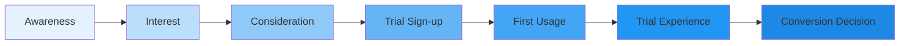

### Phase 1: Awareness & Interest

#### User State
- **Emotion**: Curious but skeptical 🤔
- **Confidence**: Low
- **Motivation**: Problem-driven (crop issues)
- **Financial Mindset**: Risk-averse

#### Discovery Touchpoints

```yaml
Organic Discovery:
  - Neighbor recommendation
  - Social media posts
  - Agricultural forums
  - WhatsApp groups
  User Reaction: "Others are using this?"
  Trust Level: High
  Action: Searches for more info

Sponsored Discovery:
  - SMS from sponsor
  - Company promotion
  - Field day demonstration
  User Reaction: "Free trial from trusted company"
  Trust Level: Very high
  Action: Clicks link immediately

Digital Discovery:
  - Google search
  - Facebook ads
  - YouTube videos
  User Reaction: "Is this legitimate?"
  Trust Level: Low
  Action: Researches reviews
```

#### First Impression Points
```
Landing Page Experience:
📱 Mobile View: Clean, fast-loading, local language
💚 Trust Signals: User count, success stories, certifications
🎯 Value Proposition: "Free 30-day trial - No credit card"
📊 Social Proof: "Used by 10,000+ Turkish farmers"
🔒 Security: SSL badge, privacy policy visible
```

### Phase 2: Trial Registration

#### User State
- **Emotion**: Hopeful but cautious 🤞
- **Confidence**: Growing
- **Motivation**: High (free trial)
- **Commitment Level**: Minimal

#### Registration Flow Psychology

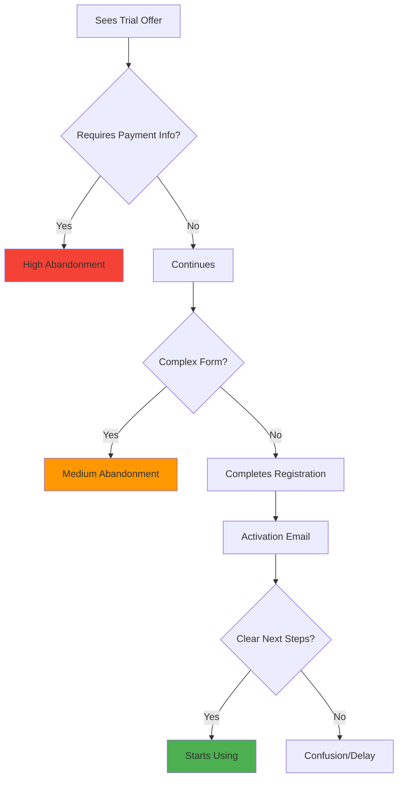

#### Optimal Registration Experience

```yaml
Step 1: Basic Information
  Fields: 
    - Phone number (for OTP)
    - Name
    - Farm location (optional)
  User Thinks: "This is simple"
  Time: 30 seconds
  Friction: Minimal

Step 2: Phone Verification
  Process: OTP sent immediately
  User Thinks: "They verify it's really me"
  Time: 20 seconds
  Friction: None (familiar process)

Step 3: Trial Activation
  Message: "Your 30-day trial is active!"
  Displays:
    - Trial end date prominently
    - Daily/monthly limits
    - Quick start guide
  User Thinks: "I understand what I'm getting"
  Emotion: Excited to try
```

### Phase 3: First Usage Experience

#### User State
- **Emotion**: Excited but nervous 😊😰
- **Confidence**: Low (new system)
- **Motivation**: Very high
- **Success Need**: Critical (first impression)

#### First Analysis Journey

```
🎯 Goal: Complete first plant analysis successfully
⏱️ Expected Time: 5 minutes
🎭 Emotional Arc: Nervous → Confused → Relieved → Impressed
```

**Moment-by-Moment Experience**
```yaml
Minute 1: Dashboard Landing
  Sees: Welcome message with name
  Thinks: "Where do I start?"
  System: Highlights "Analyze Plant" button
  Emotion: Oriented

Minute 2: Photo Capture
  Does: Takes plant photo
  Worries: "Is this good enough?"
  System: Shows quality indicator
  Emotion: Reassured

Minute 3: Upload & Processing
  Sees: Progress animation
  Thinks: "Hope this works"
  System: Shows estimated time
  Emotion: Anticipation

Minute 4: Results Arrival
  Sees: Comprehensive analysis
  Thinks: "Wow, this is detailed!"
  System: Highlights key findings
  Emotion: Impressed

Minute 5: Understanding Value
  Does: Reads recommendations
  Thinks: "I can actually use this"
  System: Offers to save results
  Emotion: Satisfied
```

### Phase 4: Trial Period Behavior

#### Usage Patterns

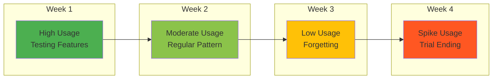

#### Behavioral Segments

```yaml
Power Users (20%):
  Behavior: Use daily limit consistently
  Mindset: "Maximum value extraction"
  Conversion Rate: 60%
  Support Needs: Advanced features
  
Regular Users (40%):
  Behavior: 2-3 analyses per week
  Mindset: "Testing for real needs"
  Conversion Rate: 35%
  Support Needs: Basic guidance
  
Sporadic Users (30%):
  Behavior: 1-2 total uses
  Mindset: "Not sure if needed"
  Conversion Rate: 10%
  Support Needs: Re-engagement
  
Non-Users (10%):
  Behavior: Registered but never used
  Mindset: "Forgot or intimidated"
  Conversion Rate: 2%
  Support Needs: Activation help
```

---

## Subscription Selection Journey

### Journey Overview: Choosing the Right Tier

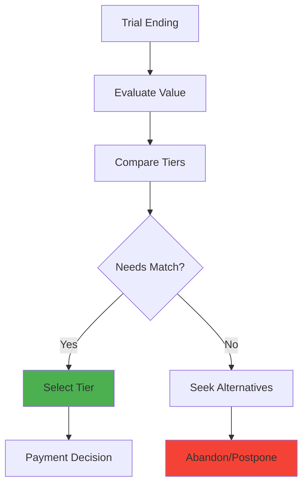

### Phase 1: Value Realization

#### User State
- **Emotion**: Analytical 🧐
- **Confidence**: Variable
- **Motivation**: ROI-focused
- **Pressure**: Trial expiration

#### Decision Triggers

```yaml
Positive Triggers:
  Solved Problem:
    Example: "Identified disease that saved crop"
    Impact: High conversion likelihood
    Action: Seeks appropriate tier
    
  Clear ROI:
    Example: "₺500 saved with fertilizer optimization"
    Impact: Price justification achieved
    Action: Compares tier value
    
  Habit Formation:
    Example: "Check plants every morning now"
    Impact: Dependency created
    Action: Ensures continuity

Negative Triggers:
  Unclear Value:
    Example: "Not sure if recommendations helped"
    Impact: Low conversion
    Action: Delays decision
    
  Technical Difficulties:
    Example: "Too complicated to use"
    Impact: Abandonment likely
    Action: Seeks simpler alternatives
    
  Price Sensitivity:
    Example: "₺99 seems expensive for 5 analyses"
    Impact: Downgrade or abandon
    Action: Waits for discounts
```

### Phase 2: Tier Comparison Psychology

#### User State
- **Emotion**: Overwhelmed by choices 😵
- **Confidence**: Uncertain
- **Motivation**: Value-seeking
- **Fear**: Overpaying or under-buying

#### Comparison Framework

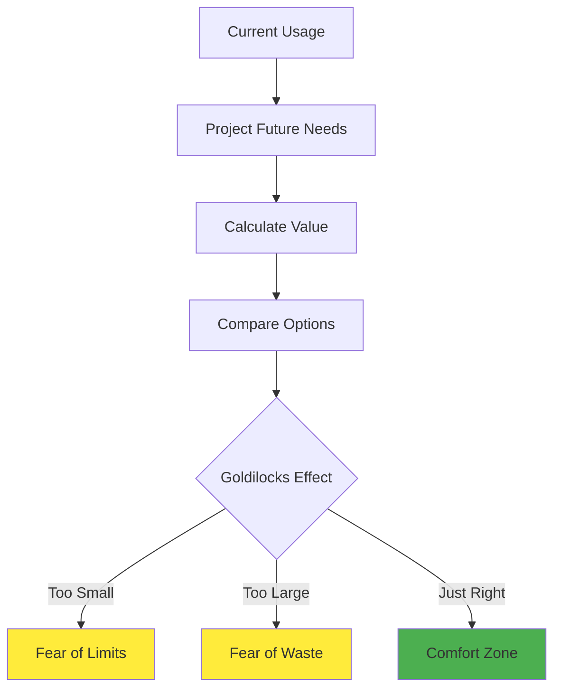

#### Tier Selection Mental Model

```yaml
Small Tier Mindset:
  Thinks: "I'll start small and upgrade if needed"
  Calculations:
    - 5 plants daily = enough for spot checks
    - ₺99 = 3kg tomato sales
    - Can upgrade anytime
  Fears:
    - Running out of quota
    - Missing critical analysis
  Comfort Factors:
    - Low commitment
    - Familiar price point
    - Easy to justify

Medium Tier Mindset:
  Thinks: "This covers my regular needs"
  Calculations:
    - 20 daily = full field monitoring
    - ₺299 = 10kg tomato sales
    - Good value per analysis
  Fears:
    - Overpaying if usage drops
    - Still might hit limits
  Comfort Factors:
    - Popular choice (social proof)
    - Balanced option
    - Room to grow

Large Tier Mindset:
  Thinks: "I need professional capacity"
  Calculations:
    - 50 daily = multiple fields
    - ₺599 = business expense
    - Enables scaling
  Fears:
    - Commitment size
    - Utilization pressure
  Comfort Factors:
    - Never worry about limits
    - Professional features
    - Priority support
```

### Phase 3: Decision Making Process

#### The Subscription Decision Tree

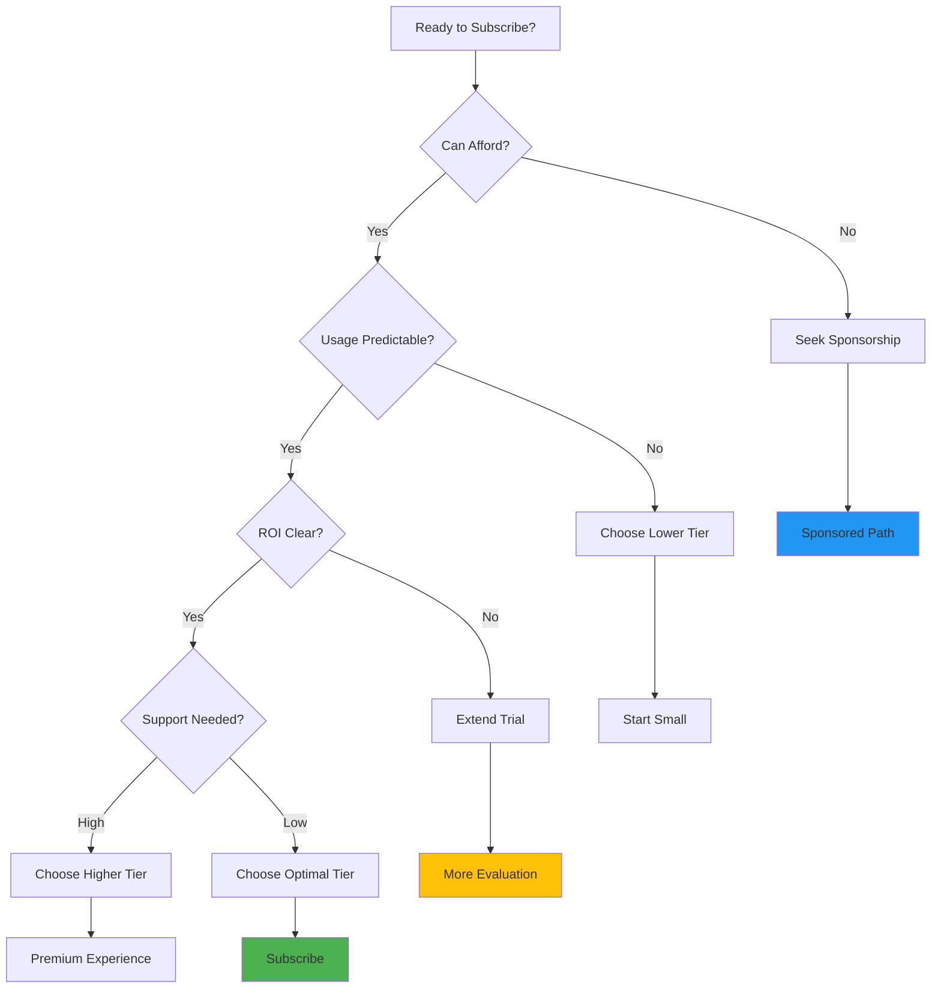

---

## Payment & Activation Journey

### Journey Overview: From Decision to Active Subscription

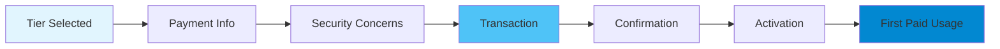

### Phase 1: Payment Process

#### User State
- **Emotion**: Anxious about security 😟
- **Confidence**: Varies with payment method
- **Motivation**: Committed but careful
- **Trust Need**: Maximum

#### Payment Method Psychology

```yaml
Credit Card:
  User Perception: Professional but risky
  Trust Factors:
    - SSL indicators
    - Known payment gateway
    - No card storage option
  Friction Points:
    - Card number entry
    - Security concerns
    - Family approval needed
  Success Rate: 65%

Bank Transfer:
  User Perception: Secure but slow
  Trust Factors:
    - Familiar process
    - Bank mediation
    - Paper trail
  Friction Points:
    - Manual process
    - Activation delay
    - Reference number confusion
  Success Rate: 45%

Mobile Payment:
  User Perception: Convenient and safe
  Trust Factors:
    - Phone-based authentication
    - Instant confirmation
    - Familiar interface
  Friction Points:
    - Service availability
    - Transaction limits
  Success Rate: 80%

Cash Payment Points:
  User Perception: Most trusted
  Trust Factors:
    - Physical interaction
    - Immediate receipt
    - No online risk
  Friction Points:
    - Travel required
    - Office hours only
  Success Rate: 90% (but low volume)
```

#### Payment Flow Optimization

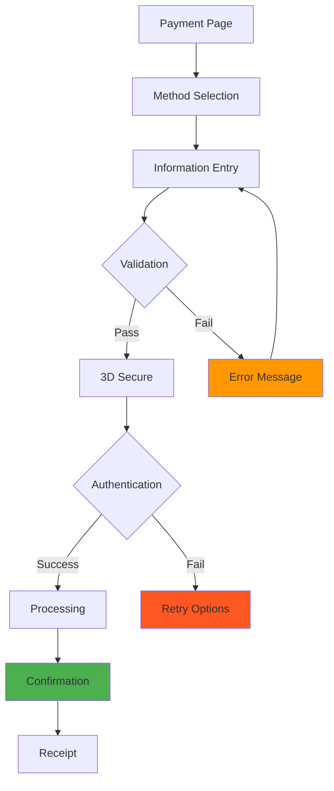

### Phase 2: Post-Payment Activation

#### User State
- **Emotion**: Relief and anticipation 😌
- **Confidence**: High
- **Motivation**: Ready to use
- **Expectation**: Immediate access

#### Activation Experience

```yaml
Instant Activation:
  Time: < 5 seconds
  User Sees:
    - "Payment Successful! ✓"
    - "Your subscription is now active"
    - New quota limits displayed
    - Quick tour of paid features
  User Feels: Accomplished, eager
  Next Action: Immediate analysis

Email Confirmation:
  Contents:
    - Payment receipt
    - Subscription details
    - Billing cycle information
    - Support contact
    - Cancel/modify instructions
  User Reaction: Saves for records
  Trust Impact: Increases confidence
```

---

## Usage & Quota Management Journey

### Journey Overview: Daily Subscription Usage

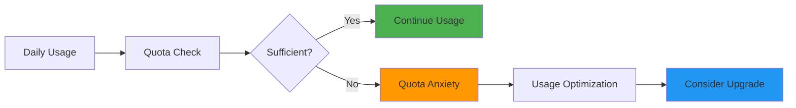

### Phase 1: Usage Patterns

#### User Behavior Segments

```yaml
Conservative Users (40%):
  Behavior: 
    - Check quota before each use
    - Save analyses for important plants
    - Anxiety about running out
  Daily Pattern:
    - Morning: Check remaining quota
    - Careful selection of plants
    - Evening: Review usage
  Emotional State: Anxious but controlled
  Upgrade Likelihood: Low (managing within limits)

Optimal Users (35%):
  Behavior:
    - Natural usage matches tier
    - Comfortable with limits
    - Regular patterns
  Daily Pattern:
    - Consistent daily usage
    - No quota checking
    - Monthly review only
  Emotional State: Satisfied
  Upgrade Likelihood: Low (perfect fit)

Power Users (20%):
  Behavior:
    - Frequently hit limits
    - Frustrated by restrictions
    - Seeking workarounds
  Daily Pattern:
    - Early limit reaching
    - Afternoon frustration
    - Planning next day's usage
  Emotional State: Frustrated
  Upgrade Likelihood: High

Under-utilizers (5%):
  Behavior:
    - Forget to use service
    - Waste quota allocation
    - Guilt about value
  Daily Pattern:
    - Sporadic usage
    - End-of-month rush
    - Regret unused quota
  Emotional State: Guilty
  Downgrade Likelihood: High
```

### Phase 2: Quota Psychology

#### The Quota Anxiety Curve

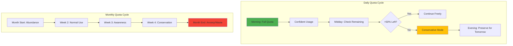

#### Quota Management Strategies

```yaml
User Strategies:
  Batching:
    - Save all plants for one session
    - Photograph multiple angles at once
    - Process similar plants together
    Impact: Efficiency but delays insights
    
  Prioritization:
    - High-value crops first
    - Problem plants priority
    - Skip healthy-looking plants
    Impact: Missed preventive opportunities
    
  Sharing:
    - Multiple farmers share account
    - Coordinate usage times
    - Split subscription costs
    Impact: Terms violation risk
    
  Alternative Seeking:
    - Free alternatives for simple cases
    - Expert opinion for complex issues
    - Reserve subscription for critical needs
    Impact: Reduced platform value perception
```

### Phase 3: Usage Optimization

#### Helping Users Maximize Value

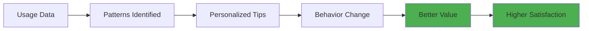

**Optimization Interventions**

```yaml
For Conservative Users:
  Message: "You have 3 unused analyses today - they don't carry over!"
  Timing: 6 PM daily
  Tip: "Try preventive scanning of healthy plants"
  Result: 15% increase in usage

For Power Users:
  Message: "You've used 80% of today's quota by noon"
  Timing: When threshold hit
  Tip: "Space out analyses for all-day coverage"
  Alternative: "Upgrade to M tier for 4x more analyses"
  Result: 25% upgrade rate

For Under-utilizers:
  Message: "You've used only 30% of your subscription this month"
  Timing: Week 3 of month
  Tip: "Set a daily reminder to check your plants"
  Option: "Downgrade to save money"
  Result: Better tier matching
```

---

## Upgrade/Downgrade Journey

### Journey Overview: Changing Subscription Tiers

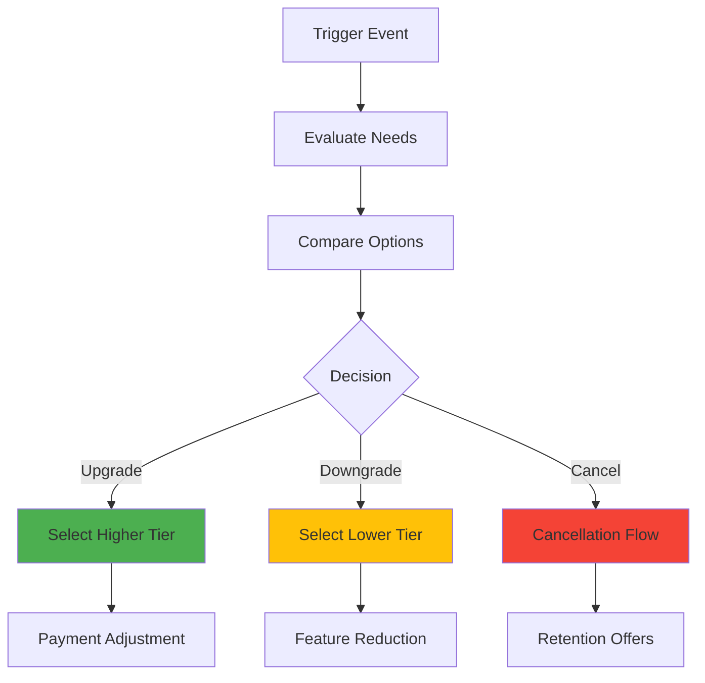

### Upgrade Journey

#### Upgrade Triggers

```yaml
Quota Exhaustion:
  Frequency: Hit daily limit 3+ times/week
  User Emotion: Frustrated
  Message: "Unlock 4x more analyses with Medium tier"
  Conversion Rate: 35%

Business Growth:
  Indicator: Farm expansion or new crops
  User Emotion: Optimistic
  Message: "Scale your success with more analyses"
  Conversion Rate: 45%

Feature Attraction:
  Trigger: Tried to access premium feature
  User Emotion: Interested
  Message: "This feature is available in Large tier"
  Conversion Rate: 25%

Social Influence:
  Source: Peer recommendation
  User Emotion: FOMO
  Message: "Join 500+ farmers on Medium tier"
  Conversion Rate: 30%
```

#### Upgrade Experience

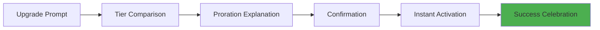

**Psychological Optimization**
```yaml
Reduce Friction:
  - One-click upgrade
  - No re-entering payment info
  - Instant quota increase
  - Prorated billing clearly shown

Add Incentives:
  - First month discount
  - Bonus analyses for upgrading
  - Exclusive features tour
  - Success guarantee

Celebrate Decision:
  - Congratulations message
  - Show new capabilities
  - Welcome to tier community
  - Share success metrics
```

### Downgrade Journey

#### Downgrade Triggers

```yaml
Underutilization:
  Indicator: <50% quota usage for 2 months
  User Emotion: Guilty/wasteful
  Message: "Optimize your subscription based on usage"
  Action Rate: 20% downgrade

Financial Pressure:
  Trigger: Payment failure or complaint
  User Emotion: Stressed
  Message: "Keep using ZiraAI with a smaller plan"
  Retention Rate: 60%

Seasonal Changes:
  Pattern: Reduced winter usage
  User Emotion: Practical
  Message: "Adjust for seasonal needs"
  Return Rate: 70% upgrade back

Dissatisfaction:
  Source: Support complaints
  User Emotion: Frustrated
  Message: "Would a different plan work better?"
  Save Rate: 40%
```

#### Downgrade Experience

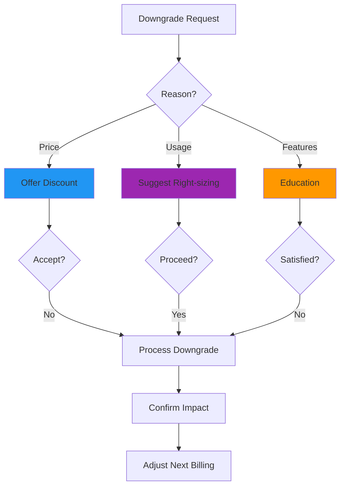

---

## Renewal & Retention Journey

### Journey Overview: Keeping Subscribers Active

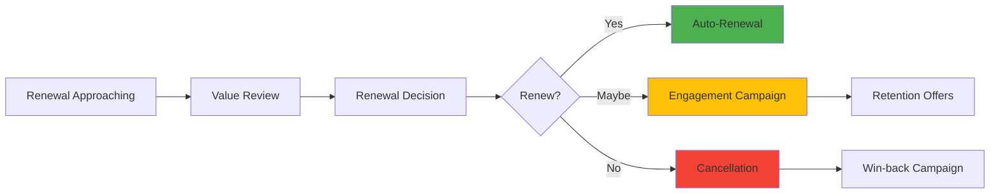

### Phase 1: Pre-Renewal Engagement

#### 30 Days Before Renewal

```yaml
Week 4 Before:
  Communication: Value summary email
  Content:
    - Analyses performed: 157
    - Problems detected: 12
    - Money saved: ~₺850
    - Success story highlight
  User Reaction: "I've used it more than I thought"
  Action: 65% no action (good sign)

Week 3 Before:
  Communication: Feature spotlight
  Content:
    - Unused features tour
    - Tips for more value
    - Community success stories
  User Reaction: "I should try these features"
  Action: 20% increase feature usage

Week 2 Before:
  Communication: Renewal reminder
  Content:
    - Renewal date
    - Current plan details
    - Easy modification options
  User Reaction: "I need to decide soon"
  Action: 30% review account

Week 1 Before:
  Communication: Personalized offer
  Content:
    - Usage-based recommendation
    - Loyalty discount if applicable
    - Upgrade incentives
  User Reaction: "They value my business"
  Action: 85% renewal decision made
```

### Phase 2: Renewal Decision Psychology

#### Decision Factors

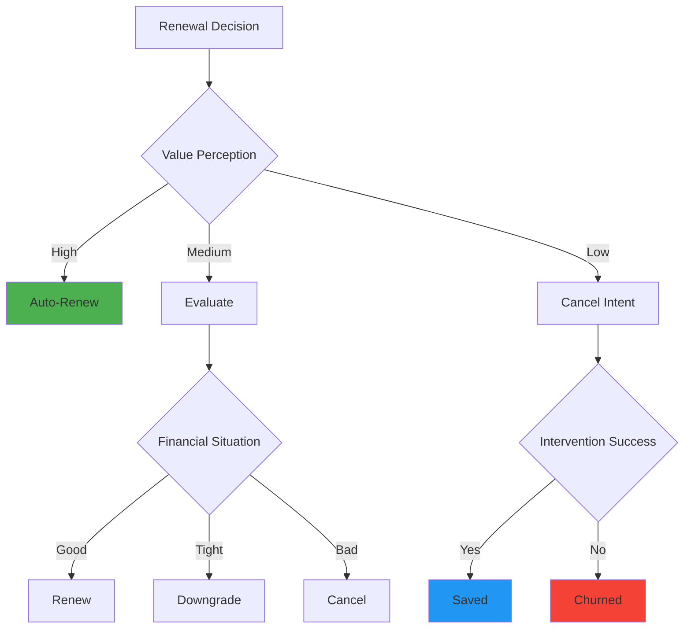

#### Retention Psychology

```yaml
High-Value Perception Users:
  Characteristics:
    - Regular usage (>60% of quota)
    - Positive ROI experience
    - Integrated into routine
  Renewal Rate: 85%
  Strategy: Maintain satisfaction
  
Medium-Value Perception Users:
  Characteristics:
    - Moderate usage (30-60% quota)
    - Some success stories
    - Occasional user
  Renewal Rate: 50%
  Strategy: Increase engagement
  
Low-Value Perception Users:
  Characteristics:
    - Low usage (<30% quota)
    - No clear wins
    - Forgot about service
  Renewal Rate: 15%
  Strategy: Re-activation campaign
```

### Phase 3: Cancellation & Win-back

#### Cancellation Journey

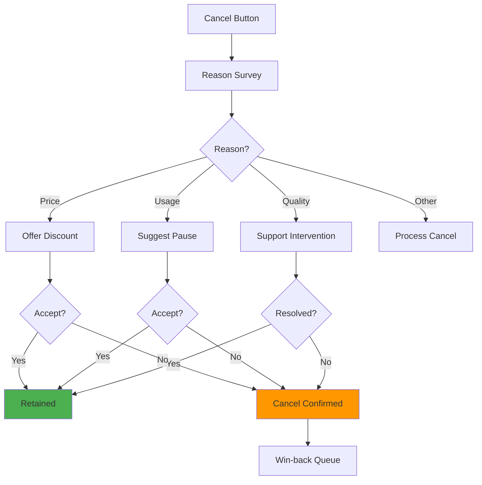

#### Win-back Campaigns

```yaml
Immediate (0-7 days):
  Message: "We miss you already"
  Offer: Come back discount (30% off)
  Channel: Email + SMS
  Success Rate: 15%

Month 1:
  Message: "See what you're missing"
  Content: New features, success stories
  Offer: Free week to try again
  Success Rate: 8%

Month 3:
  Message: "Special invitation back"
  Offer: Lower tier at discount
  Incentive: No commitment month
  Success Rate: 5%

Month 6:
  Message: "Exclusive comeback offer"
  Offer: 50% off for 3 months
  Feature: Priority support
  Success Rate: 3%
```

---

## Support & Recovery Journey

### Journey Overview: Subscription Support Interactions

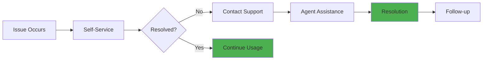

### Common Support Scenarios

#### Payment Issues

```yaml
Failed Payment:
  User Experience:
    - Service interruption
    - Panic about losing data
    - Frustration with system
  Support Response:
    - Immediate grace period
    - Multiple retry options
    - Alternative payment methods
  Resolution Time: 24 hours
  Retention Impact: Critical

Payment Dispute:
  User Experience:
    - Confusion about charges
    - Trust degradation
    - Anger if duplicate
  Support Response:
    - Detailed billing breakdown
    - Quick refund if error
    - Goodwill credit
  Resolution Time: 48 hours
  Trust Recovery: 2-3 months

Refund Request:
  User Experience:
    - Disappointment with service
    - Seeking validation
    - Financial concern
  Support Response:
    - Understand root cause
    - Offer alternatives first
    - Process if insisted
  Success Metric: 30% retention despite request
```

#### Usage Support

```yaml
Quota Confusion:
  Common Questions:
    - "Why did my quota reset?"
    - "Can I buy extra analyses?"
    - "Do unused quotas rollover?"
  User Emotion: Confused, potentially angry
  Support Approach:
    - Clear explanation with visuals
    - Show usage history
    - Recommend optimal tier
  Prevention: Better UI indicators

Feature Discovery:
  User State: Underutilizing subscription
  Support Role: Education and guidance
  Tactics:
    - Screen sharing session
    - Video tutorials
    - Practice scenarios
  Outcome: 40% increase in feature usage

Technical Problems:
  Issues: App crashes, slow loading, errors
  User Impact: Cannot use paid service
  Priority: Highest
  Response:
    - Immediate workaround
    - Account credit for downtime
    - Regular updates on fix
  Retention Risk: Very high if not resolved quickly
```

### Support Channel Optimization

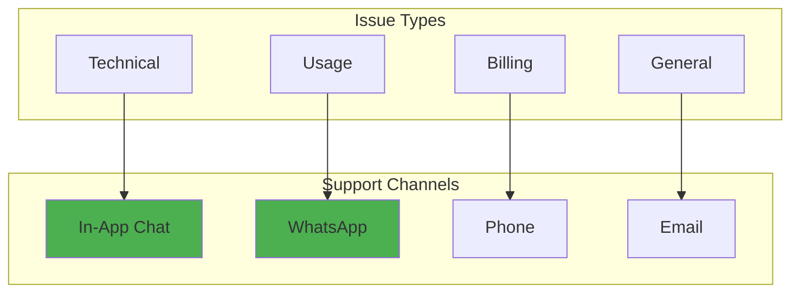

---

## Pain Points & Optimization Opportunities

### Critical Subscription Pain Points

#### 1. Trial-to-Paid Conversion Drop

```yaml
Pain Point:
  Current State: 35% conversion rate
  User Feedback:
    - "Not enough time to see value"
    - "Forgot trial was ending"
    - "Payment requirement surprised me"
  
  Impact:
    - High acquisition cost
    - Lost revenue potential
    - Poor user experience
  
Opportunity:
  Solutions:
    1. Extend trial for engaged users
    2. Progressive value unlock
    3. Soft paywall approach
    
  Implementation:
    - Day 20: Offer 10-day extension for active users
    - Day 25: Show value dashboard
    - Day 28: One-click conversion with discount
    
  Expected Impact:
    - 50% conversion rate
    - Better user satisfaction
    - Higher LTV
```

#### 2. Quota Anxiety

```yaml
Pain Point:
  Current State: 
    - 60% of users check quota daily
    - 40% restrict usage due to limits
    - 25% request quota rollover
    
  User Psychology:
    - Fear of running out
    - Guilt when unused
    - Frustration with rigid limits
    
Opportunity:
  Solutions:
    1. Flexible quota system
    2. Rollover allowance (limited)
    3. Burst capacity option
    
  Features:
    - 10% monthly rollover
    - "Boost days" with 2x quota
    - Share unused with community
    
  Expected Impact:
    - Reduced support tickets (30%)
    - Higher satisfaction scores
    - Increased usage rates
```

#### 3. Payment Friction

```yaml
Pain Point:
  Current State:
    - 25% payment failure rate
    - 40% abandon at payment page
    - Limited payment options
    
  Regional Issues:
    - Credit card penetration low
    - Bank transfer delays
    - Trust in online payments
    
Opportunity:
  Solutions:
    1. Mobile money integration
    2. Cash payment points
    3. Installment options
    
  Partnerships:
    - Local payment providers
    - Agricultural cooperatives
    - Mobile operators
    
  Expected Impact:
    - 60% reduction in payment failures
    - 80% completion rate
    - Broader market access
```

### Optimization Matrix

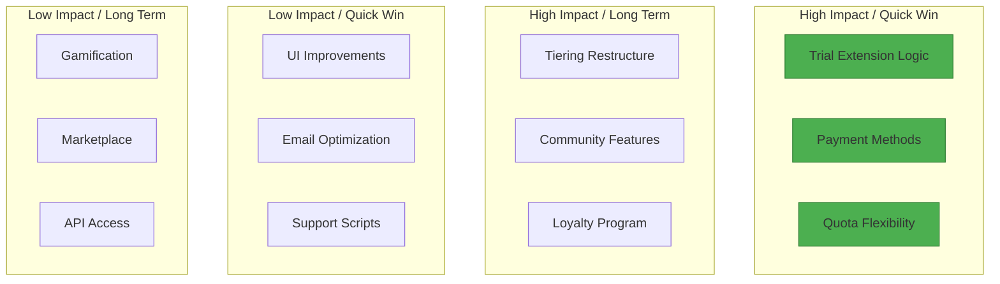

### User Experience Improvements

#### Immediate Improvements (Week 1-2)

```yaml
1. Quota Widget:
   Change: Persistent quota display
   Location: Top of dashboard
   Visual: Progress bar with colors
   Impact: Reduce anxiety, prevent surprises
   Effort: 4 hours development

2. Trial Countdown:
   Change: Daily reminder in app
   Format: "14 days left in trial"
   Action: One-tap conversion
   Impact: 10% conversion increase
   Effort: 2 hours

3. Payment Recovery:
   Change: Auto-retry failed payments
   Schedule: Day 1, 3, 5
   Notification: SMS before retry
   Impact: 15% recovery rate
   Effort: 1 day
```

#### Short-term Improvements (Month 1)

```yaml
1. Flexible Quotas:
   Feature: Daily unused → weekly pool
   Limit: Max 20% accumulation
   Display: Visual quota bank
   Impact: 25% satisfaction increase
   Investment: 1 week development

2. Tier Recommendation Engine:
   Logic: Based on usage patterns
   Timing: End of month
   Message: Personalized suggestion
   Impact: Better tier matching
   Investment: 2 weeks

3. Payment Provider Expansion:
   Add: 3 local payment methods
   Include: QR code payments
   Enable: Offline payment verification
   Impact: 30% new user access
   Investment: 3 weeks
```

#### Long-term Improvements (Quarter 1)

```yaml
1. Subscription Sharing:
   Feature: Family/Coop plans
   Structure: Main + sub accounts
   Benefit: Cost splitting
   Impact: 40% market expansion
   Investment: 2 months

2. Loyalty Rewards:
   Program: Points for consistency
   Rewards: Bonus analyses, discounts
   Gamification: Streaks, badges
   Impact: 20% retention increase
   Investment: 1.5 months

3. Pause Subscription:
   Option: Freeze for 1-3 months
   Use Case: Seasonal farmers
   Benefit: Prevent cancellations
   Impact: 30% churn reduction
   Investment: 3 weeks
```

---

## Success Metrics & Recommendations

### Key Performance Indicators

#### Subscription Health Metrics

```yaml
Acquisition Metrics:
  Trial Starts:
    Current: 500/month
    Target: 750/month
    Strategy: Referral program
    
  Trial-to-Paid:
    Current: 35%
    Target: 50%
    Strategy: Value communication
    
  CAC (Customer Acquisition Cost):
    Current: ₺150
    Target: ₺100
    Strategy: Organic growth

Engagement Metrics:
  Quota Utilization:
    Current: 55%
    Target: 70%
    Strategy: Usage encouragement
    
  Feature Adoption:
    Current: 3.2 features
    Target: 5 features
    Strategy: Progressive disclosure
    
  Daily Active Users:
    Current: 40%
    Target: 60%
    Strategy: Habit formation

Retention Metrics:
  Monthly Churn:
    Current: 8%
    Target: 5%
    Strategy: Value reinforcement
    
  LTV (Lifetime Value):
    Current: ₺1,200
    Target: ₺2,000
    Strategy: Upselling, retention
    
  NPS Score:
    Current: 45
    Target: 60
    Strategy: Experience improvement

Revenue Metrics:
  ARPU (Avg Revenue Per User):
    Current: ₺245
    Target: ₺320
    Strategy: Tier optimization
    
  MRR Growth:
    Current: 15%
    Target: 25%
    Strategy: Expansion revenue
    
  Payment Success Rate:
    Current: 75%
    Target: 90%
    Strategy: Provider diversity
```

### Implementation Roadmap

```mermaid
gantt
    title Subscription Optimization Roadmap
    dateFormat YYYY-MM-DD
    
    section Quick Wins
    Quota Widget           :active, 2025-01-20, 2d
    Trial Countdown        :active, 2025-01-22, 1d
    Payment Recovery       :active, 2025-01-23, 1d
    
    section Month 1
    Flexible Quotas        :2025-02-01, 7d
    Tier Recommendations   :2025-02-08, 14d
    Payment Providers      :2025-02-15, 21d
    
    section Quarter 1
    Subscription Sharing   :2025-03-01, 60d
    Loyalty Program        :2025-03-15, 45d
    Pause Feature          :2025-04-01, 21d
```

### Strategic Recommendations

#### 1. Immediate Actions (This Week)

```yaml
Priority 1: Reduce Payment Friction
  Actions:
    - Add payment retry logic
    - Implement grace period
    - Add WhatsApp payment support
  Owner: Payment team
  Success Metric: 10% reduction in failures

Priority 2: Improve Trial Experience
  Actions:
    - Add value dashboard
    - Send daily tips
    - Show countdown timer
  Owner: Product team
  Success Metric: 5% conversion increase

Priority 3: Address Quota Anxiety
  Actions:
    - Add usage forecasting
    - Show daily reset time
    - Provide usage tips
  Owner: UX team
  Success Metric: 20% fewer support tickets
```

#### 2. Monthly Initiatives

```yaml
Month 1: Foundation
  Focus: Core experience improvements
  Projects:
    - Payment provider integration
    - Quota flexibility system
    - Trial extension logic
  Investment: ₺50,000
  Expected ROI: 25% revenue increase

Month 2: Engagement
  Focus: Usage optimization
  Projects:
    - Recommendation engine
    - Feature discovery tours
    - Community features
  Investment: ₺75,000
  Expected ROI: 30% retention improvement

Month 3: Growth
  Focus: Market expansion
  Projects:
    - Referral program
    - Tier restructuring
    - Partnership development
  Investment: ₺100,000
  Expected ROI: 40% user growth
```

#### 3. Long-term Vision

```yaml
6-Month Goal:
  Metrics:
    - 10,000 active subscribers
    - 5% monthly churn
    - ₺400 ARPU
  
  Key Features:
    - Family plans
    - Seasonal subscriptions
    - API access tier
    - Community marketplace
  
  Market Position:
    - #1 in Turkish agtech
    - 50% farmer satisfaction
    - Profitable unit economics

1-Year Goal:
  Scale:
    - 25,000 subscribers
    - International expansion
    - B2B enterprise tier
  
  Innovation:
    - AI-powered recommendations
    - Predictive analytics
    - Integrated marketplace
    - Education platform
  
  Business Model:
    - Subscription + marketplace
    - Data insights revenue
    - Partnership revenues
```

### Success Measurement Framework

```mermaid
graph TD
    A[Daily Metrics] --> B[Weekly Review]
    B --> C[Monthly Analysis]
    C --> D[Quarterly Planning]
    
    A1[Usage Stats] --> A
    A2[Payment Success] --> A
    A3[Support Tickets] --> A
    
    B1[Cohort Analysis] --> B
    B2[Feature Adoption] --> B
    B3[Churn Signals] --> B
    
    C1[Revenue Growth] --> C
    C2[LTV Analysis] --> C
    C3[Satisfaction Scores] --> C
    
    D1[Strategy Review] --> D
    D2[Roadmap Adjustment] --> D
    D3[Investment Planning] --> D
    
    style D fill:#4caf50
```

---

## Conclusion

The ZiraAI Subscription User Journey reveals a complex ecosystem of user needs, emotions, and behaviors that directly impact business success. The current system shows strong foundations but significant opportunities for optimization across all journey phases.

### Key Insights

1. **Trial Experience**: The 30-day trial is too short for value realization; progressive value demonstration needed
2. **Payment Friction**: Local payment methods and trust-building are critical for conversion
3. **Quota Psychology**: Fear-based usage restriction significantly impacts satisfaction and value perception
4. **Tier Matching**: Many users are in wrong tiers; recommendation engine needed
5. **Retention Drivers**: Value communication and community features are underleveraged

### Critical Success Factors

1. **Reduce Friction**: Every removed step increases conversion by 5-10%
2. **Build Trust**: Local payment methods and social proof are essential
3. **Demonstrate Value**: Continuous value reinforcement prevents churn
4. **Enable Success**: Proactive support and education drive satisfaction
5. **Foster Community**: Peer influence drives both acquisition and retention

### Expected Outcomes

With the recommended optimizations:
- **Conversion Rate**: 35% → 50% (43% increase)
- **Monthly Churn**: 8% → 5% (38% reduction)
- **ARPU**: ₺245 → ₺320 (31% increase)
- **NPS Score**: 45 → 60 (33% improvement)
- **Payment Success**: 75% → 90% (20% improvement)

The path forward requires systematic implementation of user-centric improvements, continuous measurement, and rapid iteration based on user feedback. Success will come from treating subscriptions not as transactions, but as relationships requiring constant nurturing and value delivery.