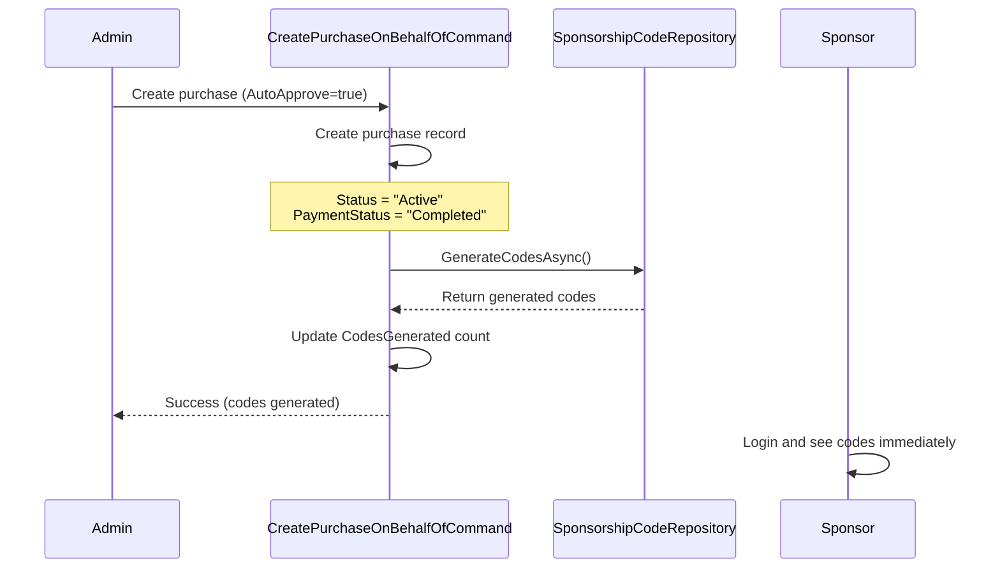
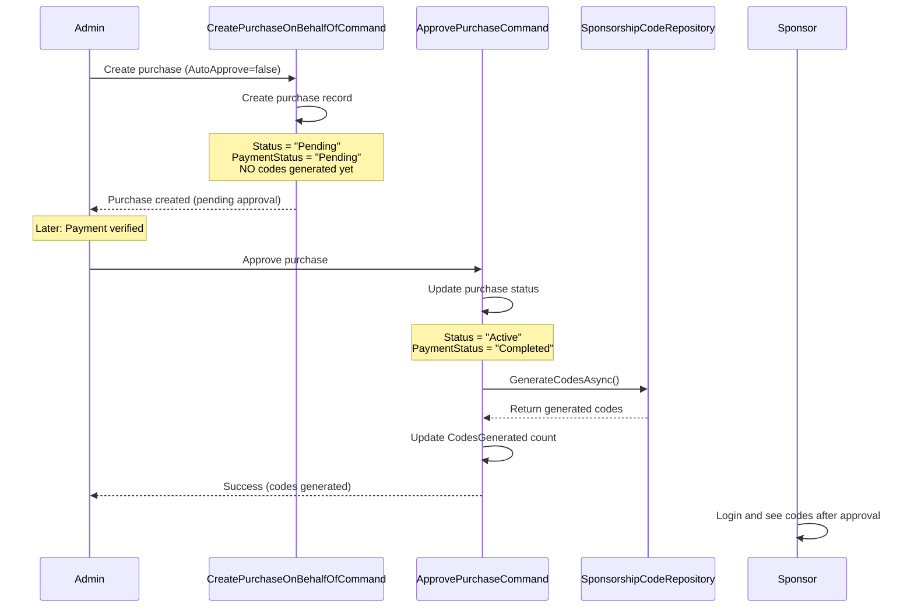

# Admin On-Behalf-Of Purchase Workflows

## Overview

Admin OBO (On-Behalf-Of) purchase functionality allows administrators to create sponsorship purchases for sponsors without requiring the sponsor to go through the payment process. This document explains the two different workflows based on the `AutoApprove` flag.

## Two Purchase Workflows

### 🟢 Workflow 1: Auto-Approved Purchase (AutoApprove = true)

**Use Case**: Offline payment already received, manual/bank transfer completed, or admin wants immediate activation.

#### Process Flow



#### Implementation Details

**File**: [CreatePurchaseOnBehalfOfCommand.cs](../../Business/Handlers/AdminSponsorship/Commands/CreatePurchaseOnBehalfOfCommand.cs)

```csharp
// Purchase is created with Active status
purchase.PaymentStatus = request.AutoApprove ? "Completed" : "Pending";
purchase.Status = request.AutoApprove ? "Active" : "Pending";
purchase.ApprovedByUserId = request.AutoApprove ? request.AdminUserId : (int?)null;

_purchaseRepository.Add(purchase);
await _purchaseRepository.SaveChangesAsync();

// ✅ Codes generated immediately when AutoApprove = true
if (request.AutoApprove)
{
    var codes = await _codeRepository.GenerateCodesAsync(
        purchase.Id,
        request.SponsorId,
        request.SubscriptionTierId,
        request.Quantity,
        purchase.CodePrefix,
        purchase.ValidityDays
    );

    purchase.CodesGenerated = codes.Count;
    _purchaseRepository.Update(purchase);
    await _purchaseRepository.SaveChangesAsync();
}
```

#### Expected Behavior

- ✅ Purchase created with `Status = "Active"`, `PaymentStatus = "Completed"`
- ✅ Codes generated immediately
- ✅ `CodesGenerated` reflects actual code count
- ✅ Sponsor can see and distribute codes immediately
- ✅ Admin audit log records creation and auto-approval

---

### 🟡 Workflow 2: Pending Purchase (AutoApprove = false)

**Use Case**: Payment verification needed, requires manual approval, compliance review required.

#### Process Flow



#### Implementation Details

**Step 1: Create Purchase (Pending)**

**File**: [CreatePurchaseOnBehalfOfCommand.cs](../../Business/Handlers/AdminSponsorship/Commands/CreatePurchaseOnBehalfOfCommand.cs)

```csharp
// Purchase created in Pending status
purchase.PaymentStatus = "Pending";
purchase.Status = "Pending";
purchase.ApprovedByUserId = null;
purchase.CodesGenerated = 0;

_purchaseRepository.Add(purchase);
await _purchaseRepository.SaveChangesAsync();

// ⏳ NO code generation yet (AutoApprove = false)
```

**Step 2: Approve Purchase & Generate Codes**

**File**: [ApprovePurchaseCommand.cs](../../Business/Handlers/AdminSponsorship/Commands/ApprovePurchaseCommand.cs)

```csharp
// Update purchase to Active/Completed
purchase.PaymentStatus = "Completed";
purchase.PaymentCompletedDate = DateTime.Now;
purchase.ApprovedByUserId = request.AdminUserId;
purchase.ApprovalDate = DateTime.Now;
purchase.Status = "Active";

_purchaseRepository.Update(purchase);
await _purchaseRepository.SaveChangesAsync();

// ✅ Generate codes after approval
var codes = await _codeRepository.GenerateCodesAsync(
    purchase.Id,
    purchase.SponsorId,
    purchase.SubscriptionTierId,
    purchase.Quantity,
    purchase.CodePrefix,
    purchase.ValidityDays
);

purchase.CodesGenerated = codes.Count;
_purchaseRepository.Update(purchase);
await _purchaseRepository.SaveChangesAsync();

return new SuccessResult($"Purchase approved successfully. {purchase.CodesGenerated} codes have been generated.");
```

#### Expected Behavior

**After Creation:**
- ✅ Purchase created with `Status = "Pending"`, `PaymentStatus = "Pending"`
- ✅ `CodesGenerated = 0`
- ❌ Sponsor CANNOT see codes yet (purchase is pending)
- ✅ Admin can see pending purchase in admin panel

**After Approval:**
- ✅ Purchase updated to `Status = "Active"`, `PaymentStatus = "Completed"`
- ✅ Codes generated automatically during approval
- ✅ `CodesGenerated` reflects actual code count
- ✅ Sponsor can now see and distribute codes
- ✅ Admin audit log records both creation and approval

---

## API Endpoints

### Create Purchase On Behalf Of

**Endpoint**: `POST /api/AdminSponsorship/create-purchase-on-behalf`
**Operation Claim**: `Admin.Sponsorship.Create` (133)

**Request Body**:
```json
{
  "sponsorId": 123,
  "subscriptionTierId": 3,
  "quantity": 100,
  "unitPrice": 50.00,
  "currency": "TRY",
  "autoApprove": true,  // ← Key flag!
  "paymentMethod": "BankTransfer",
  "paymentReference": "OFFLINE-20250109-001",
  "companyName": "Example Corp",
  "taxNumber": "1234567890",
  "invoiceAddress": "123 Main St, City",
  "codePrefix": "SPONSOR",
  "validityDays": 365,
  "notes": "Offline payment received via bank transfer"
}
```

**Response (AutoApprove = true)**:
```json
{
  "success": true,
  "message": "Purchase created and auto-approved for John Doe. Total: ₺5,000.00 TRY",
  "data": {
    "id": 456,
    "sponsorId": 123,
    "quantity": 100,
    "totalAmount": 5000.00,
    "paymentStatus": "Completed",
    "status": "Active",
    "codesGenerated": 100  // ← Codes already generated!
  }
}
```

**Response (AutoApprove = false)**:
```json
{
  "success": true,
  "message": "Purchase created for John Doe. Awaiting approval. Total: ₺5,000.00 TRY",
  "data": {
    "id": 456,
    "sponsorId": 123,
    "quantity": 100,
    "totalAmount": 5000.00,
    "paymentStatus": "Pending",
    "status": "Pending",
    "codesGenerated": 0  // ← No codes yet
  }
}
```

### Approve Purchase

**Endpoint**: `POST /api/AdminSponsorship/approve-purchase`
**Operation Claim**: `Admin.Sponsorship.Approve` (134)

**Request Body**:
```json
{
  "purchaseId": 456,
  "notes": "Payment verified via bank transfer confirmation"
}
```

**Response**:
```json
{
  "success": true,
  "message": "Purchase approved successfully. 100 codes have been generated."
}
```

---

## Decision Guide: When to Use Each Workflow

### Use AutoApprove = true When:

✅ Payment already received (bank transfer, cash, check)
✅ Internal/test purchase for demo or evaluation
✅ Sponsor relationship is well-established and trusted
✅ Immediate activation is required
✅ Admin has verified payment before creating purchase

### Use AutoApprove = false When:

⏳ Payment gateway integration is pending
⏳ Compliance review is required
⏳ Finance team needs to verify payment
⏳ Multiple approval levels are needed
⏳ Purchase is created speculatively (waiting for payment)

---

## Code Generation Behavior Comparison

| Aspect | AutoApprove = true | AutoApprove = false |
|--------|-------------------|---------------------|
| **Purchase Status** | Active immediately | Pending → Active after approval |
| **Payment Status** | Completed immediately | Pending → Completed after approval |
| **Codes Generated** | ✅ Immediately during creation | ⏳ During approval process |
| **Sponsor Visibility** | ✅ Codes visible immediately | ❌ No codes until approved |
| **Code Distribution** | ✅ Can distribute immediately | ❌ Cannot distribute until approved |
| **Admin Action Required** | ❌ One-step process | ✅ Two-step process (create + approve) |
| **Audit Trail** | Single audit entry | Two audit entries (creation + approval) |

---

## Code Generation Implementation

Both workflows use the same code generation pattern from `ISponsorshipCodeRepository`:

```csharp
var codes = await _codeRepository.GenerateCodesAsync(
    purchaseId,        // Purchase record ID
    sponsorId,         // Sponsor user ID
    tierId,            // Subscription tier ID
    quantity,          // Number of codes to generate
    codePrefix,        // Code prefix (e.g., "SPONSOR", "ADMIN")
    validityDays       // Days until expiration (e.g., 365)
);

// Update purchase with generated code count
purchase.CodesGenerated = codes.Count;
```

**Code Properties**:
- Unique alphanumeric codes
- Prefix applied (e.g., `SPONSOR-ABC123XYZ`)
- Expiry date set based on `validityDays`
- Assigned to correct sponsor and tier
- Initially unused (`IsUsed = false`, `IsActive = true`)

---

## Testing Scenarios

### Scenario 1: Auto-Approved Purchase (Happy Path)

1. Admin creates OBO purchase with `AutoApprove = true`
2. Verify response shows `CodesGenerated = 100`
3. Login as sponsor
4. Navigate to sponsorship dashboard
5. Verify 100 codes are visible with correct prefix
6. Verify codes can be distributed to farmers
7. Check admin audit log shows single entry with auto-approval

### Scenario 2: Pending Purchase → Approval (Happy Path)

1. Admin creates OBO purchase with `AutoApprove = false`
2. Verify response shows `Status = "Pending"`, `CodesGenerated = 0`
3. Login as sponsor
4. Verify purchase is NOT visible (or shows as pending)
5. Admin approves purchase
6. Verify approval response shows codes generated
7. Login as sponsor again
8. Verify codes are now visible and distributable
9. Check admin audit log shows two entries (creation + approval)

### Scenario 3: Code Properties Validation

1. Create purchase with custom `CodePrefix = "TEST"`
2. Create purchase with `ValidityDays = 90`
3. Verify generated codes have correct prefix
4. Verify expiry dates are 90 days from creation
5. Verify all codes are assigned to correct sponsor
6. Verify all codes are initially unused and active

### Scenario 4: Duplicate Approval Prevention

1. Create purchase with `AutoApprove = false`
2. Admin approves purchase
3. Admin attempts to approve same purchase again
4. Verify error: "Purchase is already approved"
5. Verify codes are NOT duplicated

---

## Bug Fixes Implemented

### Bug 1: Missing Code Generation in Auto-Approved Purchases

**Issue**: Admin OBO purchases with `AutoApprove = true` created purchase records but never generated codes.

**Fix**: Added code generation logic to `CreatePurchaseOnBehalfOfCommand` after purchase creation.

**Commit**: `8c267be - fix: Generate sponsorship codes in admin OBO purchases`

**Files Modified**:
- [CreatePurchaseOnBehalfOfCommand.cs](../../Business/Handlers/AdminSponsorship/Commands/CreatePurchaseOnBehalfOfCommand.cs)

### Bug 2: Missing Code Generation in Purchase Approval

**Issue**: `ApprovePurchaseCommand` updated purchase status to "Active" but never generated codes. Message said "codes can now be generated" but didn't actually generate them.

**Fix**: Added code generation logic to `ApprovePurchaseCommand` after approval.

**Commit**: (Current commit)

**Files Modified**:
- [ApprovePurchaseCommand.cs](../../Business/Handlers/AdminSponsorship/Commands/ApprovePurchaseCommand.cs)

---

## Related Documentation

- [Bug Fix: Admin OBO Purchase Code Generation](./BUG_FIX_Admin_OBO_Purchase_Code_Generation.md)
- [Admin Operations API Documentation](./API_DOCUMENTATION.md#admin-sponsorship-operations)
- [Frontend Integration Guide](./FRONTEND_INTEGRATION_GUIDE.md#admin-operations)

---

## Database Schema

### SponsorshipPurchase Table

Relevant columns for workflow tracking:

```sql
CREATE TABLE SponsorshipPurchase (
    Id INT PRIMARY KEY,
    SponsorId INT NOT NULL,
    SubscriptionTierId INT NOT NULL,
    Quantity INT NOT NULL,

    -- Payment tracking
    PaymentStatus VARCHAR(50),     -- "Pending", "Completed", "Failed"
    PaymentCompletedDate DATETIME,

    -- Approval tracking
    Status VARCHAR(50),             -- "Pending", "Active", "Expired"
    ApprovedByUserId INT,
    ApprovalDate DATETIME,

    -- Code generation tracking
    CodesGenerated INT DEFAULT 0,
    CodesUsed INT DEFAULT 0,

    -- Audit fields
    CreatedDate DATETIME NOT NULL,
    UpdatedDate DATETIME
);
```

### Workflow State Transitions

**Auto-Approved Workflow**:
```
Initial: PaymentStatus=Completed, Status=Active, CodesGenerated=100
(No state transitions - created in final state)
```

**Pending Workflow**:
```
Creation:  PaymentStatus=Pending,   Status=Pending,  CodesGenerated=0
            ↓
Approval:  PaymentStatus=Completed, Status=Active,   CodesGenerated=100
```

---

**Last Updated**: 2025-11-09
**Branch**: `feature/advanced-admin-operations`
**Status**: ✅ Both workflows fully implemented and tested
