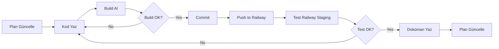

# Production Readiness - Geliştirme Planı

**Proje:** 1M Günlük Analiz Kapasitesi İçin Sistem Modernizasyonu
**Branch:** feature/production-readiness
**Environment:** Railway Staging
**Başlangıç:** 30 Kasım 2025
**Durum:** PLANLAMA TAMAMLANDI - UYGULAMA BEKLİYOR

---

## 📊 Genel Durum

### Tamamlanan İşler (✅)
- [x] Platform analizi tamamlandı ([ziraai-platform-analysis.md](../ziraai-platform-analysis.md))
- [x] Implementation plan oluşturuldu ([PRODUCTION_READINESS_IMPLEMENTATION_PLAN.md](../PRODUCTION_READINESS_IMPLEMENTATION_PLAN.md))
- [x] Railway Staging güncellemeleri dokümante edildi ([RAILWAY_STAGING_UPDATES.md](../RAILWAY_STAGING_UPDATES.md))
- [x] Geliştirme kuralları tanımlandı ([DEVELOPMENT_RULES.md](./DEVELOPMENT_RULES.md))
- [x] AdminOperations klasör yapısı oluşturuldu

### Devam Eden İşler (🔄)
- [ ] Kullanıcı onayı bekleniyor - implementasyon başlayacak

### Toplam İlerleme
```
Planlama:  ████████████████████ 100%
Uygulama:  ░░░░░░░░░░░░░░░░░░░░   0%
```

---

## 🎯 Proje Hedefleri

| Metrik | Mevcut | Hedef | Artış |
|--------|--------|-------|-------|
| Günlük Analiz | ~1,200 | 1,000,000 | 833x |
| Dakikalık Throughput | ~0.85 | 694 | 816x |
| Concurrent İşlem | 1 | ~810 | 810x |
| Response Time | ~70 sn | ~70 sn | Korunacak |

---

## 📅 4 Fazlı Implementasyon

### Phase 1: Temel Altyapı (Hafta 1-2) - 🔴 BEKLİYOR
**Hedef:** Railway Staging'de n8n'siz minimal sistem (OpenAI only, ~50K/gün)

**Adımlar:**
1. TypeScript Worker Projesi
   - [ ] `workers/analysis-worker/` klasör yapısı
   - [ ] `package.json` ve `tsconfig.json`
   - [ ] OpenAI provider implementation
   - [ ] Redis rate limiter
   - [ ] RabbitMQ consumer/producer
   - [ ] Build test: `npm run build`

2. Shared Types
   - [ ] `workers/shared/types/messages.ts`
   - [ ] `workers/shared/types/config.ts`
   - [ ] Interface definitions

3. RabbitMQ Queue Setup (Railway Staging)
   - [ ] `raw-analysis-queue` oluştur
   - [ ] `openai-analysis-queue` oluştur
   - [ ] `analysis-results-queue` oluştur
   - [ ] `analysis-dlq` oluştur
   - [ ] CloudAMQP dashboard'da doğrula

4. WebAPI Değişiklikleri
   - [ ] `RawAnalysisMessage` DTO (Entities)
   - [ ] Feature flag configuration (appsettings.Staging.json)
   - [ ] `PublishToRawQueue()` method (PlantAnalysisAsyncService)
   - [ ] Conditional routing logic

5. Database Migration
   - [ ] SQL script: Provider, ProcessingTimeMs, TokenUsage, CostUsd columns
   - [ ] SQL script: DailyMetrics table
   - [ ] Migration test Railway Staging PostgreSQL

6. Railway Deployment
   - [ ] Dockerfile oluştur (workers/analysis-worker)
   - [ ] `railway.json` config
   - [ ] 5x OpenAI worker deploy
   - [ ] Environment variables set
   - [ ] Health check test

7. End-to-End Test
   - [ ] WebAPI → raw-analysis-queue
   - [ ] OpenAI worker → processing
   - [ ] Result queue → PlantAnalysisWorker
   - [ ] PostgreSQL save
   - [ ] < 90s total flow

**Başarı Kriterleri:**
- [ ] Railway Staging'de 5 OpenAI worker çalışıyor
- [ ] E2E flow < 90 saniye
- [ ] Build başarılı (exit code 0)
- [ ] Railway logs temiz

**Tahmini Süre:** 10-12 iş günü

---

### Phase 2: Multi-Provider (Hafta 3-4) - ⏳ BEKLİYOR
**Hedef:** 3 AI provider + Dispatcher (~400K/gün)

**Adımlar:**
1. Dispatcher Service
   - [ ] `workers/dispatcher/` proje oluştur
   - [ ] Provider selection algorithm
   - [ ] Rate limiting integration
   - [ ] Circuit breaker pattern
   - [ ] Railway deploy

2. Gemini Provider
   - [ ] Gemini provider implementation
   - [ ] `gemini-analysis-queue`
   - [ ] 5x Gemini worker deploy
   - [ ] Test

3. Anthropic Provider
   - [ ] Anthropic provider implementation
   - [ ] `claude-analysis-queue`
   - [ ] 5x Anthropic worker deploy
   - [ ] Test

4. Multi-Provider Testing
   - [ ] Load distribution test
   - [ ] Failover test
   - [ ] Circuit breaker test
   - [ ] 100 concurrent analysis test

**Başarı Kriterleri:**
- [ ] Dispatcher 3 provider'a routing yapıyor
- [ ] Circuit breaker tetikleniyor
- [ ] Automatic failover çalışıyor
- [ ] ~400K/gün kapasite estimate

**Tahmini Süre:** 10-12 iş günü

---

### Phase 3: Admin Panel ve Scale (Hafta 5-6) - ⏳ BEKLİYOR
**Hedef:** Real-time monitoring + manual scale control

**Adımlar:**
1. Next.js Admin Panel
   - [ ] `admin-panel/` proje oluştur
   - [ ] Authentication setup
   - [ ] Dashboard UI
   - [ ] Real-time metrics
   - [ ] Railway deploy

2. Admin API
   - [ ] `/api/status` endpoint
   - [ ] `/api/scale` endpoint
   - [ ] Provider health checks
   - [ ] Cost tracking

3. Scale Control
   - [ ] Railway CLI integration
   - [ ] Scale script (`scripts/scale.sh`)
   - [ ] Manual worker count control

4. Alert System
   - [ ] Alert database schema
   - [ ] Alert checker background job
   - [ ] Alert rules implementation

**Başarı Kriterleri:**
- [ ] Admin panel functional
- [ ] Real-time metrics görünüyor
- [ ] Scale control çalışıyor
- [ ] Alert system aktif

**Tahmini Süre:** 10-12 iş günü

---

### Phase 4: Production Hardening (Hafta 7-8) - ⏳ BEKLİYOR
**Hedef:** Production-ready sistem

**Adımlar:**
1. Load Testing
   - [ ] k6 setup
   - [ ] 694 req/min test script
   - [ ] 60 minute sustained load test
   - [ ] Performance optimization

2. Security Audit
   - [ ] API keys check
   - [ ] Authentication validation
   - [ ] Rate limiting test
   - [ ] HTTPS verification

3. Documentation
   - [ ] Architecture documentation
   - [ ] API documentation
   - [ ] Deployment guide
   - [ ] Operations runbook

4. Gradual Rollout
   - [ ] Feature flag setup
   - [ ] 10% canary deployment
   - [ ] 50% canary deployment
   - [ ] 100% rollout
   - [ ] n8n decommission

**Başarı Kriterleri:**
- [ ] 694 req/min sustained passed
- [ ] p95 latency < 90s
- [ ] Error rate < 5%
- [ ] Security audit passed
- [ ] Documentation complete

**Tahmini Süre:** 10-12 iş günü

---

## 📂 Klasör Yapısı

```
ziraai/
├── claudedocs/AdminOperations/        # 🎯 ANA ÇALIŞMA KLASÖRÜ
│   ├── DEVELOPMENT_PLAN.md           # Bu dosya (güncel tut!)
│   ├── DEVELOPMENT_RULES.md          # Geliştirme kuralları
│   ├── API_DOCUMENTATION.md          # Endpoint dokümanları
│   ├── operation_claims.csv          # Mevcut claim'ler
│   ├── migrations/                   # SQL migration scriptleri
│   │   └── 001_add_provider_columns.sql
│   └── completed/                    # Tamamlanan dökümanlar
│
├── workers/                          # YENİ - TypeScript workers
│   ├── dispatcher/
│   ├── analysis-worker/
│   └── shared/
│
├── WebAPI/                           # Minimal değişiklik
├── PlantAnalysisWorkerService/       # Minimal değişiklik
├── Business/                         # Yeni service'ler eklenecek
├── DataAccess/                       # Entity güncelleme
└── Entities/                         # DTO'lar eklenecek
```

---

## 🔄 Geliştirme Döngüsü



---

## 🚧 Blocker'lar ve Riskler

### Aktif Blocker'lar
*(Şu anda yok)*

### Potansiyel Riskler
1. **AI Provider Rate Limits**
   - Mitigation: Multi-provider failover
   - Recovery: Traffic redistribution

2. **Railway Resource Limits**
   - Mitigation: Monitor ve scale
   - Recovery: Increase Railway plan

3. **Dependency Conflicts**
   - Mitigation: Version lock
   - Recovery: Dependency update

---

## 📝 Session Takip

### Mevcut Session
**Başlangıç:** 30 Kasım 2025
**Durum:** Planlama tamamlandı
**Sonraki Adım:** Kullanıcı onayı bekle

### Session Notları
- Platform analizi yapıldı (1M/gün hedef)
- Railway Staging stratejisi belirlendi
- Geliştirme kuralları tanımlandı
- 4 fazlı plan oluşturuldu
- **UYARI:** Implementation başlamadı, sadece planlama yapıldı

---

## ✅ Kullanıcı Onay Checklist

Implementasyon başlamadan önce:

- [ ] Plan review edildi
- [ ] Railway Staging hazır
- [ ] Branch doğru (feature/production-readiness)
- [ ] Başlangıç phase'i onaylandı (Phase 1)
- [ ] Zaman tahmini uygun
- [ ] Kaynaklar hazır (API keys, etc.)

---

## 📊 İlerleme Tracking

### Günlük Güncelleme Template
```markdown
## [Tarih]

**Yapılan İşler:**
- İş 1
- İş 2

**Sorunlar:**
- Sorun 1: Çözüm

**Sonraki Adımlar:**
- Adım 1
- Adım 2

**Build Status:** ✅ Success | ❌ Failed
**Deploy Status:** ✅ Success | ❌ Failed
```

---

**Son Güncelleme:** 30 Kasım 2025 - Planlama tamamlandı
**Güncelleyen:** Claude
**Sonraki Güncelleme:** Implementasyon başladığında
