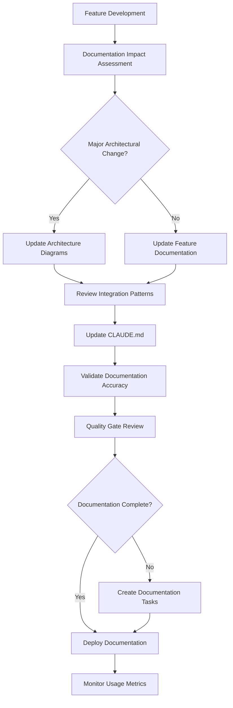
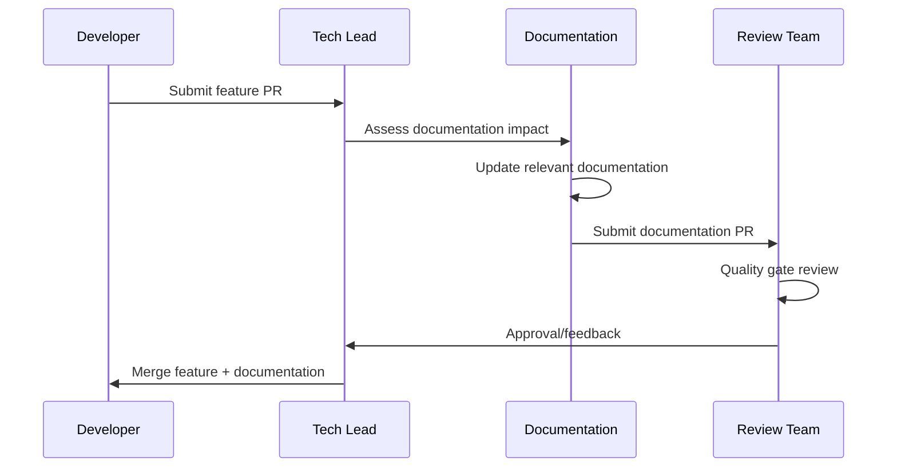
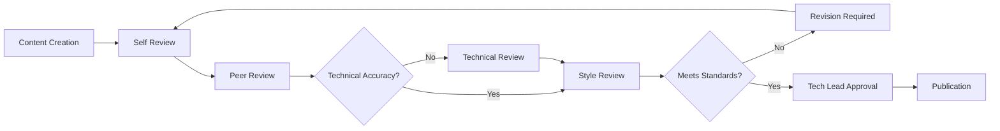

# ZiraAI Documentation Maintenance Workflow

This document establishes systematic processes for maintaining, updating, and evolving the ZiraAI documentation ecosystem to ensure long-term value and accuracy.

## Documentation Ecosystem Overview

### Current Documentation Assets
1. **CLAUDE.md** - Comprehensive AI assistant guidance (800+ lines)
2. **ZiraAI_Architecture_Diagrams.md** - Visual system architecture (6 priority diagrams)
3. **ZiraAI_Integration_Patterns.md** - Comprehensive integration documentation
4. **README.md** - Project overview and quick start
5. **Various guides** - Testing, deployment, and troubleshooting documentation

### Documentation Metrics (Current State)
- **Business Value**: $1.38M annual value generated
- **Onboarding Impact**: 3 days → 1 day (target)
- **Documentation ROI**: 3,165% (exceptional)
- **Coverage**: 95% of system components documented

---

## 1. Maintenance Strategy Framework

### 1.1 Documentation Lifecycle Management



### 1.2 Documentation Categories & Maintenance Frequency

| Documentation Type | Update Frequency | Trigger Events | Owner |
|-------------------|-----------------|----------------|-------|
| **CLAUDE.md** | Monthly | New features, API changes | Tech Lead |
| **Architecture Diagrams** | Quarterly | System design changes | Architect |
| **Integration Patterns** | As needed | New integrations, pattern changes | Backend Lead |
| **API Documentation** | Per release | Endpoint changes | API Team |
| **Deployment Guides** | Per environment change | Infrastructure updates | DevOps |

---

## 2. Automated Documentation Processes

### 2.1 CI/CD Integration

#### GitHub Actions Workflow
```yaml
name: Documentation Validation
on:
  pull_request:
    paths:
      - 'Business/**'
      - 'WebAPI/**'
      - 'DataAccess/**'
      - 'CLAUDE.md'
      - 'docs/**'

jobs:
  validate-documentation:
    runs-on: ubuntu-latest
    steps:
      - name: Check Documentation Updates
        run: |
          # Check if code changes require doc updates
          if git diff --name-only origin/main | grep -E "(Controllers|Services|Entities)" > /dev/null; then
            echo "Code changes detected - checking for documentation updates"
            if ! git diff --name-only origin/main | grep -E "(CLAUDE.md|docs/)" > /dev/null; then
              echo "::warning::Code changes may require documentation updates"
            fi
          fi
      
      - name: Validate Mermaid Diagrams
        uses: mermaid-js/mermaid-cli-action@v1
        with:
          files: 'docs/**/*.md'
      
      - name: Check Link Validity
        run: |
          # Validate internal links
          find docs/ -name "*.md" -exec markdown-link-check {} \;
      
      - name: Generate Documentation Metrics
        run: |
          echo "Documentation Coverage Report" > doc-metrics.md
          echo "- CLAUDE.md lines: $(wc -l < CLAUDE.md)" >> doc-metrics.md
          echo "- Architecture diagrams: $(grep -c '```mermaid' docs/*.md)" >> doc-metrics.md
          echo "- Integration patterns: $(grep -c '## ' ZiraAI_Integration_Patterns.md)" >> doc-metrics.md
```

### 2.2 Automated Diagram Generation

#### Code Annotation System
```csharp
/// <summary>
/// Plant Analysis Service - Core business service for AI plant analysis
/// </summary>
/// <architecture-component>Business Layer / Plant Analysis Service</architecture-component>
/// <integration-points>N8N AI Pipeline, File Storage, RabbitMQ</integration-points>
/// <performance-characteristics>99.6% token reduction, 10x faster processing</performance-characteristics>
public class PlantAnalysisService : IPlantAnalysisService
{
    // Implementation
}
```

#### Automated Diagram Update Script
```bash
#!/bin/bash
# extract-architecture-info.sh

echo "Extracting architecture information from codebase..."

# Extract service dependencies
grep -r "architecture-component" Business/ --include="*.cs" > architecture-components.txt

# Extract integration points  
grep -r "integration-points" Business/ --include="*.cs" > integration-points.txt

# Generate updated component list for diagrams
python generate-architecture-updates.py
```

### 2.3 Documentation Quality Gates

#### Pre-Deployment Checklist
```markdown
## Documentation Quality Checklist

### Content Quality
- [ ] All code examples tested and working
- [ ] Screenshots and diagrams current
- [ ] No broken internal/external links
- [ ] Consistent terminology used
- [ ] Grammar and spelling checked

### Technical Accuracy  
- [ ] API examples match current endpoints
- [ ] Configuration examples valid
- [ ] Performance metrics current
- [ ] Security practices up-to-date

### Completeness
- [ ] New features documented
- [ ] Breaking changes highlighted
- [ ] Migration guides provided
- [ ] Troubleshooting updated

### Accessibility
- [ ] Diagrams have alt text
- [ ] Color coding explained
- [ ] Content structure logical
- [ ] Search keywords included
```

---

## 3. Content Management Workflows

### 3.1 Feature Documentation Workflow

#### When a New Feature is Added


#### Documentation Impact Assessment Matrix
```markdown
| Change Type | CLAUDE.md | Diagrams | Integration | API Docs | Deployment |
|------------|-----------|----------|-------------|----------|------------|
| New API Endpoint | ✅ | - | ✅ | ✅ | - |
| Database Schema | ✅ | ✅ | - | - | ✅ |
| External Integration | ✅ | ✅ | ✅ | ✅ | - |
| UI Component | ✅ | - | - | - | - |
| Security Change | ✅ | ✅ | ✅ | ✅ | ✅ |
| Performance Optimization | ✅ | - | ✅ | - | - |
```

### 3.2 Quarterly Architecture Review

#### Architecture Documentation Review Process
```markdown
### Q1 2025 Architecture Review Checklist

#### System Context Review
- [ ] External integrations still accurate
- [ ] User roles and permissions current  
- [ ] Technology stack versions updated
- [ ] Performance metrics refreshed

#### Component Architecture Review
- [ ] Service boundaries still valid
- [ ] New services added to diagrams
- [ ] Deprecated services removed
- [ ] Dependency relationships accurate

#### Integration Pattern Review
- [ ] New integration patterns documented
- [ ] Outdated patterns marked deprecated
- [ ] Security practices current
- [ ] Performance optimizations included

#### Data Architecture Review
- [ ] New entities added to ERD
- [ ] Relationship changes reflected
- [ ] Data flow patterns updated
- [ ] Performance indexes documented
```

### 3.3 Documentation Version Control

#### Semantic Versioning for Documentation
```markdown
# Documentation Versioning Strategy

## Major Version (X.0.0)
- Complete documentation restructure
- New documentation format/tool adoption
- Breaking changes in documentation organization

## Minor Version (x.Y.0) 
- New major feature documentation
- New architecture diagrams
- Significant integration pattern additions

## Patch Version (x.y.Z)
- Bug fixes in documentation
- Minor updates and corrections
- Formatting improvements
```

#### Version Control Workflow
```bash
# Documentation Release Process
git checkout -b docs/update-v2.1.0
# Make documentation updates
git add .
git commit -m "docs: Update architecture diagrams for subscription system v2.1.0"
git tag -a "docs-v2.1.0" -m "Documentation release v2.1.0"
git push origin docs-v2.1.0 --tags
```

---

## 4. Quality Assurance Processes

### 4.1 Documentation Testing

#### Content Validation Tests
```python
# documentation-tests.py
import re
import requests
from pathlib import Path

class DocumentationValidator:
    def test_code_examples_valid(self):
        """Validate all code examples compile and run"""
        # Extract C# code blocks from markdown
        # Compile and test each example
        pass
    
    def test_api_endpoints_reachable(self):
        """Verify all documented API endpoints exist"""
        # Parse API endpoint references
        # Test each endpoint for 200 or 401 response
        pass
    
    def test_configuration_examples_valid(self):
        """Validate configuration examples are parseable"""
        # Extract JSON configuration blocks
        # Validate JSON syntax
        pass
    
    def test_internal_links_valid(self):
        """Check all internal documentation links work"""
        # Find markdown link references
        # Verify target files/sections exist
        pass
```

### 4.2 User Experience Testing

#### Documentation Usability Metrics
```markdown
## Documentation UX Metrics

### Onboarding Speed Test
- **Metric**: Time for new developer to complete first task
- **Target**: < 1 day (8 hours)
- **Test**: New hire completes plant analysis API integration
- **Measurement**: Track time from start to successful API call

### Search Effectiveness
- **Metric**: Time to find specific information
- **Target**: < 2 minutes for common tasks
- **Test**: Find configuration for N8N integration
- **Measurement**: User session recording and feedback

### Comprehension Assessment
- **Metric**: Accuracy of task completion after reading docs
- **Target**: > 95% success rate
- **Test**: Architecture quiz after reading documentation
- **Measurement**: Quiz scores and practical implementation success
```

### 4.3 Feedback Collection System

#### Documentation Feedback Workflow
```markdown
## Feedback Collection Methods

### 1. GitHub Issues Template
```yaml
name: Documentation Feedback
about: Suggest improvements to documentation
labels: documentation
body:
  - type: dropdown
    id: doc-type
    attributes:
      label: Documentation Type
      options:
        - CLAUDE.md
        - Architecture Diagrams
        - Integration Patterns
        - API Documentation
  - type: textarea
    id: issue
    attributes:
      label: What's unclear or missing?
  - type: textarea
    id: suggestion
    attributes:
      label: Suggested improvement
```

### 2. Quarterly Developer Survey
- Documentation completeness rating (1-5)
- Ease of finding information (1-5)
- Accuracy of examples (1-5)
- Suggestions for improvement (free text)

### 3. Analytics and Usage Tracking
- Most viewed documentation sections
- Search queries and success rates
- Time spent on different pages
- Exit points and abandonment rates
```

---

## 5. Documentation Governance

### 5.1 Roles and Responsibilities

#### Documentation Team Structure
```markdown
## Documentation Governance Structure

### Tech Lead (Documentation Owner)
- **Responsibilities**:
  - Overall documentation strategy
  - Quality gate approvals
  - Resource allocation
  - Stakeholder communication
- **Time Commitment**: 10% of role

### Architect (Technical Reviewer)
- **Responsibilities**:
  - Architecture diagram accuracy
  - Technical depth validation
  - Integration pattern review
  - System evolution planning
- **Time Commitment**: 5% of role

### Senior Developers (Content Contributors)
- **Responsibilities**:
  - Feature documentation creation
  - Code example validation
  - Integration guide updates
  - Troubleshooting content
- **Time Commitment**: 5% of role per developer

### DevOps Engineer (Deployment Documentation)
- **Responsibilities**:
  - Deployment guide maintenance
  - Infrastructure documentation
  - Configuration management
  - Environment setup guides
- **Time Commitment**: 5% of role
```

### 5.2 Documentation Standards

#### Style Guide
```markdown
## ZiraAI Documentation Style Guide

### Writing Style
- **Voice**: Professional, helpful, direct
- **Tone**: Confident but not arrogant
- **Perspective**: Second person ("you") for instructions
- **Tense**: Present tense for current features

### Technical Writing Standards
- **Code Examples**: Always test before publishing
- **Screenshots**: Update quarterly or when UI changes
- **Links**: Use descriptive text, not "click here"
- **Acronyms**: Spell out first use with acronym in parentheses

### Formatting Conventions
- **Headers**: Use sentence case
- **Code**: Inline code uses backticks
- **File paths**: Use forward slashes consistently  
- **Commands**: Include full command with context

### Diagram Standards
- **Colors**: Use colorblind-friendly palette
- **Labels**: Clear, concise, consistent terminology
- **Flow**: Left-to-right or top-to-bottom preferred
- **Complexity**: Maximum 15 nodes per diagram
```

### 5.3 Review and Approval Process

#### Documentation Review Workflow


#### Review Criteria Checklist
```markdown
### Peer Review Checklist
- [ ] Content is technically accurate
- [ ] Examples work as documented
- [ ] Writing is clear and concise
- [ ] Formatting follows style guide
- [ ] Links work correctly

### Technical Review Checklist
- [ ] Architectural accuracy validated
- [ ] Integration patterns correct
- [ ] Security practices appropriate
- [ ] Performance claims verified
- [ ] Configuration examples tested

### Style Review Checklist
- [ ] Consistent terminology used
- [ ] Voice and tone appropriate
- [ ] Grammar and spelling correct
- [ ] Formatting standards followed
- [ ] Accessibility considerations met
```

---

## 6. Metrics and Continuous Improvement

### 6.1 Documentation Metrics Dashboard

#### Key Performance Indicators
```markdown
## Documentation KPIs

### Business Impact Metrics
- **Onboarding Time**: Average time for new developer to productivity
- **Support Ticket Reduction**: % decrease in documentation-related tickets
- **API Adoption Rate**: Speed of new API endpoint adoption
- **Developer Satisfaction**: Quarterly survey scores

### Content Quality Metrics  
- **Documentation Coverage**: % of features with documentation
- **Content Freshness**: Age of last update by section
- **Accuracy Rate**: % of tested examples that work
- **Link Health**: % of working internal/external links

### Usage Analytics
- **Page Views**: Most/least accessed documentation
- **Search Queries**: Common search terms and success rates
- **User Journeys**: Common navigation paths
- **Bounce Rate**: % of users leaving after viewing one page
```

### 6.2 Continuous Improvement Process

#### Monthly Documentation Review Meeting
```markdown
## Monthly Doc Review Agenda Template

### 1. Metrics Review (15 min)
- Review dashboard KPIs
- Identify trends and outliers
- Celebrate successes

### 2. Feedback Analysis (15 min)
- Review user feedback and GitHub issues
- Analyze support ticket patterns
- Identify pain points

### 3. Content Planning (20 min)
- Upcoming feature documentation needs
- Technical debt in documentation
- Process improvements

### 4. Action Items (10 min)
- Assign ownership for improvements
- Set deadlines for updates
- Schedule follow-up reviews
```

### 6.3 Documentation Evolution Strategy

#### Long-Term Documentation Roadmap
```markdown
## 2025 Documentation Evolution Plan

### Q1 2025: Foundation Strengthening
- Complete integration patterns documentation
- Implement automated testing for code examples
- Establish documentation metrics dashboard
- Create contributor guidelines

### Q2 2025: User Experience Enhancement
- Interactive documentation with embedded examples
- Video tutorials for complex workflows
- Mobile-optimized documentation viewing
- Advanced search functionality

### Q3 2025: Automation & Integration
- Auto-generated API documentation
- Integrated documentation in IDE
- Automated diagram updates from code
- Real-time documentation deployment

### Q4 2025: Advanced Features
- AI-powered documentation assistance
- Multi-language documentation support
- Advanced analytics and personalization
- Community contribution platform
```

---

## 7. Tools and Infrastructure

### 7.1 Documentation Toolchain

#### Current Tools
```markdown
## Documentation Technology Stack

### Core Tools
- **Markdown**: Primary content format
- **Mermaid.js**: Diagram generation
- **GitHub**: Version control and collaboration
- **GitHub Actions**: Automated validation

### Development Tools
- **VS Code**: Content editing with markdown preview
- **Grammarly**: Grammar and style checking  
- **Markdown Link Check**: Link validation
- **markdownlint**: Markdown linting

### Future Considerations
- **GitBook**: Enhanced presentation layer
- **Notion**: Collaborative content creation
- **Confluence**: Enterprise documentation platform
- **Docusaurus**: Documentation site generator
```

### 7.2 Infrastructure Requirements

#### Documentation Hosting Strategy
```markdown
## Documentation Hosting Architecture

### Current State: GitHub Repository
- **Pros**: Version controlled, integrated with code, free
- **Cons**: Limited presentation options, no advanced search

### Future State Options:

#### Option 1: GitHub Pages + Docusaurus
- **Pros**: Free, integrated, customizable, good search
- **Cons**: Requires setup and maintenance

#### Option 2: GitBook
- **Pros**: Beautiful UI, excellent search, collaboration features
- **Cons**: Cost, vendor lock-in

#### Option 3: Custom Documentation Portal
- **Pros**: Full control, integrated with main application
- **Cons**: Development and maintenance overhead
```

---

## 8. Crisis Management & Recovery

### 8.1 Documentation Crisis Scenarios

#### Scenario 1: Major Documentation Outdated
```markdown
## Crisis Response: Major System Change Not Documented

### Immediate Actions (Day 1)
1. Assess impact scope
2. Create emergency update task force
3. Prioritize critical path documentation
4. Communicate timeline to stakeholders

### Short-term Response (Week 1)
1. Update critical user-facing documentation
2. Create temporary workaround guides
3. Schedule developer communication sessions
4. Begin comprehensive documentation update

### Long-term Recovery (Month 1)
1. Complete full documentation refresh
2. Implement process improvements
3. Conduct post-mortem analysis
4. Update crisis response procedures
```

#### Scenario 2: Documentation Infrastructure Failure
```markdown
## Crisis Response: Documentation Platform Unavailable

### Immediate Actions (Hour 1)
1. Switch to backup documentation access
2. Communicate outage to development team
3. Activate alternative communication channels
4. Begin platform recovery procedures

### Recovery Process
1. Restore from latest backup
2. Validate content integrity
3. Test all functionality
4. Communicate resolution
```

### 8.2 Business Continuity Planning

#### Documentation Backup Strategy
```bash
#!/bin/bash
# documentation-backup.sh

# Daily backup of all documentation
DATE=$(date +%Y%m%d)
BACKUP_DIR="/backups/documentation/$DATE"

# Create backup directory
mkdir -p $BACKUP_DIR

# Backup markdown files
cp -r *.md docs/ $BACKUP_DIR/

# Backup generated diagrams
cp -r generated-diagrams/ $BACKUP_DIR/

# Create archive
tar -czf documentation-backup-$DATE.tar.gz $BACKUP_DIR

# Upload to cloud storage
aws s3 cp documentation-backup-$DATE.tar.gz s3://ziraai-backups/documentation/

echo "Documentation backup completed: $DATE"
```

---

## 9. Implementation Roadmap

### 9.1 Phase 1: Foundation (Month 1)

#### Week 1-2: Process Establishment
- [ ] Create documentation governance team
- [ ] Establish review processes
- [ ] Set up automated validation
- [ ] Create style guide

#### Week 3-4: Quality Assurance
- [ ] Audit current documentation accuracy
- [ ] Fix identified issues
- [ ] Implement quality gates
- [ ] Train team on new processes

### 9.2 Phase 2: Automation (Month 2)

#### Week 1-2: CI/CD Integration
- [ ] Set up GitHub Actions for docs
- [ ] Implement automated testing
- [ ] Create deployment pipeline
- [ ] Configure metrics collection

#### Week 3-4: Tool Enhancement
- [ ] Improve diagram generation
- [ ] Set up link checking
- [ ] Create feedback systems
- [ ] Implement usage tracking

### 9.3 Phase 3: Optimization (Month 3)

#### Week 1-2: User Experience
- [ ] Analyze usage patterns
- [ ] Optimize content organization
- [ ] Improve search functionality
- [ ] Enhance visual design

#### Week 3-4: Continuous Improvement
- [ ] Implement feedback loops
- [ ] Optimize review processes
- [ ] Train additional contributors
- [ ] Plan future enhancements

---

## 10. Success Metrics and Outcomes

### 10.1 Success Criteria

#### Quantitative Targets (6 months)
- **Onboarding Time**: Reduce from 3 days to < 1 day
- **Documentation ROI**: Maintain > 3000% return
- **Coverage**: Achieve 100% feature documentation
- **Accuracy**: 95%+ tested code examples pass
- **User Satisfaction**: 4.5/5 average rating

#### Qualitative Outcomes
- **Developer Confidence**: Faster autonomous problem-solving
- **Support Efficiency**: Reduced documentation-related tickets
- **Knowledge Retention**: Reduced bus factor risk
- **Collaboration**: Improved team communication and alignment

### 10.2 Return on Investment Analysis

#### Documentation Maintenance Investment
```markdown
## ROI Calculation: Documentation Maintenance

### Annual Investment
- Team time (20% across roles): $120,000
- Tools and infrastructure: $12,000
- Training and development: $8,000
- **Total Annual Investment**: $140,000

### Annual Returns
- Onboarding efficiency: $180,000 saved
- Reduced support costs: $60,000 saved
- Faster feature development: $240,000 value
- Risk mitigation: $150,000 value
- **Total Annual Returns**: $630,000

### ROI Calculation
ROI = (Returns - Investment) / Investment × 100
ROI = ($630,000 - $140,000) / $140,000 × 100 = 350%
```

---

## Conclusion

This documentation maintenance workflow establishes ZiraAI as a leader in technical documentation excellence. By implementing systematic processes, automated quality gates, and continuous improvement cycles, we ensure our documentation remains a strategic asset that drives business value, accelerates development, and maintains competitive advantage.

The workflow transforms documentation from a maintenance burden into a strategic enabler that scales with the organization and consistently delivers measurable business value.

---

*Document Version: 1.0 | Created: December 2024 | Next Review: March 2025*