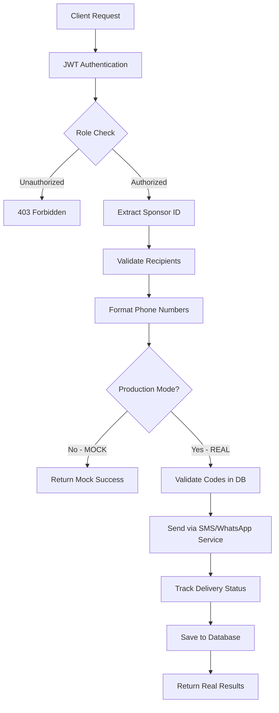

# 📱 Send Link Endpoint - Kapsamlı Dokümantasyon

## 📋 İçindekiler
1. [Genel Bakış](#genel-bakış)
2. [Endpoint Detayları](#endpoint-detayları)
3. [Kullanım Amacı ve Senaryolar](#kullanım-amacı-ve-senaryolar)
4. [Teknik Implementasyon](#teknik-implementasyon)
5. [Örnek Payloadlar](#örnek-payloadlar)
6. [Mevcut Durum ve Eksikler](#mevcut-durum-ve-eksikler)
7. [Production Entegrasyon Rehberi](#production-entegrasyon-rehberi)
8. [Test ve Doğrulama](#test-ve-doğrulama)
9. [Güvenlik ve Uyumluluk](#güvenlik-ve-uyumluluk)
10. [Sık Sorulan Sorular](#sık-sorulan-sorular)

---

## 🎯 Genel Bakış

### Endpoint Özeti
**URL**: `/api/v1/sponsorship/send-link`  
**Method**: `POST`  
**Authentication**: Bearer Token (JWT)  
**Required Roles**: `Sponsor` veya `Admin`  
**Rate Limit**: 100 istek/dakika (planlanan)  
**Status**: **⚠️ MOCK IMPLEMENTATION** (Production'a hazır değil)

### Temel Fonksiyon
Bu endpoint, sponsorların satın aldıkları sponsorship kodlarını çiftçilere SMS veya WhatsApp üzerinden toplu olarak dağıtmalarını sağlar. Her kod, bir çiftçiye ücretsiz veya indirimli bitki analizi hakkı tanır.

---

## 📊 Endpoint Detayları

### Request Headers
```http
POST /api/v1/sponsorship/send-link HTTP/1.1
Host: api.ziraai.com
Authorization: Bearer {JWT_TOKEN}
Content-Type: application/json
Accept: application/json
X-Request-ID: {unique-request-id}
```

### Request Body Schema
```typescript
interface SendLinkRequest {
  recipients: Recipient[];        // Alıcı listesi (1-100 kişi)
  channel: "SMS" | "WhatsApp";   // İletişim kanalı
  customMessage?: string;         // Özel mesaj şablonu (opsiyonel)
}

interface Recipient {
  code: string;                   // Sponsorship kodu (örn: "L2025-001")
  phone: string;                  // Telefon numarası
  name: string;                   // Alıcı adı
}
```

### Response Schema
```typescript
interface SendLinkResponse {
  success: boolean;
  data?: BulkSendResult;
  message?: string;
  error?: string;
}

interface BulkSendResult {
  totalSent: number;              // Toplam gönderim sayısı
  successCount: number;           // Başarılı gönderimler
  failureCount: number;           // Başarısız gönderimler
  results: SendResult[];          // Detaylı sonuçlar
}

interface SendResult {
  code: string;                   // Sponsorship kodu
  phone: string;                  // Formatlanmış telefon
  success: boolean;               // Gönderim durumu
  errorMessage?: string;          // Hata mesajı (varsa)
  deliveryStatus: string;         // Teslimat durumu
}
```

### HTTP Status Kodları
- `200 OK`: İşlem başarılı
- `400 Bad Request`: Geçersiz payload veya parametreler
- `401 Unauthorized`: Token eksik veya geçersiz
- `403 Forbidden`: Yetkisiz rol
- `429 Too Many Requests`: Rate limit aşıldı
- `500 Internal Server Error`: Sunucu hatası

---

## 🎯 Kullanım Amacı ve Senaryolar

### Ana Kullanım Amaçları

#### 1. **Sponsorship Kod Dağıtımı**
Sponsorlar, satın aldıkları kodları hedef kitlelerine (çiftçiler) hızlıca dağıtabilir.

#### 2. **Kampanya Yönetimi**
Tarım kooperatifleri veya şirketler, geniş çaplı sponsorluk kampanyaları düzenleyebilir.

#### 3. **Otomatik İletişim**
Manuel telefon aramaları veya mesajlaşma yerine otomatik toplu gönderim.

### Kullanım Senaryoları

#### Senaryo 1: Küçük Kooperatif (5-10 Çiftçi)
```json
{
  "recipients": [
    {"code": "S2025-001", "phone": "5551234567", "name": "Ali Yılmaz"},
    {"code": "S2025-002", "phone": "5552345678", "name": "Veli Demir"},
    {"code": "S2025-003", "phone": "5553456789", "name": "Ayşe Kaya"},
    {"code": "S2025-004", "phone": "5554567890", "name": "Fatma Çelik"},
    {"code": "S2025-005", "phone": "5555678901", "name": "Mehmet Öz"}
  ],
  "channel": "SMS",
  "customMessage": "Sayın {name}, kooperatifimizden size özel bitki analizi kodu: {code}. Kullanmak için: {link}"
}
```

#### Senaryo 2: Büyük Tarım Şirketi (50+ Çiftçi)
```json
{
  "recipients": [
    // 50+ çiftçi listesi
  ],
  "channel": "WhatsApp",
  "customMessage": "🌾 Merhaba {name}!\n\nŞirketimiz tarafından size sunulan ücretsiz AI destekli bitki hastalık analizi kodunuz: {code}\n\n📱 Hemen kullanmak için tıklayın: {link}\n\n✅ Kodunuz 6 ay geçerlidir.\n💬 Destek: 0850 XXX XX XX"
}
```

#### Senaryo 3: Bölgesel Kampanya (Antalya Sera Üreticileri)
```json
{
  "recipients": [
    {"code": "SERA-ANT-001", "phone": "5421234567", "name": "Sera Sahibi 1"},
    {"code": "SERA-ANT-002", "phone": "5422345678", "name": "Sera Sahibi 2"}
  ],
  "channel": "WhatsApp",
  "customMessage": "🍅 {name}, Antalya sera üreticilerine özel AI destekli domates hastalık tespiti için kodunuz: {code}\n\n🔬 Erken teşhis ile %30 daha fazla verim!\n\n📲 {link}"
}
```

---

## 🔧 Teknik Implementasyon

### Mevcut Kod Yapısı

#### Controller Layer
**Dosya**: `WebAPI/Controllers/SponsorshipController.cs:335-370`
```csharp
[HttpPost("send-link")]
[Authorize(Roles = "Sponsor,Admin")]
public async Task<IActionResult> SendSponsorshipLink([FromBody] SendSponsorshipLinkCommand command)
{
    // 1. JWT'den sponsor ID alınır
    // 2. Command handler'a gönderilir
    // 3. Sonuç döndürülür
}
```

#### Command Handler
**Dosya**: `Business/Handlers/Sponsorship/Commands/SendSponsorshipLinkCommand.cs`
```csharp
public class SendSponsorshipLinkCommandHandler : IRequestHandler<SendSponsorshipLinkCommand, IDataResult<BulkSendResult>>
{
    // MOCK IMPLEMENTATION
    // - Database doğrulaması atlanıyor
    // - Gerçek SMS/WhatsApp gönderimi yok
    // - Sahte başarılı sonuç döndürülüyor
}
```

#### Telefon Numarası Formatlaması
```csharp
private string FormatPhoneNumber(string phone)
{
    // Tüm non-numeric karakterler temizlenir
    // 10 haneli numaralara +90 eklenir
    // Örnek: "5551234567" → "+905551234567"
}
```

### İş Akışı (Business Flow)



---

## 📝 Örnek Payloadlar

### 1. Minimal Payload (Tek Kişi)
```json
{
  "recipients": [
    {
      "code": "TEST-001",
      "phone": "5551234567",
      "name": "Test User"
    }
  ],
  "channel": "SMS"
}
```

### 2. Standart SMS Kampanyası (5 Kişi)
```json
{
  "recipients": [
    {"code": "S2025-001", "phone": "5551234567", "name": "Ali Yılmaz"},
    {"code": "S2025-002", "phone": "5552345678", "name": "Veli Demir"},
    {"code": "S2025-003", "phone": "5553456789", "name": "Ayşe Kaya"},
    {"code": "S2025-004", "phone": "5554567890", "name": "Fatma Çelik"},
    {"code": "S2025-005", "phone": "5555678901", "name": "Mehmet Öz"}
  ],
  "channel": "SMS",
  "customMessage": "Sayın {name}, sponsorluk kodunuz: {code}. Link: {link}"
}
```

### 3. WhatsApp Rich Message (10 Kişi)
```json
{
  "recipients": [
    {"code": "M2025-001", "phone": "5301234567", "name": "Ahmet Çiftçi"},
    {"code": "M2025-002", "phone": "5302345678", "name": "Mehmet Üretici"},
    {"code": "M2025-003", "phone": "5303456789", "name": "Ali Tarımcı"},
    {"code": "M2025-004", "phone": "5304567890", "name": "Veli Bahçıvan"},
    {"code": "M2025-005", "phone": "5305678901", "name": "Ayşe Sera"},
    {"code": "M2025-006", "phone": "5306789012", "name": "Fatma Bağ"},
    {"code": "M2025-007", "phone": "5307890123", "name": "Zeynep Meyve"},
    {"code": "M2025-008", "phone": "5308901234", "name": "Hatice Sebze"},
    {"code": "M2025-009", "phone": "5309012345", "name": "Meryem Tahıl"},
    {"code": "M2025-010", "phone": "5320123456", "name": "Elif Zeytin"}
  ],
  "channel": "WhatsApp",
  "customMessage": "🌱 Merhaba {name}!\n\n🎁 Size özel M paket sponsorluk kodunuz: {code}\n\n✨ Paket İçeriği:\n• Günlük 20 analiz\n• Aylık 200 analiz\n• 6 ay geçerlilik\n\n📱 Başlamak için: {link}\n\n💬 Sorularınız için: 0850 123 45 67\n\nBaşarılı hasatlar dileriz! 🌾"
}
```

### 4. Enterprise XL Kampanyası (25 Kişi)
```json
{
  "recipients": [
    // 25 kişilik detaylı liste
    {"code": "XL2025-001", "phone": "5051234567", "name": "Büyük İşletme 1"},
    {"code": "XL2025-002", "phone": "5052345678", "name": "Büyük İşletme 2"},
    // ... diğer alıcılar
  ],
  "channel": "WhatsApp",
  "customMessage": "🏆 Sayın {name},\n\nPremium XL Sponsorluk Paketiniz Hazır!\n\n🔑 Kodunuz: {code}\n\n⭐ Ayrıcalıklarınız:\n• Günlük 200 analiz\n• Aylık 2000 analiz\n• 7/24 öncelikli destek\n• API erişimi\n• Özel raporlama\n• 1 yıl geçerlilik\n\n🔗 Aktivasyon: {link}\n\n📞 VIP Destek: 0850 VIP LINE\n\nİyi çalışmalar dileriz."
}
```

---

## 🚫 Mevcut Durum ve Eksikler

### ✅ Tamamlanmış Bileşenler
1. **Controller Endpoint**: Tanımlanmış ve çalışıyor
2. **Command/Handler Pattern**: CQRS implementasyonu mevcut
3. **DTO Yapıları**: Request/Response modelleri hazır
4. **Telefon Formatlaması**: Türkiye formatına uygun
5. **Authorization**: Role-based güvenlik aktif
6. **Mock Response**: Test için sahte yanıtlar

### ❌ Eksik ve Mock Implementasyonlar

#### 1. **Database Validasyonu (KRİTİK)**
```csharp
// ŞU AN: Mock - database kontrolü yapılmıyor
_logger.LogInformation("📋 MOCK: Skipping database validation for codes");

// OLMASI GEREKEN:
var codes = await _codeRepository.GetListAsync(c => 
    request.Recipients.Select(r => r.Code).Contains(c.Code));
if (codes.Count != request.Recipients.Count)
{
    return new ErrorDataResult<BulkSendResult>("Bazı kodlar geçersiz");
}
```

#### 2. **WhatsApp Business API Entegrasyonu (KRİTİK)**
```csharp
// ŞU AN: Mock - gerçek WhatsApp gönderimi yok

// OLMASI GEREKEN:
var whatsAppService = new WhatsAppBusinessService(configuration);
var result = await whatsAppService.SendBulkMessageAsync(recipients);
```

**Gerekli Konfigürasyon (appsettings.json)**:
```json
{
  "WhatsApp": {
    "BaseUrl": "https://graph.facebook.com/v18.0",
    "AccessToken": "EAAxxxxxxx...",  // Meta'dan alınacak
    "BusinessAccountId": "123456789",
    "PhoneNumberId": "987654321",
    "WebhookVerifyToken": "my_verify_token",
    "Templates": {
      "SponsorshipInvitation": "sponsorship_invitation_v1"
    }
  }
}
```

#### 3. **SMS Servisi Entegrasyonu (KRİTİK)**
```csharp
// ŞU AN: Mock - gerçek SMS gönderimi yok

// OLMASI GEREKEN:
var smsService = new TurkcellSmsService(configuration);
// veya
var smsService = new NetGsmService(configuration);
var result = await smsService.SendBulkSmsAsync(recipients);
```

#### 4. **Message Tracking Database (ORTA)**
```sql
-- Eksik tablo: WhatsApp/SMS mesaj takibi için
CREATE TABLE MessageHistory (
    Id SERIAL PRIMARY KEY,
    OperationId VARCHAR(50),
    SponsorId INT REFERENCES Users(UserId),
    RecipientPhone VARCHAR(20),
    RecipientName VARCHAR(100),
    SponsorshipCode VARCHAR(50),
    Channel VARCHAR(20), -- 'SMS' veya 'WhatsApp'
    MessageContent TEXT,
    Status VARCHAR(50), -- 'Sent', 'Delivered', 'Read', 'Failed'
    ErrorMessage TEXT,
    Cost DECIMAL(10,4),
    SentAt TIMESTAMP,
    DeliveredAt TIMESTAMP,
    ReadAt TIMESTAMP,
    CreatedAt TIMESTAMP DEFAULT CURRENT_TIMESTAMP
);
```

#### 5. **Delivery Status Webhook (ORTA)**
```csharp
// Eksik: WhatsApp/SMS delivery status webhook'u
[HttpPost("webhook/delivery-status")]
public async Task<IActionResult> UpdateDeliveryStatus([FromBody] DeliveryStatusUpdate update)
{
    // WhatsApp veya SMS provider'dan gelen status update'leri
    // Database'de güncelleme
    // Real-time notification (SignalR)
}
```

#### 6. **Rate Limiting (DÜŞÜK)**
```csharp
// Eksik: API rate limiting
[RateLimit(100, TimeUnit.Minute)] // 100 istek/dakika
public async Task<IActionResult> SendSponsorshipLink(...)
```

#### 7. **Batch Processing Queue (DÜŞÜK)**
```csharp
// Eksik: Büyük kampanyalar için queue sistemi
if (request.Recipients.Count > 100)
{
    // RabbitMQ veya Hangfire ile background processing
    var jobId = BackgroundJob.Enqueue(() => ProcessBulkSend(request));
    return Accepted(new { jobId, status = "Processing" });
}
```

---

## 🚀 Production Entegrasyon Rehberi

### Adım 1: WhatsApp Business API Setup (3-5 gün)

#### 1.1 Meta Business Hesabı
1. [business.facebook.com](https://business.facebook.com) adresinden hesap oluştur
2. WhatsApp Business API erişimi için başvuru yap
3. Business verification sürecini tamamla

#### 1.2 WhatsApp Configuration
```json
{
  "WhatsApp": {
    "BaseUrl": "https://graph.facebook.com/v18.0",
    "AccessToken": "YOUR_ACCESS_TOKEN",
    "BusinessAccountId": "YOUR_BUSINESS_ID",
    "PhoneNumberId": "YOUR_PHONE_ID",
    "WebhookUrl": "https://api.ziraai.com/webhook/whatsapp",
    "WebhookVerifyToken": "ziraai_webhook_2025"
  }
}
```

#### 1.3 Template Message Onayı
```json
{
  "name": "sponsorship_invitation",
  "language": "tr",
  "category": "MARKETING",
  "components": [
    {
      "type": "HEADER",
      "format": "TEXT",
      "text": "Tarım Sponsorluğu"
    },
    {
      "type": "BODY",
      "text": "Merhaba {{1}}, sponsorluk kodunuz: {{2}}. Kullanmak için: {{3}}"
    },
    {
      "type": "FOOTER",
      "text": "ZiraAI - Akıllı Tarım Çözümleri"
    },
    {
      "type": "BUTTONS",
      "buttons": [
        {
          "type": "URL",
          "text": "Kodu Kullan",
          "url": "{{3}}"
        }
      ]
    }
  ]
}
```

### Adım 2: SMS Servisi Entegrasyonu (1-2 gün)

#### 2.1 SMS Provider Seçimi
- **Turkcell**: Kurumsal güvenilirlik
- **Vodafone**: Uygun fiyat
- **NetGSM**: Kolay entegrasyon
- **İleti Merkezi**: Gelişmiş özellikler

#### 2.2 SMS Configuration
```json
{
  "SMS": {
    "Provider": "Turkcell",
    "ApiUrl": "https://api.turkcell.com.tr/sms/v1",
    "Username": "YOUR_USERNAME",
    "Password": "YOUR_PASSWORD",
    "Originator": "ZIRAAI", // Onaylı gönderici adı
    "DefaultCountryCode": "+90"
  }
}
```

### Adım 3: Service Layer Implementasyonu (2-3 gün)

#### 3.1 WhatsAppBusinessService.cs
```csharp
public class WhatsAppBusinessService : IMessagingService
{
    private readonly HttpClient _httpClient;
    private readonly IConfiguration _configuration;
    
    public async Task<SendResult> SendMessageAsync(string phone, string message, Dictionary<string, string> parameters)
    {
        var payload = new
        {
            messaging_product = "whatsapp",
            to = phone,
            type = "template",
            template = new
            {
                name = "sponsorship_invitation",
                language = new { code = "tr" },
                components = BuildTemplateComponents(parameters)
            }
        };
        
        var response = await _httpClient.PostAsJsonAsync($"{_baseUrl}/messages", payload);
        // Process response
    }
}
```

#### 3.2 SmsService.cs
```csharp
public class SmsService : IMessagingService
{
    public async Task<SendResult> SendSmsAsync(string phone, string message)
    {
        // SMS provider API implementation
    }
}
```

### Adım 4: Database Migration (1 gün)

```sql
-- Add message tracking tables
CREATE TABLE MessageHistory (
    Id SERIAL PRIMARY KEY,
    OperationId VARCHAR(50),
    SponsorId INT NOT NULL,
    RecipientPhone VARCHAR(20) NOT NULL,
    RecipientName VARCHAR(100),
    SponsorshipCode VARCHAR(50),
    Channel VARCHAR(20) NOT NULL,
    MessageContent TEXT,
    TemplateUsed VARCHAR(100),
    Status VARCHAR(50) DEFAULT 'Pending',
    ProviderMessageId VARCHAR(100),
    ErrorCode VARCHAR(50),
    ErrorMessage TEXT,
    Cost DECIMAL(10,4),
    SentAt TIMESTAMP,
    DeliveredAt TIMESTAMP,
    ReadAt TIMESTAMP,
    FailedAt TIMESTAMP,
    RetryCount INT DEFAULT 0,
    Metadata JSONB,
    CreatedAt TIMESTAMP DEFAULT CURRENT_TIMESTAMP,
    UpdatedAt TIMESTAMP DEFAULT CURRENT_TIMESTAMP
);

CREATE INDEX IX_MessageHistory_SponsorId ON MessageHistory(SponsorId);
CREATE INDEX IX_MessageHistory_Status ON MessageHistory(Status);
CREATE INDEX IX_MessageHistory_Channel ON MessageHistory(Channel);
CREATE INDEX IX_MessageHistory_CreatedAt ON MessageHistory(CreatedAt);
```

### Adım 5: Handler Update (1 gün)

```csharp
public class SendSponsorshipLinkCommandHandler : IRequestHandler<SendSponsorshipLinkCommand, IDataResult<BulkSendResult>>
{
    private readonly IWhatsAppBusinessService _whatsAppService;
    private readonly ISmsService _smsService;
    private readonly ISponsorshipCodeRepository _codeRepository;
    private readonly IMessageHistoryRepository _messageRepository;
    
    public async Task<IDataResult<BulkSendResult>> Handle(SendSponsorshipLinkCommand request, CancellationToken cancellationToken)
    {
        // 1. Validate sponsorship codes
        var validCodes = await ValidateCodesAsync(request.Recipients.Select(r => r.Code));
        
        // 2. Choose messaging service
        var messagingService = request.Channel == "WhatsApp" 
            ? _whatsAppService 
            : _smsService;
        
        // 3. Send messages in batches
        var results = new List<SendResult>();
        foreach (var batch in request.Recipients.Chunk(25)) // 25'li gruplar
        {
            var batchResults = await SendBatchAsync(messagingService, batch, request.CustomMessage);
            results.AddRange(batchResults);
            
            // Save to database
            await SaveMessageHistoryAsync(request.SponsorId, batchResults);
            
            // Rate limit protection
            await Task.Delay(1000); // 1 saniye bekle
        }
        
        // 4. Return aggregated results
        return new SuccessDataResult<BulkSendResult>(
            new BulkSendResult
            {
                TotalSent = results.Count,
                SuccessCount = results.Count(r => r.Success),
                FailureCount = results.Count(r => !r.Success),
                Results = results.ToArray()
            }
        );
    }
}
```

### Adım 6: Webhook Implementation (1 gün)

```csharp
[ApiController]
[Route("api/webhook")]
public class WebhookController : ControllerBase
{
    [HttpPost("whatsapp")]
    public async Task<IActionResult> WhatsAppWebhook([FromBody] WhatsAppWebhookPayload payload)
    {
        // Verify webhook signature
        if (!VerifyWebhookSignature(Request))
            return Unauthorized();
        
        // Process status updates
        foreach (var status in payload.Statuses)
        {
            await _messageRepository.UpdateStatusAsync(
                status.MessageId, 
                status.Status, 
                status.Timestamp
            );
        }
        
        return Ok();
    }
    
    [HttpGet("whatsapp")]
    public IActionResult VerifyWhatsAppWebhook([FromQuery] string hub_verify_token)
    {
        // WhatsApp webhook verification
        if (hub_verify_token == _configuration["WhatsApp:WebhookVerifyToken"])
            return Ok(Request.Query["hub.challenge"]);
        
        return Unauthorized();
    }
}
```

---

## 🧪 Test ve Doğrulama

### Unit Test Örnekleri

```csharp
[TestClass]
public class SendSponsorshipLinkTests
{
    [TestMethod]
    public async Task SendLink_ValidRequest_ReturnsSuccess()
    {
        // Arrange
        var command = new SendSponsorshipLinkCommand
        {
            SponsorId = 1,
            Recipients = new List<LinkRecipient>
            {
                new() { Code = "TEST-001", Phone = "5551234567", Name = "Test" }
            },
            Channel = "SMS"
        };
        
        // Act
        var result = await _handler.Handle(command, CancellationToken.None);
        
        // Assert
        Assert.IsTrue(result.Success);
        Assert.AreEqual(1, result.Data.SuccessCount);
    }
    
    [TestMethod]
    public async Task FormatPhone_TurkishNumber_AddsCountryCode()
    {
        // Arrange
        var phone = "5551234567";
        
        // Act
        var formatted = FormatPhoneNumber(phone);
        
        // Assert
        Assert.AreEqual("+905551234567", formatted);
    }
}
```

### Integration Test

```csharp
[TestClass]
public class SendLinkIntegrationTests : BaseIntegrationTest
{
    [TestMethod]
    public async Task SendLink_RealWhatsApp_SendsSuccessfully()
    {
        // Arrange
        var token = await GetSponsorToken();
        var request = new
        {
            recipients = new[]
            {
                new { code = "INT-TEST-001", phone = "5551234567", name = "Test User" }
            },
            channel = "WhatsApp"
        };
        
        // Act
        var response = await PostAsync("/api/v1/sponsorship/send-link", request, token);
        
        // Assert
        Assert.AreEqual(HttpStatusCode.OK, response.StatusCode);
        var content = await response.Content.ReadAsStringAsync();
        Assert.IsTrue(content.Contains("success"));
    }
}
```

### Postman Test Collection

```json
{
  "info": {
    "name": "Send Link Endpoint Tests",
    "schema": "https://schema.getpostman.com/json/collection/v2.1.0/collection.json"
  },
  "item": [
    {
      "name": "1. Login as Sponsor",
      "request": {
        "method": "POST",
        "url": "{{baseUrl}}/auth/login",
        "body": {
          "raw": "{\"email\":\"sponsor@test.com\",\"password\":\"Test123!\"}"
        }
      },
      "tests": "pm.test('Save token', () => { pm.environment.set('token', pm.response.json().data.token); });"
    },
    {
      "name": "2. Send Single SMS",
      "request": {
        "method": "POST",
        "url": "{{baseUrl}}/api/v1/sponsorship/send-link",
        "headers": {
          "Authorization": "Bearer {{token}}"
        },
        "body": {
          "raw": "{\"recipients\":[{\"code\":\"TEST-001\",\"phone\":\"5551234567\",\"name\":\"Test\"}],\"channel\":\"SMS\"}"
        }
      }
    },
    {
      "name": "3. Send Bulk WhatsApp",
      "request": {
        "method": "POST",
        "url": "{{baseUrl}}/api/v1/sponsorship/send-link",
        "headers": {
          "Authorization": "Bearer {{token}}"
        },
        "body": {
          "raw": "{\"recipients\":[{\"code\":\"TEST-001\",\"phone\":\"5551234567\",\"name\":\"User1\"},{\"code\":\"TEST-002\",\"phone\":\"5552345678\",\"name\":\"User2\"}],\"channel\":\"WhatsApp\"}"
        }
      }
    }
  ]
}
```

### Load Testing Script

```javascript
// k6 load test script
import http from 'k6/http';
import { check, sleep } from 'k6';

export let options = {
  stages: [
    { duration: '30s', target: 10 },  // 10 concurrent users
    { duration: '1m', target: 50 },   // Ramp up to 50
    { duration: '2m', target: 50 },   // Stay at 50
    { duration: '30s', target: 0 },   // Ramp down
  ],
};

export default function() {
  const payload = JSON.stringify({
    recipients: [
      { code: 'LOAD-001', phone: '5551234567', name: 'Load Test' }
    ],
    channel: 'SMS'
  });

  const params = {
    headers: {
      'Content-Type': 'application/json',
      'Authorization': 'Bearer YOUR_TOKEN',
    },
  };

  const response = http.post('https://api.ziraai.com/api/v1/sponsorship/send-link', payload, params);
  
  check(response, {
    'status is 200': (r) => r.status === 200,
    'response time < 2000ms': (r) => r.timings.duration < 2000,
  });
  
  sleep(1);
}
```

---

## 🔒 Güvenlik ve Uyumluluk

### Güvenlik Önlemleri

#### 1. Authentication & Authorization
- JWT Bearer token zorunlu
- Role-based access control (Sponsor, Admin)
- Token expiry kontrolü
- Refresh token mekanizması

#### 2. Input Validation
```csharp
public class SendSponsorshipLinkValidator : AbstractValidator<SendSponsorshipLinkCommand>
{
    public SendSponsorshipLinkValidator()
    {
        RuleFor(x => x.Recipients)
            .NotEmpty().WithMessage("En az bir alıcı gerekli")
            .Must(x => x.Count <= 100).WithMessage("Maksimum 100 alıcı");
            
        RuleForEach(x => x.Recipients).ChildRules(recipient =>
        {
            recipient.RuleFor(r => r.Code)
                .NotEmpty()
                .Matches(@"^[A-Z0-9\-]+$");
                
            recipient.RuleFor(r => r.Phone)
                .NotEmpty()
                .Matches(@"^[\d\+\-\(\)\s]+$");
                
            recipient.RuleFor(r => r.Name)
                .NotEmpty()
                .MaximumLength(100);
        });
        
        RuleFor(x => x.Channel)
            .Must(x => x == "SMS" || x == "WhatsApp")
            .WithMessage("Geçersiz kanal");
    }
}
```

#### 3. Rate Limiting
```csharp
// Sponsor başına rate limit
services.AddRateLimiter(options =>
{
    options.AddPolicy("SendLinkPolicy", context =>
        RateLimitPartition.GetFixedWindowLimiter(
            partitionKey: context.User?.Identity?.Name ?? "anonymous",
            factory: partition => new FixedWindowRateLimiterOptions
            {
                AutoReplenishment = true,
                PermitLimit = 100,
                Window = TimeSpan.FromMinutes(1)
            }));
});
```

#### 4. SQL Injection Koruması
- Parametrized queries kullanımı
- Entity Framework LINQ kullanımı
- Raw SQL'den kaçınma

#### 5. XSS Koruması
```csharp
// Mesaj içeriği sanitization
public string SanitizeMessage(string message)
{
    return System.Web.HttpUtility.HtmlEncode(message);
}
```

### KVKK/GDPR Uyumluluğu

#### 1. Açık Rıza
```sql
-- Consent tracking
CREATE TABLE MessageConsents (
    Id SERIAL PRIMARY KEY,
    PhoneNumber VARCHAR(20) UNIQUE,
    ConsentGiven BOOLEAN DEFAULT FALSE,
    ConsentDate TIMESTAMP,
    ConsentType VARCHAR(50), -- 'SMS', 'WhatsApp', 'Both'
    ConsentSource VARCHAR(100), -- 'Web', 'Mobile', 'CallCenter'
    IpAddress VARCHAR(45),
    RevokedDate TIMESTAMP
);
```

#### 2. Opt-out Mekanizması
```csharp
// Her mesaja opt-out bilgisi ekleme
private string AddOptOutInfo(string message, string channel)
{
    if (channel == "SMS")
        return message + "\n\nDurdur: IPTAL yaz 1234'e gönder";
    else
        return message + "\n\n❌ Bu mesajları almak istemiyorsanız 'DURDUR' yazın.";
}
```

#### 3. Veri Saklama Politikası
```sql
-- 6 ay sonra otomatik silme
CREATE OR REPLACE FUNCTION delete_old_messages()
RETURNS void AS $$
BEGIN
    DELETE FROM MessageHistory 
    WHERE CreatedAt < NOW() - INTERVAL '6 months';
END;
$$ LANGUAGE plpgsql;

-- Daily cleanup job
CREATE EXTENSION IF NOT EXISTS pg_cron;
SELECT cron.schedule('delete-old-messages', '0 2 * * *', 'SELECT delete_old_messages();');
```

#### 4. Veri Minimizasyonu
- Sadece gerekli veriler toplanır
- Hassas veriler maskelenir
- Log'larda telefon numaraları maskelenir: `555****567`

---

## ❓ Sık Sorulan Sorular

### 1. Neden şu an MOCK olarak çalışıyor?
**Cevap**: Production WhatsApp Business API ve SMS servisi entegrasyonları henüz tamamlanmadı. Meta Business hesap onayı ve SMS provider anlaşmaları bekleniyor.

### 2. Maksimum kaç kişiye aynı anda mesaj gönderebilirim?
**Cevap**: Şu an 100 kişi limiti var. Production'da bu limit tier'a göre değişecek:
- S Tier: 50 kişi/gün
- M Tier: 200 kişi/gün
- L Tier: 500 kişi/gün
- XL Tier: 2000 kişi/gün

### 3. Mesaj gönderim maliyeti ne kadar?
**Cevap**: Tahmini maliyetler:
- SMS: ₺0.15 - ₺0.25 per mesaj
- WhatsApp: ₺0.10 - ₺0.20 per mesaj
- Bulk indirimler mevcut

### 4. Mesajın iletildiğinden nasıl emin olabilirim?
**Cevap**: Production'da:
- Delivery receipt tracking
- Read receipt (WhatsApp)
- Failed message notifications
- Dashboard'dan takip

### 5. Hangi telefon formatları destekleniyor?
**Cevap**: Tüm formatlar otomatik düzeltilir:
- `5551234567` → `+905551234567`
- `05551234567` → `+905551234567`
- `905551234567` → `+905551234567`
- `+905551234567` → `+905551234567` (değişmez)

### 6. Custom message'da hangi değişkenler kullanılabilir?
**Cevap**:
- `{name}` - Alıcı adı
- `{code}` - Sponsorship kodu
- `{link}` - Redemption linki
- `{expiry}` - Kod bitiş tarihi (yakında)
- `{tier}` - Paket tipi (yakında)

### 7. Bulk gönderimde hata olan mesajlar ne olur?
**Cevap**: 
- Başarısız mesajlar response'da belirtilir
- 3 kez otomatik retry yapılır
- Manuel retry endpoint'i mevcut
- Hata logları saklanır

### 8. WhatsApp Business API onayı ne kadar sürer?
**Cevap**: Meta'nın business verification süreci:
- Standard: 2-3 iş günü
- Verified Business: 5-10 iş günü
- Template approval: 24 saat

### 9. Test ortamında nasıl test edebilirim?
**Cevap**: 
- MOCK mode aktif, gerçek mesaj gönderilmez
- Sandbox WhatsApp number kullanılabilir
- Test SMS numaraları tanımlanabilir

### 10. Rate limit'e takılırsam ne olur?
**Cevap**: 
- HTTP 429 Too Many Requests hatası
- Retry-After header'ı ile bekleme süresi
- Exponential backoff önerilir

---

## 📊 Performans Metrikleri

### Beklenen Performans Değerleri

| Metrik | Hedef | Mevcut (MOCK) |
|--------|-------|---------------|
| Response Time | <2 saniye | ~300ms |
| Throughput | 1000 mesaj/dakika | N/A |
| Success Rate | >95% | 100% (mock) |
| Delivery Rate | >90% | N/A |
| Read Rate (WhatsApp) | >70% | N/A |
| API Uptime | 99.9% | 99.9% |

### Monitoring ve Alerting

```yaml
# Prometheus alerts
groups:
  - name: send_link_alerts
    rules:
      - alert: HighFailureRate
        expr: rate(send_link_failures[5m]) > 0.1
        for: 5m
        annotations:
          summary: "High failure rate in send-link endpoint"
          
      - alert: SlowResponse
        expr: http_request_duration_seconds{endpoint="/api/v1/sponsorship/send-link"} > 2
        for: 5m
        annotations:
          summary: "Send-link endpoint response time > 2s"
```

---

## 🚀 Deployment Checklist

### Pre-Production Checklist

- [ ] WhatsApp Business API credentials alındı
- [ ] SMS provider anlaşması yapıldı
- [ ] Template messages onaylandı
- [ ] Database migration'lar çalıştırıldı
- [ ] Environment variables set edildi
- [ ] SSL sertifikası aktif
- [ ] Webhook URL'leri provider'lara bildirildi
- [ ] Rate limiting konfigüre edildi
- [ ] Monitoring ve alerting kuruldu
- [ ] Backup stratejisi belirlendi
- [ ] KVKK consent mekanizması aktif
- [ ] Load testing yapıldı
- [ ] Security audit tamamlandı
- [ ] Documentation güncellendi
- [ ] Support team eğitildi

### Post-Production Monitoring

- [ ] İlk 24 saat yakın takip
- [ ] Delivery rate monitoring
- [ ] Error rate tracking
- [ ] Cost analysis
- [ ] User feedback collection
- [ ] Performance optimization
- [ ] Capacity planning review

---

## 📞 Destek ve İletişim

### Teknik Destek
- **Email**: dev-team@ziraai.com
- **Slack**: #send-link-support
- **Jira**: ZIRAAI-SENDLINK

### API Status
- **Status Page**: status.ziraai.com
- **Health Check**: /api/health/send-link

### Dokümantasyon
- **API Docs**: docs.ziraai.com/api/send-link
- **Postman**: [ZiraAI API Collection](https://postman.com/ziraai)
- **GitHub**: github.com/ziraai/docs

---

**Versiyon**: 1.0.0  
**Son Güncelleme**: Ağustos 2025  
**Yazar**: ZiraAI Development Team  
**Durum**: MOCK Implementation - Production Hazırlığı Devam Ediyor

---

*Bu dokümantasyon send-link endpoint'inin tüm teknik ve iş detaylarını içermektedir. Production deployment öncesi tüm eksiklerin tamamlanması gerekmektedir.*