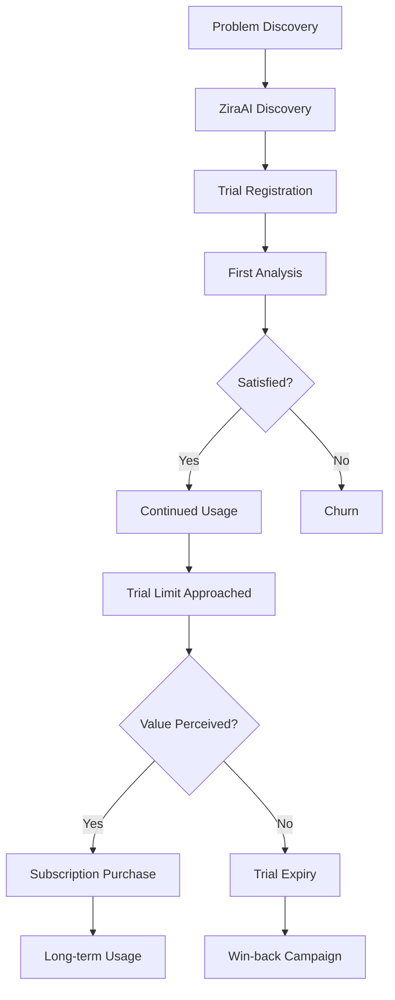
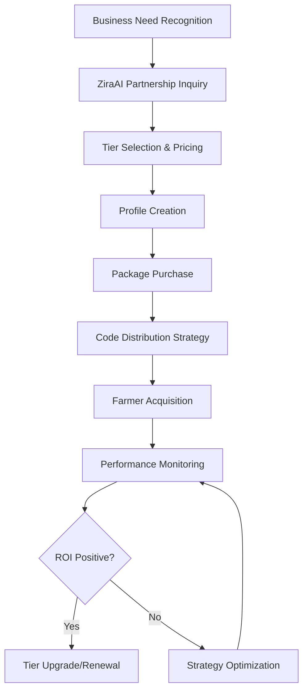

# 👥 ZiraAI Kullanıcı Personaları - Kapsamlı Analiz Dokümanı

## 📋 İçindekiler
1. [Executive Summary](#executive-summary)
2. [Çiftçi (Farmer) Personaları](#çiftçi-farmer-personaları)
3. [Sponsor Personaları](#sponsor-personaları)
4. [Yönetici (Admin) Personaları](#yönetici-admin-personaları)
5. [Teknoloji Adoption Patterns](#teknoloji-adoption-patterns)
6. [User Journey Mapping](#user-journey-mapping)
7. [Business Scenarios](#business-scenarios)
8. [Platform Kullanım Analytics](#platform-kullanım-analytics)

---

## 🎯 Executive Summary

ZiraAI platformu, Türkiye'nin tarım sektörüne yönelik AI destekli bitki analiz hizmeti sunan kapsamlı bir ekosistemdir. Bu dokümanda, 3 ana kullanıcı grubu ve 12 farklı persona tipi detaylandırılmıştır:

### 📊 Kullanıcı Dağılımı
- **%70 Çiftçi (Farmer)**: Birincil kullanıcı grubu, plant analysis hizmeti tüketicisi
- **%20 Sponsor**: İş ortakları, funding ve pazarlama desteği sağlayıcı
- **%10 Admin**: Sistem yöneticileri, iş geliştirme ve customer success ekipleri

### 🏗️ Sistem Architecture Özeti
- **Subscription Tiers**: Trial, S, M, L, XL (günlük/aylık limit sistemi)
- **Sponsorship System**: Purchase-based model, bulk code distribution
- **Platform Options**: Web API + Mobile Apps (Angular/Flutter)
- **AI Integration**: N8N webhook, URL-based processing (99.9% cost optimization)

---

## 🌱 Çiftçi (Farmer) Personaları

### 1. 👨‍🌾 **Ahmet - Bireysel Çiftçi (S Tier)**

#### **Demografik Bilgiler**
- **Yaş**: 45, Erkek
- **Konum**: Antalya, akdeniz bölgesi
- **Eğitim**: Lise mezunu
- **Deneyim**: 20 yıl tarım, 2 yıl teknoloji kullanımı
- **İşletme**: 15 dekar sera domates, aile işletmesi

#### **Teknoloji Profili**
- **Cihaz**: Android telefon, orta seviye teknik bilgi
- **İnternet**: 4G, günde 2-3 saat kullanım
- **Uygulamalar**: WhatsApp, YouTube, hava durumu

#### **Platform Kullanımı**
- **Subscription**: S Tier (5 günlük / 50 aylık analiz)
- **Kullanım Pattern**: Haftalık 2-3 analiz, problem olduğunda reaktif
- **Tercih Edilen Endpoint**: Synchronous analysis (anında sonuç beklentisi)
- **Mobile First**: %90 mobil uygulama kullanımı

#### **İhtiyaçlar ve Hedefler**
```json
{
  "primary_goals": [
    "Hastalık tespiti ve erken müdahale",
    "Verim artırma",
    "İlaçlama maliyetini düşürme"
  ],
  "pain_points": [
    "Karmaşık teknoloji arayüzleri",
    "Pahalı abonelik maliyetleri",
    "İngilizce terimler"
  ],
  "success_metrics": [
    "Problem çözme süresi < 24 saat",
    "Anlık sonuç alma",
    "Türkçe açıklamalar"
  ]
}
```

#### **Tipik Kullanım Senaryosu**
```
06:00 - Serada sabah kontrolü
06:15 - Problem fark eder (yaprak lekesi)
06:20 - ZiraAI mobil app açar
06:22 - Fotoğraf çeker, sync analysis
06:25 - Sonuçları okur (Türkçe)
06:30 - Önerilen tedaviyi planlar
```

#### **API Kullanım Patterns**
```http
POST /api/plantanalyses/analyze        ✅ Günde 1-2 kez
GET  /api/plantanalyses/{id}           ✅ Sonuç tekrar kontrolü
GET  /api/subscriptions/usage-status   ✅ Kota kontrolü
GET  /api/plantanalyses/{id}/image     ✅ Foto tekrar görüntüleme
```

---

### 2. 🚜 **Mehmet Bey - Ticari Çiftçi (M Tier)**

#### **Demografik Bilgiler**
- **Yaş**: 38, Erkek
- **Konum**: Konya, iç anadolu
- **Eğitim**: Ziraat mühendisi
- **Deneyim**: 15 yıl tarım, 5 yıl teknoloji
- **İşletme**: 200 dekar buğday, 50 dekar mısır

#### **Teknoloji Profili**
- **Cihaz**: iPhone + Laptop, ileri seviye teknik bilgi
- **İnternet**: Fiber + 4G, günde 4-5 saat
- **Yazılım**: Excel, tarım apps, ERP sistemleri

#### **Platform Kullanımı**
- **Subscription**: M Tier (20 günlük / 200 aylık analiz)
- **Kullanım Pattern**: Günlük monitoring, proaktif yaklaşım
- **Tercih**: Async analysis (toplu işlem), detailed reports
- **Platform**: %60 web, %40 mobile

#### **İhtiyaçlar ve Hedefler**
```json
{
  "primary_goals": [
    "Preventive agriculture",
    "Veri-driven decision making",
    "ROI optimization",
    "Hasat kalitesi artırma"
  ],
  "advanced_features": [
    "Toplu analiz işlemleri", 
    "Trend analysis",
    "Seasonal planning",
    "Cost-benefit analysis"
  ],
  "integrations": [
    "ERP sistemleri",
    "Meteoroloji verileri",
    "Market fiyat takibi"
  ]
}
```

#### **API Kullanım Patterns**
```http
POST /api/plantanalyses/analyze-async  ✅ Toplu analiz
GET  /api/plantanalyses/list           ✅ Historical data
GET  /api/subscriptions/history        ✅ Usage analytics
POST /api/subscriptions/subscribe      ✅ Tier upgrade
```

---

### 3. 👩‍🎓 **Ayşe - Genç Çiftçi (L Tier)**

#### **Demografik Bilgiler**
- **Yaş**: 28, Kadın
- **Konum**: İzmir, ege bölgesi
- **Eğitim**: Tarım mühendisi, yüksek lisans
- **Deneyim**: 5 yıl tarım, digital native
- **İşletme**: 30 dekar organik sebze üretimi

#### **Teknoloji Profili**
- **Cihaz**: Flagship smartphone + MacBook
- **Sosyal Medya**: Instagram, LinkedIn, YouTube
- **Early Adopter**: Yeni teknolojileri hızlı benimseme

#### **Platform Kullanımı**
- **Subscription**: L Tier (50 günlük / 500 aylık analiz)
- **Advanced Features**: Smart links, messaging, analytics
- **API Integration**: Own dashboard, data export
- **Content Creation**: Analysis sonuçlarını sosyal medyada paylaşım

#### **İhtiyaçlar ve Hedefler**
```json
{
  "primary_goals": [
    "Organik sertifika compliance",
    "Sürdürülebilir tarım",
    "Brand building",
    "Teknoloji leadership"
  ],
  "special_requirements": [
    "Organic farming compatibility",
    "Environmental impact tracking",
    "Social media integration",
    "Educational content"
  ]
}
```

---

### 4. 👴 **Hasan Amca - Geleneksel Çiftçi (Trial → S Tier)**

#### **Demografik Bilgiler**
- **Yaş**: 62, Erkek
- **Konum**: Sivas, iç anadolu
- **Eğitim**: İlkokul
- **Deneyim**: 40 yıl tarım, teknolojiye mesafeli
- **İşletme**: 50 dekar arpa, hayvancılık

#### **Teknoloji Profili**
- **Cihaz**: Basit Android telefon
- **Destek İhtiyacı**: Yoğun onboarding, Türkçe interface
- **Güven**: Yavaş adaption, proof-of-concept bekleyen

#### **Platform Kullanımı**
- **Journey**: Trial (30 gün) → S Tier (ikna olduktan sonra)
- **Usage**: Çocukları/torunları ile birlikte kullanım
- **Priority**: Basit interface, voice support, video tutorials

#### **Özel İhtiyaçlar**
```json
{
  "accessibility": [
    "Büyük fontlar",
    "Basit navigasyon", 
    "Ses rehberi",
    "Video tutorials"
  ],
  "support": [
    "Telefon desteği",
    "Yerinde eğitim",
    "Aile üyesi onboarding"
  ]
}
```

---

### 5. 🤝 **Kooperatif Üyesi - Ali (Sponsored User)**

#### **Demografik Bilgiler**
- **Yaş**: 42, Erkek
- **Konum**: Bursa, marmara bölgesi
- **Üyelik**: Bursa Organik Çiftçiler Kooperatifi
- **İşletme**: 25 dekar organik domates

#### **Sponsorship Model**
- **Sponsor**: Organik gübre şirketi (L Tier sponsorship)
- **Access**: Kooperatif aracılığıyla sponsorship code
- **Benefits**: Free L tier access + sponsor messaging

#### **Platform Kullanımı**
```json
{
  "sponsorship_journey": [
    "Kooperatif üyeliği",
    "Sponsorship code alma",
    "Code redemption",
    "L tier benefits access"
  ],
  "sponsor_interaction": [
    "Ürün önerileri alma",
    "Seasonal campaigns",
    "Group purchasing power"
  ]
}
```

---

## 💼 Sponsor Personaları

### 1. 🌿 **GreenAgri A.Ş. - Tarım Input Şirketi (M Tier)**

#### **Şirket Profili**
- **Sektör**: Organik gübre ve biyolojik mücadele
- **Çalışan**: 50 kişi
- **Hedef Market**: Organik çiftçiler
- **Coğrafya**: Akdeniz + Ege bölgesi

#### **Sponsorship Strategy**
- **Tier**: M Tier (20 günlük / 200 aylık analiz)
- **Target**: 500 çiftçi sponsorluğu
- **Budget**: ₺150,000/yıl
- **ROI Goal**: %15 sales increase

#### **Platform Kullanımı**
```json
{
  "sponsor_features": [
    "Bulk code generation",
    "Basic analytics dashboard",
    "Logo display (start + results screens)"
  ],
  "messaging": false,
  "smart_links": false,
  "data_access": "30% of analysis data"
}
```

#### **Business Goals**
```json
{
  "marketing_objectives": [
    "Brand awareness artırma",
    "Lead generation", 
    "Customer acquisition cost düşürme",
    "Seasonal campaign effectiveness"
  ],
  "success_metrics": [
    "Code redemption rate > %60",
    "Brand recall > %40", 
    "Sales conversion > %8"
  ]
}
```

---

### 2. 🚜 **TarımTech Solutions - Teknoloji Şirketi (L Tier)**

#### **Şirket Profili**
- **Sektör**: Tarım teknolojileri ve ekipmanları
- **Çalışan**: 200 kişi
- **Ürünler**: IoT sensors, drones, smart irrigation
- **Market**: Enterprise ve ticari çiftçiler

#### **Sponsorship Strategy**
- **Tier**: L Tier (50 günlük / 500 aylık analiz)
- **Premium Features**: Messaging + Full profile access
- **Integration**: Kendi IoT verilerini platform analytics ile birleştirme

#### **Platform Kullanımı**
```json
{
  "advanced_features": [
    "Farmer messaging system",
    "Full farmer profile access",
    "60% analysis data access",
    "Logo display (all screens)"
  ],
  "business_model": [
    "Consultation services",
    "Equipment sales follow-up",
    "Farmer relationship building"
  ]
}
```

#### **Farmer Engagement**
```json
{
  "messaging_strategy": [
    "Post-analysis consultations",
    "Seasonal equipment recommendations",
    "Technical support provision",
    "Training program invitations"
  ],
  "data_utilization": [
    "Market trend analysis",
    "Product development insights",
    "Regional farming pattern studies"
  ]
}
```

---

### 3. 🏢 **AgroGlobal Corporation - Büyük Korporasyon (XL Tier)**

#### **Şirket Profili**
- **Sektör**: Entegre tarım hizmetleri
- **Çalışan**: 1000+ kişi
- **Ürünler**: Seeds, fertilizers, pesticides, equipment
- **Market**: Nationwide, export operations

#### **Sponsorship Strategy**
- **Tier**: XL Tier (200 günlük / 2000 aylık analiz)
- **Investment**: ₺500,000+/yıl
- **Target**: 2000+ farmer sponsorship

#### **Premium Features Access**
```json
{
  "xl_exclusive_features": [
    "Smart Links system",
    "Advanced analytics dashboard",
    "100% analysis data access",
    "Complete farmer profile visibility",
    "Messaging system",
    "Logo display (all screens + priority positioning)"
  ]
}
```

#### **Smart Links Utilization**
```json
{
  "smart_linking_strategy": [
    {
      "link_type": "Product",
      "target_crops": ["tomato", "pepper", "cucumber"],
      "keywords": ["fertilizer", "disease", "nutrient"],
      "product_name": "AgroMax Premium NPK",
      "price": 299.99,
      "priority": 90
    },
    {
      "link_type": "Campaign", 
      "seasonal": "Spring 2024",
      "discount": "20% off for analysis users",
      "landing_page": "https://agroglobal.com/spring-campaign"
    }
  ]
}
```

#### **Business Intelligence**
```json
{
  "data_analytics": [
    "Regional crop health monitoring",
    "Disease outbreak prediction",
    "Market demand forecasting",
    "Precision agriculture insights"
  ],
  "roi_metrics": [
    "Customer lifetime value",
    "Market share growth",
    "Product development ROI"
  ]
}
```

---

### 4. 🌾 **Tarım Kooperatifleri Birliği - NGO Sponsor (S Tier)**

#### **Organizasyon Profili**
- **Tip**: Non-profit organization
- **Üye**: 50 kooperatif, 3000+ çiftçi
- **Hedef**: Küçük çiftçi desteği
- **Budget**: Limited, grant-based

#### **Sponsorship Model**
- **Tier**: S Tier (cost-effective)
- **Volume**: High quantity, low individual limit
- **Distribution**: Kooperatif üyeleri arasında

#### **Social Impact Goals**
```json
{
  "objectives": [
    "Küçük çiftçi teknoloji erişimi",
    "Tarım knowledge democratization",
    "Rural development support",
    "Sustainable farming promotion"
  ],
  "distribution_strategy": [
    "Cooperative member priority",
    "Geographic equality",
    "Small farm focus"
  ]
}
```

---

## 👑 Yönetici (Admin) Personaları

### 1. 💻 **Burak - Sistem Yöneticisi**

#### **Rol Profili**
- **Departman**: IT Operations
- **Deneyim**: 8 yıl .NET development, 3 yıl DevOps
- **Sorumluluk**: System monitoring, deployment, troubleshooting

#### **Günlük Aktiviteler**
```json
{
  "monitoring_tasks": [
    "API performance metrics",
    "Database query optimization", 
    "N8N webhook health",
    "RabbitMQ queue monitoring",
    "User subscription status"
  ],
  "troubleshooting": [
    "Authentication issues",
    "Subscription validation errors",
    "Image processing failures",
    "Database connection problems"
  ]
}
```

#### **Platform Kullanımı**
```http
GET  /api/configurations                ✅ System config management
PUT  /api/configurations/{id}           ✅ Runtime config updates  
GET  /api/subscriptions/usage-logs      ✅ Usage analytics
GET  /api/test/rabbitmq-health          ✅ Infrastructure monitoring
GET  /api/logs                          ✅ System logs analysis
```

---

### 2. 📈 **Seda - İş Geliştirme Yöneticisi**

#### **Rol Profili**
- **Departman**: Business Development
- **Deneyim**: 10 yıl B2B sales, tarım sektörü
- **Sorumluluk**: Sponsorship partnerships, revenue optimization

#### **KPI'lar ve Metrikler**
```json
{
  "revenue_metrics": [
    "Monthly recurring revenue (MRR)",
    "Sponsor acquisition rate", 
    "Code redemption effectiveness",
    "Customer lifetime value"
  ],
  "partnership_goals": [
    "New sponsor onboarding",
    "Tier upgrade conversions",
    "Partnership satisfaction scores"
  ]
}
```

#### **Platform Analytics Usage**
```http
GET  /api/sponsorship/statistics        ✅ Sponsor performance
GET  /api/subscriptions/tiers           ✅ Tier analysis
GET  /api/analytics/campaign-performance ✅ ROI tracking
GET  /api/sponsorship/usage-analytics   ✅ Business intelligence
```

---

### 3. 🎯 **Emre - Customer Success Yöneticisi**

#### **Rol Profili**
- **Departman**: Customer Success
- **Deneyim**: 6 yıl customer support, agricultural background
- **Sorumluluk**: User satisfaction, churn prevention

#### **Customer Journey Optimization**
```json
{
  "onboarding_metrics": [
    "Trial-to-paid conversion rate",
    "First analysis completion rate",
    "Mobile app adoption rate"
  ],
  "satisfaction_tracking": [
    "NPS scores by user segment",
    "Feature utilization rates", 
    "Support ticket resolution times"
  ]
}
```

#### **Admin Operations**
```http
GET  /api/users                         ✅ User management
PUT  /api/users/{id}                     ✅ Account management
GET  /api/subscriptions/history          ✅ User journey analysis
POST /api/users/{id}/trial-extension    ✅ Customer success actions
```

---

## 🚀 Teknoloji Adoption Patterns

### 1. **Early Adopters (%15)**
- **Profile**: Genç, eğitimli, teknoloji meraklısı çiftçiler
- **Behavior**: L/XL tier preference, API integrations, feature requests
- **Value**: Beta testing, word-of-mouth marketing, feature evangelists

### 2. **Early Majority (%35)**
- **Profile**: Ticari çiftçiler, moderate technology adoption
- **Behavior**: M tier preference, ROI-focused usage
- **Value**: Revenue stability, case study sources

### 3. **Late Majority (%35)**
- **Profile**: Geleneksel çiftçiler, proven solution seekers
- **Behavior**: S tier preference, basic features usage
- **Value**: Market penetration, volume-based revenue

### 4. **Laggards (%15)**
- **Profile**: Yaşlı, teknoloji konusunda tereddütlü çiftçiler
- **Behavior**: Trial extension, family-assisted usage
- **Challenge**: High support costs, low conversion rates

---

## 🗺️ User Journey Mapping

### **Çiftçi Journey - Trial'den Paid'e Geçiş**



#### **Critical Success Factors**
1. **First Analysis Success**: %85+ success rate needed
2. **Problem-Solution Fit**: Relevant crop/disease detection
3. **Language Localization**: Turkish interface mandatory
4. **Mobile Experience**: Seamless mobile workflow

### **Sponsor Journey - Partner Onboarding**



---

## 🎯 Business Scenarios

### **Scenario 1: Sezon Başı Yoğunluğu**

#### **Context**
Mart-Nisan ayları, fide dikim sezonu başlangıcı

#### **User Behavior Changes**
```json
{
  "api_usage_spike": "+300% analysis requests",
  "common_crops": ["tomato", "pepper", "cucumber", "eggplant"],
  "typical_problems": ["seedling diseases", "transplant shock", "soil issues"],
  "peak_hours": "06:00-08:00, 17:00-19:00",
  "geography": "Antalya, Mersin, Adana (Akdeniz)"
}
```

#### **System Impact**
- N8N webhook load increased
- Database storage growth
- Customer support ticket increase
- Subscription upgrade requests

### **Scenario 2: Hastalık Outbreak - Reactive Usage**

#### **Context** 
Bölgesel hastalık salgını (örn. Late blight)

#### **Pattern**
```json
{
  "usage_pattern": "Sudden spike in specific region",
  "analysis_type": "Disease identification focused",
  "user_behavior": "Multiple photos from same garden",
  "social_amplification": "Word-of-mouth spread",
  "sponsor_opportunity": "Targeted fungicide promotions"
}
```

### **Scenario 3: Sponsor Campaign - Smart Links**

#### **Context**
Gübre şirketi bahar kampanyası

#### **XL Tier Sponsor Action**
```json
{
  "smart_links_strategy": {
    "trigger_keywords": ["nitrogen", "deficiency", "yellowing"],
    "target_crops": ["tomato", "corn", "wheat"],
    "campaign_message": "Bahar özel %20 indirim",
    "landing_page": "https://sponsor.com/spring-campaign",
    "expected_ctr": "15-20%",
    "attribution_tracking": "UTM + promo codes"
  }
}
```

---

## 📊 Platform Kullanım Analytics

### **Geographic Distribution**
```json
{
  "regional_usage": {
    "Akdeniz": "35%",  // Antalya, Mersin, Adana
    "Ege": "25%",      // İzmir, Aydın, Muğla  
    "Marmara": "20%",  // Bursa, Balıkesir
    "İç Anadolu": "15%", // Konya, Ankara
    "Diğer": "5%"
  }
}
```

### **Seasonal Patterns**
```json
{
  "peak_seasons": {
    "Spring": "40% of annual usage",
    "Summer": "35% of annual usage", 
    "Fall": "20% of annual usage",
    "Winter": "5% of annual usage"
  },
  "crop_calendar_correlation": "Strong correlation with planting/growing seasons"
}
```

### **Device & Platform Usage**
```json
{
  "platform_breakdown": {
    "mobile_app": "75%",
    "web_interface": "25%"
  },
  "mobile_platforms": {
    "android": "85%",
    "ios": "15%"
  },
  "feature_usage": {
    "sync_analysis": "80%",
    "async_analysis": "20%",
    "image_retrieval": "95%",
    "usage_status_check": "60%"
  }
}
```

---

## 🎯 Actionable Insights & Recommendations

### **Product Development**
1. **Mobile-First Design**: 75% mobile usage requires mobile-optimized UX
2. **Turkish Localization**: Critical for user adoption and satisfaction
3. **Offline Capability**: Rural internet connectivity challenges
4. **Voice Interface**: Accessibility for older farmers

### **Business Strategy**
1. **Seasonal Marketing**: Campaign timing alignment with agricultural calendar
2. **Regional Partnerships**: Focus on high-usage geographic areas
3. **Tier Optimization**: M-tier represents sweet spot for most commercial farmers
4. **Sponsor Value Prop**: Clear ROI demonstration for tier upgrades

### **Customer Success**
1. **Onboarding Flow**: Critical first-analysis success optimization
2. **Support Strategy**: Multilingual support with agricultural expertise
3. **Community Building**: Peer-to-peer learning and knowledge sharing
4. **Success Metrics**: Track problem-resolution speed and accuracy

Bu comprehensive persona analysis, ZiraAI platformunun user-centric development, marketing strategies ve business optimization için strategic roadmap sağlamaktadır.