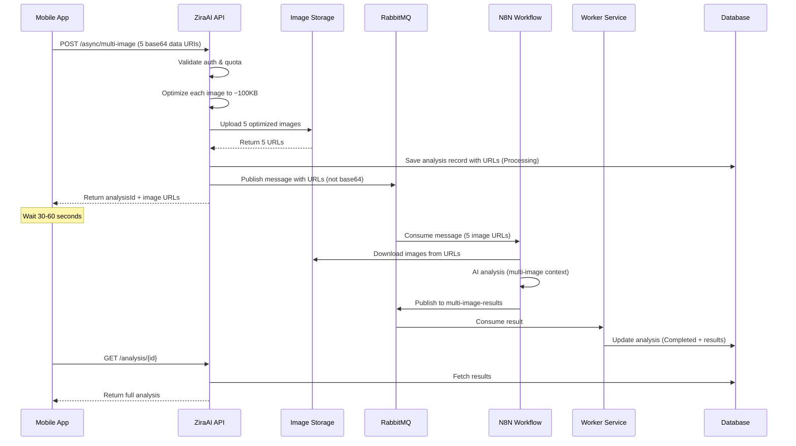

# Multi-Image Plant Analysis API Documentation

## Overview

The Multi-Image Plant Analysis API allows users to submit up to 5 images of a single plant for comprehensive AI-powered health analysis. This provides more accurate diagnostics by analyzing different perspectives and parts of the plant.

**Version:** 1.0
**Base URL (Development):** `https://localhost:5001`
**Base URL (Staging):** `https://ziraai-api-sit.up.railway.app`

---

## Key Features

### 🎯 Multi-Perspective Analysis
- **Up to 5 images** per analysis request
- **Specialized views** supported:
  - Main plant image (required)
  - Leaf top view (optional)
  - Leaf bottom view (optional)
  - Full plant overview (optional)
  - Root system view (optional)

### ⚡ Performance Optimization
- Client sends images as base64 data URI strings
- API automatically optimizes each image to ~100KB
- API uploads to storage and uses URLs in queue (99.6% token reduction)
- Async processing via dedicated RabbitMQ queue
- Average processing time: 30-60 seconds

### 🔒 Security & Validation
- JWT Bearer authentication required
- Active subscription validation
- Quota management (daily/monthly limits)
- Usage logging for billing

---

## Endpoints

### 1. Queue Multi-Image Analysis (Async)

Submit a plant analysis request with up to 5 images for asynchronous processing.

**Endpoint:** `POST /api/v1/plantanalysis/async/multi-image`

**Authentication:** Required (Bearer Token)

**Content-Type:** `application/json`

#### Request Body

```json
{
  // ========== IMAGES (1-5 images) ==========
  "image": "data:image/jpeg;base64,/9j/4AAQ...",           // REQUIRED: Main plant image
  "leafTopImage": "data:image/jpeg;base64,/9j/4AAQ...",    // OPTIONAL: Leaf top view
  "leafBottomImage": "data:image/jpeg;base64,/9j/4AAQ...", // OPTIONAL: Leaf bottom view
  "plantOverviewImage": "data:image/jpeg;base64,/9j/...",  // OPTIONAL: Full plant
  "rootImage": "data:image/jpeg;base64,/9j/4AAQ...",       // OPTIONAL: Root system

  // ========== REQUIRED FIELDS ==========
  "cropType": "Tomato",
  "location": "Greenhouse A1",

  // ========== OPTIONAL CONTEXT ==========
  "gpsCoordinates": {
    "lat": 39.9334,
    "lng": 32.8597
  },
  "urgencyLevel": "Low|Medium|High|Critical",
  "notes": "Yellowing leaves on lower branches",
  "fieldId": "FIELD-001",

  // ========== ENVIRONMENTAL DATA ==========
  "altitude": 850,                    // meters
  "temperature": 22.5,                // celsius
  "humidity": 65.0,                   // percentage
  "weatherConditions": "Partly cloudy",
  "soilType": "Loamy",

  // ========== CROP HISTORY ==========
  "plantingDate": "2025-01-15T00:00:00Z",
  "expectedHarvestDate": "2025-04-15T00:00:00Z",
  "lastFertilization": "2025-02-01T00:00:00Z",
  "lastIrrigation": "2025-02-25T00:00:00Z",
  "previousTreatments": [
    "Organic fertilizer applied 3 weeks ago",
    "Pest control spray 1 week ago"
  ],

  // ========== CONTACT INFO ==========
  "contactInfo": {
    "phone": "+905551234567",
    "email": "farmer@example.com"
  },

  // ========== ADDITIONAL METADATA ==========
  "additionalInfo": {
    "previousYieldKg": 150,
    "soilTestDate": "2025-01-10",
    "irrigationSystem": "Drip"
  },

  // ========== SPONSORSHIP (Optional) ==========
  "farmerId": "FARMER-123",           // If analysis on behalf of farmer
  "sponsorId": "SPONSOR-456",         // Sponsorship code
  "sponsorUserId": 789,               // Sponsor user ID
  "sponsorshipCodeId": 101            // SponsorshipCode table ID
}
```

#### Field Details

| Field | Type | Required | Description |
|-------|------|----------|-------------|
| `image` | string (data URI) | ✅ Yes | Main plant image in base64 data URI format |
| `leafTopImage` | string (data URI) | ❌ No | Top view of leaf for detailed analysis |
| `leafBottomImage` | string (data URI) | ❌ No | Bottom view of leaf (shows disease patterns) |
| `plantOverviewImage` | string (data URI) | ❌ No | Full plant view for structural assessment |
| `rootImage` | string (data URI) | ❌ No | Root system view for nutrient deficiency analysis |
| `cropType` | string | ✅ Yes | Type of crop (e.g., "Tomato", "Pepper", "Cucumber") |
| `location` | string | ✅ Yes | Location description (e.g., "Greenhouse A1") |
| `gpsCoordinates` | object | ❌ No | GPS coordinates with `lat` and `lng` |
| `urgencyLevel` | string | ❌ No | Priority: "Low", "Medium", "High", "Critical" |
| `notes` | string | ❌ No | Additional observations or concerns |

#### Response (Success - 200 OK)

```json
{
  "success": true,
  "message": "Multi-image analysis queued successfully",
  "data": {
    "analysisId": "async_multi_analysis_20250227_143022_a1b2c3d4",
    "queueStatus": "Queued",
    "estimatedProcessingTime": "30-60 seconds",
    "imagesProcessed": 5,
    "imageUrls": {
      "main": "https://freeimage.host/i/abc123",
      "leafTop": "https://freeimage.host/i/abc124",
      "leafBottom": "https://freeimage.host/i/abc125",
      "plantOverview": "https://freeimage.host/i/abc126",
      "root": "https://freeimage.host/i/abc127"
    }
  }
}
```

#### Error Responses

**401 Unauthorized** - Missing or invalid token
```json
{
  "success": false,
  "message": "Unauthorized"
}
```

**400 Bad Request** - Invalid request data
```json
{
  "success": false,
  "message": "Validation failed",
  "errors": [
    "Image is required",
    "Invalid data URI format for leafTopImage"
  ]
}
```

**403 Forbidden** - Subscription quota exceeded
```json
{
  "success": false,
  "message": "Daily analysis limit exceeded. Please upgrade your subscription.",
  "data": {
    "dailyLimit": 10,
    "dailyUsage": 10,
    "monthlyLimit": 100,
    "monthlyUsage": 45
  }
}
```

**503 Service Unavailable** - Queue not available
```json
{
  "success": false,
  "message": "Analysis queue is currently unavailable. Please try again later."
}
```

---

### 2. Get Analysis Status & Results

Retrieve the status and results of a previously submitted analysis.

**Endpoint:** `GET /api/v1/plantanalysis/{analysisId}`

**Authentication:** Required (Bearer Token)

**Path Parameters:**
- `analysisId` (string): The ID returned from queue endpoint

#### Response (Processing - 200 OK)

```json
{
  "success": true,
  "data": {
    "id": 12345,
    "analysisId": "async_multi_analysis_20250227_143022_a1b2c3d4",
    "analysisStatus": "Processing",
    "createdDate": "2025-02-27T14:30:22Z",
    "cropType": "Tomato",
    "location": "Greenhouse A1"
  }
}
```

#### Response (Completed - 200 OK)

```json
{
  "success": true,
  "data": {
    "id": 12345,
    "analysisId": "async_multi_analysis_20250227_143022_a1b2c3d4",
    "analysisStatus": "Completed",
    "analysisDate": "2025-02-27T14:31:15Z",
    "createdDate": "2025-02-27T14:30:22Z",

    // ========== IMAGE URLS ==========
    "imageUrl": "https://freeimage.host/i/abc123",
    "leafTopUrl": "https://freeimage.host/i/abc124",
    "leafBottomUrl": "https://freeimage.host/i/abc125",
    "plantOverviewUrl": "https://freeimage.host/i/abc126",
    "rootUrl": "https://freeimage.host/i/abc127",

    // ========== PLANT IDENTIFICATION ==========
    "species": "Solanum lycopersicum",
    "variety": "Cherry Tomato",
    "growthStage": "Vegetative",
    "identificationConfidence": 95,

    // ========== HEALTH ASSESSMENT ==========
    "overallHealthScore": 72,
    "vigorScore": 75,
    "severity": "Moderate",
    "primaryConcern": "Nitrogen deficiency with early blight symptoms",
    "seconارyConcerns": ["Water stress", "Calcium deficiency"],

    // ========== PEST & DISEASE ==========
    "pestsDetected": [
      {
        "type": "Aphids",
        "severity": "Low",
        "confidence": 85,
        "affectedParts": ["Leaf underside", "New growth"]
      }
    ],
    "diseasesDetected": [
      {
        "type": "Early Blight",
        "category": "Fungal",
        "severity": "Moderate",
        "confidence": 78,
        "affectedParts": ["Lower leaves"]
      }
    ],

    // ========== NUTRIENT STATUS ==========
    "primaryDeficiency": "Nitrogen",
    "nitrogenStatus": "Deficient",
    "phosphorusStatus": "Adequate",
    "potassiumStatus": "Adequate",
    "calciumStatus": "Slightly Low",

    // ========== RECOMMENDATIONS ==========
    "immediateActions": [
      {
        "action": "Apply nitrogen fertilizer",
        "details": "Use 20-10-10 NPK fertilizer at 50g per plant",
        "timeline": "Within 24 hours",
        "priority": "High"
      }
    ],
    "shortTermActions": [
      {
        "action": "Fungicide application",
        "details": "Apply copper-based fungicide for early blight control",
        "timeline": "Within 3 days",
        "priority": "Medium"
      }
    ],
    "preventiveActions": [
      {
        "action": "Improve air circulation",
        "details": "Prune lower leaves and increase plant spacing",
        "timeline": "Next week",
        "priority": "Low"
      }
    ],

    // ========== SUMMARY ==========
    "farmerFriendlySummary": "Your tomato plant shows moderate nitrogen deficiency and early signs of fungal infection. Apply fertilizer immediately and treat with fungicide within 3 days. With proper care, recovery is expected within 2 weeks.",

    // ========== METADATA ==========
    "aiModel": "gpt-4o-2024-11-20",
    "workflowVersion": "multi-image-v1.0",
    "processingTimeMs": 45230,
    "totalTokens": 12500,
    "costUsd": 0.125,
    "costTry": 4.25
  }
}
```

#### Error Responses

**404 Not Found** - Analysis ID doesn't exist
```json
{
  "success": false,
  "message": "Analysis not found"
}
```

---

### 3. Check Queue Health

Verify that the multi-image analysis queue is operational before submitting requests.

**Endpoint:** `GET /api/v1/plantanalysis/async/multi-image/health`

**Authentication:** Required (Bearer Token)

#### Response (Healthy - 200 OK)

```json
{
  "success": true,
  "data": {
    "isHealthy": true,
    "queueName": "plant-analysis-multi-image-requests",
    "timestamp": "2025-02-27T14:30:00Z"
  }
}
```

#### Response (Unhealthy - 503 Service Unavailable)

```json
{
  "success": false,
  "message": "Queue health check failed",
  "data": {
    "isHealthy": false,
    "queueName": "plant-analysis-multi-image-requests",
    "timestamp": "2025-02-27T14:30:00Z"
  }
}
```

---

## Image Requirements

### Supported Formats
- JPEG/JPG
- PNG
- WebP
- GIF
- BMP
- TIFF
- SVG

### Size & Optimization
- **Original Upload:** Any size accepted
- **Processing:** Each image automatically optimized to ~100KB
- **Dimensions:** Max 800x600 for AI processing
- **Quality:** JPEG quality adjusted automatically (typically 70%)

### Data URI Format
```
data:image/jpeg;base64,/9j/4AAQSkZJRg...
```

### Best Practices

#### Main Image
- Clear, well-lit photo of affected area
- Focus on the problem (discolored leaves, spots, pests)
- Avoid blurry or dark images

#### Leaf Images (Top & Bottom)
- Close-up shots showing leaf texture and color
- Include both healthy and affected leaves for comparison
- Bottom view critical for pest detection (aphids, mites)

#### Plant Overview
- Full plant in frame showing overall structure
- Helps assess vigor, growth pattern, and structural issues
- Useful for nutrient deficiency diagnosis

#### Root Image
- Clean roots if possible (gently remove soil)
- Shows root health, rot, or pest damage
- Critical for diagnosing water stress or root diseases

---

## Rate Limiting & Quotas

### Subscription Tiers

| Tier | Daily Limit | Monthly Limit | Multi-Image Support |
|------|-------------|---------------|---------------------|
| Trial | 3 | 10 | ✅ Yes |
| Small | 10 | 100 | ✅ Yes |
| Medium | 30 | 500 | ✅ Yes |
| Large | 100 | 2000 | ✅ Yes |
| XL | Unlimited | Unlimited | ✅ Yes |

### Quota Behavior
- Each multi-image analysis counts as **1 request** regardless of image count
- Quotas reset at midnight UTC (daily) and 1st of month (monthly)
- When limit exceeded, API returns `403 Forbidden`
- Upgrade subscription to increase limits

---

## Processing Flow



---

## Error Handling

### Common Error Scenarios

#### 1. Invalid Image Format
```json
{
  "success": false,
  "message": "Invalid image format for leafTopImage. Supported: JPEG, PNG, WebP, GIF, BMP, TIFF, SVG"
}
```

#### 2. Image Too Large (Pre-optimization)
- No explicit limit - API will handle any reasonable size
- If image cannot be optimized, returns error

#### 3. Queue Unavailable
```json
{
  "success": false,
  "message": "Analysis queue is currently unavailable. Please try again later."
}
```
**Action:** Check queue health endpoint, retry after delay

#### 4. Processing Timeout
- If status remains "Processing" > 5 minutes, contact support
- Worker may have failed - check logs

---

## Comparison: Single vs Multi-Image

| Feature | Single-Image | Multi-Image |
|---------|--------------|-------------|
| **Endpoint** | `/api/v1/plantanalysis/async` | `/api/v1/plantanalysis/async/multi-image` |
| **Queue** | `plant-analysis-requests` | `plant-analysis-multi-image-requests` |
| **Result Queue** | `plant-analysis-results` | `plant-analysis-multi-image-results` |
| **Image Count** | 1 (required) | 1-5 (main required, 4 optional) |
| **Request Body** | `image` only | `image`, `leafTopImage`, `leafBottomImage`, `plantOverviewImage`, `rootImage` |
| **Response URLs** | `imageUrl` only | `imageUrl`, `leafTopUrl`, `leafBottomUrl`, `plantOverviewUrl`, `rootUrl` |
| **Processing Time** | 20-40 seconds | 30-60 seconds |
| **Accuracy** | Standard | Enhanced (multi-perspective) |
| **Use Case** | Quick checks | Comprehensive diagnosis |
| **Quota Cost** | 1 request | 1 request (same as single) |

---

## Best Practices

### 1. Image Selection Strategy

**Basic Analysis (1 image):**
- Use single-image endpoint
- Upload main affected area only

**Comprehensive Analysis (3-5 images):**
- Main image: Primary concern
- Leaf top/bottom: Detailed texture and pest detection
- Plant overview: Overall health assessment
- Root image: If suspecting root issues

### 2. Polling for Results

**Recommended Pattern:**
```
1. Submit analysis → Get analysisId
2. Wait 10 seconds
3. Poll GET /analysis/{id} every 5 seconds
4. Max 20 attempts (100 seconds timeout)
5. If still "Processing", show "Taking longer than expected" message
```

**Do NOT:**
- Poll immediately after submission
- Poll more frequently than every 5 seconds
- Poll indefinitely (set max timeout)

### 3. Error Recovery

**Transient Errors (503, queue unavailable):**
- Retry after exponential backoff: 2s, 4s, 8s
- Max 3 retries

**Permanent Errors (400, 401, 403):**
- Don't retry
- Show user-friendly error message
- For 403 (quota), prompt subscription upgrade

### 4. Image Caching

- Cache analysis results locally for 7 days
- Re-use analysisId for viewing previous results
- Don't re-upload same images

---

## Testing

### Development Environment
- Base URL: `https://localhost:5001`
- RabbitMQ: `localhost:5672` (credentials in appsettings.Development.json)
- Queue: `plant-analysis-multi-image-requests`

### Staging Environment
- Base URL: `https://ziraai-api-sit.up.railway.app`
- RabbitMQ: Managed by Railway
- Queue: `plant-analysis-multi-image-requests`

### Test Credentials
Contact development team for test accounts with active subscriptions.

---

## Support & Troubleshooting

### Common Issues

**Q: Analysis stuck in "Processing" status**
A: Wait up to 5 minutes. If still processing, check N8N workflow status or contact support.

**Q: "Queue health check failed" error**
A: RabbitMQ service may be down. Check status endpoint. If persistent, contact DevOps.

**Q: Images not appearing in results**
A: Check image URLs in response. If URLs are broken, image storage service may have issues.

**Q: Low confidence scores in results**
A: Ensure images are clear, well-lit, and focused. Try uploading higher quality images.

### Contact
- **Technical Support:** tech@ziraai.com
- **API Issues:** api@ziraai.com
- **Documentation:** docs.ziraai.com

---

## Changelog

### Version 1.0 (2025-02-27)
- Initial release of multi-image analysis API
- Support for up to 5 images per analysis
- Dedicated RabbitMQ queues for multi-image processing
- Enhanced AI analysis with multi-perspective context
